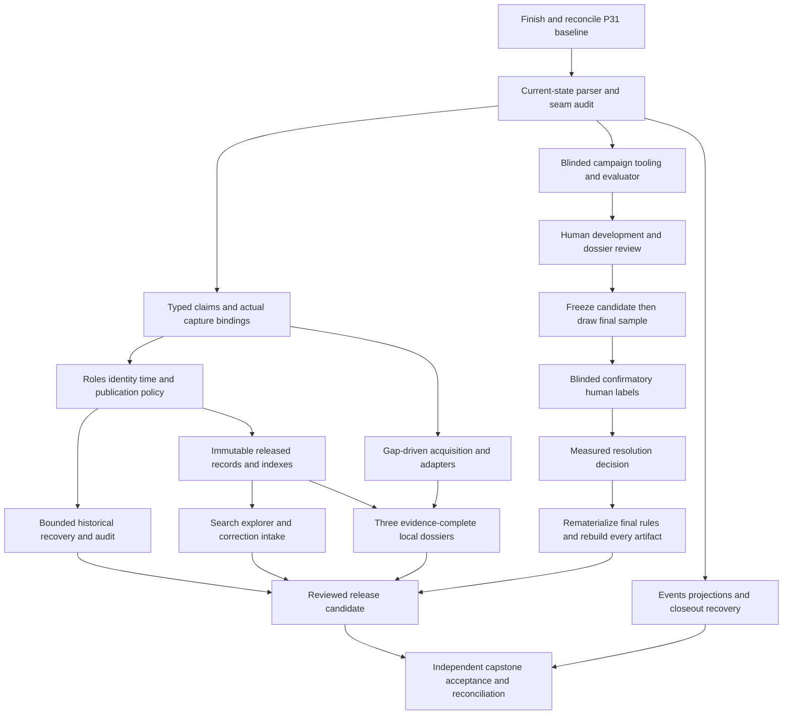

# Round 10 — Evidence integrity, useful investigations, and reliable build memory

Status: engineering design authored under the operator's 2026-09-25 request; execution is not started. Read `HANDOFF.md` before integrating this isolated branch. The main LEDGER remains the only execution state. The canonical requirements are in spec §55; this document explains interfaces, tradeoffs and the decomposition. Research evidence lives in `research/S1…S6`; `PLAN.json` and `REQUIREMENTS.csv` are the machine-readable ownership/dependency maps.

## Outcome and dependency order

The product should answer a bounded public question with a reproducible chain from source bytes to an appropriately qualified claim, through recorded resolution, to a specific public release. More records, more graph edges, and a more elaborate map are useful only when this chain holds.

The six streams therefore converge on one acceptance portfolio: three local dossiers (Oklahoma City, Tulsa and San Diego), a statistically defensible resolution assessment, complete discovery of eligible released records, durable correction intake, a measured acquisition queue, and a compact truthful build state. No dataset-wide claim of completeness is made. A fourth or fifth dossier is a later decision after the three-city portfolio demonstrates the method.

Training, pilot review and recruitment approved by the operator may run alongside independent engineering once packets exist. The final confirmatory frame and sealed campaign are drawn only after the relevant snapshot and semantic rules are frozen; earlier pilot labels are never silently reused as holdout evidence. No agent supplies substitute human labels. The manifest puts the blocking campaign marker after independent implementation so the orchestrator does not strand useful work behind reviewer availability. An operator may explicitly defer a live stage; the owed row and PROVISIONAL disclosure remain. Nothing in this design signs a rights, publication, human-evaluation or acceptance gate.

## Existing P31 ownership and the delta

| Existing owner | Preserve and consume | This round adds |
|---|---|---|
| P31.1 pooled API and bounded identifier search | pool/cursor/503 behavior and regression checks | immutable released search corpus; temporal requests must not silently invoke a current-only endpoint |
| P31.2/.4/.6 run lifecycle, stored captures and asserting replay | capture-store and run lineage, resumable chunks, no-network replay | actual claim-to-capture links, exact locators and completeness states; replay never pretends to be a new observation |
| P31.5 entity references | additive literal/ref twins and existing identities | role-aware extraction, identity ambiguity safeguards, consumed publication-review status |
| P31.7 re-sightings | append-only occurrence history and supersession | one shared as-of occurrence selection in resolver, reconciliation, API and exports, including A→B→A |
| P31.8 predicates | registered families and directness configuration | preserve typed qualifiers through the production sink; role and source-artifact genre validation |
| P31.9 coverage peers | explicit peer/tracked-predicate definitions | dossier absence states with real field evidence and source search history |
| P31.10/.11 review tooling and clustering wiring | PG queue, sampler, accept/reject propagation, zero-decision correctness | blinded independent labels, abstention records, leakage-safe partitions and meaningful statistical eligibility |
| P31.12/.13 source breadth | eight already-owned adapters and retry work | only additional, scored gap-closing targets; existing source improvement counts as a first-class acquisition |
| P31.14/.15/.16 analytics, tiles and public refresh | compartmented exports, z0–z14 PMTiles, compression, no basemap, HG-11 | release-specific records/search, coordinated focus, measurable no-JS pagination and publication completeness |
| P31.19 closeout | leak-check scope, capstone and exact Oct-10 replay obligation | explicitly scheduled Round-10 homes; no premature closure of that calendar event |

P32.1 must re-check every baseline anchor on the actual landed P31 tip. If P31 already closes a proposed defect, retain a regression/acceptance owner and shrink the delta through an appended plan amendment; do not reimplement it. If a prerequisite differs, append a scoped amendment before dispatching its consumer. The research snapshot is not a claim about the future P31.19 tree.

## Shared contracts and sole owners

### Claim assertion and evidence binding

The first evidence implementation ticket owns a versioned typed assertion contract spanning connector link output and `PgClaimSink`. It preserves subject identity, registered predicate, literal or entity reference, original lexical value, unit, geographic/population scope, valid-time expression, epistemic axes, sensitivity, legal/rights compartment, qualifiers, and correction/derivation links. Missing is different from a default value. Connector/source defaults can be applied only by an explicit versioned mapping recorded in the assertion, never by silently hardcoding all rows to one reliability/directness/inference/tier value.

P32.2 owns a field mapping before any new adapter: instrument lifecycle/execution status, monetary amount/currency/period, actor roles, capability/modality, clause exceptions and applicability jurisdiction/time map to existing LinkML fields where possible; missing typed fields are generated additions with explicit unknown/redacted states.

Each assertion binds one or more evidence locators: actual capture id, content digest and algorithm, byte length/media type, retrieval time, source URI, extractor version/config digest, target identity, and location in the captured artifact. Location is typed: JSON Pointer/record key; CSV row+column; page+text span or table cell for PDF; normalized HTML text/DOM selector with archived content digest; or explicitly `document_only` with a reason. A locator must identify the bytes the extractor actually consumed. Source publication date, capture retrieval, pipeline assertion time, and valid-world time are separate fields.

Do not remove legacy synthetic captures: mark them as legacy provenance with a separately appended assessment. Bindings to recovered real bytes require digest and lineage proof. Report `exact_replayable`, `document_locatable`, `source_attributed_only`, `unrecoverable`, and `restricted_not_public` as distinct dimensions/states; do not conflate access restriction with evidence loss. Replayability is checked with the recorded parser/config, and disagreement becomes an audit result rather than an overwrite.

### Semantic roles, identities, and corrections

Source publisher, data host, observed operator, owner, purchaser, prime contractor, reseller, vendor, recipient, funder and access partner are distinct roles. A source label cannot establish operation. A template does not establish execution; a procurement award does not establish installation; a subscription does not establish local hardware; a recommendation does not establish enacted policy. Derived sums retain inputs, arithmetic and approximate precision. Count contradictions require comparable subject, predicate, device/capability, population, geography, valid period and measurement basis. Non-comparable reports remain visible, separately labeled.

Externally scoped organization identifiers take priority. A normalized name alone is a match candidate, not sufficient evidence that organizations in different jurisdictions are identical. Existing identity keys are never rewritten. Use append-only proposed split/merge dispositions with reviewed redirects and stable public-id resolution. Unknown jurisdiction stays unknown. Automatic geographical inference from a publisher's address is prohibited. The semantic ticket owns a concrete migration proposal; it must test both false-union and false-split cases before applying a backfill.

Corrections append a disposition linking the affected assertion, new assertion or withdrawal reason, adjudicator/authority, recorded time and evidence. Administrative withholding of an unsafe public artifact is distinct from deleting or rewriting the historical spine. Consumers use one versioned eligibility policy; they cannot each improvise whether a review flag matters.

### Temporal read contract

The temporal ticket owns an eligible-occurrence selection function/view. Inputs include subject/predicate, world cutoff, belief cutoff, and ruleset. Eligibility first constrains what the system knew at the belief time, then applies the asserted valid-world interval; retrieval time is a fallback basis only for undated observational claims and is labeled. Replays retain original observation timing. The latest eligible occurrence is selected with deterministic tie-breakers; claim ids are not clocks. A future capture cannot change a past belief answer. Selection first finds the latest eligible establishing occurrence within each source assertion/source-record lineage, preserving atomic fields such as coordinate pairs. It retains concurrent independent source candidates; only an explicit versioned resolution policy can choose among them or abstain. A subject/predicate-wide MAX is not a valid replacement for this candidate set. The selected assertion, occurrence and evidence ids must survive into API and export envelopes. A recurring camera input digest may reuse a prior result, but every execution appends its own completion/result reference so current selection follows the latest completed execution, including A→B→A. Consumer conformance vectors cover resolver, camera-site materializer, reconciliation, API and release export.

### Release and record contract

The release ticket owns a two-stage identity contract. A pre-render release namespace is derived from canonical ID-free projection roots plus interpretation/renderer inputs and explicit release-generation metadata. It is available before records and citations are rendered. A separate final integrity-manifest digest covers the emitted artifact checksums, including bytes that embed the release namespace. Do not hash final self-referencing output bytes to derive the namespace: that creates a cryptographic fixed-point problem. Fixed field serialization and a reject-on-different-bytes rule for an existing namespace make both stages reproducible. It pins schema, code, ontology, policy, ruleset and source-snapshot/occurrence set; world/belief cutoffs; generation time; input/output row counts; compartment licenses and attribution; suppression/withholding summary; completeness/failure state; and all artifact digests. A release is atomic: incomplete compartments/indexes/records never update the latest pointer. Identical canonical pre-render inputs yield the same namespace; an existing namespace accepts only identical final artifacts. Timestamps that intentionally create a new release are explicit rather than accidental build nondeterminism.

Record URLs bind release + compartment + opaque stable record id. Evidence and claim anchors resolve from that immutable release. `latest` is a convenience redirect, not a citation. A missing historical release returns an explicit unavailable response; unsupported query parameters cannot display an unchanged page labeled as a historical answer. Withdrawal can replace access to a restricted artifact with a tombstone and reason under policy while retaining its recorded identity/checksum where lawful. No unreviewed raw evidence is copied into public indexes.

### Search and coordinated workspace

Use the existing Astro static core and named React islands. The selected search architecture is a deterministic per-compartment SQLite FTS5 artifact built from released records and served read-only by the existing API package, with a no-JS dynamic HTML search route over those same immutable inputs. Digest-verified immutable indexes stage to bounded local storage; never use SQLite immutable mode against a mutable network mount. Query artifacts carry the release and compartment. Cold staging/resource exhaustion returns explicit readiness/503, never latest-release substitution. This adds a bounded dynamic search route, not a second app; static browse/record pages and archival exports remain complete. P32.14 owns service-route and benchmark details; any new paid capacity requires approval, and a failed benchmark produces a documented alternative ADR before deployment rather than a silent fallback to current PG tables. A separate full SPA adds a second interpretation/rendering path before the existing path is trustworthy; it is not selected for this round. Release-built, per-compartment search documents/indexes cover every eligible entity/site/dossier/evidence-metadata record with explicit type totals and availability. Do not feed 230,000 rows into a single browser JSON load or invoke current PG search under a historical release URL. Search is shardable and bounded; exact id lookup and no-JS browse pagination are first-class routes. Search-result ids navigate to the specific record, not a generic map.

Shared URL state names release, compartment, query, jurisdiction, record type, focus id, filters, view, and page/cursor with a version. Unknown combinations fail visibly; back/forward and deep links restore state. Map, list, network and evidence pane share the same release/focus. Switching compartment changes data and attribution explicitly. New base-map services, account systems and a second independent app shell require separate decisions.

### Correction intake and human review are separate channels

A small public receiver accepts bounded anonymous correction submissions and returns a receipt token. It stores only the allowlisted structured fields and a minimized narrative in an isolated moderation store; it cannot insert graph claims, set reviewer authority, or invoke curation directly. No uploads or remote-URL fetching in the first release. Size/rate controls, spam quarantine, link handling, retention, notification behavior, redaction and receipt-token entropy must be specified and tested before exposure. Avoid durable IP storage; ephemeral rate-control identifiers and their retention are documented. A private loopback authenticated curator reviews through existing workflows. P32.16a owns the authorized idempotent application bridge: submission → reviewed proposal → policy-validated canonical disposition → application receipt → resulting release. A received or reviewed report is not yet an applied correction, and application is not publication. Crash/retry tests must cover this whole chain; the public receiver never receives application privilege. A public corrections log contains reviewed dispositions, never unfiltered submissions or contact data.

The independent evaluation label store additionally records same-device/different-device/insufficient-evidence labels, reason codes and evidence references with pseudonymous reviewer ids. These are not automatically operational accept/reject decisions. Blinding, adjudication and the sealed holdout boundary are owned by the evaluation protocol; public correction traffic is not ground truth.

### Dossier and acquisition contracts

The dossier template has a fixed question set (capability, owned versus accessed hardware, operator/owner/vendor/prime, procurement/funding, authority/status, retention, access/sharing, usage/oversight, decision dates, changes and outstanding unknowns). Each answer is supported, disputed, derived, unknown, withheld or not applicable with evidence and time. Reviewable means every question is addressed with support or an honestly researched absence. Pilot evidence-complete additionally means at least 28/36 on the fixed twelve-question S2 rubric, with questions 1, 5, 7 and 8 at least 2 and independent semantic review of material governance/contract/relationship assertions. This is an editorial workload criterion, not a statistical truth score. Below-threshold dossiers remain explicitly incomplete; publication of such a view requires a separate explicit scope decision and does not satisfy the three-dossier pilot. Do not delete difficult questions or substitute a city merely to hide missing evidence. A source register and a fact-to-capture ledger make coverage reviewable. Compare the cities by these fields, never by an unexplained grand total of heterogeneous records.

Acquisition targets start from a missing dossier relationship/question or an independently justified national need. Candidate records retain discovery query, official URL, checked-at/access status, authority, evidence type, expected predicates and joins, source-lineage independence, geographic/temporal scope, rights posture, Part VIII preflight, extraction cost and refreshability. Existing registered sources and P31-owned work are deduplicated before ranking. Utility is a transparent prioritization aid, not a probability of truth. Rights uncertainty and person-level data are hard gates, never compensated by a high usefulness score. The researched candidate inventory with per-row review depth in `data/source-candidates.csv` is research inventory, not an ingestion permission list.

## Rollout, resource limits, and rollback

All production migrations are additive sqitch changes with deploy/revert/verify; generated ontology outputs follow `make gen`. Test backfills against a bounded copy/fixture first, estimate row growth and indexes, and record query plans against the actual dedicated-core database. Honor ADR-107/111/114 budgets and pinned jobs; do not roll the reserved Oct-10 replay job early. Use bounded chunks, restart checkpoints, source/run selection and dry-run inventories. No broad rescrape is a substitute for unavailable historical evidence.

Engineering tickets finish with tested tools and explicit return-pass packets when a live gate is unavailable. The later bounded recovery/activation ticket owns production execution; a release ticket owns HG-11 publication. Activation and rollback first apply the current access-withdrawal policy to the candidate, independently of its historical belief/world time. A rollback may not restore a now-withheld name, coordinate or relationship. P32.5 owns the withdrawal registry and blast-radius rules; P32.13 owns serving enforcement and P32.25 verifies deployment. Enumerate HTML/JSON, aliases, snippets/facets, tiles, compressed variants, archive/index downloads, bucket origins and operator-controlled CDN caches. If a partition cannot be safely filtered, deny that whole immutable artifact and serve a safe tombstone; never change its bytes under the same id. Short/revalidating body caches and denial checks apply before access. Do not promise recall of third-party downloads. A rollback reselects an eligible prior public release and appends correction/disposition records; it never deletes claim history. Any attempt to introduce an evidence tier downgrade, new legal interpretation or automatic publication of review-pending organizations requires its recorded policy decision.

## Quality and success criteria

- An independent reviewer can trace every flagship dossier answer to exact captured evidence or an explicit unresolved limitation.
- All eligible release records are discoverable and directly addressable; sampled-result coverage is never described as full corpus.
- Known role/count/time adversarial cases cannot produce an unsupported operator, hardware deployment, comparable contradiction or historical answer.
- Evaluation reports state the sampling frame and uncertainty; absent independent evidence leaves tiers provisional or review-only.
- Every new source batch demonstrates net new supported relationships or closes named gaps after deduplication, with a measured maintenance cost.
- Current build state is reproducible from controlled records, catches conflicting status, and survives interrupted closeout without double advancement.
- Capstone inspects implementation independently before reading self-assessed run ledgers, executes composed checks, and separates fixture, hosted and public verification.

## Scope exclusions and unresolved human inputs

This plan does not authorize ingestion or publication, obtain reviewers, make legal findings, send public-records requests, or spend money. Reviewer availability, source rights, any substantive publication exception, and final release acceptance remain concrete operator decisions at their existing gates. Engineering defaults and failure outcomes are fully specified so those decisions do not block independent implementation. Threshold tuning is conditional on new training evidence and an untouched holdout, never prescribed as a result before humans work.

## Final snapshot and evaluation sequencing

P32.9 builds protocol and label-store tooling. P32.22 freezes the repaired population snapshot. HUMAN-H4 supplies independent development/pilot/calibration labels and separate dossier semantic review. P32.22a selects the candidate using only those development data, freezes its ruleset, then constructs its eligible auto-positive frame and draws the preregistered confirmatory sample. HUMAN-H5 supplies final independent blinded labels for that exact fixed sample. P32.23 unseals once and evaluates that candidate; no tuning, extra draws or candidate selection remains. Failed/inconclusive outcomes are valid. Any changed candidate after unsealing requires a new independent frame/sample/campaign. P32.23a rematerializes the selected or safely demoted rules and rebuilds all release artifacts; P32.24 tests that exact candidate; GATE-G3 reviews it; P32.25 publishes it. No pre-evaluation preview substitutes for that sequence.

The evaluator initially runs in shadow mode. Existing production posture remains explicitly PROVISIONAL under its recorded policy until an approved operational transition; no new certification is inferred from installing the evaluator. Any pre-campaign safety demotion is separately scoped and authorized. After HUMAN-H5, P32.23 records the measured activation/demotion decision and P32.23a rebuilds the candidate accordingly.

## P31.19 integration delta — 2026-09-27 UTC

The import baseline is `08d87c4dc22d4c7c505aa19fe28bcf36e84cfe7a`, after P31.19. Existing 2026-09-25 research remains a dated snapshot. P31.9–19 landed peer classes, human-decision/duplicate-target wiring, the eight accountability sources, export analytics, per-compartment tiles/compression, the approved republish and scoped leak checking; P32.1 measures what remains instead of replaying these tickets. The new ADR allocation is ADR-120; sequence 161–200 and BL-058 remain free and unchanged.

The three engineering rows that P31.19 left without scheduled contracts now have explicit deliverables and negative acceptance in PLAN: **D-P31.1-3 → P32.2** (registered facts remain servable despite an unknown predicate, with normal eligibility and no guessed semantics); **D-P31.1-1 → P32.4** (bounded, correctly invalidated annotation watermark under the shared temporal contract, with measured query/latency evidence); **D-P31.5-2 → P32.5** (the existing common publication-eligibility contract). These are prospective closures, not MET claims. P32.1 verifies their baseline and routing; P32.24/P33.2 verify the composed result. The first two contract amendments are narrow compatibility/performance seams within their existing read/schema and temporal owners; no extra ticket or requirement id is introduced.

ACCEPT-R8 was already signed in `0a715fc`; the contrary P31.19 prose is corrected by appended notes. New H4/H5/G3/ACCEPT-R10 decisions remain pending. P31.19's exact-head CI had a separate npm lockfile completeness failure; the import receipt records its bounded repair and fresh verification without relabeling old CI green.
