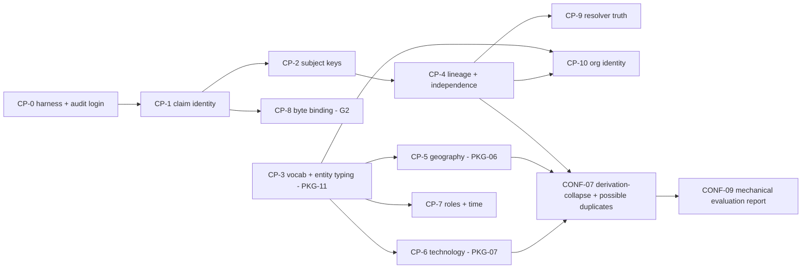

# L3 — Confidence program without independent humans

Row **L3** of `META_PLAN.md` §6 Stream L (owner D; depends L1, L2, F4, E3). Design only. Written by Claude Code (Opus 5.5) in the
planning worktree `/Users/stevenvitali/Eleutheria-next-phase` (branch `claude/next-phase-planning`, head `e34faf7c`; pipeline code
byte-identical to chain tip `b051732c`, per L1). Run window (`date -u`): **2026-09-30T22:53:19Z → see footer**. `PD` =
`docs/build/planning/2026-09-30-next-phase`.

> **Design only (P3, P10).** Nothing here was executed against production, and no network request was made. Nothing below is
> `engineered`, `fixture-verified` or `live-executed` (P5). No human work was done or simulated, and no agent label is presented as a
> human label (P4). Every public sentence quoted here is **agent-drafted** and must be confirmed verbatim by the operator before it
> ships. Every recommendation is the agent's; every decision is the operator's (§10). Costs marked **[est]** are planning guesses.

**Operator constraints this row answers** (verbatim, `feedback/OPERATOR_FEEDBACK.md`):
- U-006: *"I'm not that confident because I haven't done a deep audit of the mechanism by which disparate sources with disparate
  schemas are synthesized into a deduplicated knowledge graph of relations between entities."*
- U-007: *"… increased confidence in algorithms used to turn raw ingested data into synthesized knowledge graph …"*
- U-008: *"… for now, assume we have no humans on our team other than me augmented by agents running frontier models."*
- U-011: *"agents should have maximal autonomy but budgets on money spent should always be made clear and transparent … and no one
  should be contacted outside the project."*
- U-013: *"… for now we should just err on the side of not blocking on counsel decisions."*

**Inputs read** (whole unless noted): `META_PLAN.md` §1–§3, §6 Stream L/S/T, §7, §7.1, §8; `research/L1-pipeline-audit.md`;
`research/L2-graph-quality.md`; `data/l2_metrics.csv`; `findings/incoming/L1.csv`, `L2.csv` (titles, routing, selected evidence);
`design/F4-s3-spine.md`; `research/E3-human-work.md` §0–§9; `design/E2-governance-options.md` §0, E2-14…E2-16;
`research/F2b-verdicts.md` §1–§3, §6; `design/B4-verification.md` §0, G10, G11, §5; `design/G3-release-model.md` §0, §4.4, §5.5,
§7.3, §11; `design/K2-graph-and-entities.md` §10–§12; `design/K14-visual-and-onboarding.md` §3.4 (lexicon); `design/D3-product-direction.md`
§3(b); `research/F5-eng-debt.md` PKG-06…PKG-12; `design/J3-transparency-design.md` ticket list; `design/K8-evidence.md` (grep);
`design/K5-dossier-sources.md` (grep); `review/DATA_TRUTH.md` DR-C3-01…15; `findings/FINDINGS.csv` (grep, to avoid re-raising).
Repository: spec `docs/2_canonical_design_spec.md:1449` (SIG-EPIS-029), `:2465-2519` (§14.6–14.7, SIG-IDENT-020…030), `:4691`
(SIG-RECON-018), `:7317-7331` (§55.4, SIG-EVAL-001…007), `:7383-7389` (§55.9); ADR-099, ADR-105 (whole), ADR-128/129 (status and
revisit triggers); `docs/tickets/00_MANIFEST.md:1-5, :380-384`; `docs/tickets/DEFERRALS.md` rows D-R6.1-EVAL, D-R10-HUMAN-1,
D-P30.2b-1/2/3; `resolution/src/resolution/data/camera_site_rules.toml:1-80`; `resolution/src/resolution/camera_sites.py:306-318,
:830-880`; `db/deploy/human_eval_campaign.sql:205-222`. `LEDGER.md` was not opened (P13).

**Outputs.** This file and `PD/findings/incoming/L3.csv` (`NEW-1…NEW-4`, §12).

---

## 0. Bottom line

1. **Confidence has to come mostly from construction and mechanics, not from review.** L2 measured the copying layer as faithful
   (50 of 50 sampled sites reproduce their upstream record) and the *synthesis* as weak: 5,278 collided subjects, 13.5 % cross-layer
   duplicates against 3.75 % merged, 77.4 % of camera subjects mistyped, 74.2 % with a publisher recorded as operator, 0 of 2.78 M
   evidence bindings reaching bytes, 2 contradictions recorded. Almost every one of those errors can be removed by construction
   and then held down by a mechanical check. Review is not the bottleneck; truthful inputs are.
2. **Correctness prerequisites, in order** (§2): **CP-0** measurement substrate (audit login + quality harness + baseline) →
   **CP-1** truthful claim identity → **CP-2** truthful subject keys → **CP-4** declared lineage and independence. That identity
   core is a prerequisite to *any* evaluation. Camera-site evaluation additionally needs **CP-5** per-point geography and **CP-6**
   technology typing. Entity and edge evaluation needs **CP-3** closed vocabulary and entity typing, **CP-7** roles and time, and
   **CP-10** organisation identity. Contradiction metrics need **CP-9** resolver input truth. Any reviewer, agent or human, needs
   **CP-8** evidence-byte binding. Four of the eleven are owned elsewhere (CP-3/5/6 by F5 PKG-11/06/07; CP-8 by G2 with J3) and
   one is shared (CP-7 with K2 GX-02 and PKG-10). L3 names them and does not duplicate them (P9).
3. **Invariant suite: 27 checks** (§3). L1's 17 invariants and L2's 14 checks deduplicate to **23** (C14 moves to evaluation), and L3
   adds **4** (derivation census, inferential auto-write lock, origin distinctness, metamorphic ER invariants). Each check is
   `enforce`, `ratchet` or `report`. **Only mechanical checks may gate.** Because 29 of L2's 45 metrics fail today, most checks start
   in **ratchet** mode: the baseline is L2's value and any regression fails, and each check flips to `enforce` only in the ticket
   that fixes its cause, the same convention as the repo's `LD-` xfails (NEW-3). Placement follows B4 G10 and the G3 promotion
   gate: sink/ingest (fail the target run), nightly spine probe, a new release check **V15 "graph quality"** plus the existing V6,
   V8, V9, V13 and V14, and PR tests over a **real-data regression corpus**. A ratchet regression makes a release Class S.
   Estimated extra spend ≤ $5/month [est].
4. **Evaluation without independent humans** (§4) uses four evidence classes, never mixed in a headline:
   - **mechanical census and mechanical samples** (no judgment): derivation-collapse census against upstream ids, id-resolution
     and fidelity samples re-fetched from the upstream with exact Clopper–Pearson bounds (200/200 → lower bound 0.985), cross-copy
     agreement on known-identical records, mechanical hard negatives (distinct ids from one origin), synthetic perturbation
     (known-answer) tests, metamorphic invariants, spatial checks, upstream count reconciliation;
   - **agent review**, labelled as such: a seeded weekly sample in two blind agent contexts, where disagreement routes work and
     agreement is never truth;
   - **maintainer checks** by the operator: human, **disclosed as not independent**, a ≤ 40-minute blind-first protocol per Class-S
     release, captured verbatim in chat, plus optional operational accept/reject decisions on possible duplicates (which SIG-EVAL-002
     explicitly distinguishes from evaluation labels);
   - **independent human evaluation: none available.** It stays owed.
5. **Not claimable** (§4.5): "human-verified", "independently reviewed" or "certified"; any precision figure for identity
   inference (same physical device across independent sources) or for organisation identity; candidate recall; that a camera
   physically exists or operates; completeness of coverage; agent or model agreement as accuracy; maintainer checks as
   independent review; and certification at the 0.98 floor. That floor needs independent labels, and even with them one tier at
   n = 149 passes only 22–47 % of the time at a true precision of 0.99–0.995 (E3, F4).
6. **Auto-write policy: "derivation, not identity"** (§4.6). SIG collapses **copies** automatically when that is mechanically
   established:
   - **C0**: a duplicate target;
   - **C1**: the same id in a declared id namespace within a declared lineage, census-verified on every run;
   - **C2**: a bijective exact-position match inside a declared, documented and measured mirror lineage (operator option).

   SIG **never auto-writes identity inferences**: tier 3g across independent lineages, 1g without a namespace, 4g and 5g. Those are
   published as **"possible duplicate"** with their basis and distance, and counts become an **interval** ("412 records · between 371
   and 398 listed cameras"). The live run's 11,106 auto-write pairs (tier 3 alone 4,693, on the favourable of two agent label sets)
   are superseded by a new run under ruleset v3. Organisations: only authoritative-identifier tiers (§14.6 tiers 0–1) auto-link;
   name matches are "possibly the same" (D-K2-7).
7. **Public disclosure** (§5): a release-bound **`/quality/`** page rendered from a `quality.json` release artifact, showing every
   check with value, threshold, status, basis class and trend, a "Who checked what" table and "What we cannot tell you"; a
   status-lane panel for the nightly spine probe; a **per-record basis block** (copy / possible duplicate / independent
   corroboration / location check / technology source / evidence / "Not reviewed by a person"); and replacement wording for "the
   frozen, human-verified holdout" (§5.3).
8. **Rows 184–187 and SIG-EVAL** (§6). F4's Option B cannot run: every successor seat is external (U-008), and recruiting is outreach
   (U-011). The decisions:
   - **184–187** are superseded, not executed. **No Round-11 human rows** are seeded: EV1, HUMAN-H6, HUMAN-H7 and the confirmatory
     segment go to a **later-phase trigger, T-EVAL-IND**. F4's EV2 survives as CONF-02.
   - **D-R10-HUMAN-1 stays OPEN**, never waived, and is declared non-blocking by ADR.
   - **EVAL-001** becomes MET-ENGINEERED once the "human-verified" claim is gone. **EVAL-002** stays PARTIAL, owed. **EVAL-003**
     becomes MET (engineering). **EVAL-004** becomes **WAIVED(ADR-L3-B), scoped to derivation-collapse tiers C0–C2**; the
     inferential tiers are fail-safe review-only. **EVAL-005** and **EVAL-007** stay MISSING, owed, later-phase(T-EVAL-IND).
     **EVAL-006** becomes MET (engineering: every published figure scoped).
   - Adjacent: IDENT-030 is kept by **not** shipping network analytics (answers D-K2-2). UI-042 and DOS-002's independent check stay
     owed.
9. **Round-11 tickets: 14 keys, 17 runs** (§9), `CONF-01…CONF-14`, placed from wave 0 (CONF-02, the honest posture and demotion) to
   the tail (CONF-14, the L2 re-measurement). They depend on F5 PKG-06/07/08/11, G2 activation, G3 REL-04b/REL-06, B4 G10/G11, J3
   TX-07/TX-08 and K2 GX-01/02/04. There are three ADR drafts (§8) and fourteen draft requirements, `SIG-CONF-D01…D14` (§7).

---

## 1. What "confidence" means here, and the evidence ladder

**Three questions the program must answer for the operator** (U-006/U-007), with the L1 seams they cover:

| question | seams (L1 §1) | today (L1/L2) |
|---|---|---|
| **Q1 Fidelity.** Is each published row a faithful copy of what its upstream says? | S0–S3, S11 | mostly yes: 50/50 sampled sites match upstream at 0 m; 11 of 15 layers have exact counts (L2 §3) |
| **Q2 Synthesis.** Are identity, deduplication, typing, roles, geography, time, contradiction and relations correct? | S4–S11 | no: every seam has a measured defect (L2 summary; L1 §3 FM-01…FM-25) |
| **Q3 Detection.** Would we know if it broke? | S12, CI | no: release validation checks integrity only (L1 NEW-13); every defect above "ships green" |

**The evidence ladder.** Every statement SIG makes about quality carries exactly one basis class. The classes sit *beside* META_PLAN
P5's status layers and do not replace them. P5 says how far a thing got (engineered → public); the basis class says who or what
checked it.

| class | name | who/what decides | may gate a release or an auto-write? | public wording |
|---|---|---|---|---|
| **B0** | by construction | code plus a test proves the property holds for every record (e.g. keys unique per capture) | yes | "guaranteed by how SIG is built (tested)" |
| **B1** | mechanical census | a program checks **every** record in scope, with no judgment | yes | "checked automatically on all N" |
| **B2** | mechanical sample | a program checks a seeded random sample, with no judgment, and reports an exact interval | yes, on the lower bound | "checked automatically on a random n; at least X % (95 %)" |
| **B3** | agent review | an AI agent judges (e.g. "is this contract about surveillance?") | **never**; it triggers work only | "reviewed by an AI agent (model, date); not a person" |
| **B4** | maintainer check | the operator, a human who is **not independent** of the project | **never**; it informs and triggers | "checked by SIG's maintainer; not independent" |
| **B5** | independent human | a person outside the project, under SIG-EVAL-001/002 | yes, per SIG-EVAL-004 | "independently reviewed" (only with a completion marker) |

**B5 does not exist and is not planned for Round 11** (U-008, U-011). Every design choice below follows from three rules:
- only B0–B2 gate;
- B3 and B4 route attention and are disclosed;
- anything that would need B5 is either not done (no identity-inference auto-writes) or not claimed (§4.5).

---

## 2. Correctness by construction — the ordered prerequisites

L1 ranked ten fixes by error removed per unit of work (§6.1). Here they are re-cut by **what each one makes measurable**, because an
evaluation run over wrong inputs measures the input defect, not the algorithm. Example: the camera gold set's holdout is 53 %
mirror pairs, and its largest pair is the axis-swapped Nottingham/Mark43 layer (L1 S6-eval). "Owner" respects exactly-one
ownership (P9): where another row already owns a fix, L3 only adds the check.

| # | prerequisite | removes (findings) | why evaluation is meaningless without it | size | depends | owner |
|---|---|---|---|---|---|---|
| **CP-0** | **Measurement substrate.** A least-privilege audit **login** (`sig_audit`, SELECT-only through `sig_read_public` plus the two tables it lacks). The quality harness and check registry. A baseline run that reproduces L2's values | L1 NEW-13, L2 NEW-16 | fixes cannot be proven, only asserted. L2 had to use the owner login with `SET ROLE` | M | — | **CONF-01**; login via G1-01 / G2 ACT-13 |
| **CP-1** | **Truthful claim identity.** Row position, page URL, capture digest, fetch date and version counters leave the claim digest and move to the `claim_evidence` binding. Digest scheme versioned so the switch does not re-mint 2.5 M claims. Replay tests | L1 NEW-1, L2 NEW-7 (17.5 % exact repeats) | re-mints inflate counts and manufacture "independent" support (L1 NEW-4). Every evaluation frame drifts between runs | M | CP-0 | **CONF-03a** |
| **CP-2** | **Truthful subject keys.** Key field pinned per target and unique per capture (fail the target run). Legistar tenant scope. Atlas and EFF agency keys state-scoped. Key-stability monitor. Collided subjects re-keyed by new, append-only identity decisions | L1 NEW-3, NEW-11; L2 NEW-1 (5,278 collided subjects) | 2.3 % of camera subjects are several cameras. Any pair sample over them measures collisions. The 5,290 "conflicted" points are identity errors, not disagreement | M | CP-1 | **CONF-03b** (absorbs PKG-06b's "investigate the IDOT/FL511 conflicts" bullet; S1 confirms) |
| **CP-3** | **Closed vocabulary and entity typing.** Unregistered predicates and genres quarantined. The six missing predicates registered. Subject entity type declared per subject scheme | L1 NEW-2, NEW-5, NEW-14; L2 NEW-8 (10,238 mistyped) | unregistered facts never reach the resolver, so contradiction recall is unmeasurable. Per-type metrics are corrupt | S–M + M | — | **F5 PKG-11** (K2 §10 routes entity typing there) |
| **CP-4** | **Declared lineage and independence.** A registry `lineage` field (`origin` / `mirror-of:<id>` / `derived-from:<id>`, with documentary evidence). An `id_namespace` per target key field. `camreg_osm_surveillance` split into its two republishes. §28 reads `independence_class` = lineage root. `derived_from_claim_ids` persisted | L1 NEW-4, NEW-6; L2 NEW-3 | corroboration counts copies. Copy-collapse (§4.6) is impossible without declared lineage. The mirror stratum dominates any sample | M | CP-1, CP-2 | **CONF-04** (absorbs PKG-12's `derived_from` bullet; S1 confirms) |
| **CP-5** | **Per-point geography.** `(scheme, code)` keys, point-in-polygon, per-target `axis_order`, null-island and sign detectors, `unresolved` assigned by polygon with its basis | L1 FM-01…03; L2 NEW-12, NEW-13 | spatial checks have no ground truth. ER's jurisdiction soft conflict reads a per-source string (FDOT D5 "CA") | L | CP-3 | **F5 PKG-06a/b** + K4 JUR-02 |
| **CP-6** | **Technology typing.** A per-target technology slug becomes a claim, an export column and the ER `device_class` | L1 NEW-7; L2 NEW-6 (77.4 % mistyped) | the ALPR/traffic incompatibility guard does not protect 66 % of sites. Per-technology quality is unmeasurable | L | CP-3 | **F5 PKG-07** |
| **CP-7** | **Roles and time.** The operator is an agency or explicit `unknown`, never the publisher. Edge dates with no 1970 placeholder. Currency on edges. Edge supersession. One sharing classifier. EFF 2016–17 as a valid period. Upstream change date from `editingInfo` / `Last-Modified` | L1 NEW-10; L2 NEW-4 (74.2 %), NEW-10 | operator-edge correctness is 4/10 in the agent sample. Freshness and currency cannot be evaluated (100 % unbounded valid periods) | M | CP-3 | **CONF-06** (backend) + K2 GX-02 (export and labels) + F5 PKG-10 (freshness) |
| **CP-8** | **Evidence-byte binding.** P32.2 actual-capture binding live on hosted. Re-capture of each source on its next run. Locators | L2 NEW-5 (0 of 2,782,187) | no reviewer, whether agent, operator or future independent, can check a claim against the bytes it rests on | M + live | CP-1 | **G2** activation (P32.2 live) + J3 TX-08; L3 adds GQ-18 |
| **CP-9** | **Resolver input truth.** Valid time and connector directness read. Tolerance-aware comparison that emits dissent / `contested` | L1 NEW-4 (part 2); L2 NEW-2 (0 dissent in 19,121) | contradiction recall is ≈ 0, so "contradictions kept visible" cannot be measured | M | CP-4 | **CONF-05** |
| **CP-10** | **Organisation identity by construction.** UEI/SAM, ORI, Census-of-Governments GEOID and Wikidata QID crosswalks. Cascade tiers 0–1 as a production materializer with match records. Name tiers become "possibly the same" | L1 NEW-12; L2 NEW-9 (≥ 171/200 agencies duplicated, 0 links) | accountability joins cannot fire (INV-17 ≈ 0). Organisation metrics are fragmentation metrics | L | CP-3, CP-4 | **CONF-13** (new sources through I8 and HG-03) |

**Which are prerequisites to what.**
- **Any evaluation at all:** CP-0, CP-1, CP-2 and CP-4, the identity core. Before them, a frame drawn today is invalid on arrival
  (F4 PC-4; SIG-EVAL-006/007 drift).
- **Any reviewer-based check** (B3, B4 or a future B5): add CP-8.
- **Camera-site matching evaluation:** add CP-5 and CP-6, which are ER guard inputs.
- **Edge and organisation evaluation:** add CP-3, CP-7 and CP-10.
- **Contradiction metrics:** add CP-9.
- **The "frame-affecting set"** (F4 §2 PC-4) is CP-1, CP-2, CP-4, CP-5, CP-6 plus the Stream-I camera ingests. A future
  T-EVAL-IND campaign freezes its frame only after all of them land (§6.5).

---

## 3. Continuous automated verification

### 3.1 Deduplication of the proposed checks

The inputs are L1 §6.2 (INV-01…17, 17 checks) and L2 §4 (C1…C14, 14 checks), 31 in all.

| L2 check | disposition |
|---|---|
| C1 key uniqueness | = INV-04 |
| C2 geometry gate | = INV-07 (geometry) and INV-08 (keys; `unresolved` by polygon) |
| C3 duplicate monitor | split: C3a = INV-09 (duplicate accounting); **C3b** (an undeclared layer pair with > 50 % overlap) is new → GQ-11, the SIG-EPIS-029 detector |
| C4 redundancy | = INV-03 |
| C5 contradiction recall | new → GQ-13 |
| C6 technology and entity type | = INV-06 (extended with technology) |
| C7 role check | new → GQ-07 |
| C8 evidence binding | = INV-16 |
| C9 time coverage | = INV-12 (extended with claim time and upstream change dates) |
| C10 attribution | = INV-14 |
| C11 upstream reconciliation | new → GQ-19 |
| C12 release diff | new → GQ-20 (consumed from G3 V14) |
| C13 relevance precision | new → GQ-22 (report-only: it rests on agent labels) |
| C14 rotating agent sample | an evaluation method, not an invariant → §4.3 |

L1's INV-15 (the auto-write holdout gate) is **reformulated** by L3's policy as GQ-23 plus GQ-24.

**Result:** 17 + 6 = **23 deduplicated checks**, plus **4 new L3 checks** (GQ-23 derivation census, GQ-24 inferential auto-write
lock, GQ-25 origin distinctness, GQ-26 metamorphic ER invariants). GQ-27 (basis labels and claim markers) is the B4 G10
claim-marker rule and DR-C3-03, so it is listed but owned there. **27 checks in total.**

### 3.2 The graph-quality suite (`sig.quality-suite/1`)

Placement codes:
- **I** — ingest/sink: fails the target's run, other targets continue;
- **M** — post-materialize nightly spine probe, read-only audit login;
- **R** — release-candidate gate: G3 V-suite, the new **V15** plus the named existing V-check;
- **P** — pull request: unit/property tests plus the real-data regression corpus (§3.5);
- **S** — scheduled public probe after promote (B4 G10).

Seed modes:
- **enforce** — a failure blocks (a run, a materialization or a promotion);
- **ratchet(b)** — baseline b; a regression beyond b fails, improvement is recorded, and the check flips to `enforce` in the named
  ticket;
- **report** — published, never gating (used where the evidence is B3/B4, or where there is no settled target).

| id | check (plain) | from | runs | enforce threshold | today (source) | seed mode → flips in |
|---|---|---|---|---|---|---|
| GQ-01 | Every emitted predicate, genre and enum is in the generated registry; unregistered → quarantine | INV-01 | I, P | 0 unregistered in current claims | 6 predicates unregistered (L1 NEW-2) | ratchet(6) → PKG-11 |
| GQ-02 | Replaying a connector with rows re-ordered, re-paged or unchanged inserts 0 claims and mints no new ER run | INV-02 | P, M (1 source/night) | 0 | fails (L1 probe 1) | ratchet → CONF-03a |
| GQ-03 | Exact current repeats of (subject, predicate, value, source) | INV-03, C4 | M | ≤ 1 % of current claims | 17.5 % (L2 M08) | ratchet(17.5 %) → CONF-03a |
| GQ-04 | Within one capture, one subject key ↔ one upstream row; the key field is pinned per target | INV-04, C1 | I | 0 | 5,278 subjects (L2 M07) | ratchet → CONF-03b |
| GQ-05 | Key stability: share of a source's subjects whose latest point moved > 0.0005° since the previous run | INV-05 | M | ≤ 0.5 % per source per run (warn > 0.1 %) | unmeasured | report → CONF-03b |
| GQ-06 | Entity type agrees with subject scheme; every camera target declares a technology; exports carry it; nothing typed `traffic_camera` unless its target says so | INV-06, C6 | I, R | 0 mismatches | 10,238 entities; 180,036 subjects (L2 M21, M22) | ratchet → PKG-11 (type), PKG-07 (technology) |
| GQ-07 | `camera_operator` is an agency entity or explicit `unknown`; publisher strings blocklisted | C7 | I, M | 0 | 172,588 (74.2 %) (L2 M23) | ratchet → CONF-06 |
| GQ-08 | 0 points at (0,0); 0 axis swaps or sign flips; 0 points > 2 km outside the claimed polygon without a disclosed conflict | INV-07, C2, DR-C3-05 | **R = G3 V9**, S | 0 | 2,807 outside; 562 swaps; 14 null; 5 flips (L2 M16–M18) | enforce for null/swap/flip once V9 lands (REL-04b, after PKG-06b adds withholding) · ratchet(2,807) for outside → PKG-06b |
| GQ-09 | Dossier keys are `(scheme, code)`; no bucket mixes schemes; `unresolved` is not a jurisdiction; polygon-assigned points carry their basis | INV-08, DR-C3-11 | R | 0 | fails (I1 NEW-1; L2 M19: 153,050 assignable) | ratchet → PKG-06a / K4 JUR-02 |
| GQ-10 | Duplicate accounting: published site rows = records after derivation-collapse; every ≥ 2-lineage point within 25 m is collapsed or listed as a possible duplicate; the count interval is published; same-layer co-located distinct records are classed "multi-view", not duplicates | INV-09, C3a, DR-C3-10 | R (V15) | row count = records; 100 % accounted; dossier inflation ≤ 1.02× against lineage roots | `n_sources`=1 on 100 %; inflation up to 2.25× (L2 M06, M13) | ratchet → CONF-07b |
| GQ-11 | Undeclared copying: any layer pair with > 50 % of the smaller layer within 1 m and no declared lineage | C3b; SIG-EPIS-029 | M, I (new-source onboarding) | 0 undeclared pairs | ≥ 11 inferred lineages, 0 declared (L2 §2.1) | ratchet → CONF-04; a new source with an undeclared overlap is held from publication |
| GQ-12 | No resolution counts > 1 independence class from one source or lineage; a class is never a claim id | INV-10; SIG-RECON-018 | M (DB test on the live spine) | 0 | fails (L1 NEW-4) | ratchet → CONF-04 |
| GQ-13 | Contradiction recall: every current resolution with ≥ 2 values beyond the predicate tolerance is contested or carries dissent | C5 | M | recall 1.0 | 0 of 19,121 (L2 M14) | ratchet → CONF-05 |
| GQ-14 | No map, network or search node labelled by its UUID when a label exists; unlabeled sites ≤ 5 % or a derived label | INV-11 | R | 0 UUID labels | 131/131 network; 82.8 % of sites (L2 M28) | ratchet → K2 GX-01/02 |
| GQ-15 | Every published edge has observed or valid time (or an explicit `undated`), currency and source; 0 edges starting 1970-01-01; 0 live duplicate edges per (from, to, kind); freshness says "not evaluable", not "ok" | INV-12, C9, DR-C3-07 | I, M, R | 0 / 0 / 0 | 98.8 % of edges undated; 178/178 "ok" (L2 M30, M37) | ratchet → CONF-06, GX-02, PKG-10 |
| GQ-16 | One "resolved": coverage numerator ⊆ denominator by join; dossier, map and coverage agree | INV-13, DR-C3-04 | **R = G3 V6** | exact | fails (C3 NEW-5) | ratchet → PKG-10 |
| GQ-17 | Each exported row's attribution equals its registry source's; 0 empty where required; 0 upstream rows credited to SIG | INV-14, C10, DR-C3-09 | **R = G3 V8**, S | 0 | 66,138 empty; 630 SIG-credited (L2 M35) | ratchet → PKG-08 |
| GQ-18 | Share of current claims bound to a byte-bearing capture with a locator, per source | INV-16, C8 | M, R | non-decreasing; 100 % for every source re-run after activation | 0 of 2,782,187 (L2 M33) | ratchet(0) → G2 activation + J3 TX-08 |
| GQ-19 | Upstream count reconciliation per target per run: SIG subjects against the upstream count taken at fetch | C11 | I | \|Δ\| ≤ 1 % or explained | Surrey −13 %, ACT −4.2 % (L2 M40) | report → CONF-01 once PKG-12/J3 TX-04 telemetry lands |
| GQ-20 | Release diff: id retention; per-dossier Δ > 5 % explained; top-N changes listed; per-check deltas | C12 | **R = G3 V14** | retention ≥ 99.9 %; no unexplained Δ | 1.000 retention (L2 M11) | enforce |
| GQ-21 | Accountability join rate: deployments with an operator entity; operators that are also procurement buyers | INV-17 | M | target rising (no floor yet) | ≈ 0 (L1 NEW-12) | report |
| GQ-22 | Topical relevance precision of procurement, agenda and grant records that reach graph views | C13 | S (weekly sample) | ≥ 0.9, warn only | 0 of 9 (L2 M44) | **report** (B3 evidence never gates) |
| GQ-23 | **Derivation census.** 100 % of C1 collapses carry the same id in the declared namespace, unique in both captures, with coordinates within the measured copy tolerance. 100 % of C2 collapses are bijective within a documented lineage whose measured overlap is ≥ 0.9 | new (replaces INV-15 for copy tiers) | M (after every ER run) | 100 %; **any failure demotes that lineage's collapse tier on the next run and alerts** | n/a (tiers do not exist yet) | enforce from CONF-07a |
| GQ-24 | **Inferential auto-write lock.** 0 auto-written same-device decisions in any identity-inference tier (3g across independent lineages, 1g without a namespace, 4g, 5g) while no B5 evaluation certifies that tier; the rules digest is checked | new (INV-15 successor) | M, R | 0 | 11,106 auto-write pairs, incl. 4,693 at tier 3 (L2 M04, NEW-15) | enforce from CONF-02 |
| GQ-25 | **Origin distinctness.** No collapse or cluster contains two records that one origin publisher lists as distinct (distinct pinned, unique ids in one namespace) | new | M | 0 | unmeasured | enforce from CONF-07a |
| GQ-26 | **Metamorphic ER invariants.** Input order and page size do not change clusters; removing a declared mirror does not change the distinct-record count; a re-run adds +0 | new | P (corpus), M (monthly full) | exact | unmeasured | enforce from CONF-08 |
| GQ-27 | Every published quality or evaluation figure names its basis class, n, population, source-mix digest, ruleset and window; "human-verified", "independently reviewed" or "certified" appears only with a B5 completion marker | DR-C3-03; B4 G10 claim markers; SIG-EVAL-006 | **R = G3 V13**, P (build output) | 0 violations | fails (F-06, F-108) | enforce from H-4 / CONF-02 |

**Only mechanical checks gate.** GQ-22 and every B3/B4 figure are `report` forever. A check that needs a judgment can never block a
release, and it can never unblock one either.

### 3.3 Gating semantics and coordination with the G3 promotion gate and B4 guards

- **Why ratchet** (NEW-3). G3 §5.5 says "any failure or skip blocks promotion; a waiver is possible only with Class S". L2 marks 29 of
  its 45 metrics `fail` today. If L1/L2 invariants were adopted as hard V-checks, the choice would be between never releasing and
  waiving every release. A ratchet makes the suite useful on day 1:
  - it cannot hide a regression;
  - it cannot claim a pass it has not earned;
  - it turns each fix ticket's acceptance into "flip GQ-nn to `enforce`".

  This is the repo's `tests/e2e` convention (an xfail carries an `LD-` reason and is flipped only by the closing ticket), applied
  to data.
- **The ratchet file** is `exports/src/exports/data/quality_checks.toml`: id, statement, population, placement, mode, baseline,
  threshold, `flips_in` ticket and basis class. It is versioned data, and a change is reviewed like a ruleset. A baseline may only
  move toward the threshold. Loosening one needs a new ADR (SIG-ENG-003), the same rule as never loosening an xfail's assertion.
- **G3 promotion gate.** A new **V15 "graph quality"** runs the R-placed checks over the candidate files and writes
  `quality.json` into the release. The existing V6 (GQ-16), V8 (GQ-17), V9 (GQ-08), V13 (GQ-27) and V14 (GQ-20) keep their
  owners: REL-04a/04b, PKG-08, PKG-06, PKG-10. V15 **consumes** their results into the one report rather than re-implementing them
  (P9). Outcomes:
  - an `enforce` failure blocks promotion;
  - a **ratchet regression, or any `report` metric moving the wrong way beyond its alert band, makes the candidate Class S**: an
    operator-signed readout that lists the deltas (G3 §7.3; extends the classifier row "any V14 anomaly").
  - Class R (the standing go) requires 0 enforce failures and 0 ratchet regressions.
- **B4 G10 placement.** Each check declares its trigger points (DRAFT-OPS-1) and writes a `probe-run/1` record. The nightly spine
  probe and the post-promote public re-runs (GQ-08, GQ-17, GQ-27) are G10 scheduled probes. The round tail runs the full sweep.
  **G11 no-vacuous-pass** applies to every check: `candidates > 0` with `evaluated = 0` fails.
- **B4 G6** (tests assert invariants, not living values). Regression-corpus snapshots are data outputs under explicit approval
  (§3.5), not pins of living build memory, so they do not violate G6.

### 3.4 Where the suite runs, and what it costs

| lane | mechanism | cadence | cost [est] |
|---|---|---|---|
| Sink/ingest (I) | inside the connector runner and `PgClaimSink`; a target run fails closed, other targets continue | every run | $0 (in existing jobs) |
| Nightly spine probe (M) | a Cloud Run job (`sig-quality-probe`) on the G2 ACT-13 execution-host pattern, `sig_audit` login via the Cloud SQL connector, `statement_timeout`, heavy scans with `TABLESAMPLE … REPEATABLE` (disclosed as block-sampled estimates, L2 §5), outside the day 6–13 batch window (G3 §7) | nightly; full census weekly | ≈ 15 min/night at 1 vCPU / 2 GiB → < $2/month (inference from list prices). Cloud SQL load is the real cost: schedule off-peak and cap concurrency (`db-custom-1-3840`) |
| Release gate (R) | `sig-ops release verify` V15 (REL-04b) | every candidate | $0 marginal |
| PR (P) | pytest + the committed regression slices (§3.5) | every PR touching `connectors/ resolution/ reconcile/ exports/ db/` | CI minutes only |
| Scheduled public (S) | B4 G10 probes; status lane via J3 TX-07 (`status/quality/latest.json`) | 6-hourly / daily | $0 marginal (existing lane) |
| Restricted regression slices | the nightly probe job reads `gs://…-sig-restricted/regression/` | nightly | ≤ 1 GB → ≈ $0.03/month |

**Total ≤ $5/month [est].** This is far below the $300 ceiling (U-008) and needs no approval above it. A second model family for
agent review would be metered spend and is a separate decision (Q-L3-4).

### 3.5 Regression suites over real data (not only fixtures)

L1 §4 found every seam `fixture-verified` and none verified against real data by an automated check. The **real-data regression
corpus (RDC)** fixes that. It has three parts.

**(a) Archetype slices.** Captured upstream bytes, one slice per failure archetype the audit found, each a few hundred to a few
thousand rows:

| slice | archetype it pins | expected facts (source-derived oracle) |
|---|---|---|
| IL DOT layer | non-unique `OBJECTID` key (L2 M07) | distinct upstream rows = distinct subjects; 0 key collisions |
| FL 511 republished layers ×2 | collisions plus a republish pair | as above; the copies pair one-to-one |
| `camreg_osm_surveillance`, both targets | same-source overlapping republishes (L1 NEW-6) | after the CP-4 split, the collapse count equals the shared-OSM-id count |
| Nottingham + Mark43 | axis swap plus a mirror (0.998 overlap) | all points in the GB-ENG polygon after the axis fix; bijective copies |
| MD open data + Esri dashboard + MD CHART | a three-way mirror | distinct records = origin records |
| UCSD + PennDOT; Toronto + CoT GeoHub | a republish by a third party | as above |
| GA 511 | (0,0) and a sign flip | withheld with reason |
| FDOT D5 (registered CA) | wrong declared state | points located in FL; the conflict disclosed |
| IA DOT | co-located multi-view records | classed "multi-view", not duplicates (NEW-4) |
| EFF Data Driven CSV | 2016–17 data stamped 2020; double claims | valid period 2016–17; 0 exact repeats |
| Legistar, two tenants | contract-key collision | distinct tenant-scoped subjects |
| Atlas + EFF agencies with the same name in two states | name keys without state | distinct entities; "possibly the same" only within one state |
| procurement slice | topical relevance | the GX-04 rule applied; relevance reported |

**(b) Oracles derived from the source, not from SIG.** Each slice's expectations are computed by a **separate, minimal oracle
script** from the raw bytes, for example "count distinct upstream rows" or "which rows share an OSM id". They are never computed by
running SIG's pipeline and freezing its output. This independence of the oracle from the code under test is the point. A
pipeline change that alters an oracle-checked fact fails. A change that alters only a snapshot (claim digests, cluster ids) needs
an explicit **snapshot-approval commit**: a rationale plus the diff summary, written into the ticket's run ledger.

**(c) Generated cases on real templates.** Two kinds:
- **perturbations** of real records (§4.2 M-4);
- **mechanical hard negatives** (§4.2 M-5).

**Storage and rights.** Slices whose licence permits redistribution with attribution are committed under
`tests/data/rdc/<slice>/` with `SOURCES.md` and attribution. ODbL-derived slices (OSM, DeFlock) and anything else not clearly
redistributable stay in the restricted bucket, with only their sha256 digests committed, and run in the nightly job instead of PR
CI. ODbL compartment separation is a gated boundary (AGENTS.md). Slices are refreshed only by a new slice version, never edited in
place.

**Replay.** INV-02/GQ-02 replays one rotating source's latest OCFL capture into a throwaway database every night and asserts +0
claims and +0 ER run.

### 3.6 Upstream count reconciliation (GQ-19)

At fetch time the runner records the upstream's own count per target (`returnCountOnly` for ArcGIS, the Socrata `count`, CSV row
counts) in the run telemetry. That telemetry is PKG-12 / J3 TX-04's per-fetch fields; L3 does not add a second writer. The check
compares it with the subjects SIG holds for the target after the run:
- an unexplained |Δ| > 1 % fails the target run once promoted to `enforce`;
- "explained" means a recorded reason (filter, withheld rows, pagination cap);
- the per-target Δ is published on the source page (K10) and summarised on `/quality/`.

---

## 4. Evaluation without independent humans

### 4.1 What each method can and cannot establish

| method | class | estimand (what it measures) | cannot say |
|---|---|---|---|
| M-1 derivation census | B1 | every automatic collapse rests on the same id in a declared namespace (C1), or on a bijective exact match in a documented lineage (C2) | that the upstream record is right, or that the camera exists |
| M-1b id-resolution sample | B2 | a declared namespace really resolves: the origin record fetched by id is at the stated point | as above |
| M-2 fidelity sample | B2 | published record = current upstream record (id, point, attributes) | existence; completeness |
| M-3 cross-copy agreement | B1 | how copies of one upstream record differ (coordinate offsets, attributes) → the empirical copy tolerance for C2; staleness per mirror | anything about independent sources |
| M-4 perturbation tests | B0/B1 | matcher behaviour under **modelled** changes (jitter, id format, name variants, dropped fields, swaps, truncation, co-location) | real-world precision (only modelled perturbations are exercised) |
| M-5 mechanical hard negatives | B1 | the rate at which the matcher would merge **known-distinct** pairs: distinct ids from one origin, incompatible verified technology, far-apart jurisdictions | precision on the unknown pairs that matter most (independent sources, one point, no ids) |
| M-6 metamorphic invariants | B0 | stability: order, page size, mirror removal, idempotency | correctness of a stable answer |
| M-7 spatial consistency | B1 | point-in-polygon, swap/sign/null, precision | that the jurisdiction's own registry is correct |
| M-8 reconciliation and diff | B1 | completeness against the upstream's own count; release-to-release change | what the upstream omits |
| M-9 corroboration | B1 | sites seen by ≥ 2 **independent** lineages (after CP-4) | that uncorroborated sites are wrong |
| agent sample (§4.3) | B3 | fidelity plus judgment items (technology, relevance, role, "same device?") as seen by an AI agent | truth; any gate |
| maintainer check (§4.4) | B4 | what the maintainer found on a disclosed, consequence-weighted selection | independent verification |
| inbound corrections (G2 step 6; E2 A-1) | unsolicited, human, self-selected | errors people report without being asked | an error rate (the reports are not a sample) |

### 4.2 Automatic (mechanical) methods

- **M-1 Derivation census (GQ-23).** After every ER run, for each collapse:
  - **C1:** both records carry the same value in the declared `id_namespace` (e.g. an OSM node id), the id is unique in both
    captures (GQ-04), the points are within the copy tolerance from M-3, and attribute differences are recorded;
  - **C2:** the lineage is declared with documentary evidence (the mirror's own metadata names its origin), the measured overlap
    is ≥ 0.9, and the match is one-to-one within 5 m.

  Any failure demotes that lineage's collapse tier on the next run and alerts. This is ADR-099's auto-demotion, driven by a census
  instead of a holdout.
- **M-1b Id-resolution sample.** Quarterly, per declared namespace, a seeded random n = 200 collapses: fetch the origin record by id
  (e.g. OSM via Overpass, with P16's approved contact string) and check it is within tolerance of both copies. With 200 of 200 the
  exact one-sided lower bound is **0.985** (recorded execution §13). Report p̂, the bound, n and the failures. This is a real
  statistical statement about the *copy link*, and nothing more.
- **M-2 Fidelity sample.** Weekly, a seeded random n = 200 published sites re-fetched from their current upstream by id (L2 did 50 by
  agent-run script; in Round 11 it is a scheduled program). Report the share matching on id, point (0 m) and attributes, with
  Clopper–Pearson bounds, per source class. This measures Q1.
- **M-3 Cross-copy agreement.** Over all C1 pairs, the distribution of coordinate offsets (L2 saw reprojection noise at ≥ 12 dp on
  9.4 % of points), direction and name agreement. This sets C2's tolerance from data rather than a guess (today `coincident_m = 1.0`
  is a constant) and flags stale mirrors (L2 M38: republishes lag origins by up to 5.7 years).
- **M-4 Synthetic perturbation (known-answer) tests.** Inject synthetic copies of real records into a scratch run, with controlled
  perturbations: coordinate jitter at several σ, id reformatting (`51` / `51.0`), name variants, dropped fields, axis swap,
  sign flip and precision truncation. Also inject **synthetic co-located distinct devices** built from real multi-view templates
  (IA DOT-style sites). Measure per-class recall and false-merge rate. The report states in the table header that these are
  modelled perturbations and not an estimate of real-world precision.
- **M-5 Mechanical hard negatives (GQ-25).** A known-distinct pair set built without judgment:
  - (i) two records with distinct, unique ids in one origin namespace, including co-located ones;
  - (ii) records of incompatible technology, once CP-6 has typed them from the target;
  - (iii) records > 10 km apart that share a normalised ref (the NEW-1 hazard).

  Publish "known-distinct pairs merged: k of N" as a census. The honest caveat is that these negatives are only the
  mechanically definable kind.
- **M-6 Metamorphic invariants (GQ-26).** Permute input order and page size and expect identical clusters. Remove a declared
  mirror and expect an unchanged distinct-record count. Add an origin whose mirror is already present and expect an unchanged
  count. Re-run and expect +0.
- **M-7 Spatial, M-8 reconciliation and diff, M-9 corroboration.** GQ-08/09, GQ-19/20, and the per-site `n_independent_lineages`
  (the resolver already computes 274 corroborated multi-record sites against 6,237 single-lineage ones; L2 §2.2).
- **Excluded: capture–recapture coverage estimates.** Estimating total cameras from the overlap of two sources assumes the sources
  are independent. Mirrors and shared crowdsourcing violate that (L2 M05), so any such figure would be misleading. It is not
  published (§4.5).

### 4.3 Agent-assisted review — labelled, never "human-verified"

- **Lane.** A weekly, seeded, stratified sample (L2 C14): 50 sites plus 30 edges. The strata are new sources, possible duplicates,
  sites in the largest dossier deltas, operator edges, procurement edges, plus a fixed simple-random block.
- **Two blind contexts.** Each judgment item is labelled by **two fresh agent contexts** with different prompts, neither seeing the
  other's answer, the matcher's tier or any earlier label. Both are recorded.
- **What disagreement and agreement mean.** Disagreement routes the item to the maintainer queue (§4.4 stratum S4). Agreement is
  recorded as "agent consensus", never as correct. Agent–agent κ is published as **agreement between two AI runs**, never as
  accuracy. Same-family agreement is correlated. A different model family is optional (Q-L3-4): metered spend, and it sends public
  data to another provider.
- **Storage.** A separate `agent-review/1` JSONL record per item under the build memory's reports tree, or a table no human role
  writes. It carries `labeller_kind=agent`, model id, prompt digest, context id and seed. It **never** enters `human_eval_*` (the
  ADR-128 roles already refuse it) and is never read by an auto-write gate or by `eval-confidence/1`.
- **Permitted uses:** triage and ordering of the maintainer queue; trend alarms (e.g. fidelity falls below 95 %); rules
  *development* on training/development partitions only; the GQ-22 relevance measurement (report-only).
- **Prohibited uses:** any gate; any "verified" wording; labelling any item in a partition reserved for a future B5 campaign
  (SIG-EVAL-001's split discipline, so the sealed frame stays clean).
- **Existing gold set.** `camera_site_gold.json`'s adjudicator fields are relabelled "agent (Claude Opus 5.5), twice". The file is
  retained as a **development** set, and it stops being the auto-write reference (§4.6).

### 4.4 What the operator can do personally — maintainer checks (disclosed non-independence)

The operator is a human, but not independent: they direct the rules, control the project, and their words reach the repo through
agent sessions using their git identity (B4 §2.3: no repo check can prove authenticity). So maintainer checks are **B4**:
informative, disclosed, never gating, never counted toward SIG-EVAL-002.

**Protocol OPCHECK** (agent-drafted; the operator adopts or edits it):

1. **When.** Once per Class-S release, attached to the release go the operator already gives (G3 §7.3). An optional weekly
   session. Nothing blocks when a session is skipped.
2. **Packet.** 20 items drawn by a seeded script (seed = digest of the release id), one item per strata slot:

   | stratum | items | drawn from |
   |---|---|---|
   | S1 consequence | 6 | records behind the largest dossier deltas (V14 top-N) |
   | S2 copies | 4 | C1/C2 collapses (random) |
   | S3 possible duplicates | 4 | the top-10 dossiers |
   | S4 disagreement | 3 | agent-disagreement items (§4.3) |
   | S5 random | 3 | simple random published sites |

   S5 is the only representative stratum. It accumulates across sessions into an SRS: after 100 items with 0 errors, the exact
   lower bound is ≈ 0.970 (§13), published as "maintainer check, not independent".
3. **Presentation.** In the Claude chat, **one item at a time**, the pattern the operator chose for D1 (§7.1). Each item shows the
   upstream record(s) with links, the published record and a fixed question for its stratum, e.g. "Does the published record match
   the upstream? yes / no / can't tell" or "Same camera? same / different / can't tell". **Blind first:** the operator answers
   before seeing SIG's tier or any agent label; then both are revealed.
4. **Record.** The agent writes the operator's answers **verbatim** with `date -u`, the packet digest and the seed to
   `docs/build/readouts/OPCHECK-<release>.md` (plus JSONL). The readout carries DRAFT-MEM-5's guard sentence. The agent never
   answers for the operator, and silence is never an answer (P4).
5. **Use.** Every "no" or "different" becomes a finding with a fix ticket. The published summary gives counts by stratum and states
   the selection method.
6. **Time.** About 1–2 min per item, so **20–40 min per session** [est]. No other operator time is required by this program.

**Operational decisions (optional; not evaluation).** The operator may accept or reject possible-duplicate review items of high
consequence, e.g. where a merge would change a dossier headline by > 2 %. These are **operational** accept/reject decisions, which
SIG-EVAL-002 explicitly separates from evaluation labels. They are allowed with:
- `decided_by = operator`;
- the agent rationale shown with its model id and prompt version (SIG-IDENT-026);
- the accept writes an append-only human `same_as` decision that the next camera-site run clusters, which is the D-P30.2b-1 path.

Suggested cap: ≤ 25 decisions/week [est]. These merges are displayed with basis "merged by SIG's maintainer", not "verified".

### 4.5 What cannot be claimed (and what SIG says instead)

| claim | why not | what SIG says instead |
|---|---|---|
| "human-verified", "independently reviewed", "certified" (any data, any tier, any dossier) | no B5 exists (U-008); SIG-EVAL-002; DR-C3-03 | "checked automatically" / "reviewed by an AI agent" / "checked by SIG's maintainer; not independent", each with n and date |
| a precision figure (with or without interval) for **identity inference**: same physical device across independent sources, tiers 3g/4g/5g | needs independent labels (SIG-EVAL-004). Agent label sets disagree (tier 3: 73/74 vs 58/74, L2 NEW-15) | "possible duplicate; not merged"; the count interval |
| **certification at the 0.98 floor**, for any tier | needs B5; even with it, n = 149 on one tier passes 22 / 47 / 86 % at p = 0.99 / 0.995 / 0.999, and 11 % at 1 % insufficient evidence (E3 §4, F4 §5) | the derivation census (B1) for copies; nothing for inference |
| organisation identity correctness; "N agencies" as distinct real agencies | no production org ER; name keys (L1 NEW-12) | "N organisation records; M possibly the same" (D-K2-7) |
| candidate recall ("we found all duplicates") | a candidate-only frame cannot see blocking misses (ADR-129) | the duplicate curve and the count interval |
| that a camera physically exists, or operates now | fidelity is to the upstream copy (L2 §3) | "listed by <source> as of <date>"; currency labels |
| coverage completeness; national totals as censuses | coverage is what sources publish (D3; §32) | named denominators; "not researched" states |
| capture–recapture population estimates | the independence assumption is violated (mirrors) | not published |
| that two agreeing models are correct | P4; correlated errors | "two AI runs agreed" (as a count) |
| that maintainer checks are independent review | they are not | "maintainer check (not independent)" |
| centrality, rankings or hubs in the network | SIG-IDENT-030 requires ER gates that cannot pass without B5 | descriptive, evidenced edges only (answers D-K2-2) |

### 4.6 The auto-write policy: derivation, not identity

**The distinction** (NEW-2). A *derivation* statement says "these two rows are copies of one upstream record". It is a provenance
fact: SIG-EPIS-009 wants it recorded, and SIG-RECON-018 wants it counted as one class. It can be verified mechanically. An
*identity* statement says "these two independently produced records describe one physical device". That is an inference whose
precision only human ground truth can certify. Today's camera-site tiers mix the two:
- tier 1g compares bare `external_ref` strings with **no id namespace**, so equal row numbers from unrelated layers qualify
  (`camera_sites.py:837-873`; NEW-1);
- tier 3g treats sub-metre coincidence between *independent* sources the same as between mirrors.

**Recommended tiers** (ruleset v3; §14.6 tier mapping kept):

| tier | rule | disposition | basis shown | spec tier |
|---|---|---|---|---|
| **C0** duplicate target | the same layer ingested twice under one source (row- or byte-identical; ADR-116 duplicate-target lineage) | **collapse (auto)** | "same upstream layer ingested twice" | 0 |
| **C1** shared namespaced id | the same value in a declared `id_namespace` of a declared lineage (`mirror-of`/`derived-from`); unique in both captures; within copy tolerance | **collapse (auto)**, census every run (GQ-23), quarterly id-resolution sample (M-1b) | "copy of <origin> record <id>, checked automatically" | 1 |
| **C2** exact position within a documented lineage | the lineage is declared with documentary evidence **and** has measured overlap ≥ 0.9; bijective within 5 m; ≤ the M-3 copy tolerance; no attribute conflict | **collapse (auto)** under Q-L3-6 (alternative: treat as P) | "position-matched copy of <origin> (layer is a republish; matched by location)" | 1 (crosswalk by lineage) |
| **P** possible duplicate | 3g across independent lineages; 1g without a namespace; 4g; 5g; soft conflicts; refused unions; shape alerts | **not merged**; a `possible_duplicate` link with distance and reason; stays in the review queue for optional operator operational decisions | "possible duplicate of <record>, <d> m away; not merged: SIG cannot prove it is the same camera" | 3–5 → review |
| (hard constraints) | never two records one origin lists as distinct (GQ-25); never incompatible technology after CP-6; clusters ≤ 50 m and ≤ 6 members | refuse | — | ADR-105 §4 |

- **What collapse means.** A collapse is recorded as a **derivation link** (`derived_from`, with lineage evidence) and a site id
  shared by the copies, in a new append-only run. It is not an entity merge. `merged_into` stays unwritten, per ADR-105 §6. Why
  collapse is safe from under-counting: it can never produce fewer distinct records than the origin publisher itself lists
  (bijection plus GQ-25), so its worst failure is **over-counting**, which is the conservative direction.
- **Counts become intervals.** Per dossier and nationally, with an illustration from the 2026-09-27 release (inference: it depends
  on the lineage declarations):
  - **records**: 227,335 geolocated rows;
  - **after copy-collapse (upper bound)**: about 203,400 if the 1 m cross-layer copies are all declared lineages (L2 M02 at 1 m
    = 0.1053);
  - **if every possible duplicate within 25 m were the same camera (lower bound)**: about 196,700 (M02 at 25 m = 0.1346);
  - published as "between ≈196,700 and ≈203,400 listed cameras (227,335 records)".

  Today's figure is "223,901 resolved sites", which rests on 8,724 merges including agent-gated inferential tiers.
- **The live posture changes first, in wave 0** (CONF-02). A new run under ruleset v3 sets inferential tiers to review-only
  (GQ-24), so the latest run's 11,106 auto-write pairs are superseded append-only. Until CONF-07 lands the collapse tiers, the
  public figure is "N records; possible duplicates shown, not merged".
- **Organisations.**
  - §14.6 tier 0 (an exact shared authoritative identifier: ORI, GEOID, UEI, LEI, QID) and tier 1 (an established crosswalk from
    an authoritative registry) **auto-link**. This is the derivation-by-identifier analogue, B1-censused.
  - Tier 2 (normalised name + state + class) stays **"possibly the same"** (D-K2-7) unless the collision exclusion list is
    generated from an authoritative registry for that class and state.
  - Splink tiers 4–5 stay review-only (SIG-IDENT-020).
  - D-K2-1(b), auto-allowing registry-matched organisations for publication, is consistent with this.
- **Relation to the spec.**
  - SIG-IDENT-020 allows tiers 0–3 to auto-write. SIG-EVAL-004 requires a B5 lower bound ≥ 0.98 "for each authorized tier" and
    never says whether identifier/derivation tiers are in scope (NEW-2).
  - L3 recommends recording **EVAL-004 as WAIVED(ADR-L3-B), scoped to C0–C2**, rather than arguing MET-DIFFERENTLY. A skeptic could
    read a reclassification of copies as "not auto-write" as a convenient carve-out, and under-claiming is the safer error (F-16).
  - For every inferential tier the requirement is **met fail-safe**: "insufficient evidence … retains … review-only status".
  - The alternative, if the operator wants no waiver, is to demote C1/C2 too and publish copies as "also published by" links
    without collapsing counts. The public behaviour then matches today's observation framing, but with the interval.

---

## 5. Public disclosure of confidence

### 5.1 The `/quality/` page ("How sure is SIG?")

- **Placement.** Under the K14 "Trust and method" hub (Methodology · **Quality** · Editorial standards · Corrections · Known
  issues). It is a **T1 content page, zero-JS** (static tables and inline SVG sparklines; K0 budgets), release-bound (`/quality/`
  latest, `/s/<pub>/quality/` per release, J3 TX-13b).
- **Data.** Rendered only from the release artifact **`quality.json`** (`sig.quality-report/1`). Every number carries a DR-C3-01
  pointer, which J3 TX-09 checks. The nightly spine probe's latest result is a separate panel from the status lane
  (`status/quality/latest.json`, J3 TX-07), labelled "latest check of the working database (not yet published), <time>". The two
  populations are never mixed (L2 §5).
- **Sections:**
  1. **In brief** (≤ 80 words, DR-K14-07; agent-drafted): *"SIG checks its own data automatically on every release: <N> checks,
     <k> passing, <r> still being fixed. Each check below says what it tests, on how many records, and how. No person outside the
     project has reviewed SIG's data or its matching. So SIG merges records only when they are copies of the same upstream record,
     which a program can verify. Where two sources may describe the same camera but SIG cannot prove it, both stay visible, marked
     'possible duplicate'."*
  2. **The checks.** A table: id, plain name, what it guards, value, threshold, status (passing / being fixed: no worse than
     <baseline> / failing), basis class, trend over the last releases, "fixed by" link. **Failing and ratchet checks are shown, not
     hidden** (Q-L3-5).
  3. **How duplicates are handled.** Copies vs possible duplicates, the count interval, the copy tolerance from M-3, the derivation
     census result and the id-resolution sample with its bound.
  4. **Who checked what.** A table of B0–B5 with counts and dates: automated checks (N, release); mechanical samples (n, bound);
     AI-agent reviews (n, model, "not a person"); maintainer checks (n, strata, "not independent"); **independent reviews: none**.
  5. **What we cannot tell you yet** (§4.5, in plain words).
  6. **Corrections.** Received, confirmed and fixed counts from the intake / known-issues lane (G2 step 6, J3 TX-06), with the
     dispute contact (Q-29).
  7. **History.** Per-release deltas (append-only).

### 5.2 Per-record confidence and basis

L3 supplies the fields and wording. K5 (dossier sources table), K1 (map), K2 (entity pages) and J3 TX-08 (record provenance panel)
render them; K14's lexicon (§3.4: *Provisional*, *Not reviewed*) is reused and not duplicated.

| field (export) | display (agent-drafted) |
|---|---|
| `site_id`, `copies[]` (source, upstream id, basis C0/C1/C2) | "1 camera record from **<Source>**. Also published by **<Mirror>** (a copy of the same upstream record, id <id>, checked automatically)." |
| `possible_duplicates[]` (record, distance, reason) | "**Possible duplicate:** <Source> lists a camera <d> m away. SIG has not merged them because it cannot prove they are the same device." |
| `n_independent_lineages` | "Seen independently by 2 sources: <A>, <B>." / "Listed by 1 source." |
| `location_check` (inside / outside by d / unplaced + reason) | "Location checked: inside <Jurisdiction>." / "**Location conflict:** <d> km outside <Jurisdiction>; shown, not counted there." |
| `technology`, `technology_basis` | "Technology: ALPR, from <Source>'s layer description." |
| `binding_state` (J3) | "Evidence: <Source>, fetched <date>; copy kept: yes/no." |
| `checked_by` | "Checked by: automated checks (release <label>). **Not reviewed** by a person." (plus "maintainer check <date>" if the record was in an OPCHECK packet, with its result) |
| dossier count | "**412** camera records · between **371** and **398** listed cameras ([why a range?](/quality/#duplicates))" |

### 5.3 The wording that replaces "the frozen, human-verified holdout"

Agent-drafted; shipped by the H-4 honesty ticket (E2 §0.1), not by L3 (P9):

> **Matching quality: development evidence only.** 540 record pairs (180 of them set aside as a holdout) were labelled by an AI
> model (Claude Opus 5.5) and labelled again by a second run of the same model. No person labelled them, and they are not an
> independent evaluation. The two runs disagree on coincident-point pairs (<a> of <n> vs <b> of <n> judged the same). SIG no
> longer uses these labels to decide merges. It merges only records that are copies of one upstream record, which is checked
> automatically on every release (see [Quality](/quality/)). All other possible duplicates are shown, not merged.

The `<a>/<b>/<n>` values are filled from the evaluator output of the run the page describes. The latest hosted run reports 73 of
74 vs 58 of 74 for tier 3 (L2 NEW-15).

The organisation row gets the E2-14 wording ("a rules-based adjudicator compared with a small set of seed labels stored in the
repository; no record shows those labels were made by a person").

### 5.4 Release descriptor

G3's descriptor keeps `evaluation.status = provisional` and never shows `certified` without B5. REL-01 adds a **`quality`** block:
- `suite` (version and digest of `quality_checks.toml`);
- `report_digest`;
- `enforce_failures` (must be 0);
- `ratchet_regressions` (0 for Class R);
- `basis_counts` {B0…B5}, with B5 = 0;
- `source_mix_digest`;
- `ruleset_digest`.

V13 checks that the page wording matches the block.

---

## 6. Disposition of rows 184–187 and SIG-EVAL-001…007 (reconciling F4)

### 6.1 What changes relative to F4

F4 recommended Option B, staged: supersede 184–187 and seed EV1, EV2, HUMAN-H6 and HUMAN-H7 in Round 11, then a confirmatory segment on
T-EVAL-1. Every human seat in B except custodian and method reviewer had to be external, and recruiting needed Q-28 outreach. After
F4 was written, the operator answered:
- Q-8 → "no humans besides the operator" (U-008);
- Q-28 → "no one should be contacted outside the project" (U-011).

So T-EVAL-1 cannot fire. F4 §4.3 already says what follows: without staffing, B degrades to **C**. C is honest only if the plan
says plainly that human evaluation is not planned, the MUSTs stay owed, and the site says so. L3 adopts **C at the seed**, which is
F4's T-EVAL-0 C-posture taken now at GATE-P rather than at GATE-ACCEPT. It keeps the parts of B that need no humans:
- F4's EV2 becomes **CONF-02**;
- F4's frame-affecting set becomes §2's prerequisites;
- F4's supersession mechanics (§3, §7.3) stand.

EV1 (reviewer surface and evaluation database) is **not** built in Round 11. It has no users, it costs money (a second database), and
F4 §4.3's warning that "without EV1 the trigger can never fire" is answered by putting EV1 **first in the triggered segment**.

### 6.2 Verdicts (F2b vocabulary; proposal for T4)

| id | now (F2b) | after Round 11 (proposal) | owed leg / waiver | owner / trigger |
|---|---|---|---|---|
| **SIG-EVAL-001** | PARTIAL | **MET-ENGINEERED(D-R10-HUMAN-1)** once no surface claims a human leg (H-4, GQ-27) | the preregistered independent campaign | T-EVAL-IND |
| **SIG-EVAL-002** | PARTIAL | **PARTIAL** (stays; reviewer access (EV1) is unbuilt, so the leg needs new code) | independent two-reader labels plus adjudication | D-R10-HUMAN-1; T-EVAL-IND (EV1 first) |
| **SIG-EVAL-003** | AT-RISK-INTEGRATION | **MET**: the public report comes from `evaluator.py` with human estimands `unavailable` and mechanical estimands carrying numerator, denominator, method and population (CONF-09) | — | CONF-02, CONF-09 |
| **SIG-EVAL-004** | AT-RISK-INTEGRATION | **WAIVED(ADR-L3-B)**, scoped: the B5 lower-bound clause is not applied to derivation-collapse tiers C0–C2 (compensating controls: GQ-23 census, M-1b sample, GQ-25, per-record basis, append-only reversible runs); every inferential tier is fail-safe review-only (GQ-24) | none open for the waived scope | revisit: T-EVAL-IND, any proposal to auto-write an inferential tier, a GQ-23 failure pattern |
| **SIG-EVAL-005** | MISSING | **MISSING**, owed, non-blocking (no candidate is claimed evaluated; "failed/inconclusive … retain provisional disclosures" holds) | the frozen-candidate single evaluation plus ADR | D-R10-HUMAN-1; later-phase(T-EVAL-IND) |
| **SIG-EVAL-006** | MISSING | **MET**: every published quality or evaluation figure names tiers, population, source-mix digest, ruleset and window, and is re-run per release on drift (GQ-27, `quality.json`); no camera-tier result is generalised to organisations, edges or coverage | — | CONF-09, CONF-12 |
| **SIG-EVAL-007** | MISSING | **MISSING**, owed, non-blocking | freeze plus confirmatory frame | D-R10-HUMAN-1; later-phase(T-EVAL-IND) |
| SIG-IDENT-027 (gold set) | (T4) | **PARTIAL**: gold set retained with honest agent provenance; the independent double adjudication is owed | D-R6.1-EVAL | T-EVAL-IND |
| SIG-IDENT-028 (per-run P/R/F1, auto-demotion) | (T4) | **PARTIAL**: auto-demotion becomes census-driven for copy tiers; holdout P/R/F1 is reported as agent-labelled development data | D-R6.1-EVAL | T-EVAL-IND |
| SIG-IDENT-030 (no network analytics before the gates) | (T4) | **MET by abstention**: no centrality, ranking or hub statistic ships; today's statistic is removed (K2 GX-02) | — | answers D-K2-2 |
| SIG-EPIS-029 (undeclared copying) | MET-DIFFERENTLY in the matrix ("by design + policy"; L1 S7: only a constant exists) | **MET** when GQ-11 runs in production (CONF-04) | — | CONF-04 |
| SIG-RECON-018 (independence classes) | per T4 (L1 S7: met by the function, violated by its production inputs) | **MET** when GQ-12 passes on the live spine (CONF-04) | — | CONF-04 |
| SIG-UI-042, SIG-DOS-002 (independent checks) | PARTIAL / MET-ENGINEERED | **stay owed**. The operator may be one hostile reader (disclosed); the second and the semantic reviewer are external | D-R10-HUMAN-1 (dossier leg) | T-EVAL-IND |

**Why most EVAL ids stay owed rather than waived.** SIG-EVAL-001/002/005/007 describe *how an independent evaluation must be run
if one is run*. Nothing in Round 11 claims one, and no gate waits on one. Waiving them would weaken the spec for no operational
gain. F4 §7.2 already recorded that D-R10-HUMAN-1 "is never closed, never WONTFIX, and never waived". EVAL-004 is the single waiver
because Round 11 does something its text governs (automatic merges) without the evidence it names.

**Verdict-grammar consequence (G7).** F2b's cross-check says "a WAIVED row whose D-row is still OPEN is an error". D-R6.1-EVAL
therefore gets an annotation **removing EVAL-004 from its legs**: its remaining legs are EVAL-001/002/005/007 and IDENT-027/028. The
EVAL-004 waiver gets its one BL row for the revisit trigger (F2b §2.3).

### 6.3 Manifest (append-only; T3 applies, text agent-drafted)

1. **A new dispatch amendment blockquote**, inserted after line 5 as an insertion that removes nothing (B2 guard). It supersedes
   F4 §7.3's draft:

   > **Dispatch amendment — Round 11 human-evaluation disposition (<`date -u`>, GATE-P).** Rows 184–187 (`HUMAN-H4`, `P32.22a`,
   > `HUMAN-H5`, `P32.23`) are **superseded, not executed**: no human work, label or signature exists for them, and none is
   > planned in Round 11 because the project has no independent reviewers and makes no outside contact (operator answers U-008,
   > U-011). This supersedes the "a resume re-enters at row 184 in order" sentence of the S3 deferral amendment above. Their
   > obligations (`D-R10-HUMAN-1`, `D-R6.1-EVAL`) stay OPEN under trigger **T-EVAL-IND**; the non-human parts pass to Round-11
   > rows CONF-02 and CONF-09 (see Plan extensions). No Round-11 row waits on a human marker.
2. **Gate-cell tokens.** The existing text is kept byte for byte; a token is appended:
   - 184 → `· **superseded-by(T-EVAL-IND segment: EV1, HUMAN-H6, HUMAN-H7)** (R11 seed <date>)`
   - 185 → `· **superseded-by(T-EVAL-IND segment: EV-F)**`
   - 186 → `· **superseded-by(T-EVAL-IND segment: HUMAN-H8)**`
   - 187 → `· **superseded-by(CONF-02, CONF-09; decision leg: T-EVAL-IND segment EV-D, EV-R)**`

   **Validator dependency (B4 G5 / F4 NEW-3):** the V2 `nextTicket` rule must accept a trigger-seeded segment named inside
   `superseded-by(…)` as a valid successor, and skip such rows. Alternative token if T3 prefers no validator change:
   `deferred(D-R10-HUMAN-1; T-EVAL-IND)`, which V2 already skips.
3. **`## Plan extensions`.** One appended line recording the supersession, T-EVAL-IND, and the placeholder → real id map for CONF-xx.
   A second line is appended if T-EVAL-IND fires.
4. **Contracts 184–187.** Each gets F4 §7.4's appended note with successors per item 2. **Readouts** `HUMAN-H4.md` and `HUMAN-H5.md`
   get F4 §7.5's appended "Superseded — not executed" section. **No** `HUMAN-H6.md` or `HUMAN-H7.md` is created at the seed.

### 6.4 DEFERRALS (append-only annotations via the obligation-event tool; `recorded_at` = `date -u`)

| row | annotation (agent-drafted) | status token |
|---|---|---|
| **D-R10-HUMAN-1** | "· **Round-11 seed (<date>) — re-homed:** rows 184–187 superseded (not executed). No Round-11 human rows: no independent reviewers; no outside contact (U-008, U-011). Successor segment (EV1 → HUMAN-H6 → EV-F → HUMAN-H8 → EV-D → EV-R; HUMAN-H7 after dossier live passes) is seeded only on **T-EVAL-IND** (ADR-L3-A). Non-blocking: no Round-11 gate waits on this row. Stays OPEN; never waived." | OPEN (unchanged; annotation event only) |
| **D-R6.1-EVAL** | "· **Round-11 seed:** auto-write posture re-decided by ADR-L3-B. Inferential tiers review-only (GQ-24). Copy tiers C0–C2 collapse under census (GQ-23); EVAL-004 WAIVED(ADR-L3-B) for C0–C2, so **EVAL-004 is removed from this row's legs**. First-principles re-derivation against human ground truth stays owed (EVAL-001/002/005/007, IDENT-027/028); trigger T-EVAL-IND." | OPEN |
| **D-P30.2b-1** | "· **Round-11:** operator operational decisions (not evaluation labels, SIG-EVAL-002) may close the loop via CONF-11; closes DONE when ≥ 1 batch of operator decisions has been clustered by a hosted run, with evidence." | OPEN → DONE by CONF-11 evidence |
| **D-P30.2b-2** | "· **Round-11:** the device-kind half is encoded mechanically once PKG-07 types technology (a CONF-07a soft conflict); the place-name half and any tier-3g confirmatory measurement stay owed under T-EVAL-IND." | OPEN (PARTIAL after CONF-07a) |
| **new BL row** (T4 numbers it from BL-059) | "Revisit trigger for the SIG-EVAL-004 WAIVED(ADR-L3-B) scope: T-EVAL-IND, any proposal to auto-write an inferential tier, or a recurring GQ-23 failure." | — |

No new D-row is created for independent evaluation. D-R10-HUMAN-1 already owns it (P9).

### 6.5 T-EVAL-IND, and what it seeds

**T-EVAL-IND fires** when all of the following are recorded in GATE DECISIONS with evidence:
- (a) the operator states, in their own words, that at least two people independent of the project are available to label, and
  authorises that contact (an explicit exception to U-011 for this purpose);
- (b) every row of the frame-affecting set (§2) has landed;
- (c) the Q-24 aim is recorded (certify one tier at n = 149 or measure only at n ≈ 100).

**On firing**, `decompose-spec mode=extend` seeds F4 §7.1's design unchanged: **EV1** (reviewer surface and evaluation database) →
**HUMAN-H6** (pilot) → **EV-F** (freeze) → **HUMAN-H8** (confirmatory, tier 1g or C-tier) → **EV-D** → **EV-R**. **HUMAN-H7** is seeded
when the dossier live passes exist.

**Time-box.** None is needed: C is the recorded posture, and the ADR's revisit trigger carries it. **LEDGER (T5):** `returnPass`
lists no 184–187 ids and no Round-11 human markers. `nextTicket` is never a HUMAN marker.

---

## 7. Draft requirements (numbering and final wording are T1's)

| draft id | level | text | verified by |
|---|---|---|---|
| **SIG-CONF-D01** | MUST | **Basis classes.** Every published quality, evaluation or confidence statement MUST carry exactly one basis class: by construction, mechanical census, mechanical sample, agent review, maintainer check, or independent human. It MUST also carry n, population, source-mix digest, ruleset and time window. "Human-verified", "independently reviewed", "verified" or "certified" MUST appear only with an independent-human completion marker. | GQ-27 (V13); build-output lint |
| **SIG-CONF-D02** | MUST | **Agent labels are segregated.** Labels produced by AI agents or models MUST be stored with labeller kind, model id, prompt digest and context id. They MUST NOT be stored in or read from human-evaluation tables. They MUST NOT be read by any auto-write gate, evaluation-status promotion or release gate, and MUST NOT be applied to partitions reserved for an independent campaign. | schema/role test; gate input test |
| **SIG-CONF-D03** | MUST | **Only mechanical checks gate.** A release, materialization or auto-write gate MUST depend only on by-construction, mechanical-census or mechanical-sample evidence (or on independent-human evidence under SIG-EVAL-004). Agent-review and maintainer-check results MAY trigger work and MUST be published with their class. | check-registry validator (`basis` × `mode`) |
| **SIG-CONF-D04** | MUST | **Derivation, not identity.** Automatic collapse of records MUST be limited to copies of one upstream record established by a declared lineage and either (a) the same value in a declared id namespace, unique in both captures, or (b) a one-to-one exact-position match within a documented lineage whose measured overlap meets the declared floor. Every collapse MUST be re-verified by census on every run, and a failing lineage's tier MUST demote automatically. A collapse MUST NOT produce fewer records than the origin publisher lists as distinct. | GQ-23, GQ-25; RDC slices |
| **SIG-CONF-D05** | MUST | **Identity inference is never auto-written without independent evaluation.** Candidate pairs that are not derivation collapses MUST NOT be auto-written while no independent-human evaluation certifies their tier. They MUST be published as possible duplicates with basis and distance, and affected counts MUST be published as an interval. | GQ-24; export test |
| **SIG-CONF-D06** | MUST | **Graph-quality suite.** A versioned check registry MUST declare, for each check: id, statement, population, placement (sink, spine probe, release gate, pull request, scheduled), mode (enforce, ratchet with baseline, report), threshold, basis class and fixing ticket. The release gate MUST write a `quality.json` report bound into the release descriptor. | registry validator; V15 |
| **SIG-CONF-D07** | MUST | **Ratchet discipline.** A ratchet check MUST fail on any regression beyond its baseline. Its baseline MAY only move toward its threshold. It MUST flip to enforce in the ticket that removes its cause. Loosening a baseline or threshold MUST be recorded by a new ADR. A ratchet regression MUST classify the release candidate as needing a candidate-specific signed readout. | registry diff check; G3 classifier test |
| **SIG-CONF-D08** | MUST | **Real-data regression corpus.** A pinned corpus of captured upstream slices, one per recorded failure archetype, MUST run with oracles computed from the source bytes by code independent of the pipeline. Committed slices MUST respect their licences (restricted slices run in a scheduled job with digests committed). Snapshot changes MUST be approved by an explicit commit. | CI job; nightly probe-run record |
| **SIG-CONF-D09** | MUST | **Upstream reconciliation.** Each target run MUST record the upstream's own count at fetch and compare it with the subjects held after the run. An unexplained difference above 1 % MUST fail the target run once the check is enforced. | GQ-19 |
| **SIG-CONF-D10** | MUST | **Maintainer checks are disclosed, blind-first and verbatim.** Checks by the project's maintainer MUST be recorded with the maintainer's answers verbatim, time, packet digest, seed and strata. The maintainer MUST answer before seeing the system's or an agent's answer. The checks MUST be published as not independent and MUST NOT count as independent labels. | readout lint (DRAFT-MEM-5 sentence) |
| **SIG-CONF-D11** | MUST | **Public quality page.** A release-bound quality page MUST render every registered check (including failing and ratchet checks) from the release's `quality.json`, a "who checked what" table by basis class, and a "what we cannot tell you" section. A per-record basis block MUST show copy, possible-duplicate, corroboration, location-check, technology and evidence states. | V13, V15; page test |
| **SIG-CONF-D12** | MUST | **Mechanical estimands are labelled as such.** Perturbation, hard-negative, census and fidelity results MUST state their estimand in the report header and MUST NOT be presented as real-world identity precision or recall. | report schema test |
| **SIG-CONF-D13** | MUST | **Least-privilege audit path.** Continuous checks over the production database MUST use a login that can only read, with a statement timeout, and MUST write a probe-run record per run. | role test; probe record |
| **SIG-CONF-D14** | SHOULD | **Declared lineage.** Every source registry row SHOULD declare its lineage (origin, mirror-of, derived-from) with documentary evidence, and each key field its id namespace. An undeclared layer pair with measured overlap above 50 % MUST be held from publication until declared (SIG-EPIS-029). | GQ-11 |

Amended (append-only notes at T1): SIG-EVAL-004 (a waiver note pointing to ADR-L3-B); SIG-IDENT-028 (auto-demotion for copy tiers
is census-driven); §55.9 (an appended "Round-11 disposition" paragraph replacing the H4/P32.22a/H5/P32.23 path with T-EVAL-IND); the
owner re-home notes on EVAL-005/006/007 (F4 §4.2).

---

## 8. ADR drafts (numbers assigned at T1 from ADR-146; each needs the operator's words where marked)

### ADR-L3-A — Confidence without independent review

- **Context.**
  - U-006/U-007 (confidence in the synthesis); U-008 (no humans but the operator); U-011 (no outside contact); U-013.
  - L1 found the weakest seams at identity, export shaping, independence, schema mapping and evaluation.
  - L2 measured the synthesis defects.
  - F4's Option B needs external people and cannot run.
  - SIG-EVAL-001…007 and P4 forbid substituting agent labels for human ones.
- **Decision.**
  1. Confidence is built by construction (CP-0…CP-10) and held by a mechanical suite (ADR-L3-C).
  2. Evidence carries a basis class (B0–B5). Only B0–B2 gate. B3 (agent) and B4 (maintainer) are disclosed and never gate.
  3. Independent human evaluation is **not planned** for Round 11. D-R10-HUMAN-1 stays OPEN and non-blocking, never waived. The
     successor segment is seeded on T-EVAL-IND.
  4. Rows 184–187 are superseded (not executed).
  5. EVAL verdicts are as in §6.2.
  6. The public wording is as in §5.
  7. OPCHECK is the maintainer protocol.
- **Consequences.**
  - No "verified" wording anywhere.
  - The quality page shows failing checks.
  - The first releases after adoption show intervals instead of "resolved sites".
  - Journalists get a checkable method instead of a claimed one.
  - The EVAL MUSTs remain visibly owed.
- **Alternatives.**
  - (a) Amend the EVAL MUSTs into a "disclosed model-assisted standard" (E2-14 a). Rejected: it makes model agreement the standard
    for an evidentiary project.
  - (b) Keep F4 Option B. Infeasible under U-008/U-011.
  - (c) Waive all EVAL MUSTs. Rejected: no gain, and it weakens the spec.
- **Operator words.** GATE-P verbatim (Q-L3-2).
- **Revisit trigger.**
  - T-EVAL-IND fires;
  - the operator changes U-008 or U-011;
  - any proposal to publish a precision figure for identity inference;
  - an inbound correction pattern (≥ 3 confirmed errors of one class in a release) that the mechanical suite did not catch.

### ADR-L3-B — Derivation, not identity: automatic collapse only for mechanically verified copies

- **Context.**
  - ADR-099 §3 and ADR-105 §5 gate auto-write on an agent-verified holdout: 0 negatives in the frozen holdout, 53 % mirror pairs,
    the point estimate used.
  - Tier 3 auto-wrote 4,693 pairs on the favourable of two agent label sets (L2 NEW-15).
  - Tier 1g compares refs without a namespace (NEW-1).
  - SIG-IDENT-020 vs SIG-EVAL-004 scope is undefined (NEW-2).
- **Decision.**
  1. Ruleset v3: tiers C0/C1/C2 collapse as derivation links, census-verified (GQ-23), with automatic demotion on failure.
  2. All inferential tiers become possible duplicates (GQ-24).
  3. Counts are published as intervals.
  4. Organisation tiers 0–1 auto-link on authoritative identifiers; tier 2 is "possibly the same" unless a registry-generated
     collision list exists.
  5. **SIG-EVAL-004 is WAIVED for C0–C2**, with the operator's words verbatim (Q-L3-1), the accepted risk (a declared namespace or
     lineage could be wrong; mitigated by M-1b and GQ-25), and the compensating controls in §6.2.
  6. This supersedes ADR-105 §5's holdout gate for camera sites and amends ADR-099 §3 (the floor applies only to independently
     evaluated tiers).
- **Consequences.**
  - The published "223,901 resolved sites" is withdrawn in favour of an interval.
  - The dedup that reaches the public becomes real (site ids, copies), which fixes L1 NEW-8.
  - A new mirror family needs a lineage declaration before it can collapse.
- **Alternatives.**
  - (a) Keep the provisional auto-write under a time-boxed waiver (F4 Q-F4-1 ii). Rejected: it rests on agent labels.
  - (b) Demote everything, C1/C2 included (the Q-L3-1 alternative). Honest but it leaves 10–13 % double counting.
  - (c) MET-DIFFERENTLY instead of WAIVED. Rejected as over-claiming.
- **Revisit trigger.**
  - T-EVAL-IND (evaluate an inferential tier);
  - GQ-23 fails for any lineage twice in a quarter;
  - an M-1b bound falls below 0.98;
  - a new source family whose copies carry no id namespace;
  - the operator withdraws the waiver.

### ADR-L3-C — The graph-quality suite as a ratcheted release gate

- **Context.**
  - Release validation checks integrity only (L1 NEW-13).
  - 29 of L2's 45 metrics fail today.
  - G3's promotion gate is all-or-nothing (NEW-3).
  - B4 G10 places probes but defines no data-truth suite.
- **Decision.**
  1. `quality_checks.toml` (27 checks, §3.2) with enforce, ratchet and report modes.
  2. V15 in G3's verify stage, consuming V6/V8/V9/V13/V14.
  3. A ratchet regression makes the candidate Class S.
  4. A nightly spine probe via `sig_audit`.
  5. The real-data regression corpus with source-derived oracles.
  6. `quality.json` bound into the descriptor.
  7. Probe-run records (G10).
  8. No-vacuous-pass (G11).
  9. Loosening a baseline needs a new ADR.
- **Consequences.**
  - Every fix ticket's acceptance includes flipping its checks.
  - Silent regressions become red.
  - The quality page has a single source of truth.
- **Alternatives.**
  - (a) Adopt the checks as hard V-checks. Rejected: no release could ship without waivers.
  - (b) Report-only. Rejected: it does not hold fixes.
- **Revisit trigger.**
  - all ratchets flipped (the mode can then be retired);
  - probe cost on Cloud SQL above 5 % of instance time;
  - a check with persistent false positives (≥ 3 releases).

---

## 9. Round-11 ticket outline

Sizes follow J3/G3: **S** ≈ half a fresh-context run, **M** one run, **L** split a/b. "Live" = a production stage needing an operator
go.

| key | title | size | scope (one line) | depends | live / gate | flips |
|---|---|---|---|---|---|---|
| **CONF-02** | Honest evaluation posture (absorbs F4 EV2) | S | ruleset v3-interim: inferential tiers review-only; public report via `evaluator.py` with `unavailable` human estimands; gold-set provenance relabelled "agent"; §5.3 wording supplied to H-4; GQ-24 test | H-4 (R11-TRUTH, wave 0) | ER re-run (G2 ACT-13 host) + republish: Class S | GQ-24, GQ-27 → enforce |
| **CONF-01** | Quality harness, check registry, baseline | M | `quality_checks.toml`, `sig.quality-report/1`, release-file checks, spine-probe runner, `probe-run/1` records, ratchet engine, G11 counts, baseline run reproducing L2's values; V15 hook (lands with REL-04b; standalone until then) | `sig_audit` login (G1-01/ACT-13) for M checks | nightly job: op go | GQ-20 enforce |
| **CONF-03a** | Truthful claim identity | M | digest scheme v2 without volatile fields (moved to the binding); no mass re-mint (supersession mapping); replay tests | CONF-01 | re-ingest on the next scheduled runs | GQ-02, GQ-03 |
| **CONF-08** | Real-data regression corpus | M | the §3.5 slices (licence-aware storage), independent oracles, snapshot approvals, M-4 perturbation and M-5 hard-negative harness, GQ-26 | CONF-01; meaningful after CONF-03a | restricted bucket write: op go | GQ-26 |
| **CONF-03b** | Truthful subject keys | M | pinned key field per target + uniqueness per capture; tenant/state scoping; key-stability monitor; append-only re-keying of the 5,278 collided subjects | CONF-03a | hosted re-key run | GQ-04, GQ-05 |
| **CONF-04** | Lineage, id namespaces, independence | M | registry `lineage` + `id_namespace` with evidence; `camreg_osm_surveillance` split; independence class = lineage root in §28; `derived_from` persisted; GQ-11 detector (EPIS-029) | CONF-03b | registry change + re-materialize | GQ-11, GQ-12 |
| *(external)* | PKG-11 vocabulary + entity typing · PKG-07 technology · PKG-06a/b geography · PKG-08 attribution · G2 capture-binding activation · K2 GX-01/02/04 | — | owned by F5, G2, K2 | — | per owner | GQ-01, 06, 08, 09, 14, 16, 17, 18 |
| **CONF-05** | Resolver input truth | M | valid time and directness read; tolerance-aware dissent; `contested` emitted; contradiction recall | CONF-04, PKG-11 | re-materialize | GQ-13 |
| **CONF-06** | Roles and time (backend) | M | operator vs publisher (blocklist; `unknown`); edge dates, no 1970, currency, supersession, one classifier; EFF valid period 2016–17; upstream change date capture | PKG-11 | re-ingest EFF/OSM; re-materialize edges | GQ-07, GQ-15 (spine) |
| **CONF-07a** | Derivation collapse + possible duplicates (spine) | M | ruleset v3: C0/C1/C2 as derivation links; GQ-23 census with auto-demotion; GQ-25; P links with basis; count-interval computation; device-kind soft conflict from technology | CONF-04, PKG-07, PKG-06b | ER run (op go) | GQ-23, GQ-25 |
| **CONF-07b** | Publish the dedup (export) | M | `site_id`, `copies[]`, `possible_duplicates[]`, `n_independent_lineages`, intervals per dossier/map/bulk; one row per record with copies nested; K5/K1/K2 render | CONF-07a; K5 DSRC; J3 TX-10a (column registry) | **republish, HG-11 Class S** (published numbers change; ADR-101 §4) | GQ-10 |
| **CONF-09** | Mechanical evaluation report | M | EVAL-003-shaped report: M-1 census, M-1b and M-2 samples with exact bounds, M-3, M-4, M-5, M-9; human estimands `unavailable`; scoped per EVAL-006; release artifact; replaces the P28.1 table on `/methodology/` | CONF-07a, CONF-08 | M-1b/M-2 upstream GETs (P16 contact string) | — |
| **CONF-10** | Agent review lane | S | seeded weekly sample, two blind contexts, disagreement routing, `agent-review/1` storage, GQ-22 measurement; never gates | CONF-01 | none (in-harness) | GQ-22 (report) |
| **CONF-11** | Maintainer check protocol + operational decisions | S | OPCHECK packet generator, chat-capture format, readout template, publication summary; operator operational decision path with SIG-IDENT-026 logging (closes D-P30.2b-1 on evidence) | CONF-07a, CONF-10 | **operator human leg, non-blocking** | — |
| **CONF-12** | Public quality page + per-record basis | M | `/quality/` (T1 zero-JS) from `quality.json`; status-lane panel; per-record basis fields and wording to K5/K1/K2/J3 TX-08; descriptor `quality` block (REL-01) | CONF-01, CONF-09; J3 TX-07/TX-08a; K14 tokens | republish: Class S (disclosure change) | GQ-27 (page) |
| **CONF-13** | Organisation identity by construction | L — **13a** crosswalk intake (UEI/SAM, ORI, GEOID, QID) through I8/HG-03; **13b** cascade tiers 0–1 as a production materializer with match records; tier 2 "possibly the same" | PKG-11, CONF-04; I8 (sources); HG-03 per source | per-source rights: operator | GQ-21 (report) |
| **CONF-14** | Stream-L acceptance | S | re-run L2's measurements on the Round-11 release; before/after table; flip the remaining ratchets whose causes landed; DEFERRALS annotations; readout | all above in scope | tail sweep (G10) | — |

**Waves.**
- Wave 0, safety and honesty: H-4 → **CONF-02**.
- Wave 1: **CONF-01**, **CONF-03a**, **CONF-08**.
- Wave 2: **CONF-03b**, **CONF-04**, **CONF-06**, **CONF-05**, with PKG-11 → PKG-07 and PKG-06a/b in parallel.
- Wave 3: **CONF-07a** → **CONF-07b** (republish), **CONF-09**, **CONF-10**, **CONF-11**.
- Wave 4: **CONF-12**, **CONF-13a/b**.
- Tail: **CONF-14**.

That is 14 keys and 17 runs (CONF-07 and CONF-13 split; CONF-03 counted as a/b).

**Exactly-one ownership (P9).**
- CONF-02 absorbs F4 EV2.
- CONF-03b absorbs PKG-06b's IDOT/FL511 bullet.
- CONF-04 absorbs PKG-12's `derived_from` bullet.
- CONF-06 owns L1 NEW-10's backend (K2 §10 lists it as "not owned here"); GX-02 owns the export and labels; PKG-10 owns freshness.
- CONF-13 owns L1 NEW-12 (K2 routes it to L3/F5).
- GX-04 owns the relevance rule; CONF-10 only measures it.
- V6, V8, V9, V13 and V14 keep their G3 owners; V15 consumes them.
- The H-4 ticket ships the wording.

**Round-11 success criteria** (CONF-14 measures them; targets are L2's):
- **Identity and time, all 0:** subject-key collisions; enforce-mode failures; UUID labels; 1970 edges; publisher-as-operator;
  entity-type mismatches.
- **Redundancy and dedup:**
  - exact claim repeats ≤ 1 %;
  - dossier inflation ≤ 1.02× against lineage roots;
  - 100 % of ≥ 2-lineage coincident points accounted for;
  - derivation census 100 %;
  - M-1b lower bound ≥ 0.98 per declared namespace.
- **Geography and typing:**
  - 0 unexplained out-of-polygon points;
  - 0 swaps, 0 null-island points;
  - technology on 100 % of site rows.
- **Contradiction recall:** 1.0.
- **Evidence and attribution:**
  - byte binding 100 % for every re-run source;
  - attribution empty-where-required = 0.
- **Publication:**
  - `/quality/` live with every check;
  - 0 "verified" strings without a B5 marker.

---

## 10. Operator decisions this design needs

The planning orchestrator assigns final numbers (single writer).

| id | decision | recommendation | unblocks |
|---|---|---|---|
| **Q-L3-1** | Adopt "derivation, not identity" (C0–C2 collapse; inferential tiers never auto-written without independent evaluation), and record **SIG-EVAL-004 as WAIVED(ADR-L3-B) for C0–C2**, in your own words | **Yes** (alternatives: demote C1/C2 as well, or MET-DIFFERENTLY; §4.6) | CONF-02, CONF-07; EVAL-004 verdict |
| **Q-L3-2** | Supersede rows 184–187 with **no Round-11 human rows**; D-R10-HUMAN-1 OPEN and non-blocking; trigger T-EVAL-IND (this replaces F4's Q-F4-2/Q-F4-3 and the Option B staging) | **Yes** | T3, T5; ADR-L3-A |
| **Q-L3-3** | Your time for maintainer checks: OPCHECK per Class-S release (≈ 20–40 min), optional weekly; optional operational decisions (≤ 25/week) | per Class-S release only; operational decisions optional | CONF-11 |
| **Q-L3-4** | A second model family for agent review (metered spend; sends public data to another provider) | **No** for now; same-family blind contexts, disclosed as correlated | CONF-10 |
| **Q-L3-5** | Show failing and ratchet checks publicly on `/quality/` | **Yes** (radical transparency, T9) | CONF-12 |
| **Q-L3-6** | Enable C2 (position-matched copies inside documented mirror lineages) or only C0/C1 | **Enable C2** with the documentary-lineage and ≥ 0.9-overlap conditions | CONF-07a |
| (answers) | Q-24 → no certification attempt in Round 11; Q-25 → the operator holds only the maintainer-check seat; Q-F4-1 → answered by Q-L3-1; D-K2-2 → descriptive network views only, no analytics (IDENT-030 kept by abstention) | — | F4, K2 |

---

## 11. Risks

| id | risk | mitigation |
|---|---|---|
| R-1 | Readers discount a project with no independent review | show the method and the failing checks (T9); intervals instead of point counts; inbound corrections counted publicly |
| R-2 | A wrong lineage or namespace declaration collapses distinct records | documentary evidence required; M-1b sample with a bound; GQ-25; automatic demotion; collapses are append-only runs, so reversal is a new run |
| R-3 | Ratchets become permanent excuses | each ratchet names its fixing ticket; CONF-14 reports flips; loosening needs an ADR; the quality page shows "being fixed since <release>" |
| R-4 | Agent review drifts into de facto ground truth | D02/D03 enforced in code (gate inputs are tested); basis labels on every figure (GQ-27) |
| R-5 | Maintainer checks become rubber-stamping of agent suggestions | blind-first protocol; strata the maintainer does not choose; S5 random block |
| R-6 | Nightly probes load the small Cloud SQL instance | off-peak schedule, statement timeouts, TABLESAMPLE for heavy scans, a weekly census; ADR-L3-C cost trigger |
| R-7 | Regression slices breach licences (ODbL) | licence-aware storage; ODbL slices restricted, digests only in the repo |
| R-8 | The interval confuses readers | "why a range?" explainer; K14 plain-language layer; print shows both numbers |
| R-9 | A future independent campaign is contaminated by agent labels | partitions reserved for a B5 campaign are never agent-labelled (D02) |

---

## 12. Findings raised (`PD/findings/incoming/L3.csv`)

| id | sev | summary |
|---|---|---|
| NEW-1 | S2 | Camera-site tier 1g "shared upstream ref" compares bare normalised ref strings with no id namespace and no per-capture uniqueness, so equal row numbers or OBJECTIDs from unrelated layers qualify for auto-write; 1g is not evidence of a shared upstream record |
| NEW-2 | S2 | The spec has no boundary between derivation (copies of one upstream record, SIG-EPIS-009) and identity inference (same physical device). SIG-IDENT-020 lets tiers 0–3 auto-write while SIG-EVAL-004 requires a human-labelled ≥ 0.98 bound "for each authorized tier", and no text or ADR says which governs identifier-based merges |
| NEW-3 | S2 | The G3 promotion gate is all-or-nothing ("any failure or skip blocks promotion"), while 29 of L2's 45 quality metrics fail today; adopting L1/L2 invariants as V-checks would block every release or force waivers, so a ratchet mode is needed |
| NEW-4 | S3 | Same-layer co-located distinct records (multi-view camera sites, e.g. IA DOT's 99.2 % exact-coordinate pairs) are counted as duplicates and anomalies in L2's exact-duplicate and per-source anomaly metrics; checks must separate "multi-view" from "copy" before any threshold applies (inference; to be verified in CONF-01) |

---

## 13. Evidence, recorded executions and limits

- **Recorded executions** (this row; local, no network, no files written):
  - exact one-sided Clopper–Pearson lower bounds (α = 0.05) by bisection over the binomial tail: 20/20 → 0.8609; 50/50 → 0.9418;
    100/100 → 0.9705; 99/100 → 0.9534; 98/100 → 0.9384; 200/200 → 0.9851. These match E3 §4's 0.971, 0.953 and 0.938.
  - interval illustration: 227,335 × 0.1053 = 23,938 → 203,397; × 0.1346 = 30,599 → 196,736.
  - status census of `data/l2_metrics.csv`: fail 29, warn 11, ok 5.
- **Code read:**
  - `camera_sites.py:306-318` (`normalize_ref`: trim, lower-case, strip `.0`) and `:830-880` (tier 1 = `ref_equal` plus
    mutual-nearest/name rules; no namespace);
  - `camera_site_rules.toml:1-80`;
  - `human_eval_campaign.sql:205-222` (attestation kinds include `conflict_declaration`; a maintainer label would need it, and L3 keeps
    maintainer checks out of these tables entirely).
- **Not verified here:**
  - which targets carry a real origin id namespace (CONF-04 inventories them; L2's pair-overlap and 1g pairs are the starting list);
  - the latest hosted run's per-tier split beyond L2's figures;
  - the IA DOT multi-view hypothesis (NEW-4);
  - Cloud SQL headroom for nightly probes;
  - the cost figures, which are **[est]** from list prices (inference).
- **Numbers carried from earlier rows** are cited to their row and were not re-measured: L2's metric values (live spine at
  22:02–22:29Z; release `sig-2026-09-27-ce480ab1`); L1's code findings; E3/F4's arithmetic, which is re-checked above for the
  bounds used.

Run window end: 2026-09-30T23:14:09Z (`date -u`; findings CSV `observed_at` 23:13:12Z).
