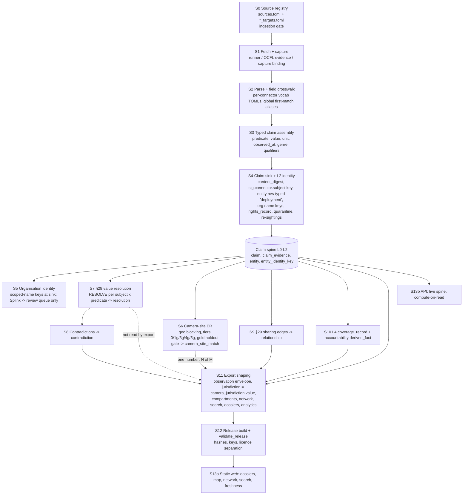

# L1 — Synthesis pipeline audit: from source bytes to the public graph

Row **L1** of `META_PLAN.md` (Stream L, R/A, read-only). Run window **2026-09-30T21:59:27Z → 2026-09-30T22:16:57Z** (`date -u`), in the
planning worktree `/Users/stevenvitali/Eleutheria-next-phase` (branch `claude/next-phase-planning`). `PD` =
`docs/build/planning/2026-09-30-next-phase`. Operator asks: U-006 ("not that confident … how disparate sources with disparate
schemas are synthesized into a deduplicated knowledge graph of relations between entities") and U-007 ("increased confidence in
algorithms used to turn raw ingested data into synthesized knowledge graph"), under U-008 (no humans besides the operator).
Companion file: `PD/findings/incoming/L1.csv` (`NEW-1…NEW-14`).

**Code under audit.** The pipeline packages (`connectors parsing ontology db resolution reconcile inference exports api`) are
byte-identical to the chain tip `b051732c` (`git diff --stat b051732c HEAD -- <those dirs>` is empty). All `file:line`
references are to that tree.

**Release under audit** (for recorded executions): `sig-2026-09-27-ce480ab1` (manifest sha256 `717aeb44…72d6`), using the
sha-verified copies C3 captured under `docs/build/logs/next-phase/C3/bucket/` (gitignored). That release was built **before**
commit `18bda164` (P32.4, 2026-09-27T06:41Z; the release object is dated 2026-09-27T01:33:43Z), so where P32.4 changed
behaviour the release and the chain tip differ; this is called out per item.

**Evidence classes (P1).** `code` (read at `b051732c`), `recorded-execution` (commands I ran in this row, listed in §9),
`live-read` (only as cited from earlier rows — I made no network requests), `inference` (labelled). Prior rows' findings are
re-verified in code before being relied on; where I could not re-verify, the item says so. Nothing here is a human label or a
human review (P4).

**Method.** I read the code seam by seam; three read-only sub-agents traced (a) connector schema mapping, (b) test coverage
per seam and (c) the export/API surface. I re-verified every load-bearing claim they returned before using it (the
verification is cited next to the claim). I ran four small read-only probes (§9): a claim-digest test, and three DuckDB
queries over the captured release parquets. No production system was touched (P3).

---

## 0. Bottom line for the operator

1. **There is no single deduplicated knowledge graph today.** Three separate structures exist, and they do not meet:
   - **The claim spine** keys every fact to a **per-source subject string** (`traffic_camera:<source>:<target>:<ref>`,
     `osm:node/<id>`, `data_driven:agency:<name>`, …). One upstream record = one entity. Nothing ever merges two such
     entities: `entity.merged_into` has **no writer** anywhere in the code (readers filter on `IS NULL`, which is always true).
   - **Camera-site ER** (the geospatial matcher, ADR-105) decides which camera records are the same device. Its output is
     used for **exactly one number** — "223,901 resolved sites from 232,625 records" — and nothing else. No cluster id is
     exported. Dossiers, the map, bulk files and search all publish **observation-level rows**, so the same camera from two
     or three publishers is counted two or three times.
   - **Organisation identity** is an **exact scoped-name key** minted at the sink (`sig.org.name_scoped` =
     `jur:<code>|<normalized name>` or `src:<source>|<name>`; ADR-122: "never auto-unioned"). The Splink matcher only enqueues
     proposals to a review queue (U-008: no reviewer besides the operator; C3 counts 33,907 proposed camera merges waiting); the cascade's deterministic tiers run only inside one connector
     (`data_driven`). There is no production organisation-ER stage.
2. **Relations are thin.** The only materialized relations are **sharing edges** (130 in the release, all from one 2016–17 EFF
   dataset whose claims are dated with a 2020 constant) and **L4 accountability links** (none reaches a dossier). Access-path
   closure is not run (`"access_paths": []` is hard-coded, `exports/src/exports/spine_export.py:1011`).
3. **The algorithms are mostly sound on paper and well tested on fixtures, but their inputs are wrong in production.** The
   §28 resolver counts corroboration per independence class — but no production code ever sets an independence class, so
   every claim is its own class (NEW-4). The camera matcher refuses same-source merges — so two overlapping republishes of
   DeFlock/OSM registered under **one** source can never be deduplicated (NEW-6). The ALPR-vs-traffic incompatibility guard
   keys on source-name substrings — so the largest ALPR layer is classed `unspecified` (NEW-7). Claim identity includes the
   row's position and page URL — so an upstream deletion re-mints identical facts as new, "independent" claims (NEW-1).
4. **The weakest seams** are, in order: (i) **identity at the sink** (keys, types, digests — S4), (ii) **export shaping**
   (jurisdiction per source, labels, dates and duplicates lost — S11), (iii) **independence/lineage** (declared nowhere —
   S7/S6), (iv) **schema mapping** (global first-match aliases, open predicate vocabulary, hard-coded types — S2/S3), and
   (v) **evaluation** (model-labelled gold with no negatives — S6).
5. **What can raise confidence without humans** is a set of **mechanical invariants over the real spine and every release**
   (§6.2; 17 checks), plus ten ranked fixes (§6.1), of which the first three — truthful identity keys, a closed vocabulary
   and declared independence — remove whole classes of error before any statistic is computed.
   Several of the defects below are **silent**: nothing fails, the numbers simply mean less than their labels say.

---

## 1. Seam diagram

Materializer order (production, hand-run per release): `resolution → camera-sites → edges → contradictions → coverage →
accountability` (`ops/src/ops/recovery_apply.py:79-85, 595-670`). Note what the diagram shows: **§28 value resolution runs over
un-merged per-source subjects**, before and independently of camera-site ER; ER output feeds only a count; the export reads
the spine and the materialized tables side by side, and the API reads the live spine and never the materialized
`resolution`/`relationship`/`camera_site_match` tables.

Text form, one line per seam (inputs → outputs; where it is materialized):

| seam | in → out | materialized or computed on read |
|---|---|---|
| S0 registry | reviewed config → targets, licences, per-target `state` | config (TOML) |
| S1 fetch/capture | URL → bytes + `evidence_capture` (+ OCFL object) | stored |
| S2 parse/crosswalk | bytes → raw records (field aliases, vocab maps) | in memory |
| S3 claim assembly | records → claim dicts (predicate, value, time, genre) | in memory |
| S4 sink/identity | dicts → `claim`, `claim_evidence`, `entity`, `entity_identity_key`, `rights_record` | stored, append-only |
| S5 org identity | object refs → org entities by name key; Splink → `review_item` | stored (keys); proposals only |
| S6 camera ER | latest camera claims → `camera_site_match`, `camera_site_run` | stored; exported only as N of M |
| S7 §28 resolution | claims per (subject, predicate) → `resolution` | stored; export does not read it (see S11) |
| S8 contradictions | §28 output → `contradiction` | stored |
| S9 sharing edges | entity-ref claims → `relationship` | stored |
| S10 L4 | spine → `coverage_record`, `inference.derived_fact` | stored |
| S11 export shaping | spine + materialized tables → release files | computed per release |
| S12 release | files → manifest, validation | stored (GCS) |
| S13 web / API | release files / live spine → pages / JSON | static / computed on read |

---

## 2. Seam-by-seam

Each seam: **algorithm** · **schema mapping** · **identity** · **conflicts** · **relations** · **geography/time** ·
**failure modes** (known = earlier finding re-verified; `NEW-n` = raised here) · **tests** (summary; detail in §4).

### S0 — Source registry and ingestion gate

- **Algorithm.** `connectors/src/connectors/data/sources.toml` (342 rows) plus per-family target files
  (`camera_registry_targets.toml` 223 targets / 173 sources; `dot_511_targets.toml` 14 targets). `assert_loadable`
  (`connectors/src/connectors/loader.py`) fails closed unless `ingestion_permitted` is true. Not re-audited here (E/I streams).
- **What the registry decides for the graph.** Each camera target's **`state` becomes every record's jurisdiction** (S3), its
  `license_spdx` becomes every claim's rights, and its `agency` becomes `camera_registry_publisher`. There is **no field for
  technology, stable id field, axis order, CRS or upstream lineage** on any of the 237 camera targets (recorded-execution:
  `tomllib` key census; keys present are `id, source_id, kind, platform, url, layer_url, agency, state, jurisdiction_scheme,
  observed_count, verified, notes, license_spdx, object_id_field, page_size`). `coordinate_mode` and `observed_fields` exist
  on the 14 DOT rows but are read nowhere (sub-agent a; re-verified: `grep coordinate_mode connectors/src` finds only the TOML).
- **Lineage is not recorded as data.** A mirror is visible only in prose `notes`/`custody_posture = MIRROR`; e.g.
  `camreg_osm_surveillance` (≈151.7k of the 154.5k OSM-derived sites) is two third-party ArcGIS republishes of DeFlock/OSM,
  registered as `government_portal` (I1 NEW-5, re-verified in `camera_registry_targets.toml`).
- **Failure modes.** Jurisdiction per source (known: K9K10 NEW-8, I1 NEW-4), code-scheme collisions (known: I1 NEW-1),
  misconfigured `state` (known: I1 NEW-2 — FDOT D5 as CA), no technology field (known: I1 NEW-9), no lineage field (NEW-4).

### S1 — Fetch and capture

- **Algorithm.** The runner fetches per target/page, stores bytes as an `evidence_capture` (OCFL object; P32.2 binds claims
  to the **actual** capture, `db/src/db/assertion.py:168-233`), and records a run row. Pre-P32.2 claims point to one
  **synthetic** per-source-per-run capture (`db/src/db/claim_sink.py:11-16`, `_ensure_evidence` at `:1167`), classified
  `legacy_synthetic`.
- **ArcGIS paging.** `resultOffset` pages ordered by the target's `object_id_field`, page count from the **static**
  `observed_count` (`connectors/src/connectors/dot_511.py:160-181`; a guard at `:766` fails when the layer outgrows the plan).
- **Failure modes.** Run telemetry incomplete and unpublished (known: ED-51, K9K10 NEW-4); raw capture digests are not an
  upstream-change signal (known: K9K10 NEW-3); page URL and row position leak into claim identity (NEW-1, see S4).

### S2 — Parse and field crosswalk ("disparate schemas")

- **Algorithm.** There is **no shared schema crosswalk**. Each connector family has a vocab TOML that maps upstream fields or
  tags to predicates; the camera family uses **global alias lists, first match wins** (`dot_511_vocab.toml:108-160`,
  `dot_511.py:342-355, 990-1032`). OSM maps tags via `osm_tag_vocab.toml:44-63`; Atlas keeps City/County/State/Vendor as raw
  context only (`atlas_vocab.toml:81-83`); procurement uses first-match aliases (`procurement.py:4732-4738`); dossier documents
  use a frozen, reviewer-authored crosswalk (all 34 predicates registered). The `parsing/` package supplies genre
  classification, table/clause extraction and locators; the LLM path (`parsing/src/parsing/extraction.py`) can only emit
  `R6`/`PROPOSED` candidates and has no production client.
- **Coordinates.** ArcGIS requests `outSR=4326`; **attribute lat/lon pairs are preferred over geometry, and the first in-range
  pair wins** (`dot_511.py:411-455`, sub-agent a; re-verified). There is no CRS check on attribute pairs and no per-target axis
  order, so a swapped pair is caught only when a value is out of range — never in the UK/EU band where |lon| ≤ 90 (the
  Nottingham/mark43 swap, known: C3 NEW-6, I1 NEW-2).
- **Hard-coded types.** Every camera record is `record_kind = "traffic_camera"` with no technology predicate (known: I1 NEW-9;
  `dot_511.py:541, 602`); EFF's vendor is a config constant "Vigilant Solutions (LEARN)" (`data_driven.py:341`).
- **Lossy mapping.** Dict/list values are stored as a Python `repr` in `value_text` (`db/src/db/assertion.py:510`; no connector
  sets `value_json`); OSM stores only `raw_value` plus a normalized set, not the normalized kind (`osm.py:640-660`); EFF puts a
  retention unit in `retention_unit`, not `unit` (`data_driven.py:655-660`); procurement `amount` is a string without currency
  (sub-agent a).
- **Failure modes.** First-match aliasing with no per-target pinning of the id/coordinate fields and no uniqueness check (NEW-3);
  type information discarded (known I1 NEW-9; NEW-7 for the ER consequence); per-target schema documentation
  (`observed_fields`, `coordinate_mode`) is not the mapping applied (part of NEW-3).

### S3 — Typed claim assembly and the predicate registry

- **Algorithm.** A claim is a plain dict (`subject_id, predicate_id, value, raw_value, evidence_genre, evidence{…},
  license, …`). The sink's adapter (`db/src/db/assertion.py:450-760`) turns it into the `sig.assertion/1` envelope: it
  rejects bad object types, value kinds, time kinds, R/D/I codes, qualifiers and locators into `assertion_quarantine`, and
  labels every default with a basis (R3/D2/I1 at `claim_sink.py:112-118`; `observed_at` ← capture `retrieved_at`,
  `assertion.py:554-558`).
- **The predicate registry** (`ontology/generated/registry/predicate_registry.json`, 184 predicates) carries cardinality,
  per-genre directness, half-life, volatility, strategy and (for coordinates) an absolute tolerance of 0.0005°. It is
  consulted by the resolver (`reconcile/src/reconcile/weight.py:185-200`), freshness and shaping — **not at emit or sink time**.
- **Open vocabulary at the sink (NEW-2).** An unregistered predicate is **auto-registered** into `vocab_predicate` with generic
  defaults (`MODERATE`, 365 days, `authoritative_source_wins`; `claim_sink.py:409-419, 1330`). The `UNKNOWN_PREDICATE`
  quarantine reason exists (`assertion.py:60`) but is raised only on the intake path (`db/src/db/intake_apply.py:484`). The
  resolver then drops the claim with a `KeyError` ("no directness row", `reconcile/src/reconcile/resolve.py:534-537`), so the
  fact is stored but can never be resolved, contradicted or corroborated. Verified unregistered predicates emitted today:
  `installation_date`, `last_checked`, `upstream_ref` (`osm_tag_vocab.toml:58-60`), `portal_stated_permitted_use`
  (`flock_portal_vocab.toml:86`), `deployed` (`pathways.py:536`), `retention_window_observed` (`data_driven.py:653`).
  Genres are open the same way: Atlas stamps `osint`/`news_reporting`/… (`atlas_vocab.toml:56-65`), none of which is one of the
  registry's 20 artifact genres, and OSM/Eyes on Flock stamp none, so they fall back to `connector_run` (D3) instead of
  `osm_node_set` (D2) / `portal_snapshot` (D1) (sub-agent a; re-verified against `artifact_genres`).
- **Time.** Registry connectors deliberately keep `observed_at` out of the claim; it is derived from the latest re-sighting's
  capture time (ADR-104/ADR-123, `reconcile/src/reconcile/materialize.py:203-220`). EFF Data Driven stamps a **config constant
  2020-01-28** on 2016–17 data (`data_driven.py:367`); Eyes on Flock uses the upstream `data_last_updated`, which its own
  docstring says is "never trusted as observed_at" (`flock_portal.py:211-218` vs `:692-706`); valid-time is almost never set.
- **Failure modes.** NEW-2 (open vocabulary, silent non-resolution); undated → 1970 placeholder in the edge path (NEW-10);
  dates recorded as constants (NEW-10).

### S4 — Claim sink and L2 identity (the weakest seam)

- **Algorithm** (`db/src/db/claim_sink.py`, `db/src/db/identity_guard.py`). Each claim is staged per chunk; subjects and object
  refs are resolved through the identity guard (`entity_identity_key` primary key `(scheme, value)`, immutable); claims are
  inserted `ON CONFLICT (content_digest) DO NOTHING`; a duplicate from a live run appends a re-sighting `claim_evidence` link
  (`record_resightings`, `:292`).
- **Claim identity = sha256 of the whole claim dict** minus `claim_id/sys_period/recorded_at` (`:110, :150-159`). Every key a
  connector adds is identity. **NEW-1:** the camera connector puts the page URL and the row's position in the page
  (`evidence.locator = Locator.row(feature_index)`, `dot_511.py:543-561`) into the dict, so **the same fact re-mints as a new
  claim whenever its row moves** (an upstream deletion shifts every later row). Recorded-execution (§9 probe 1): for one
  camera, changing only `feature_index` 7→8 changed the digest of **all 8** emitted claims; changing only the page URL did the
  same. Sub-agent a found the same class elsewhere (re-verified at the cited lines): `capture_digest`/`retrieved_date` in
  procurement and Legistar claims (`procurement.py:3584-3597, 2740, 2805`), the whole-snapshot `capture_digest` in Eyes on Flock
  field claims (`flock_portal.py:682, 703`), `osm_version` in every OSM claim (`osm.py:646`), and `datetime.now()` flowing into
  EFF claims (`data_driven.py:366`). Consequences: inflated claim counts; re-sighting dating bypassed; and, with NEW-4, a
  single source "corroborates" itself.
- **Subject identity = the connector's subject string** under `sig.connector.subject`. There is no cross-source subject key.
  **NEW-3 (key collisions and instability):**
  - Legistar contract subjects are `contract:{source}:{external_id}` with no tenant, while the `legistar` source spans the agenda
    tenants (`procurement.py:349, 2778`): two cities' `MatterId`/`MatterFile` values can collide into one "contract".
  - Atlas agencies are `atlas:{raw agency name}:{family}` (`atlas.py:530`) and EFF agencies `data_driven:agency:{name}`
    (`data_driven.py:338, 449`), both without state: same-named agencies in different states become **one entity**.
  - Camera keys take the **first matching alias** from a global list (`dot_511_vocab.toml:108-114`), unchecked for uniqueness,
    falling back to server row ids (`OBJECTID`/`FID`). For IDOT the key is `OBJECTID` (recorded-execution: alias resolution over
    `observed_fields`). Server row ids are not stable across a layer overwrite (inference), so a key can silently switch to a
    different camera.
  These are **merges without a match record** — they bypass every ER safeguard and violate SIG-IDENT-025 ("an unexplainable
  merge is a violation").
- **Entity typing (NEW-5).** Every connector subject is minted as `entity_type = 'deployment'` (`_DEFAULT_ENTITY_TYPE`,
  `claim_sink.py:118`; used at `:1571`), whatever it is — agency, contract, portal, bill, meeting. Only object refs carry a
  declared type (`organization`). Consequences: `/v1/entity/deployment/<id>` serves agencies (live-read in K12b §2 for Austin PD;
  in I1 NEW-4 for an Eyes on Flock portal); accountability anchors select `entity_type = 'deployment'`
  (`inference/src/inference/accountability.py:401`) and so treat contracts and agencies as deployments.
- **Organisation objects** are minted by name key: legacy `sig.org.name` (global) and, since ADR-122, `sig.org.name_scoped`
  (`jur:<j>|<name>` or `src:<source>|<name>`); both are publication-review-required (`claim_sink.py:99-102, 1801`). The UEI/LEI
  crosswalk path in `resolution/partner_identity.py:269-272` is fed by no connector, and `candidate_identifier` /
  `jurisdiction_candidate` / `resolved_entity_id` keys are never read under `db/` (sub-agent a; re-verified by grep) — they only
  change the digest.
- **Rights.** `rights_record` is chosen by **SPDX alone** (`claim_sink.py:949-975`): the first source's attribution text is
  reused for every later source with the same licence (known: ED-34/J1 NEW-2 — 3,272 rows credited to "DeFlock community
  map"). The same function sets `derivative_permitted = 'yes'` for any known SPDX (sub-agent c; re-verified at `:964-969`).
- **What is dropped.** Only `record_kind == "claim"` rows land; entity/index rows (`traffic_camera`, `asset`, `contract`,
  `procurement_notice`) are counted as non-claims. OSM geometry lives only on `asset` rows, so the OSM origin connector
  cannot deliver coordinates to the spine at all (sub-agent a; the national OSM layer arrives via the ArcGIS mirror, S0).

### S5 — Organisation identity and crosswalks

- **Algorithm.** Three paths, none of which merges existing entities:
  1. **Exact name keys at the sink** (S4) — conservative by design (ADR-122 §3: "never auto-unioned").
  2. **The deterministic cascade** (`resolution/src/resolution/cascade.py`, tiers 0–3) — called in production only inside the
     EFF connector's `link()` (`connectors/src/connectors/data_driven.py:66, 693`), and its `resolved_entity_id` is ignored by
     the sink.
  3. **Splink tiers 4–5** (`resolution/probabilistic.py`) — the `match`/`review enqueue` CLI (`resolution/src/resolution/cli.py:561-590`)
     only enqueues `PROPOSED` pairs. `run_entity_resolution` (`resolution/er_run.py:241`) has **no production caller**; the six
     production materializers do not include organisation ER (`ops/src/ops/recovery_apply.py:79-85`).
- **Consequence (inference, measurable by L2).** Identity errors here are **under-merges** (fragmentation): an operator minted
  under `jur:us.state_abbr:TX|austin police department` and the same agency as a procurement `buyer` minted under
  `src:<procurement source>|…` are two entities, so the accountability join "deployment operator = contract buyer"
  (`inference/accountability.py:38-45`) cannot fire. Sub-agent c reports 0 dossiers with a governance chain in the hosted
  export (consistent with C3 §4.6's empty sections).
- **Spec drift.** ADR-099 §1 says the cascade + Splink outputs are materialized; what `materialize_resolutions` writes is §28
  **value** decisions (`reconcile/src/reconcile/materialize.py:451`), not identity. "Resolution" names two different things
  (part of NEW-8).

### S6 — Camera-site geospatial ER (the only production ER)

- **Algorithm** (`resolution/src/resolution/camera_sites.py`, rules v2 in `data/camera_site_rules.toml`, ADR-105). Records =
  each camera subject's **latest** claim per camera predicate (`camera_sites_pg.py:84-100, 170-280`; the lat/lon pair must share
  one capture). Geo-grid blocking proposes cross-source pairs ≤ 50 m. Tiers: **0** duplicate target of the same source (row- or
  digest-identical); **1g** shared upstream ref (mutually nearest, one-to-one within 5 m unless names agree); **3g** coincident
  ≤ 1 m and one-to-one within 5 m; **4g/5g** proximate → review only; else discard. Hard constraints: never two records of one
  source in a cluster; ALPR vs traffic/CCTV never candidates; soft conflicts (jurisdiction, camera_type, direction > 90°)
  never auto-write; clusters ≤ 50 m span and ≤ 6 members; shape alerts demote. Auto-write tiers are enabled when the frozen
  holdout's **strict point-estimate precision** ≥ 0.98 with ≥ 50 pairs (`camera_sites.py:1612-1650`).
- **Mirror lineage.** Two sources are one lineage if ≥ 20 coincident records cover ≥ 50 % of the smaller
  (`camera_sites.py:421-500`). The result appears only in `match_evidence` and the run summary (`:886, :1394`); it changes no
  decision and nothing public.
- **What the output feeds.** `read_resolved_site_runs` (`camera_sites_pg.py:631-680`) → one metric (N of M). **No cluster id
  leaves the spine** (NEW-8).
- **Failure modes.**
  - **NEW-6 — same-source mirrors are undeduplicable.** `camreg_osm_surveillance` holds two overlapping DeFlock/OSM
    republishes as targets of **one** source. The same-source constraint forbids merging them, and the duplicate-target
    exception requires row-identical or byte-identical captures (`camera_sites.py:622-700`), which two different republishers
    never produce. Recorded-execution (§9 probe 3): inside that source, **13,529 coordinate groups at 0.1 m hold 27,253
    rows (13,724 excess)**; 14,436 excess at ~1 m. That is ≈ 9 % of the layer counted twice (inference: overlapping
    republishes; OSM nodes rarely share coordinates to 1e-6°).
  - **NEW-7 — the ALPR/traffic guard is keyed on names.** `device_class` matches source-id and operator substrings
    (`camera_sites.py:320-335`; `flock`, `alpr`, `lpr`; `dot`, `511`, `traffic`, `its_`). `camreg_osm_surveillance` matches none,
    so the largest ALPR layer is `unspecified` and **compatible with traffic cameras**; the rules file itself notes no hosted
    `camera_type` value matches the ALPR type rule. Substring rules also misfire on any source id containing `dot`/`its_`.
  - Jurisdiction soft conflict uses the per-source `camera_jurisdiction`, so a mislabelled source (FDOT D5 as CA) can never
    auto-merge with its correctly labelled counterpart (inference).
  - Evaluation weaknesses — see S6-eval below (NEW-9).
- **S6-eval — the gold set** (`resolution/src/resolution/data/camera_site_gold.json`; recorded-execution §9 probe 4):
  - 540 pairs, **both adjudicators are the same model** (`agent:claude-opus-5-5@sig-maintainer-seed` as verifier and
    `llm:claude-opus-5-5@camera-rules-v1-blind`), so the reported κ (0.669) is model-vs-model agreement, not LLM-vs-human.
  - The verifier labelled **3 `non_match` in 540 pairs, and 0 in the 180-pair frozen holdout** (150 match, 30
    not-enough-information). The holdout has no negatives, so the "precision" measures the not-enough-information rate, not the
    false-merge rate.
  - **95 of 180 holdout pairs are the `cross_source_mirror` stratum**; the single largest source pair is
    `camreg_mark43 × camreg_nottingham_gb` (28 pairs) — the two **axis-swapped** layers (C3 NEW-6) — followed by
    `camreg_osm_surveillance × camreg_stanford_us` (18) and `camreg_caloes_ca × camreg_trafficops_ca` (15; the FDOT D5 layer
    mislabelled CA). The 1g/3g figures (70/70, 69/70) therefore mostly measure **recognising a republished copy**.
  - The gate uses the point estimate; `wilson_lower_95` is computed but never gates (`camera_sites.py:1561-1570` vs
    `:1612-1650`); the sample frame is a 2026-09-24 pull, re-used for run 7 (8,724 merges vs 2,332; known C3 NEW-20, F4 NEW-5).
  - Known: "human-verified" wording is false (C3 NEW-4, F2b NEW-3).

### S7 — §28 value resolution

- **Algorithm** (`reconcile/src/reconcile/resolve.py`, `RESOLVER_VERSION p08.1/1.0.0`). Per (subject, predicate): admissibility
  (retracted, valid-window, D6 excluded, **same-source supersession by latest ordering instant**, `:524-576`) → canonicalize →
  weight (R × I × D) → independence classes → strategy (registry) → ambiguity test U1–U8 (`:884-962`) → emit
  support/agreement, currency (`C1–C4` → CURRENT…HISTORICAL) and a rationale. Deterministic; `input_digest` idempotent;
  materialized into `resolution` with `close_superseded_resolutions` closing prior rows (`db/deploy/resolution_supersede.sql`).
- **Inputs actually supplied in production** (`reconcile/src/reconcile/materialize.py:234-323`): value, reliability, integrity,
  genre (= capture `artifact_type`), observed date and instant, source id, count-scope qualifiers. **Not read:**
  `valid_period`, `claim_directness`, `derived_from_claim_ids`, and **no independence class or collection method**.
- **NEW-4 — independence is never declared.** `class_id = independence_class or derived_from_source or claim_id`
  (`resolve.py:163-166`) and `method = collection_method or source_id or claim_id` (`:169-172`). No production code sets
  either field (grep over `connectors db reconcile resolution inference exports` finds only the dataclass and a counter;
  `tests/reconcile/test_resolve.py` is the only place that sets `independence_class=`). So SIG-RECON-018 ("never per claim") is
  met by the function and violated by its inputs: every claim is its own class. Support labels are partly protected because
  CONFIRMED/STRONGLY_SUPPORTED count **methods** (falling back to source id), but U2/U3/U8 count **classes**
  (`:904-916, :955-958, :1005-1016`): two re-minted claims from one source (NEW-1) defeat U3 "one source vs one source is never
  resolvable by fiat" and can make a single dissenting source "IRRECONCILABLE". SIG-EPIS-009 (`derived_from_claim_ids`) and
  SIG-EPIS-029 (undeclared-copying detector: only a constant, `reconcile/src/reconcile/model.py:59`) are MET-DIFFERENTLY in
  the matrix on "by design + policy" grounds; neither exists in code (known: ED-49/F2b NEW-2 for the first).
- **Valid time ignored.** Because `valid_from/valid_to` are never read, `_intersects_world` is always true and supersession
  keys on `(source, None, None)`: two period-specific values from one source collapse to "the later wins" (NEW-4, second part).
- **Scope of conflicts.** Because subjects are per source (S4), §28 almost never sees two sources about one subject; its
  contradictions are same-source-over-time or intra-source. Cross-source disagreement about one physical camera is never
  compared anywhere (NEW-8).
- **Currency** is computed per query and never persisted (the `resolution` insert has no currency column,
  `materialize.py:415-423`).

### S8 — Contradictions

- **Algorithm.** `materialize_contradictions` re-runs RESOLVE and writes the resolver's own contradictions plus one synthesized
  `value_disagreement` per conflicted pair (`materialize.py:1149-1190, 1236-1309`); a no-longer-detected one gets a new
  `superseded` row. Sound and append-only.
- **Gap.** The release shows 2 contradictions while 5,290 subjects are "conflicted" in the export (known: C3 NEW-11). The two
  notions come from different code (S11). See NEW-11 for what happens to those 5,290 at the next republish.

### S9 — §29 relations: counts and sharing edges

- **Counts** (`reconcile/counts.py`, `count_scope.py`): scope-qualified comparability (ADR-122) — sound; only as good as the
  `count_scope` qualifiers connectors declare.
- **Sharing edges** (`reconcile/materialize.py:707-970`, `reconcile/sharing.py`): tier-0 current claims **with an
  `object_entity`** under a predicate whose name contains `configured`, `sharing_partner`, `observed`, `_use`, `seen`,
  `declared`, `policy`, `mou` or `agreement` (substring classifier, `:693-718`) → directed observations → per-kind reconciliation
  (asymmetry = A lists B but B's export does not list A) → `relationship` rows with `valid_from_kind='unknown'`,
  **`valid_to_kind='ongoing'` always** (`:866-888`, per SIG-ONTO-044).
- **Failure modes (NEW-10).**
  - An undated claim gets **1970-01-01**, which becomes the edge's `valid_period` lower bound (`:814`, `:890-918`); the claim
    reader for edges does not use the capture-time fallback the §28 reader uses.
  - Edges carry no currency; a 2016–17 dataset stamped 2020-01-28 is materialized as an **ongoing** edge (known consequence:
    K12b NEW-2 "undated / historical shown as current"; root cause here: the rule "single snapshot ⇒ ongoing" with no age
    decay, plus the constant date in `data_driven.py:367`).
  - `read_materialized_edges` has **no `upper_inf(sys_period)` filter and no supersession** (`:971-1007`): when an edge's evidence
    set changes, a new row is inserted and the old one stays live (sub-agent c; re-verified).
  - The asymmetry test treats **a counterparty with no export at all** as non-reciprocation (`sharing.py:121-165`): every edge
    from a one-sided source (EFF audit data) is an "asymmetry" plus a research task (counted, not written as contradictions).
  - The export's shaping classifier (`exports/src/exports/shaping.py:961`) and this one disagree (`sharing_partner`, `use`) though
    a comment says they are consistent (`materialize.py:691-692`).
- **Lifecycle** (`reconcile/lifecycle.py`) has no production caller (known: ED-47).

### S10 — L4 inference: coverage and accountability

- **Coverage** (`inference/src/inference/materialize.py:248-328`): numerators count any resolution row with a winning claim, no
  tier/currency filter, clamped with `min()` (known: C3 NEW-5, ED-42).
- **Accountability links** (`inference/src/inference/accountability.py`): deployment → operator (role taxonomy) → contract
  buyer/seller → funding → policy → oversight, written as labelled L4 `derived_fact` rows. It depends on **exact entity
  identity across sources** (S5) and on `camera_operator`, which is minted only when a target declares an operator
  (`dot_511.py:650-656`). Anchors are `entity_type='deployment' AND merged_into IS NULL` (`:401`) — both predicates are
  meaningless today (NEW-5, NEW-8).
- **Access paths** are not computed (`"access_paths": []`, `spine_export.py:1011, 1112`).

### S11 — Export shaping (the second-weakest seam)

- **Observation envelope** (`exports/src/exports/shaping.py:846-940`): per (subject, predicate), candidates are the latest claim
  **per source lineage** (P32.4, `db/src/db/occurrences.py:295-316`; key = `source_id or claim_id`), exact-string comparison of
  parsed floats, **no tolerance** (sub-agent c; re-verified at `:821-837, 874-898`), range-only validation so (0,0) passes
  (`:808-816`). This envelope — not the `resolution` table — decides `point_status` on the map and dossiers. The export fetches
  the materialized resolutions (`spine_export.py:310`) but does not use them for sites (sub-agent c).
- **Jurisdiction routing** = the raw `camera_jurisdiction` string (`shaping.py:1040-1045`), scheme ignored, geometry unchecked;
  only subjects with the four shaping predicates reach a dossier; procurement, policy, legislation and sharing claims never do
  except through an accountability link whose row value is a UUID (`spine_export.py:1296-1322`). Known: K9K10 NEW-8 (58 sources,
  166,210 of 236,994 site rows, 70.1 %, reach no geographic dossier), I1 NEW-1/NEW-4, C3 NEW-6/NEW-14.
- **Labels** (known symptom K12b NEW-1; **root cause located**): network node labels are looked up in `source_names`, a map of
  `source_registry.source_id → name` (`spine_export.py:132-135, 994-995`), keyed by connector ids that never equal an entity
  UUID, so every node falls back to its UUID. `entity_labels` is fetched (`:139-143`) and passed only to dossiers. Node `type` is
  hard-coded `agency`/`partner`. The release FTS index holds **only camera sites** (`exports/src/exports/release.py:421-470`),
  labelled from `camera_name` or empty.
- **Edge payload.** `support` is hard-coded `WEAKLY_SUPPORTED` and `evidence_count` 1 (`spine_export.py:1004-1005`): 260
  `configured_sharing_partner` claims collapse to 130 single-source edges; no date, currency, direction, source; and
  `sig_graph/sharing_edges.csv` comes from a different (compute-on-read) edge set than `network.json`, credited to SIG
  (`spine_export.py:1686-1688`) (sub-agent c; re-verified at the cited lines).
- **Duplicates.** One row per `(source, rights_id)` per site (`spine_export.py:614-645`; known: C3 NEW-17 portal fan-out); cross-source copies published
  separately (NEW-8, probe 2); same-source exact-point duplicates (known: C3 NEW-19).
- **No geometry or uniqueness gate** at export (known: ED-30/PKG-06b).

### S12 — Release build and validation

- `validate_release` (`exports/src/exports/release.py:753-873`) checks artifact hashes/sizes, undeclared files, index
  completeness, **record-key uniqueness within a compartment**, and the search-index digest. It does **not** check labels,
  geometry, cross-compartment duplicates, jurisdiction consistency, `network.json` or analytics (sub-agent c). The C3 recompute
  (`PD/review/DATA_TRUTH.md` DR-C3-15) is the only number-truth check, and it is manual.

### S13 — Public web and API

- **Web** renders release bytes only (static). **API** reads the **live spine** and computes on read; it never reads
  `resolution`, `relationship`, accountability or camera-site tables (`api/src/api/store_pg.py`; sub-agent c table §7). So the
  API and the site answer from different pipelines: labels exist in the API (`organization.cached_canonical_name`,
  `store_pg.py:640-656`) and not on the site; `/v1/dossier` falls back to 25 arbitrary subjects (known: C3 NEW-1, S0).

---

## 3. Failure-mode register

Severity per META_PLAN §8.2. "Known" rows were re-verified in code at `b051732c` (the check is in §2); consequences for the
operator's question are stated in one line.

| id | seam | failure mode | code location | consequence | status |
|---|---|---|---|---|---|
| FM-01 | S0/S11 | Jurisdiction = the target's configured `state`, per source, never per point | `dot_511.py:633-640`; `shaping.py:1040-1045` | 70.1 % of site rows reach no geographic dossier; wrong-state sources pollute dossiers | known (K9K10 NEW-8, I1 NEW-4) |
| FM-02 | S11 | USPS and ISO codes share one key space | `shaping.py:1041`; `dot_511.py:639` | DE/ID/MN/CO dossiers mix countries and states | known (I1 NEW-1) |
| FM-03 | S2/S11 | No axis/CRS check; (0,0) and out-of-jurisdiction points pass | `dot_511.py:411-455`; `shaping.py:808-816`; `camera_sites.py:410-418` | swapped UK layers, FL-as-CA, points at (0,0) published | known (C3 NEW-6, I1 NEW-2) |
| FM-04 | S2 | Every registry camera is `traffic_camera`; no technology predicate | `dot_511.py:541, 602` | the public cannot tell ALPR from traffic cameras | known (I1 NEW-9) |
| FM-05 | S6 | ALPR/traffic guard keyed on source-name substrings; DeFlock is `unspecified` | `camera_sites.py:320-335`; rules `[classes]` | the guard does not protect the largest ALPR layer | **NEW-7** |
| FM-06 | S11 | Network/search labels lost: lookup keyed by source id | `spine_export.py:132-135, 994-995`; `release.py:421-470` | 131 UUID nodes although names exist | known symptom (K12b NEW-1), root cause here |
| FM-07 | S7/S0 | Mirrors and copies never declared; independence class = claim | `resolve.py:163-172`; `materialize.py:234-323` | SIG-RECON-018/EPIS-009/029 unmet in production | known (ED-49) + **NEW-4** |
| FM-08 | S0/S6 | ArcGIS copies of OSM/DeFlock registered as one `government_portal` source | `camera_registry_targets.toml` (`camreg_osm_surveillance`) | origin not ingested; overlapping copies undeduplicable | known (I1 NEW-5) + **NEW-6** |
| FM-09 | S9/S11 | Edges ongoing by rule; no currency; 1970 placeholder; constant 2020 date | `materialize.py:814, 866-903`; `data_driven.py:367`; `spine_export.py:1004-1005` | 2016–17 sharing shown as current | known (K12b NEW-2) + **NEW-10** |
| FM-10 | S4 | Rights record chosen by SPDX only | `claim_sink.py:949-975` | third-party rows credited to "DeFlock community map" | known (ED-34, J1 NEW-2) |
| FM-11 | S11/S10 | "Resolved" defined three ways (coverage, envelope, camera ER) — plus §28 | `inference/materialize.py:273-328`; `shaping.py:846-940`; `camera_sites_pg.py:84-100` | numbers that look comparable are not | known (C3 NEW-5) + part of **NEW-8** |
| FM-12 | S11 | Row fan-out per rights source; same-source exact-point duplicates | `spine_export.py:614-645` | inflated row counts | known (C3 NEW-17, NEW-19) |
| FM-13 | S13 | API dossier/coverage placeholders | `store_pg.py:850-870, 927-956` | false API answers | known (C3 NEW-1 S0, NEW-10) |
| FM-14 | S4 | Claim identity includes row position, page URL, capture digest, fetch date, OSM version | `dot_511.py:543-561`; `procurement.py:2740, 3584-3597`; `flock_portal.py:682`; `osm.py:646`; `data_driven.py:366` | identical facts re-minted; self-corroboration | **NEW-1** |
| FM-15 | S3 | Unregistered predicates auto-registered, then unresolvable | `claim_sink.py:409-419, 1330`; `resolve.py:534-537` | facts stored but never resolved/contradicted | **NEW-2** |
| FM-16 | S4/S2 | Subject keys collide (Legistar tenants; agency names without state) or are unstable (server row ids); key field not pinned or checked | `procurement.py:349, 2778`; `atlas.py:530`; `data_driven.py:338`; `dot_511_vocab.toml:108-114` | silent false merges with no match record | **NEW-3** |
| FM-17 | S4 | Every subject typed `deployment` | `claim_sink.py:118, 1571` | agencies/contracts served and joined as deployments | **NEW-5** |
| FM-18 | S6/S11 | ER output never applied: no cluster id, `merged_into` never written | `camera_sites_pg.py:631-680`; `entity.sql:15` | dossiers/map/bulk double-count copies (5,016 excess rows at 2,933 multi-source points) | **NEW-8** |
| FM-19 | S6 | Gold set: one model as verifier and adjudicator, 0 negatives in holdout, mirror-dominated | `camera_site_gold.json`; `camera_sites.py:1612-1650` | auto-write "precision" does not measure false merges | **NEW-9** (extends C3 NEW-4, F2b NEW-3) |
| FM-20 | S9/S11 | Edge rows never superseded; two classifiers; CSV and network from different edge sets | `materialize.py:971-1007`; `shaping.py:961`; `spine_export.py:1686-1688` | stale edges stay live; published edge sets disagree | **NEW-10** |
| FM-21 | S11/S7 | 5,290 "conflicted" subjects were same-source restatements under pre-P32.4 code; chain tip will silently pick the latest | `occurrences.py:295-316`; `resolve.py:555-576` | a key instability (e.g. IDOT `OBJECTID`) will disappear from view at the next republish | **NEW-11** |
| FM-22 | S5 | No production organisation ER; name-scoped keys never unioned; UEI/LEI crosswalk unfed | `er_run.py:241`; `recovery_apply.py:79-85`; `partner_identity.py:269-272` | fragmentation breaks accountability joins (0 governance chains) | **NEW-12** |
| FM-23 | S7 | §28 reader ignores valid time and connector directness | `reconcile/materialize.py:234-323` | period-specific facts collapse to "latest wins" | part of **NEW-4** |
| FM-24 | S12 | Release validation checks integrity, not truth | `release.py:753-873` | every defect above ships green | **NEW-13** |
| FM-25 | S2 | Lossy values: repr strings, dropped units/currency, constants | `assertion.py:510`; `data_driven.py:341, 655-660`; `procurement.py` amount | numbers not comparable across sources | **NEW-14** |

---

## 4. Test coverage per seam

Mapped by sub-agent (b) and spot-checked by me. Counts are `def test_` lines in files that import the module (parametrized
cases not expanded). All suites listed pass locally (sub-agent recorded execution: 944 passed over resolution, reconcile,
parsing, inference, property; 1,199 passed over exports, api, ontology, db, e2e). Classes: **fixture** = synthetic or
hand-written inputs; **PG** = real PostgreSQL in a throwaway testcontainer seeded by hand-written SQL or synthetic claims;
**real** = production-scale or captured production data.

| seam | tests (≈) | data class | real-data link | what is not tested at all |
|---|---|---|---|---|
| S1 fetch/capture | `tests/connectors` 55 files ≈ 906; `tests/evidence` 49; OCFL 9; replay 8 | fixture (1.5 MB; `SOURCES.md` files say "hand-written", "SYNTHETIC", "trimmed excerpts"); in-memory sink | none | row-order / re-page idempotency for registry connectors (INV-02); only the agenda connector has a shuffle test (`test_agenda_documents.py:557`) |
| S2 parse/crosswalk | `tests/parsing` ≈ 106; genre in 3 connector files | fixture | none | per-target key-field uniqueness; axis swap inside valid range (only `test_dot_511.py:412`, out-of-range case) |
| S3 claim typing / registry | `tests/ontology` ≈ 77; registry 11; `test_schema_integrity.py` 6 (PG) | fixture + one committed hosted snapshot | `test_every_measured_predicate_is_registered` reads `docs/build/reports/p31.8-hosted/predicate_inventory_before.json` | sink-time conformance: the auto-registration path (`claim_sink.py:926`) is untested and unguarded |
| S4 sink / identity | 19 files ≈ 251; `test_claim_sink.py` 7; `test_sink_identity_guard.py` 15 | PG, synthetic claims | none | subject `entity_type`; `_rights_id` per-SPDX reuse; digest stability under volatile evidence fields |
| S5 org identity / crosswalk | identity 16, crosswalk 12, public_id 12, temporal 14, er_run 16; db identity 10 | fixture (crosswalk, public id: no PG) | none | the production scoped-name keys against real agency names; cross-source join rate |
| S6 cascade + Splink | cascade 18, probabilistic 14, blocking 13, review 13 | Splink really runs, on 5 synthetic orgs (`test_probabilistic.py:30-65`); e2e S4 inserts 3 orgs by hand | none | `block_key`; any run over connector-produced org entities |
| S6 camera-site ER | `test_camera_sites.py` 57; db 24; temporal contract 20 | fixture; PG fixture = 7 hand-inserted records (`test_camera_site_materialize.py:99-105`) | gold set (540 pairs from the 230,330-record hosted pull) — metadata only (`test_camera_sites.py:517`); no coordinates, so the matcher cannot be re-run on it | `haversine_m`, `decision_digest`, `gold_band`, `read_human_verdicts`, `materialize_camera_sites_from_dsn`; same-source republish overlap; device class for real source ids |
| S6-eval | gold 19, evaluator 52, human_eval 24 (+23 PG), quality gates 16, eval loop 6, report 7 | fixture | `test_eval_report_generator.py:84-140` checks the committed P28.1 report against the recorded hosted summary (consistency, not re-execution) | lower-bound gating; negatives in holdout; frame digest vs source mix |
| S7 §28 resolution | resolve 25, weight 12, camera predicates 16, rebuild, rationale; PG 6 | fixture (synthetic `Claim` objects) | none | the PG reader's missing fields (independence, valid time); `test_resolve.py:323` passes only because it sets `independence_class` by hand |
| S8 contradictions | 16 + 10 + PG 6; e2e S5 (299 vs 190, pure Python) | fixture | none | cross-source disagreement (structurally absent, NEW-8) |
| S9 counts / sharing | counts 8, count scope 6, sharing 8, edges 14, PG 6 | fixture | none | edge supersession; 1970 placeholder; classifier parity with shaping; `claim_weight` |
| S10 L4 | reconcile.materialize ≈ 114; inference.materialize ≈ 35; accountability ≈ 42; access paths 32; coverage ≈ 43 | PG seeded by hand | none | the `*_from_dsn` entry points the CLI uses; join rate over real identities |
| S11 export shaping | shaping 34, spine_export 42, analytics 28; PG 10 | fixture; the committed release candidate `p32.23a-release-candidate/candidate_export` is a fixture-spine build with 0 map assets and 0 network nodes | none | node labels (the network test asserts ids only, `test_spine_export.py:1009-1030`); geometry-in-jurisdiction; cross-source duplicates; row count = distinct entities |
| S12 release | `validate_release` tests | fixture | none | any semantic invariant |
| S13 API | `test_store_pg.py` 15 (PG); resilience 16; entity 3; e2e S6 | synthetic OKC slice | none | `build_pg_store`; jurisdiction-scope dossiers |

**Cross-cutting.**
- **Property-based tests** exist in 2 files (`tests/property/test_temporal_invariants.py`, `test_sensitivity_properties.py`);
  none for ER, resolution, counts or export.
- **No test carries one dataset end to end.** `tests/e2e/test_composed_stack.py` has 13 tests whose steps are not chained: S3
  replays atlas/osm fixtures into `PgClaimSink`, S4 inserts its own orgs by hand, S5 is pure Python, S7 exports from a
  hand-written JSON request (`:263`).
- **Nothing re-runs over production-scale data.** Hosted runs are recorded as reports (`docs/build/reports/p30.2-hosted`,
  `p30.2b-hosted/resolution_scale.json`, `p31.11-hosted/camera_site_run.json`, `P28.1_resolution_eval.md`); tests only read
  their summaries.
- **The specific invariants the operator's question needs** — coordinates inside the declared jurisdiction, in-range axis
  swaps, technology correct at export, labels reaching network/search, mirrors sharing a class in §28, exported rows = distinct
  entities — are **tested nowhere** (only the camera-ER mirror count is tested, on synthetic records,
  `test_camera_sites.py:208`).

**Verification status per seam (P5 vocabulary).** Every seam is `engineered` and `fixture-verified`. S4, S6, S7 and S11 are also
`live-executed` (they produced the 2026-09-27 release), but **none is verified against real data by any automated check**; the
only real-data verifications are C3's and I1's manual recomputes of released numbers, which found the defects in §3.

**Side effect to disclose.** Sub-agent (b) was asked to run non-Docker suites only; its second run also executed `tests/db` and
`tests/e2e`, which started throwaway local PostGIS testcontainers and rebuilt the gitignored `web/dist`. No tracked file changed
(`git status` shows only other rows' untracked planning files) and no hosted system was touched (P3 holds).

---

## 5. What "deduplicated" means today, in numbers

| layer | unit published | dedup applied | evidence |
|---|---|---|---|
| Claims | 2,423,200 tier-0 current claims | exact digest only (NEW-1 undermines it) | C3 §4.10 |
| Entities (spine) | one per source record | none across sources; `merged_into` never written | `claim_sink.py:1571`; grep |
| Camera sites | 232,625 observation records → "223,901 resolved sites" | 8,724 auto-written merges (run 7), **count only** | C3 §4.3; `camera_sites_pg.py:631` |
| Dossiers / map / bulk | observation rows | none | K9K10, C3; probe 2 |
| Cross-source copies still counted separately | 2,933 points (≈1 m) published by ≥ 2 sources, 7,949 rows, **5,016 excess** (PA 1,861; MD 1,101; GB-ENG 562; KY 414; NZ 298) | — | probe 2 (recorded-execution) |
| Within-source copies (DeFlock/OSM republishes) | 13,529 groups, 27,253 rows, **13,724 excess** at 0.1 m | impossible by constraint | probe 3 |
| Organisations | one per exact scoped name key | none (review queue only) | ADR-122; `cli.py:561-590` |
| Sharing edges | 130 edges from 260 claims, one source | per (from, to, kind) | sub-agent c; C3 |

So the published observation figures include **at least ≈ 18.7k duplicate rows (≈ 8 % of geolocated rows)** from mirrors alone
(floor: exact-coordinate duplicates only; same-source duplicates in other layers — C3 NEW-19's 23,566 — overlap this count and
are not added). L2 should measure this properly over the spine.

---

## 6. Ranked fixes and invariants

### 6.1 Highest-leverage fixes (ranked by error removed per unit of work)

Sizes: S ≤ 1 day, M ≤ 1 week, L > 1 week (engineering only; no humans). Each fix is append-only (new sqitch changes, new
claims, new identity decisions; nothing rewritten).

| rank | fix | removes | size | depends |
|---|---|---|---|---|
| 1 | **Truthful identity keys.** Take row position, page URL, capture digest, fetch date and version counters out of the claim dict (they belong on the `claim_evidence` binding); pin each camera target's key field in config and fail the run on duplicate keys; scope Legistar contract keys by tenant and Atlas/EFF agency keys by state; add a key-stability monitor (share of subjects whose coordinates move > 55 m between runs). Regression tests: re-order / re-page / replay ⇒ +0 claims. | NEW-1, NEW-3, NEW-11 | M | none |
| 2 | **Close the vocabulary at the sink.** Quarantine unregistered predicates and genres (`UNKNOWN_PREDICATE`), register the six missing predicates through the ontology, map Atlas methods onto registry genres, stamp `osm_node_set` / `portal_snapshot`; a CI test that every connector's emitted predicates, genres and enum values are in the generated registry. | NEW-2 (+ ED-45) | S–M | none |
| 3 | **Declare independence.** Default class = `source_id` (not `claim_id`); add a registry `lineage` field (origin / mirror-of) and read it as `independence_class`; feed camera `infer_lineages` into it; persist `derived_from_claim_ids` for republications; test SIG-RECON-018 on the PG read path. | NEW-4, ED-49 | M | 1 (so re-mints do not look like classes) |
| 4 | **Publish the dedup, not just a count.** Export a site `cluster_id` and "N sites (M observations)" per dossier and map cell; list cross-source copies instead of counting them; register the DeFlock/OSM republishes as separate sources (or ingest the OSM origin with coordinates) so ER can merge them. Materially changes published numbers → HG-11 (ADR-101 §4). | NEW-6, NEW-8 | L | 1, 3, 6 |
| 5 | **Edge truth.** Node labels from `organization.cached_canonical_name`/entity labels; edges carry observed date, currency, source and evidence count; no 1970 placeholder (use the capture-time fallback); supersede changed edges; one classifier; the CSV and `network.json` from one edge set; asymmetry only when the counterparty has an export. | NEW-10, K12b NEW-1/NEW-2 | M | none |
| 6 | **Point-level geography and technology** (F5 PKG-06, PKG-07): `(scheme, code)` jurisdiction keys, point-in-polygon assignment with conflicts disclosed, axis/null-island detectors, per-target technology slug feeding both the export and `device_class`. | FM-01…05, NEW-7 | L | 2 |
| 7 | **Entity types from the connector.** Subject entity type declared per subject scheme (camera → deployment, agency → organization, contract → contract…); existing rows fixed by new typed identity decisions, not UPDATEs. | NEW-5 | M | 2 |
| 8 | **Honest ER gating without humans.** Gate on the Wilson/Clopper-Pearson lower bound (the code already computes Wilson); build hard negatives mechanically (distinct devices at one intersection, same-source multi-view pairs, known-different sources); exclude the mirror stratum from the auto-write estimate or report it separately; key every measurement to a source-mix frame digest; label the labeller as "agent (Claude)". Scope with L3. | NEW-9 | M | L3 decision |
| 9 | **Organisation identity program.** Feed UEI/LEI/ORI/QID crosswalks from USAspending/SAM/FBI registries into `partner_identity`; run the cascade tiers 0–3 as a production materializer with match records; keep Splink at review. | NEW-12 | L | 7 |
| 10 | **Truth checks in the release gate** — the invariant suite below, run on every release candidate and nightly on the spine. | NEW-13 | M | none (can start first) |

Rank 10 can and should start first: it is how the other nine are proven, and it turns silent defects into red checks.

### 6.2 Invariants to check continuously (feed L2 measurements, L3 program, B4 G10 probes)

Each is mechanical, needs no human, and runs over the real spine (read-only role) or the release files. "Now" is what I
expect today from this audit (inference unless marked measured).

| id | invariant | where | now |
|---|---|---|---|
| INV-01 | Every claim's predicate, genre and enum value is in the generated registry | sink (fail closed) + CI | fails (NEW-2) |
| INV-02 | Replaying a connector over the same upstream rows in a different order or page size inserts 0 claims | fixture test + nightly replay | fails (NEW-1, probe 1) |
| INV-03 | No (subject, predicate, value, source) has more than one current claim | spine query | expected to fail (NEW-1) |
| INV-04 | Within one capture, no two upstream rows map to one subject key | connector | unchecked |
| INV-05 | Key stability: per camera source, share of subjects whose latest coordinate moved > 0.0005° since the previous run ≤ threshold | spine query per run | unchecked (NEW-11) |
| INV-06 | Entity type agrees with subject scheme (no `data_driven:agency:*` typed deployment) | spine query | fails (NEW-5) |
| INV-07 | 0 published points at (0,0); 0 outside their jurisdiction polygon without a disclosed state; per-target axis-swap test | release files | fails (measured by C3) |
| INV-08 | Every dossier key is `(scheme, code)`; no bucket mixes schemes | release files | fails (I1 NEW-1) |
| INV-09 | Duplicate accounting: published observation rows = distinct entities; every ≥ 2-source coincident point either shares a cluster id or is listed as a copy; within-source exact duplicates reported | release files | fails (probes 2–3) |
| INV-10 | No resolution counts two independence classes from one source or one lineage | spine query | fails (NEW-4) |
| INV-11 | 0 network/search nodes labelled by their UUID when any label exists | release files | fails (131/131) |
| INV-12 | Every published edge carries observed date + currency + source; 0 edges with `valid_from` 1970-01-01; 0 live duplicate edges per (from, to, kind) | release + spine | fails (NEW-10) |
| INV-13 | One "resolved": coverage numerator ≤ denominator by join (no clamp); coverage, dossiers and map agree per predicate | release | fails (C3 NEW-5) |
| INV-14 | Each exported row's attribution equals its source registry attribution | release | fails (ED-34) |
| INV-15 | Auto-write tiers enabled only if the lower bound ≥ floor on a holdout whose frame digest equals the current source mix and which contains ≥ k negatives | ER run | fails (NEW-9) |
| INV-16 | Share of published claims bound to an actual capture (not `legacy_synthetic`), reported per source | spine query | unmeasured |
| INV-17 | Accountability join rate: share of deployments with an operator entity, and of operators that also appear as a procurement buyer | spine query | ≈ 0 (NEW-12) |

For B4's G10 probes, INV-07, INV-09, INV-11, INV-12, INV-13 and INV-14 run on public release files alone (no credentials).
C3's `tools/build_trace.py` and the §9 DuckDB queries are a starting implementation.

---

## 7. Findings raised by this row

`PD/findings/incoming/L1.csv`, all `proposed`.

| id | sev | title (short) |
|---|---|---|
| NEW-1 | S1 | Claim identity includes row position, page URL, capture digest, fetch date and OSM version, so identical facts re-mint as new claims |
| NEW-2 | S2 | The predicate and genre vocabulary is open at the sink: unregistered predicates are auto-registered, then silently unresolvable |
| NEW-3 | S1 | Subject keys collide (Legistar tenants, agency names without state) or are unstable (server row ids): silent false merges with no match record |
| NEW-4 | S1 | Independence is never declared in production: every claim is its own class, so SIG-RECON-018 is unmet in practice; valid time and declared directness are not read |
| NEW-5 | S2 | Every connector subject is typed `deployment` in the entity table |
| NEW-6 | S2 | Overlapping DeFlock/OSM republishes inside one source cannot be deduplicated (13,724 excess rows) |
| NEW-7 | S2 | The camera ER's ALPR/traffic incompatibility guard is keyed on source-name substrings; the largest ALPR layer is `unspecified` |
| NEW-8 | S1 | No cross-source dedup reaches any published record: ER yields one count; 5,016 excess rows at 2,933 multi-source points are counted in dossiers and the map |
| NEW-9 | S1 | The camera gold set is labelled by one model twice, has 0 negatives in its holdout and is mirror-dominated; the auto-write gate uses the point estimate |
| NEW-10 | S2 | Sharing-edge seam: 1970 placeholder dates, never-superseded rows, two classifiers, two edge sets, asymmetry from absence |
| NEW-11 | S2 | The 5,290 "conflicted" subjects are an artifact of pre-P32.4 code; the next republish will silently pick the latest value and hide key instability |
| NEW-12 | S2 | There is no production organisation ER: name-scoped keys are never unioned and the UEI/LEI crosswalk is unfed |
| NEW-13 | S2 | Release validation checks integrity only; no truth invariant runs anywhere in CI or the release path |
| NEW-14 | S3 | Lossy value mapping: repr strings, dropped units and currency, hard-coded constants |

---

## 8. Limits and what was not verified

- **No spine query.** Everything about the hosted spine is inferred from code and from the release files. Claim re-mint rates
  (NEW-1), key collision counts (NEW-3), OBJECTID churn (NEW-11) and org fragmentation (NEW-12) need L2's read-only queries.
- **Probes 2–3 use rounding grids, not distance.** 1e-5° is ≈ 1.1 m in latitude and less in longitude; the counts are a floor
  for coincidence and can include distinct devices on one pole. The union of compartment parquets gave 222,627 distinct
  geolocated entities against C3's 227,335; I did not reconcile the difference, so percentages are approximate.
- **NEW-11's cause is an inference.** The mechanism (pre-P32.4 envelope counted every same-source claim as a candidate) is code;
  that IDOT's 98 % conflict rate comes from `OBJECTID` reassignment is a hypothesis consistent with IDOT being the one DOT layer
  keyed by `OBJECTID`.
- **Sub-agent output** was re-verified at the lines cited above; items I could not re-verify (e.g. the cross-tenant collision
  magnitude, the Eyes on Flock slug-vs-name question) are marked as sub-agent findings.
- **Not audited:** the ingestion gate and rights (E/I/J streams), parsing internals beyond the LLM boundary, the web islands'
  client code, ops scheduling.

## 9. Recorded executions

Run window **2026-09-30T21:59:27Z → 2026-09-30T22:16:57Z** (`date -u`). All from the worktree root, `uv run --offline`, read-only.

1. **Digest probe** — build one `connectors.dot_511.CameraRegistryEntry`, call `claim_rows(url, date, 7)` and `(…, 8)` and with a
   different page URL, hash each row with `db.claim_sink.content_digest`. Output: `predicates: 8 digest unchanged when only row
   position moves 7->8: []` and `digest unchanged when only query URL changes: []`.
2. **Cross-source coincidence** — DuckDB over the 11 compartment parquets in `docs/build/logs/next-phase/C3/bucket/parquet/`
   (excluding `sig_graph.parquet`), distinct `(entity_id, source_id, jurisdiction, lon, lat)`, grouped on `round(lat,5),
   round(lon,5)` with `count(distinct source_id) > 1`. Output: `(2933, 7949, 5016)`; top pairs `camreg_penndot_pa +
   camreg_ucsd` 923, `camreg_mark43 + camreg_nottingham_gb` 558, `camreg_esri_dash + camreg_md_opendata + dot_511_md` 219.
3. **Within-source OSM duplicates** — same file set, `source_id = 'camreg_osm_surveillance'` (154,528 rows, all with
   geometry), groups with `count(*) > 1` at 6/5/4 decimals. Output: `(6, 13529, 27253, 13724), (5, 14088, 28524, 14436),
   (4, 16689, 34653, 17964)`.
4. **Gold-set census** — `json.load` of `resolution/src/resolution/data/camera_site_gold.json`: 540 pairs, 180 frozen;
   adjudicators `agent:claude-opus-5-5@sig-maintainer-seed` ×540 and `llm:claude-opus-5-5@camera-rules-v1-blind` ×540;
   verifier labels match 403 / non_match 3 / NEI 134; frozen holdout strata `cross_source_mirror` 95 of 180, verifier labels
   match 150 / NEI 30 / non_match 0.
5. Supporting: `tomllib` census of target keys and of the camera id alias resolved per DOT target (IDOT → `OBJECTID`); regex
   diff of connector-emitted predicate names against the 184-row registry.
