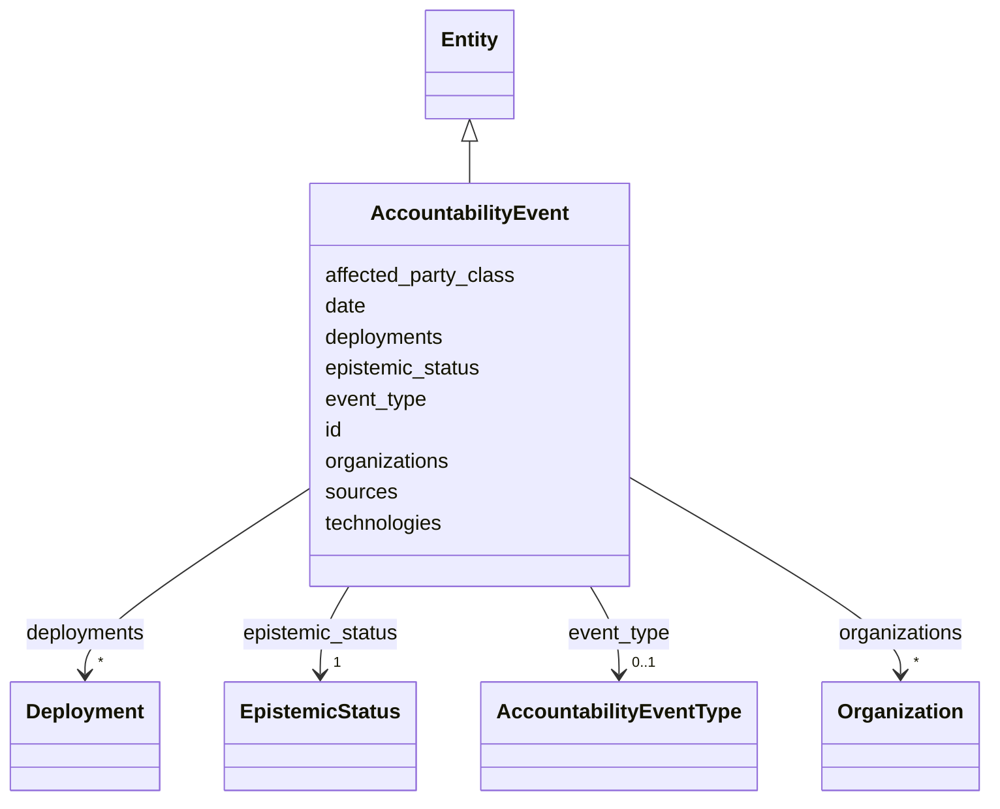

---
search:
  boost: 10.0
---

# Class: AccountabilityEvent 


_An accountability event; epistemic_status is REQUIRED and rendered everywhere (§11.17, SIG-ONTO-038/039)._


<div data-search-exclude markdown="1">


URI: [sig:AccountabilityEvent](https://ontology.sig-project.org/schema/AccountabilityEvent)





## Inheritance
* [Entity](Entity.md)
    * **AccountabilityEvent**


## Slots

| Name | Cardinality and Range | Description | Inheritance |
| ---  | --- | --- | --- |
| [event_type](event_type.md) | 0..1 <br/> [AccountabilityEventType](AccountabilityEventType.md) |  | direct |
| [epistemic_status](epistemic_status.md) | 1 <br/> [EpistemicStatus](EpistemicStatus.md) |  | direct |
| [date](date.md) | 0..1 <br/> [Edtf](Edtf.md) |  | direct |
| [organizations](organizations.md) | * <br/> [Organization](Organization.md) |  | direct |
| [deployments](deployments.md) | * <br/> [Deployment](Deployment.md) |  | direct |
| [technologies](technologies.md) | * <br/> [TechnologyCode](TechnologyCode.md) |  | direct |
| [affected_party_class](affected_party_class.md) | 0..1 <br/> [String](String.md) | A class, never a named private individual (N4) | direct |
| [sources](sources.md) | * <br/> [Uriorcurie](Uriorcurie.md) | Linkable to all six source classes of OL-2E-AL-03 (SIG-ONTO-039) | direct |
| [id](id.md) | 1 <br/> [Uriorcurie](Uriorcurie.md) | The entity's stable minted identity (L2 identity only, §8 | [Entity](Entity.md) |


## Identifier and Mapping Information


### Schema Source


* from schema: https://ontology.sig-project.org/schema/sig


## Mappings

| Mapping Type | Mapped Value |
| ---  | ---  |
| self | sig:AccountabilityEvent |
| native | sig:AccountabilityEvent |


## LinkML Source

<!-- TODO: investigate https://stackoverflow.com/questions/37606292/how-to-create-tabbed-code-blocks-in-mkdocs-or-sphinx -->

### Direct

<details>
```yaml
name: AccountabilityEvent
description: An accountability event; epistemic_status is REQUIRED and rendered everywhere
  (§11.17, SIG-ONTO-038/039).
from_schema: https://ontology.sig-project.org/schema/sig
rank: 1000
is_a: Entity
attributes:
  event_type:
    name: event_type
    from_schema: https://ontology.sig-project.org/schema/entities
    rank: 1000
    domain_of:
    - AccountabilityEvent
    range: AccountabilityEventType
  epistemic_status:
    name: epistemic_status
    from_schema: https://ontology.sig-project.org/schema/entities
    rank: 1000
    domain_of:
    - AccountabilityEvent
    range: EpistemicStatus
    required: true
  date:
    name: date
    from_schema: https://ontology.sig-project.org/schema/entities
    rank: 1000
    domain_of:
    - AccountabilityEvent
    range: edtf
  organizations:
    name: organizations
    from_schema: https://ontology.sig-project.org/schema/entities
    rank: 1000
    domain_of:
    - AccountabilityEvent
    range: Organization
    multivalued: true
  deployments:
    name: deployments
    from_schema: https://ontology.sig-project.org/schema/entities
    rank: 1000
    domain_of:
    - AccountabilityEvent
    range: Deployment
    multivalued: true
  technologies:
    name: technologies
    from_schema: https://ontology.sig-project.org/schema/entities
    rank: 1000
    domain_of:
    - AccountabilityEvent
    range: technology_code
    multivalued: true
  affected_party_class:
    name: affected_party_class
    description: A class, never a named private individual (N4).
    from_schema: https://ontology.sig-project.org/schema/entities
    rank: 1000
    domain_of:
    - AccountabilityEvent
    range: string
  sources:
    name: sources
    description: Linkable to all six source classes of OL-2E-AL-03 (SIG-ONTO-039).
    from_schema: https://ontology.sig-project.org/schema/entities
    domain_of:
    - AccountabilityEvent
    - Edge
    range: uriorcurie
    multivalued: true

```
</details>

### Induced

<details>
```yaml
name: AccountabilityEvent
description: An accountability event; epistemic_status is REQUIRED and rendered everywhere
  (§11.17, SIG-ONTO-038/039).
from_schema: https://ontology.sig-project.org/schema/sig
rank: 1000
is_a: Entity
attributes:
  event_type:
    name: event_type
    from_schema: https://ontology.sig-project.org/schema/entities
    rank: 1000
    owner: AccountabilityEvent
    domain_of:
    - AccountabilityEvent
    range: AccountabilityEventType
  epistemic_status:
    name: epistemic_status
    from_schema: https://ontology.sig-project.org/schema/entities
    rank: 1000
    owner: AccountabilityEvent
    domain_of:
    - AccountabilityEvent
    range: EpistemicStatus
    required: true
  date:
    name: date
    from_schema: https://ontology.sig-project.org/schema/entities
    rank: 1000
    owner: AccountabilityEvent
    domain_of:
    - AccountabilityEvent
    range: edtf
  organizations:
    name: organizations
    from_schema: https://ontology.sig-project.org/schema/entities
    rank: 1000
    owner: AccountabilityEvent
    domain_of:
    - AccountabilityEvent
    range: Organization
    multivalued: true
  deployments:
    name: deployments
    from_schema: https://ontology.sig-project.org/schema/entities
    rank: 1000
    owner: AccountabilityEvent
    domain_of:
    - AccountabilityEvent
    range: Deployment
    multivalued: true
  technologies:
    name: technologies
    from_schema: https://ontology.sig-project.org/schema/entities
    rank: 1000
    owner: AccountabilityEvent
    domain_of:
    - AccountabilityEvent
    range: technology_code
    multivalued: true
  affected_party_class:
    name: affected_party_class
    description: A class, never a named private individual (N4).
    from_schema: https://ontology.sig-project.org/schema/entities
    rank: 1000
    owner: AccountabilityEvent
    domain_of:
    - AccountabilityEvent
    range: string
  sources:
    name: sources
    description: Linkable to all six source classes of OL-2E-AL-03 (SIG-ONTO-039).
    from_schema: https://ontology.sig-project.org/schema/entities
    owner: AccountabilityEvent
    domain_of:
    - AccountabilityEvent
    - Edge
    range: uriorcurie
    multivalued: true
  id:
    name: id
    description: The entity's stable minted identity (L2 identity only, §8.2).
    from_schema: https://ontology.sig-project.org/schema/sig
    rank: 1000
    identifier: true
    owner: AccountabilityEvent
    domain_of:
    - Entity
    - Edge
    range: uriorcurie
    required: true

```
</details></div>