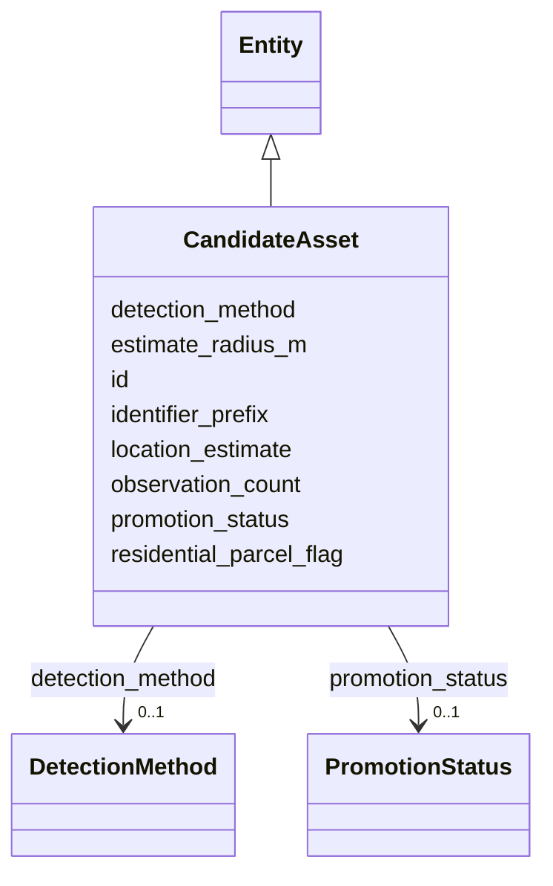

---
search:
  boost: 10.0
---

# Class: CandidateAsset 


_[NEW] RF/heuristic leads that MUST live in a separate entity type and MUST NOT appear in any public device layer until promoted under §43.5 (§11.9, SIG-ONTO-029/030)._


<div data-search-exclude markdown="1">


URI: [sig:CandidateAsset](https://ontology.sig-project.org/schema/CandidateAsset)





## Inheritance
* [Entity](Entity.md)
    * **CandidateAsset**


## Slots

| Name | Cardinality and Range | Description | Inheritance |
| ---  | --- | --- | --- |
| [detection_method](detection_method.md) | 0..1 <br/> [DetectionMethod](DetectionMethod.md) |  | direct |
| [location_estimate](location_estimate.md) | 0..1 <br/> [GeometryWkt](GeometryWkt.md) | With estimate_radius_m — never a bare point | direct |
| [estimate_radius_m](estimate_radius_m.md) | 0..1 <br/> [Float](Float.md) |  | direct |
| [identifier_prefix](identifier_prefix.md) | 0..1 <br/> [String](String.md) | OUI or similar; never a full MAC | direct |
| [observation_count](observation_count.md) | 0..1 <br/> [Integer](Integer.md) |  | direct |
| [promotion_status](promotion_status.md) | 0..1 <br/> [PromotionStatus](PromotionStatus.md) |  | direct |
| [residential_parcel_flag](residential_parcel_flag.md) | 0..1 <br/> [Boolean](Boolean.md) | A true value bars publication outright (§43 | direct |
| [id](id.md) | 1 <br/> [Uriorcurie](Uriorcurie.md) | The entity's stable minted identity (L2 identity only, §8 | [Entity](Entity.md) |


## Identifier and Mapping Information


### Schema Source


* from schema: https://ontology.sig-project.org/schema/sig


## Mappings

| Mapping Type | Mapped Value |
| ---  | ---  |
| self | sig:CandidateAsset |
| native | sig:CandidateAsset |


## LinkML Source

<!-- TODO: investigate https://stackoverflow.com/questions/37606292/how-to-create-tabbed-code-blocks-in-mkdocs-or-sphinx -->

### Direct

<details>
```yaml
name: CandidateAsset
description: '[NEW] RF/heuristic leads that MUST live in a separate entity type and
  MUST NOT appear in any public device layer until promoted under §43.5 (§11.9, SIG-ONTO-029/030).'
from_schema: https://ontology.sig-project.org/schema/sig
rank: 1000
is_a: Entity
attributes:
  detection_method:
    name: detection_method
    from_schema: https://ontology.sig-project.org/schema/entities
    rank: 1000
    domain_of:
    - CandidateAsset
    range: DetectionMethod
  location_estimate:
    name: location_estimate
    description: With estimate_radius_m — never a bare point.
    from_schema: https://ontology.sig-project.org/schema/entities
    rank: 1000
    domain_of:
    - CandidateAsset
    range: geometry_wkt
  estimate_radius_m:
    name: estimate_radius_m
    from_schema: https://ontology.sig-project.org/schema/entities
    rank: 1000
    domain_of:
    - CandidateAsset
    range: float
  identifier_prefix:
    name: identifier_prefix
    description: OUI or similar; never a full MAC.
    from_schema: https://ontology.sig-project.org/schema/entities
    rank: 1000
    domain_of:
    - CandidateAsset
    range: string
  observation_count:
    name: observation_count
    from_schema: https://ontology.sig-project.org/schema/entities
    rank: 1000
    domain_of:
    - CandidateAsset
    range: integer
  promotion_status:
    name: promotion_status
    from_schema: https://ontology.sig-project.org/schema/entities
    rank: 1000
    domain_of:
    - CandidateAsset
    range: PromotionStatus
  residential_parcel_flag:
    name: residential_parcel_flag
    description: A true value bars publication outright (§43.5).
    from_schema: https://ontology.sig-project.org/schema/entities
    rank: 1000
    domain_of:
    - CandidateAsset
    range: boolean

```
</details>

### Induced

<details>
```yaml
name: CandidateAsset
description: '[NEW] RF/heuristic leads that MUST live in a separate entity type and
  MUST NOT appear in any public device layer until promoted under §43.5 (§11.9, SIG-ONTO-029/030).'
from_schema: https://ontology.sig-project.org/schema/sig
rank: 1000
is_a: Entity
attributes:
  detection_method:
    name: detection_method
    from_schema: https://ontology.sig-project.org/schema/entities
    rank: 1000
    owner: CandidateAsset
    domain_of:
    - CandidateAsset
    range: DetectionMethod
  location_estimate:
    name: location_estimate
    description: With estimate_radius_m — never a bare point.
    from_schema: https://ontology.sig-project.org/schema/entities
    rank: 1000
    owner: CandidateAsset
    domain_of:
    - CandidateAsset
    range: geometry_wkt
  estimate_radius_m:
    name: estimate_radius_m
    from_schema: https://ontology.sig-project.org/schema/entities
    rank: 1000
    owner: CandidateAsset
    domain_of:
    - CandidateAsset
    range: float
  identifier_prefix:
    name: identifier_prefix
    description: OUI or similar; never a full MAC.
    from_schema: https://ontology.sig-project.org/schema/entities
    rank: 1000
    owner: CandidateAsset
    domain_of:
    - CandidateAsset
    range: string
  observation_count:
    name: observation_count
    from_schema: https://ontology.sig-project.org/schema/entities
    rank: 1000
    owner: CandidateAsset
    domain_of:
    - CandidateAsset
    range: integer
  promotion_status:
    name: promotion_status
    from_schema: https://ontology.sig-project.org/schema/entities
    rank: 1000
    owner: CandidateAsset
    domain_of:
    - CandidateAsset
    range: PromotionStatus
  residential_parcel_flag:
    name: residential_parcel_flag
    description: A true value bars publication outright (§43.5).
    from_schema: https://ontology.sig-project.org/schema/entities
    rank: 1000
    owner: CandidateAsset
    domain_of:
    - CandidateAsset
    range: boolean
  id:
    name: id
    description: The entity's stable minted identity (L2 identity only, §8.2).
    from_schema: https://ontology.sig-project.org/schema/sig
    rank: 1000
    identifier: true
    owner: CandidateAsset
    domain_of:
    - Entity
    - Edge
    range: uriorcurie
    required: true

```
</details></div>