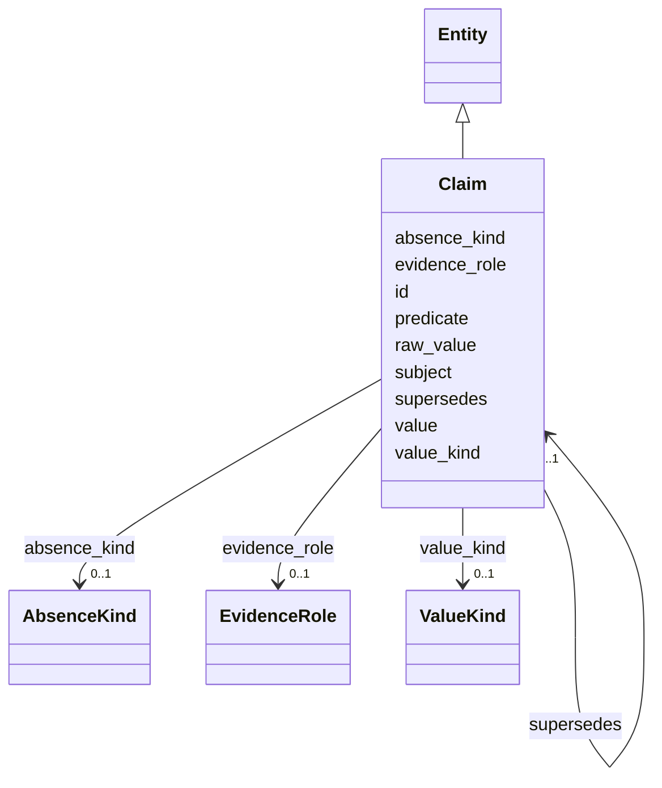

---
search:
  boost: 10.0
---

# Class: Claim 


_An append-only assertion (subject, predicate, value, ...) — the substance of the graph (§10.3, L1). Physical append-only table is P02._


<div data-search-exclude markdown="1">


URI: [sig:Claim](https://ontology.sig-project.org/schema/Claim)





## Inheritance
* [Entity](Entity.md)
    * **Claim**


## Slots

| Name | Cardinality and Range | Description | Inheritance |
| ---  | --- | --- | --- |
| [subject](subject.md) | 0..1 <br/> [Uriorcurie](Uriorcurie.md) |  | direct |
| [predicate](predicate.md) | 0..1 <br/> [PredicateCode](PredicateCode.md) |  | direct |
| [value](value.md) | 0..1 <br/> [String](String.md) |  | direct |
| [value_kind](value_kind.md) | 0..1 <br/> [ValueKind](ValueKind.md) |  | direct |
| [raw_value](raw_value.md) | 0..1 <br/> [String](String.md) |  | direct |
| [absence_kind](absence_kind.md) | 0..1 <br/> [AbsenceKind](AbsenceKind.md) |  | direct |
| [evidence_role](evidence_role.md) | 0..1 <br/> [EvidenceRole](EvidenceRole.md) |  | direct |
| [supersedes](supersedes.md) | 0..1 <br/> [Claim](Claim.md) |  | direct |
| [id](id.md) | 1 <br/> [Uriorcurie](Uriorcurie.md) | The entity's stable minted identity (L2 identity only, §8 | [Entity](Entity.md) |


## Usages

| used by | used in | type | used |
| ---  | --- | --- | --- |
| [Claim](Claim.md) | [supersedes](supersedes.md) | range | [Claim](Claim.md) |


## Identifier and Mapping Information


### Schema Source


* from schema: https://ontology.sig-project.org/schema/sig


## Mappings

| Mapping Type | Mapped Value |
| ---  | ---  |
| self | sig:Claim |
| native | sig:Claim |


## LinkML Source

<!-- TODO: investigate https://stackoverflow.com/questions/37606292/how-to-create-tabbed-code-blocks-in-mkdocs-or-sphinx -->

### Direct

<details>
```yaml
name: Claim
description: An append-only assertion (subject, predicate, value, ...) — the substance
  of the graph (§10.3, L1). Physical append-only table is P02.
from_schema: https://ontology.sig-project.org/schema/sig
rank: 1000
is_a: Entity
attributes:
  subject:
    name: subject
    from_schema: https://ontology.sig-project.org/schema/entities
    rank: 1000
    domain_of:
    - Claim
    - Resolution
    - Contradiction
    - CoverageRecord
    range: uriorcurie
  predicate:
    name: predicate
    from_schema: https://ontology.sig-project.org/schema/entities
    rank: 1000
    domain_of:
    - Claim
    - Resolution
    - Contradiction
    - CoverageRecord
    range: predicate_code
  value:
    name: value
    from_schema: https://ontology.sig-project.org/schema/entities
    rank: 1000
    domain_of:
    - Claim
    range: string
  value_kind:
    name: value_kind
    from_schema: https://ontology.sig-project.org/schema/entities
    rank: 1000
    domain_of:
    - Claim
    range: ValueKind
  raw_value:
    name: raw_value
    from_schema: https://ontology.sig-project.org/schema/entities
    rank: 1000
    domain_of:
    - Claim
    range: string
  absence_kind:
    name: absence_kind
    from_schema: https://ontology.sig-project.org/schema/entities
    rank: 1000
    domain_of:
    - Claim
    - CoverageRecord
    range: AbsenceKind
  evidence_role:
    name: evidence_role
    from_schema: https://ontology.sig-project.org/schema/entities
    rank: 1000
    domain_of:
    - Claim
    range: EvidenceRole
  supersedes:
    name: supersedes
    from_schema: https://ontology.sig-project.org/schema/entities
    rank: 1000
    domain_of:
    - Claim
    range: Claim

```
</details>

### Induced

<details>
```yaml
name: Claim
description: An append-only assertion (subject, predicate, value, ...) — the substance
  of the graph (§10.3, L1). Physical append-only table is P02.
from_schema: https://ontology.sig-project.org/schema/sig
rank: 1000
is_a: Entity
attributes:
  subject:
    name: subject
    from_schema: https://ontology.sig-project.org/schema/entities
    rank: 1000
    owner: Claim
    domain_of:
    - Claim
    - Resolution
    - Contradiction
    - CoverageRecord
    range: uriorcurie
  predicate:
    name: predicate
    from_schema: https://ontology.sig-project.org/schema/entities
    rank: 1000
    owner: Claim
    domain_of:
    - Claim
    - Resolution
    - Contradiction
    - CoverageRecord
    range: predicate_code
  value:
    name: value
    from_schema: https://ontology.sig-project.org/schema/entities
    rank: 1000
    owner: Claim
    domain_of:
    - Claim
    range: string
  value_kind:
    name: value_kind
    from_schema: https://ontology.sig-project.org/schema/entities
    rank: 1000
    owner: Claim
    domain_of:
    - Claim
    range: ValueKind
  raw_value:
    name: raw_value
    from_schema: https://ontology.sig-project.org/schema/entities
    rank: 1000
    owner: Claim
    domain_of:
    - Claim
    range: string
  absence_kind:
    name: absence_kind
    from_schema: https://ontology.sig-project.org/schema/entities
    rank: 1000
    owner: Claim
    domain_of:
    - Claim
    - CoverageRecord
    range: AbsenceKind
  evidence_role:
    name: evidence_role
    from_schema: https://ontology.sig-project.org/schema/entities
    rank: 1000
    owner: Claim
    domain_of:
    - Claim
    range: EvidenceRole
  supersedes:
    name: supersedes
    from_schema: https://ontology.sig-project.org/schema/entities
    rank: 1000
    owner: Claim
    domain_of:
    - Claim
    range: Claim
  id:
    name: id
    description: The entity's stable minted identity (L2 identity only, §8.2).
    from_schema: https://ontology.sig-project.org/schema/sig
    rank: 1000
    identifier: true
    owner: Claim
    domain_of:
    - Entity
    - Edge
    range: uriorcurie
    required: true

```
</details></div>