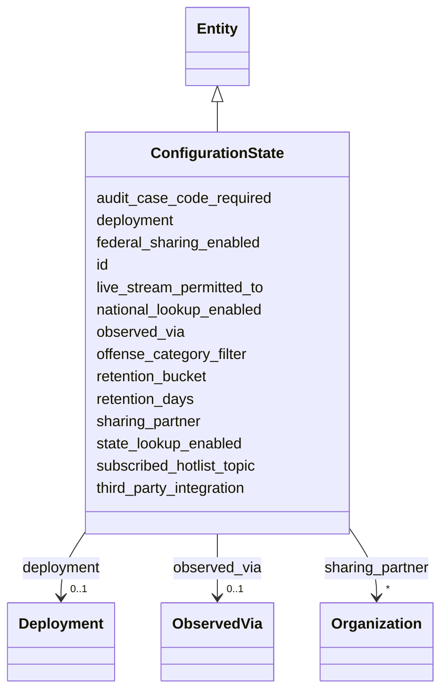

---
search:
  boost: 10.0
---

# Class: ConfigurationState 


_Promoted to a first-class, time-versioned, per-Deployment entity (§11.15). Configuration is observed, never assumed (SIG-ONTO-036). Retention is a duration OR an ordinal bucket; SIG never fabricates a midpoint (SIG-ONTO-035a)._


<div data-search-exclude markdown="1">


URI: [sig:ConfigurationState](https://ontology.sig-project.org/schema/ConfigurationState)





## Inheritance
* [Entity](Entity.md)
    * **ConfigurationState**


## Slots

| Name | Cardinality and Range | Description | Inheritance |
| ---  | --- | --- | --- |
| [deployment](deployment.md) | 0..1 <br/> [Deployment](Deployment.md) |  | direct |
| [retention_days](retention_days.md) | 0..1 <br/> [DurationIso](DurationIso.md) | Duration OR ordinal bucket; MUST accept both (SIG-ONTO-035a) | direct |
| [retention_bucket](retention_bucket.md) | 0..1 <br/> [String](String.md) | The ordinal bucket form; comparison operates on intervals, never a coerced po... | direct |
| [subscribed_hotlist_topic](subscribed_hotlist_topic.md) | * <br/> [String](String.md) |  | direct |
| [sharing_partner](sharing_partner.md) | * <br/> [Organization](Organization.md) | Repeatable, directional | direct |
| [state_lookup_enabled](state_lookup_enabled.md) | 0..1 <br/> [Boolean](Boolean.md) |  | direct |
| [national_lookup_enabled](national_lookup_enabled.md) | 0..1 <br/> [Boolean](Boolean.md) |  | direct |
| [federal_sharing_enabled](federal_sharing_enabled.md) | 0..1 <br/> [Boolean](Boolean.md) |  | direct |
| [offense_category_filter](offense_category_filter.md) | * <br/> [String](String.md) |  | direct |
| [live_stream_permitted_to](live_stream_permitted_to.md) | * <br/> [Uriorcurie](Uriorcurie.md) |  | direct |
| [third_party_integration](third_party_integration.md) | * <br/> [Uriorcurie](Uriorcurie.md) |  | direct |
| [audit_case_code_required](audit_case_code_required.md) | 0..1 <br/> [Boolean](Boolean.md) |  | direct |
| [observed_via](observed_via.md) | 0..1 <br/> [ObservedVia](ObservedVia.md) |  | direct |
| [id](id.md) | 1 <br/> [Uriorcurie](Uriorcurie.md) | The entity's stable minted identity (L2 identity only, §8 | [Entity](Entity.md) |


## Identifier and Mapping Information


### Schema Source


* from schema: https://ontology.sig-project.org/schema/sig


## Mappings

| Mapping Type | Mapped Value |
| ---  | ---  |
| self | sig:ConfigurationState |
| native | sig:ConfigurationState |


## LinkML Source

<!-- TODO: investigate https://stackoverflow.com/questions/37606292/how-to-create-tabbed-code-blocks-in-mkdocs-or-sphinx -->

### Direct

<details>
```yaml
name: ConfigurationState
description: Promoted to a first-class, time-versioned, per-Deployment entity (§11.15).
  Configuration is observed, never assumed (SIG-ONTO-036). Retention is a duration
  OR an ordinal bucket; SIG never fabricates a midpoint (SIG-ONTO-035a).
from_schema: https://ontology.sig-project.org/schema/sig
rank: 1000
is_a: Entity
attributes:
  deployment:
    name: deployment
    from_schema: https://ontology.sig-project.org/schema/entities
    domain_of:
    - PhysicalAsset
    - ConfigurationState
    range: Deployment
  retention_days:
    name: retention_days
    description: Duration OR ordinal bucket; MUST accept both (SIG-ONTO-035a).
    from_schema: https://ontology.sig-project.org/schema/entities
    rank: 1000
    domain_of:
    - ConfigurationState
    range: duration_iso
  retention_bucket:
    name: retention_bucket
    description: The ordinal bucket form; comparison operates on intervals, never
      a coerced point.
    from_schema: https://ontology.sig-project.org/schema/entities
    rank: 1000
    domain_of:
    - ConfigurationState
    range: string
  subscribed_hotlist_topic:
    name: subscribed_hotlist_topic
    from_schema: https://ontology.sig-project.org/schema/entities
    rank: 1000
    domain_of:
    - ConfigurationState
    range: string
    multivalued: true
  sharing_partner:
    name: sharing_partner
    description: Repeatable, directional.
    from_schema: https://ontology.sig-project.org/schema/entities
    rank: 1000
    domain_of:
    - ConfigurationState
    range: Organization
    multivalued: true
  state_lookup_enabled:
    name: state_lookup_enabled
    from_schema: https://ontology.sig-project.org/schema/entities
    rank: 1000
    domain_of:
    - ConfigurationState
    range: boolean
  national_lookup_enabled:
    name: national_lookup_enabled
    from_schema: https://ontology.sig-project.org/schema/entities
    rank: 1000
    domain_of:
    - ConfigurationState
    range: boolean
  federal_sharing_enabled:
    name: federal_sharing_enabled
    from_schema: https://ontology.sig-project.org/schema/entities
    rank: 1000
    domain_of:
    - ConfigurationState
    range: boolean
  offense_category_filter:
    name: offense_category_filter
    from_schema: https://ontology.sig-project.org/schema/entities
    rank: 1000
    domain_of:
    - ConfigurationState
    range: string
    multivalued: true
  live_stream_permitted_to:
    name: live_stream_permitted_to
    from_schema: https://ontology.sig-project.org/schema/entities
    rank: 1000
    domain_of:
    - ConfigurationState
    range: uriorcurie
    multivalued: true
  third_party_integration:
    name: third_party_integration
    from_schema: https://ontology.sig-project.org/schema/entities
    rank: 1000
    domain_of:
    - ConfigurationState
    range: uriorcurie
    multivalued: true
  audit_case_code_required:
    name: audit_case_code_required
    from_schema: https://ontology.sig-project.org/schema/entities
    rank: 1000
    domain_of:
    - ConfigurationState
    range: boolean
  observed_via:
    name: observed_via
    from_schema: https://ontology.sig-project.org/schema/entities
    rank: 1000
    domain_of:
    - ConfigurationState
    range: ObservedVia

```
</details>

### Induced

<details>
```yaml
name: ConfigurationState
description: Promoted to a first-class, time-versioned, per-Deployment entity (§11.15).
  Configuration is observed, never assumed (SIG-ONTO-036). Retention is a duration
  OR an ordinal bucket; SIG never fabricates a midpoint (SIG-ONTO-035a).
from_schema: https://ontology.sig-project.org/schema/sig
rank: 1000
is_a: Entity
attributes:
  deployment:
    name: deployment
    from_schema: https://ontology.sig-project.org/schema/entities
    owner: ConfigurationState
    domain_of:
    - PhysicalAsset
    - ConfigurationState
    range: Deployment
  retention_days:
    name: retention_days
    description: Duration OR ordinal bucket; MUST accept both (SIG-ONTO-035a).
    from_schema: https://ontology.sig-project.org/schema/entities
    rank: 1000
    owner: ConfigurationState
    domain_of:
    - ConfigurationState
    range: duration_iso
  retention_bucket:
    name: retention_bucket
    description: The ordinal bucket form; comparison operates on intervals, never
      a coerced point.
    from_schema: https://ontology.sig-project.org/schema/entities
    rank: 1000
    owner: ConfigurationState
    domain_of:
    - ConfigurationState
    range: string
  subscribed_hotlist_topic:
    name: subscribed_hotlist_topic
    from_schema: https://ontology.sig-project.org/schema/entities
    rank: 1000
    owner: ConfigurationState
    domain_of:
    - ConfigurationState
    range: string
    multivalued: true
  sharing_partner:
    name: sharing_partner
    description: Repeatable, directional.
    from_schema: https://ontology.sig-project.org/schema/entities
    rank: 1000
    owner: ConfigurationState
    domain_of:
    - ConfigurationState
    range: Organization
    multivalued: true
  state_lookup_enabled:
    name: state_lookup_enabled
    from_schema: https://ontology.sig-project.org/schema/entities
    rank: 1000
    owner: ConfigurationState
    domain_of:
    - ConfigurationState
    range: boolean
  national_lookup_enabled:
    name: national_lookup_enabled
    from_schema: https://ontology.sig-project.org/schema/entities
    rank: 1000
    owner: ConfigurationState
    domain_of:
    - ConfigurationState
    range: boolean
  federal_sharing_enabled:
    name: federal_sharing_enabled
    from_schema: https://ontology.sig-project.org/schema/entities
    rank: 1000
    owner: ConfigurationState
    domain_of:
    - ConfigurationState
    range: boolean
  offense_category_filter:
    name: offense_category_filter
    from_schema: https://ontology.sig-project.org/schema/entities
    rank: 1000
    owner: ConfigurationState
    domain_of:
    - ConfigurationState
    range: string
    multivalued: true
  live_stream_permitted_to:
    name: live_stream_permitted_to
    from_schema: https://ontology.sig-project.org/schema/entities
    rank: 1000
    owner: ConfigurationState
    domain_of:
    - ConfigurationState
    range: uriorcurie
    multivalued: true
  third_party_integration:
    name: third_party_integration
    from_schema: https://ontology.sig-project.org/schema/entities
    rank: 1000
    owner: ConfigurationState
    domain_of:
    - ConfigurationState
    range: uriorcurie
    multivalued: true
  audit_case_code_required:
    name: audit_case_code_required
    from_schema: https://ontology.sig-project.org/schema/entities
    rank: 1000
    owner: ConfigurationState
    domain_of:
    - ConfigurationState
    range: boolean
  observed_via:
    name: observed_via
    from_schema: https://ontology.sig-project.org/schema/entities
    rank: 1000
    owner: ConfigurationState
    domain_of:
    - ConfigurationState
    range: ObservedVia
  id:
    name: id
    description: The entity's stable minted identity (L2 identity only, §8.2).
    from_schema: https://ontology.sig-project.org/schema/sig
    rank: 1000
    identifier: true
    owner: ConfigurationState
    domain_of:
    - Entity
    - Edge
    range: uriorcurie
    required: true

```
</details></div>