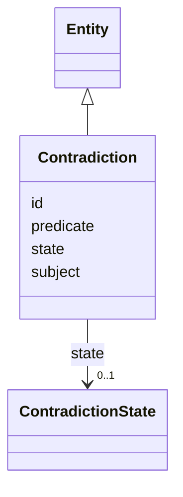

---
search:
  boost: 10.0
---

# Class: Contradiction 


_A first-class, addressable contradiction object (§31)._


<div data-search-exclude markdown="1">


URI: [sig:Contradiction](https://ontology.sig-project.org/schema/Contradiction)





## Inheritance
* [Entity](Entity.md)
    * **Contradiction**


## Slots

| Name | Cardinality and Range | Description | Inheritance |
| ---  | --- | --- | --- |
| [subject](subject.md) | 0..1 <br/> [Uriorcurie](Uriorcurie.md) |  | direct |
| [predicate](predicate.md) | 0..1 <br/> [PredicateCode](PredicateCode.md) |  | direct |
| [state](state.md) | 0..1 <br/> [ContradictionState](ContradictionState.md) |  | direct |
| [id](id.md) | 1 <br/> [Uriorcurie](Uriorcurie.md) | The entity's stable minted identity (L2 identity only, §8 | [Entity](Entity.md) |


## Identifier and Mapping Information


### Schema Source


* from schema: https://ontology.sig-project.org/schema/sig


## Mappings

| Mapping Type | Mapped Value |
| ---  | ---  |
| self | sig:Contradiction |
| native | sig:Contradiction |


## LinkML Source

<!-- TODO: investigate https://stackoverflow.com/questions/37606292/how-to-create-tabbed-code-blocks-in-mkdocs-or-sphinx -->

### Direct

<details>
```yaml
name: Contradiction
description: A first-class, addressable contradiction object (§31).
from_schema: https://ontology.sig-project.org/schema/sig
rank: 1000
is_a: Entity
attributes:
  subject:
    name: subject
    from_schema: https://ontology.sig-project.org/schema/entities
    domain_of:
    - Claim
    - Resolution
    - Contradiction
    - CoverageRecord
    range: uriorcurie
  predicate:
    name: predicate
    from_schema: https://ontology.sig-project.org/schema/entities
    domain_of:
    - Claim
    - Resolution
    - Contradiction
    - CoverageRecord
    range: predicate_code
  state:
    name: state
    from_schema: https://ontology.sig-project.org/schema/entities
    rank: 1000
    domain_of:
    - Contradiction
    range: ContradictionState

```
</details>

### Induced

<details>
```yaml
name: Contradiction
description: A first-class, addressable contradiction object (§31).
from_schema: https://ontology.sig-project.org/schema/sig
rank: 1000
is_a: Entity
attributes:
  subject:
    name: subject
    from_schema: https://ontology.sig-project.org/schema/entities
    owner: Contradiction
    domain_of:
    - Claim
    - Resolution
    - Contradiction
    - CoverageRecord
    range: uriorcurie
  predicate:
    name: predicate
    from_schema: https://ontology.sig-project.org/schema/entities
    owner: Contradiction
    domain_of:
    - Claim
    - Resolution
    - Contradiction
    - CoverageRecord
    range: predicate_code
  state:
    name: state
    from_schema: https://ontology.sig-project.org/schema/entities
    rank: 1000
    owner: Contradiction
    domain_of:
    - Contradiction
    range: ContradictionState
  id:
    name: id
    description: The entity's stable minted identity (L2 identity only, §8.2).
    from_schema: https://ontology.sig-project.org/schema/sig
    rank: 1000
    identifier: true
    owner: Contradiction
    domain_of:
    - Entity
    - Edge
    range: uriorcurie
    required: true

```
</details></div>