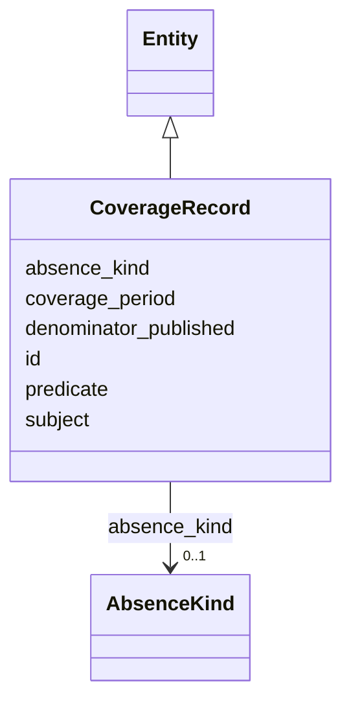

---
search:
  boost: 10.0
---

# Class: CoverageRecord 


_[NEW] Makes negative claims queryable (§11.23, §32.2)._


<div data-search-exclude markdown="1">


URI: [sig:CoverageRecord](https://ontology.sig-project.org/schema/CoverageRecord)





## Inheritance
* [Entity](Entity.md)
    * **CoverageRecord**


## Slots

| Name | Cardinality and Range | Description | Inheritance |
| ---  | --- | --- | --- |
| [subject](subject.md) | 0..1 <br/> [Uriorcurie](Uriorcurie.md) |  | direct |
| [predicate](predicate.md) | 0..1 <br/> [PredicateCode](PredicateCode.md) |  | direct |
| [absence_kind](absence_kind.md) | 0..1 <br/> [AbsenceKind](AbsenceKind.md) |  | direct |
| [coverage_period](coverage_period.md) | 0..1 <br/> [String](String.md) |  | direct |
| [denominator_published](denominator_published.md) | 0..1 <br/> [Boolean](Boolean.md) |  | direct |
| [id](id.md) | 1 <br/> [Uriorcurie](Uriorcurie.md) | The entity's stable minted identity (L2 identity only, §8 | [Entity](Entity.md) |


## Identifier and Mapping Information


### Schema Source


* from schema: https://ontology.sig-project.org/schema/sig


## Mappings

| Mapping Type | Mapped Value |
| ---  | ---  |
| self | sig:CoverageRecord |
| native | sig:CoverageRecord |


## LinkML Source

<!-- TODO: investigate https://stackoverflow.com/questions/37606292/how-to-create-tabbed-code-blocks-in-mkdocs-or-sphinx -->

### Direct

<details>
```yaml
name: CoverageRecord
description: '[NEW] Makes negative claims queryable (§11.23, §32.2).'
from_schema: https://ontology.sig-project.org/schema/sig
rank: 1000
is_a: Entity
attributes:
  subject:
    name: subject
    from_schema: https://ontology.sig-project.org/schema/entities
    domain_of:
    - Claim
    - Resolution
    - Contradiction
    - CoverageRecord
    range: uriorcurie
  predicate:
    name: predicate
    from_schema: https://ontology.sig-project.org/schema/entities
    domain_of:
    - Claim
    - Resolution
    - Contradiction
    - CoverageRecord
    range: predicate_code
  absence_kind:
    name: absence_kind
    from_schema: https://ontology.sig-project.org/schema/entities
    domain_of:
    - Claim
    - CoverageRecord
    range: AbsenceKind
  coverage_period:
    name: coverage_period
    from_schema: https://ontology.sig-project.org/schema/entities
    domain_of:
    - UsageAggregate
    - CoverageRecord
    range: string
  denominator_published:
    name: denominator_published
    from_schema: https://ontology.sig-project.org/schema/entities
    rank: 1000
    domain_of:
    - CoverageRecord
    range: boolean

```
</details>

### Induced

<details>
```yaml
name: CoverageRecord
description: '[NEW] Makes negative claims queryable (§11.23, §32.2).'
from_schema: https://ontology.sig-project.org/schema/sig
rank: 1000
is_a: Entity
attributes:
  subject:
    name: subject
    from_schema: https://ontology.sig-project.org/schema/entities
    owner: CoverageRecord
    domain_of:
    - Claim
    - Resolution
    - Contradiction
    - CoverageRecord
    range: uriorcurie
  predicate:
    name: predicate
    from_schema: https://ontology.sig-project.org/schema/entities
    owner: CoverageRecord
    domain_of:
    - Claim
    - Resolution
    - Contradiction
    - CoverageRecord
    range: predicate_code
  absence_kind:
    name: absence_kind
    from_schema: https://ontology.sig-project.org/schema/entities
    owner: CoverageRecord
    domain_of:
    - Claim
    - CoverageRecord
    range: AbsenceKind
  coverage_period:
    name: coverage_period
    from_schema: https://ontology.sig-project.org/schema/entities
    owner: CoverageRecord
    domain_of:
    - UsageAggregate
    - CoverageRecord
    range: string
  denominator_published:
    name: denominator_published
    from_schema: https://ontology.sig-project.org/schema/entities
    rank: 1000
    owner: CoverageRecord
    domain_of:
    - CoverageRecord
    range: boolean
  id:
    name: id
    description: The entity's stable minted identity (L2 identity only, §8.2).
    from_schema: https://ontology.sig-project.org/schema/sig
    rank: 1000
    identifier: true
    owner: CoverageRecord
    domain_of:
    - Entity
    - Edge
    range: uriorcurie
    required: true

```
</details></div>