---
search:
  boost: 10.0
---

# Class: Entity 


_Abstract base — every entity has identity (§3.1 defining standard)._


<div data-search-exclude markdown="1">


* __NOTE__: this is an abstract class and should not be instantiated directly


URI: [sig:Entity](https://ontology.sig-project.org/schema/Entity)

```mermaid
 classDiagram
    class Entity
    click Entity href "../Entity/"
      Entity <|-- Jurisdiction
        click Jurisdiction href "../Jurisdiction/"
      Entity <|-- Organization
        click Organization href "../Organization/"
      Entity <|-- Person
        click Person href "../Person/"
      Entity <|-- Product
        click Product href "../Product/"
      Entity <|-- Technology
        click Technology href "../Technology/"
      Entity <|-- Capability
        click Capability href "../Capability/"
      Entity <|-- Deployment
        click Deployment href "../Deployment/"
      Entity <|-- PhysicalAsset
        click PhysicalAsset href "../PhysicalAsset/"
      Entity <|-- CandidateAsset
        click CandidateAsset href "../CandidateAsset/"
      Entity <|-- DataSystem
        click DataSystem href "../DataSystem/"
      Entity <|-- Contract
        click Contract href "../Contract/"
      Entity <|-- FundingInstrument
        click FundingInstrument href "../FundingInstrument/"
      Entity <|-- Policy
        click Policy href "../Policy/"
      Entity <|-- LegalInstrument
        click LegalInstrument href "../LegalInstrument/"
      Entity <|-- ConfigurationState
        click ConfigurationState href "../ConfigurationState/"
      Entity <|-- UsageAggregate
        click UsageAggregate href "../UsageAggregate/"
      Entity <|-- AccountabilityEvent
        click AccountabilityEvent href "../AccountabilityEvent/"
      Entity <|-- LegalProceeding
        click LegalProceeding href "../LegalProceeding/"
      Entity <|-- RecordsRequest
        click RecordsRequest href "../RecordsRequest/"
      Entity <|-- Source
        click Source href "../Source/"
      Entity <|-- EvidenceArtifact
        click EvidenceArtifact href "../EvidenceArtifact/"
      Entity <|-- EvidenceCapture
        click EvidenceCapture href "../EvidenceCapture/"
      Entity <|-- Extraction
        click Extraction href "../Extraction/"
      Entity <|-- Claim
        click Claim href "../Claim/"
      Entity <|-- Resolution
        click Resolution href "../Resolution/"
      Entity <|-- Contradiction
        click Contradiction href "../Contradiction/"
      Entity <|-- ResearchTask
        click ResearchTask href "../ResearchTask/"
      Entity <|-- CoverageRecord
        click CoverageRecord href "../CoverageRecord/"
      
      Entity : id
        
      
```





## Inheritance
* **Entity**
    * [Jurisdiction](Jurisdiction.md)
    * [Organization](Organization.md)
    * [Person](Person.md)
    * [Product](Product.md)
    * [Technology](Technology.md)
    * [Capability](Capability.md)
    * [Deployment](Deployment.md)
    * [PhysicalAsset](PhysicalAsset.md)
    * [CandidateAsset](CandidateAsset.md)
    * [DataSystem](DataSystem.md)
    * [Contract](Contract.md)
    * [FundingInstrument](FundingInstrument.md)
    * [Policy](Policy.md)
    * [LegalInstrument](LegalInstrument.md)
    * [ConfigurationState](ConfigurationState.md)
    * [UsageAggregate](UsageAggregate.md)
    * [AccountabilityEvent](AccountabilityEvent.md)
    * [LegalProceeding](LegalProceeding.md)
    * [RecordsRequest](RecordsRequest.md)
    * [Source](Source.md)
    * [EvidenceArtifact](EvidenceArtifact.md)
    * [EvidenceCapture](EvidenceCapture.md)
    * [Extraction](Extraction.md)
    * [Claim](Claim.md)
    * [Resolution](Resolution.md)
    * [Contradiction](Contradiction.md)
    * [ResearchTask](ResearchTask.md)
    * [CoverageRecord](CoverageRecord.md)


## Slots

| Name | Cardinality and Range | Description | Inheritance |
| ---  | --- | --- | --- |
| [id](id.md) | 1 <br/> [Uriorcurie](Uriorcurie.md) | The entity's stable minted identity (L2 identity only, §8 | direct |


## Identifier and Mapping Information


### Schema Source


* from schema: https://ontology.sig-project.org/schema/sig


## Mappings

| Mapping Type | Mapped Value |
| ---  | ---  |
| self | sig:Entity |
| native | sig:Entity |


## LinkML Source

<!-- TODO: investigate https://stackoverflow.com/questions/37606292/how-to-create-tabbed-code-blocks-in-mkdocs-or-sphinx -->

### Direct

<details>
```yaml
name: Entity
description: Abstract base — every entity has identity (§3.1 defining standard).
from_schema: https://ontology.sig-project.org/schema/sig
rank: 1000
abstract: true
slots:
- id

```
</details>

### Induced

<details>
```yaml
name: Entity
description: Abstract base — every entity has identity (§3.1 defining standard).
from_schema: https://ontology.sig-project.org/schema/sig
rank: 1000
abstract: true
attributes:
  id:
    name: id
    description: The entity's stable minted identity (L2 identity only, §8.2).
    from_schema: https://ontology.sig-project.org/schema/sig
    rank: 1000
    identifier: true
    owner: Entity
    domain_of:
    - Entity
    - Edge
    range: uriorcurie
    required: true

```
</details></div>