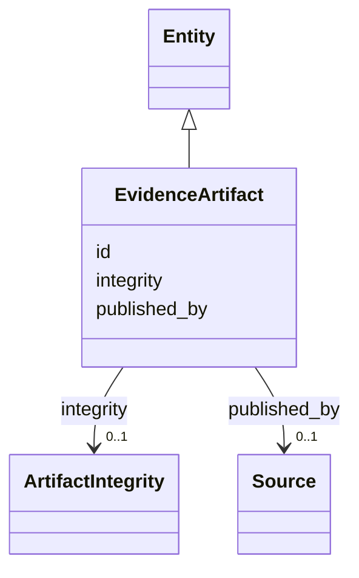

---
search:
  boost: 10.0
---

# Class: EvidenceArtifact 


_A specific artifact published by a Source (§10.2)._


<div data-search-exclude markdown="1">


URI: [sig:EvidenceArtifact](https://ontology.sig-project.org/schema/EvidenceArtifact)





## Inheritance
* [Entity](Entity.md)
    * **EvidenceArtifact**


## Slots

| Name | Cardinality and Range | Description | Inheritance |
| ---  | --- | --- | --- |
| [published_by](published_by.md) | 0..1 <br/> [Source](Source.md) |  | direct |
| [integrity](integrity.md) | 0..1 <br/> [ArtifactIntegrity](ArtifactIntegrity.md) |  | direct |
| [id](id.md) | 1 <br/> [Uriorcurie](Uriorcurie.md) | The entity's stable minted identity (L2 identity only, §8 | [Entity](Entity.md) |


## Usages

| used by | used in | type | used |
| ---  | --- | --- | --- |
| [EvidenceCapture](EvidenceCapture.md) | [captures_artifact](captures_artifact.md) | range | [EvidenceArtifact](EvidenceArtifact.md) |


## Identifier and Mapping Information


### Schema Source


* from schema: https://ontology.sig-project.org/schema/sig


## Mappings

| Mapping Type | Mapped Value |
| ---  | ---  |
| self | sig:EvidenceArtifact |
| native | sig:EvidenceArtifact |


## LinkML Source

<!-- TODO: investigate https://stackoverflow.com/questions/37606292/how-to-create-tabbed-code-blocks-in-mkdocs-or-sphinx -->

### Direct

<details>
```yaml
name: EvidenceArtifact
description: A specific artifact published by a Source (§10.2).
from_schema: https://ontology.sig-project.org/schema/sig
rank: 1000
is_a: Entity
attributes:
  published_by:
    name: published_by
    from_schema: https://ontology.sig-project.org/schema/entities
    rank: 1000
    domain_of:
    - EvidenceArtifact
    range: Source
  integrity:
    name: integrity
    from_schema: https://ontology.sig-project.org/schema/entities
    rank: 1000
    domain_of:
    - EvidenceArtifact
    range: ArtifactIntegrity

```
</details>

### Induced

<details>
```yaml
name: EvidenceArtifact
description: A specific artifact published by a Source (§10.2).
from_schema: https://ontology.sig-project.org/schema/sig
rank: 1000
is_a: Entity
attributes:
  published_by:
    name: published_by
    from_schema: https://ontology.sig-project.org/schema/entities
    rank: 1000
    owner: EvidenceArtifact
    domain_of:
    - EvidenceArtifact
    range: Source
  integrity:
    name: integrity
    from_schema: https://ontology.sig-project.org/schema/entities
    rank: 1000
    owner: EvidenceArtifact
    domain_of:
    - EvidenceArtifact
    range: ArtifactIntegrity
  id:
    name: id
    description: The entity's stable minted identity (L2 identity only, §8.2).
    from_schema: https://ontology.sig-project.org/schema/sig
    rank: 1000
    identifier: true
    owner: EvidenceArtifact
    domain_of:
    - Entity
    - Edge
    range: uriorcurie
    required: true

```
</details></div>