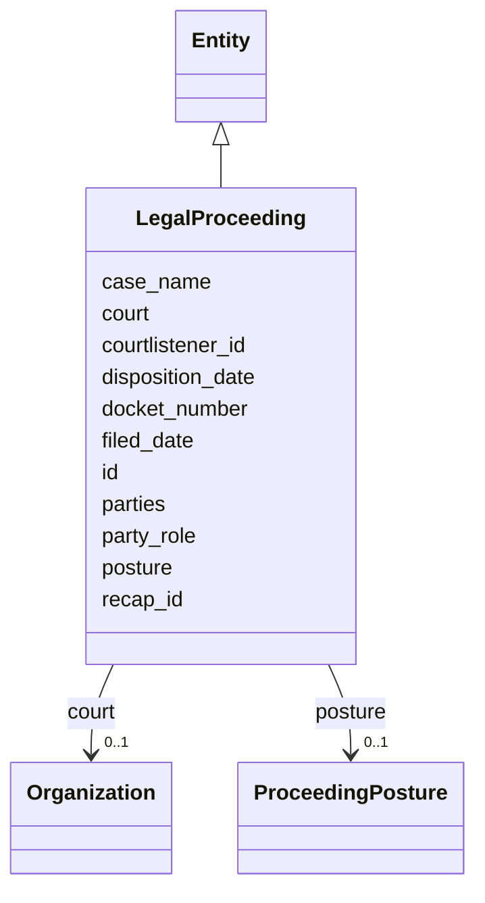

---
search:
  boost: 10.0
---

# Class: LegalProceeding 


_Split from AccountabilityEvent — dockets, parties, filings, posture (§11.18)._


<div data-search-exclude markdown="1">


URI: [sig:LegalProceeding](https://ontology.sig-project.org/schema/LegalProceeding)





## Inheritance
* [Entity](Entity.md)
    * **LegalProceeding**


## Slots

| Name | Cardinality and Range | Description | Inheritance |
| ---  | --- | --- | --- |
| [court](court.md) | 0..1 <br/> [Organization](Organization.md) |  | direct |
| [docket_number](docket_number.md) | 0..1 <br/> [String](String.md) |  | direct |
| [case_name](case_name.md) | 0..1 <br/> [String](String.md) |  | direct |
| [parties](parties.md) | * <br/> [Uriorcurie](Uriorcurie.md) |  | direct |
| [party_role](party_role.md) | * <br/> [String](String.md) |  | direct |
| [filed_date](filed_date.md) | 0..1 <br/> [Edtf](Edtf.md) |  | direct |
| [disposition_date](disposition_date.md) | 0..1 <br/> [Edtf](Edtf.md) |  | direct |
| [posture](posture.md) | 0..1 <br/> [ProceedingPosture](ProceedingPosture.md) |  | direct |
| [courtlistener_id](courtlistener_id.md) | 0..1 <br/> [String](String.md) |  | direct |
| [recap_id](recap_id.md) | 0..1 <br/> [String](String.md) |  | direct |
| [id](id.md) | 1 <br/> [Uriorcurie](Uriorcurie.md) | The entity's stable minted identity (L2 identity only, §8 | [Entity](Entity.md) |


## Identifier and Mapping Information


### Schema Source


* from schema: https://ontology.sig-project.org/schema/sig


## Mappings

| Mapping Type | Mapped Value |
| ---  | ---  |
| self | sig:LegalProceeding |
| native | sig:LegalProceeding |


## LinkML Source

<!-- TODO: investigate https://stackoverflow.com/questions/37606292/how-to-create-tabbed-code-blocks-in-mkdocs-or-sphinx -->

### Direct

<details>
```yaml
name: LegalProceeding
description: Split from AccountabilityEvent — dockets, parties, filings, posture (§11.18).
from_schema: https://ontology.sig-project.org/schema/sig
rank: 1000
is_a: Entity
attributes:
  court:
    name: court
    from_schema: https://ontology.sig-project.org/schema/entities
    rank: 1000
    domain_of:
    - LegalProceeding
    range: Organization
  docket_number:
    name: docket_number
    from_schema: https://ontology.sig-project.org/schema/entities
    rank: 1000
    domain_of:
    - LegalProceeding
    range: string
  case_name:
    name: case_name
    from_schema: https://ontology.sig-project.org/schema/entities
    rank: 1000
    domain_of:
    - LegalProceeding
    range: string
  parties:
    name: parties
    from_schema: https://ontology.sig-project.org/schema/entities
    rank: 1000
    domain_of:
    - LegalProceeding
    range: uriorcurie
    multivalued: true
  party_role:
    name: party_role
    from_schema: https://ontology.sig-project.org/schema/entities
    rank: 1000
    domain_of:
    - LegalProceeding
    range: string
    multivalued: true
  filed_date:
    name: filed_date
    from_schema: https://ontology.sig-project.org/schema/entities
    rank: 1000
    domain_of:
    - LegalProceeding
    - RecordsRequest
    range: edtf
  disposition_date:
    name: disposition_date
    from_schema: https://ontology.sig-project.org/schema/entities
    rank: 1000
    domain_of:
    - LegalProceeding
    range: edtf
  posture:
    name: posture
    from_schema: https://ontology.sig-project.org/schema/entities
    rank: 1000
    domain_of:
    - LegalProceeding
    range: ProceedingPosture
  courtlistener_id:
    name: courtlistener_id
    from_schema: https://ontology.sig-project.org/schema/entities
    rank: 1000
    domain_of:
    - LegalProceeding
    range: string
  recap_id:
    name: recap_id
    from_schema: https://ontology.sig-project.org/schema/entities
    rank: 1000
    domain_of:
    - LegalProceeding
    range: string

```
</details>

### Induced

<details>
```yaml
name: LegalProceeding
description: Split from AccountabilityEvent — dockets, parties, filings, posture (§11.18).
from_schema: https://ontology.sig-project.org/schema/sig
rank: 1000
is_a: Entity
attributes:
  court:
    name: court
    from_schema: https://ontology.sig-project.org/schema/entities
    rank: 1000
    owner: LegalProceeding
    domain_of:
    - LegalProceeding
    range: Organization
  docket_number:
    name: docket_number
    from_schema: https://ontology.sig-project.org/schema/entities
    rank: 1000
    owner: LegalProceeding
    domain_of:
    - LegalProceeding
    range: string
  case_name:
    name: case_name
    from_schema: https://ontology.sig-project.org/schema/entities
    rank: 1000
    owner: LegalProceeding
    domain_of:
    - LegalProceeding
    range: string
  parties:
    name: parties
    from_schema: https://ontology.sig-project.org/schema/entities
    rank: 1000
    owner: LegalProceeding
    domain_of:
    - LegalProceeding
    range: uriorcurie
    multivalued: true
  party_role:
    name: party_role
    from_schema: https://ontology.sig-project.org/schema/entities
    rank: 1000
    owner: LegalProceeding
    domain_of:
    - LegalProceeding
    range: string
    multivalued: true
  filed_date:
    name: filed_date
    from_schema: https://ontology.sig-project.org/schema/entities
    rank: 1000
    owner: LegalProceeding
    domain_of:
    - LegalProceeding
    - RecordsRequest
    range: edtf
  disposition_date:
    name: disposition_date
    from_schema: https://ontology.sig-project.org/schema/entities
    rank: 1000
    owner: LegalProceeding
    domain_of:
    - LegalProceeding
    range: edtf
  posture:
    name: posture
    from_schema: https://ontology.sig-project.org/schema/entities
    rank: 1000
    owner: LegalProceeding
    domain_of:
    - LegalProceeding
    range: ProceedingPosture
  courtlistener_id:
    name: courtlistener_id
    from_schema: https://ontology.sig-project.org/schema/entities
    rank: 1000
    owner: LegalProceeding
    domain_of:
    - LegalProceeding
    range: string
  recap_id:
    name: recap_id
    from_schema: https://ontology.sig-project.org/schema/entities
    rank: 1000
    owner: LegalProceeding
    domain_of:
    - LegalProceeding
    range: string
  id:
    name: id
    description: The entity's stable minted identity (L2 identity only, §8.2).
    from_schema: https://ontology.sig-project.org/schema/sig
    rank: 1000
    identifier: true
    owner: LegalProceeding
    domain_of:
    - Entity
    - Edge
    range: uriorcurie
    required: true

```
</details></div>