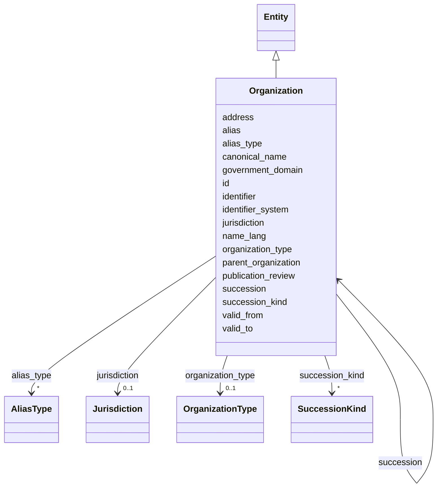

---
search:
  boost: 10.0
---

# Class: Organization 


_The single entity for ALL institutional actors; "vendor" is a role, not a subtype (§11.2, SIG-ONTO-012). canonical_name is a claim, not a column (§8.2)._


<div data-search-exclude markdown="1">


URI: [sig:Organization](https://ontology.sig-project.org/schema/Organization)





## Inheritance
* [Entity](Entity.md)
    * **Organization**


## Slots

| Name | Cardinality and Range | Description | Inheritance |
| ---  | --- | --- | --- |
| [canonical_name](canonical_name.md) | 0..1 <br/> [String](String.md) | A claim, not an authoritative column (§8 | direct |
| [alias](alias.md) | * <br/> [String](String.md) |  | direct |
| [alias_type](alias_type.md) | * <br/> [AliasType](AliasType.md) |  | direct |
| [name_lang](name_lang.md) | * <br/> [Bcp47](Bcp47.md) |  | direct |
| [organization_type](organization_type.md) | 0..1 <br/> [OrganizationType](OrganizationType.md) |  | direct |
| [parent_organization](parent_organization.md) | 0..1 <br/> [Organization](Organization.md) |  | direct |
| [jurisdiction](jurisdiction.md) | 0..1 <br/> [Jurisdiction](Jurisdiction.md) |  | direct |
| [identifier](identifier.md) | * <br/> [String](String.md) | Repeatable (scheme,value) pairs, qualified by identifier_system (SIG-IDENT-00... | direct |
| [identifier_system](identifier_system.md) | * <br/> [String](String.md) |  | direct |
| [government_domain](government_domain.md) | 0..1 <br/> [String](String.md) |  | direct |
| [address](address.md) | * <br/> [String](String.md) |  | direct |
| [valid_from](valid_from.md) | 0..1 <br/> [Edtf](Edtf.md) |  | direct |
| [valid_to](valid_to.md) | 0..1 <br/> [Edtf](Edtf.md) |  | direct |
| [succession](succession.md) | * <br/> [Organization](Organization.md) |  | direct |
| [succession_kind](succession_kind.md) | * <br/> [SuccessionKind](SuccessionKind.md) |  | direct |
| [publication_review](publication_review.md) | 0..1 <br/> [Boolean](Boolean.md) | Routes surrogate-only orgs through §43 | direct |
| [id](id.md) | 1 <br/> [Uriorcurie](Uriorcurie.md) | The entity's stable minted identity (L2 identity only, §8 | [Entity](Entity.md) |


## Usages

| used by | used in | type | used |
| ---  | --- | --- | --- |
| [Organization](Organization.md) | [parent_organization](parent_organization.md) | range | [Organization](Organization.md) |
| [Organization](Organization.md) | [succession](succession.md) | range | [Organization](Organization.md) |
| [Product](Product.md) | [vendor](vendor.md) | range | [Organization](Organization.md) |
| [Deployment](Deployment.md) | [deploying_organization](deploying_organization.md) | range | [Organization](Organization.md) |
| [Deployment](Deployment.md) | [vendor](vendor.md) | range | [Organization](Organization.md) |
| [PhysicalAsset](PhysicalAsset.md) | [manufacturer](manufacturer.md) | range | [Organization](Organization.md) |
| [DataSystem](DataSystem.md) | [operator](operator.md) | range | [Organization](Organization.md) |
| [DataSystem](DataSystem.md) | [vendor](vendor.md) | range | [Organization](Organization.md) |
| [DataSystem](DataSystem.md) | [holds_data_collected_by](holds_data_collected_by.md) | range | [Organization](Organization.md) |
| [Contract](Contract.md) | [buyer](buyer.md) | range | [Organization](Organization.md) |
| [Contract](Contract.md) | [seller](seller.md) | range | [Organization](Organization.md) |
| [FundingInstrument](FundingInstrument.md) | [funder](funder.md) | range | [Organization](Organization.md) |
| [FundingInstrument](FundingInstrument.md) | [recipient](recipient.md) | range | [Organization](Organization.md) |
| [Policy](Policy.md) | [adopting_body](adopting_body.md) | range | [Organization](Organization.md) |
| [LegalInstrument](LegalInstrument.md) | [enacting_body](enacting_body.md) | range | [Organization](Organization.md) |
| [ConfigurationState](ConfigurationState.md) | [sharing_partner](sharing_partner.md) | range | [Organization](Organization.md) |
| [UsageAggregate](UsageAggregate.md) | [searching_org](searching_org.md) | range | [Organization](Organization.md) |
| [UsageAggregate](UsageAggregate.md) | [source_org](source_org.md) | range | [Organization](Organization.md) |
| [AccountabilityEvent](AccountabilityEvent.md) | [organizations](organizations.md) | range | [Organization](Organization.md) |
| [LegalProceeding](LegalProceeding.md) | [court](court.md) | range | [Organization](Organization.md) |
| [RecordsRequest](RecordsRequest.md) | [requesting_party](requesting_party.md) | range | [Organization](Organization.md) |
| [RecordsRequest](RecordsRequest.md) | [target_agency](target_agency.md) | range | [Organization](Organization.md) |


## Identifier and Mapping Information


### Schema Source


* from schema: https://ontology.sig-project.org/schema/sig


## Mappings

| Mapping Type | Mapped Value |
| ---  | ---  |
| self | sig:Organization |
| native | sig:Organization |


## LinkML Source

<!-- TODO: investigate https://stackoverflow.com/questions/37606292/how-to-create-tabbed-code-blocks-in-mkdocs-or-sphinx -->

### Direct

<details>
```yaml
name: Organization
description: The single entity for ALL institutional actors; "vendor" is a role, not
  a subtype (§11.2, SIG-ONTO-012). canonical_name is a claim, not a column (§8.2).
from_schema: https://ontology.sig-project.org/schema/sig
rank: 1000
is_a: Entity
attributes:
  canonical_name:
    name: canonical_name
    description: A claim, not an authoritative column (§8.2, SIG-ONTO-003).
    from_schema: https://ontology.sig-project.org/schema/entities
    rank: 1000
    domain_of:
    - Organization
    range: string
  alias:
    name: alias
    from_schema: https://ontology.sig-project.org/schema/entities
    rank: 1000
    domain_of:
    - Organization
    range: string
    multivalued: true
  alias_type:
    name: alias_type
    from_schema: https://ontology.sig-project.org/schema/entities
    rank: 1000
    domain_of:
    - Organization
    range: AliasType
    multivalued: true
  name_lang:
    name: name_lang
    from_schema: https://ontology.sig-project.org/schema/entities
    domain_of:
    - Jurisdiction
    - Organization
    range: bcp47
    multivalued: true
  organization_type:
    name: organization_type
    from_schema: https://ontology.sig-project.org/schema/entities
    rank: 1000
    domain_of:
    - Organization
    range: OrganizationType
  parent_organization:
    name: parent_organization
    from_schema: https://ontology.sig-project.org/schema/entities
    rank: 1000
    domain_of:
    - Organization
    range: Organization
  jurisdiction:
    name: jurisdiction
    from_schema: https://ontology.sig-project.org/schema/entities
    rank: 1000
    domain_of:
    - Organization
    - Deployment
    - LegalInstrument
    range: Jurisdiction
  identifier:
    name: identifier
    description: Repeatable (scheme,value) pairs, qualified by identifier_system (SIG-IDENT-006).
    from_schema: https://ontology.sig-project.org/schema/entities
    rank: 1000
    domain_of:
    - Organization
    range: string
    multivalued: true
  identifier_system:
    name: identifier_system
    from_schema: https://ontology.sig-project.org/schema/entities
    rank: 1000
    domain_of:
    - Organization
    range: string
    multivalued: true
  government_domain:
    name: government_domain
    from_schema: https://ontology.sig-project.org/schema/entities
    rank: 1000
    domain_of:
    - Organization
    range: string
  address:
    name: address
    from_schema: https://ontology.sig-project.org/schema/entities
    rank: 1000
    domain_of:
    - Organization
    range: string
    multivalued: true
  valid_from:
    name: valid_from
    from_schema: https://ontology.sig-project.org/schema/entities
    domain_of:
    - Jurisdiction
    - Organization
    - Edge
    range: edtf
  valid_to:
    name: valid_to
    from_schema: https://ontology.sig-project.org/schema/entities
    domain_of:
    - Jurisdiction
    - Organization
    - Edge
    range: edtf
  succession:
    name: succession
    from_schema: https://ontology.sig-project.org/schema/entities
    rank: 1000
    domain_of:
    - Organization
    range: Organization
    multivalued: true
  succession_kind:
    name: succession_kind
    from_schema: https://ontology.sig-project.org/schema/entities
    rank: 1000
    domain_of:
    - Organization
    range: SuccessionKind
    multivalued: true
  publication_review:
    name: publication_review
    description: Routes surrogate-only orgs through §43.4 before public exposure (SIG-ONTO-013).
    from_schema: https://ontology.sig-project.org/schema/entities
    rank: 1000
    domain_of:
    - Organization
    range: boolean

```
</details>

### Induced

<details>
```yaml
name: Organization
description: The single entity for ALL institutional actors; "vendor" is a role, not
  a subtype (§11.2, SIG-ONTO-012). canonical_name is a claim, not a column (§8.2).
from_schema: https://ontology.sig-project.org/schema/sig
rank: 1000
is_a: Entity
attributes:
  canonical_name:
    name: canonical_name
    description: A claim, not an authoritative column (§8.2, SIG-ONTO-003).
    from_schema: https://ontology.sig-project.org/schema/entities
    rank: 1000
    owner: Organization
    domain_of:
    - Organization
    range: string
  alias:
    name: alias
    from_schema: https://ontology.sig-project.org/schema/entities
    rank: 1000
    owner: Organization
    domain_of:
    - Organization
    range: string
    multivalued: true
  alias_type:
    name: alias_type
    from_schema: https://ontology.sig-project.org/schema/entities
    rank: 1000
    owner: Organization
    domain_of:
    - Organization
    range: AliasType
    multivalued: true
  name_lang:
    name: name_lang
    from_schema: https://ontology.sig-project.org/schema/entities
    owner: Organization
    domain_of:
    - Jurisdiction
    - Organization
    range: bcp47
    multivalued: true
  organization_type:
    name: organization_type
    from_schema: https://ontology.sig-project.org/schema/entities
    rank: 1000
    owner: Organization
    domain_of:
    - Organization
    range: OrganizationType
  parent_organization:
    name: parent_organization
    from_schema: https://ontology.sig-project.org/schema/entities
    rank: 1000
    owner: Organization
    domain_of:
    - Organization
    range: Organization
  jurisdiction:
    name: jurisdiction
    from_schema: https://ontology.sig-project.org/schema/entities
    rank: 1000
    owner: Organization
    domain_of:
    - Organization
    - Deployment
    - LegalInstrument
    range: Jurisdiction
  identifier:
    name: identifier
    description: Repeatable (scheme,value) pairs, qualified by identifier_system (SIG-IDENT-006).
    from_schema: https://ontology.sig-project.org/schema/entities
    rank: 1000
    owner: Organization
    domain_of:
    - Organization
    range: string
    multivalued: true
  identifier_system:
    name: identifier_system
    from_schema: https://ontology.sig-project.org/schema/entities
    rank: 1000
    owner: Organization
    domain_of:
    - Organization
    range: string
    multivalued: true
  government_domain:
    name: government_domain
    from_schema: https://ontology.sig-project.org/schema/entities
    rank: 1000
    owner: Organization
    domain_of:
    - Organization
    range: string
  address:
    name: address
    from_schema: https://ontology.sig-project.org/schema/entities
    rank: 1000
    owner: Organization
    domain_of:
    - Organization
    range: string
    multivalued: true
  valid_from:
    name: valid_from
    from_schema: https://ontology.sig-project.org/schema/entities
    owner: Organization
    domain_of:
    - Jurisdiction
    - Organization
    - Edge
    range: edtf
  valid_to:
    name: valid_to
    from_schema: https://ontology.sig-project.org/schema/entities
    owner: Organization
    domain_of:
    - Jurisdiction
    - Organization
    - Edge
    range: edtf
  succession:
    name: succession
    from_schema: https://ontology.sig-project.org/schema/entities
    rank: 1000
    owner: Organization
    domain_of:
    - Organization
    range: Organization
    multivalued: true
  succession_kind:
    name: succession_kind
    from_schema: https://ontology.sig-project.org/schema/entities
    rank: 1000
    owner: Organization
    domain_of:
    - Organization
    range: SuccessionKind
    multivalued: true
  publication_review:
    name: publication_review
    description: Routes surrogate-only orgs through §43.4 before public exposure (SIG-ONTO-013).
    from_schema: https://ontology.sig-project.org/schema/entities
    rank: 1000
    owner: Organization
    domain_of:
    - Organization
    range: boolean
  id:
    name: id
    description: The entity's stable minted identity (L2 identity only, §8.2).
    from_schema: https://ontology.sig-project.org/schema/sig
    rank: 1000
    identifier: true
    owner: Organization
    domain_of:
    - Entity
    - Edge
    range: uriorcurie
    required: true

```
</details></div>