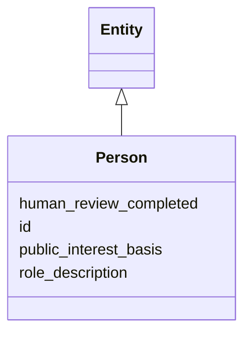

---
search:
  boost: 10.0
---

# Class: Person 


_[NEW] Tightly constrained (§11.3, SIG-ONTO-014/015/016). A Person row carries NO surveillance attributes and MUST NOT be reachable from any automated extraction path. It exists only for named public officials and SIG's own attributable curators._


<div data-search-exclude markdown="1">


URI: [sig:Person](https://ontology.sig-project.org/schema/Person)





## Inheritance
* [Entity](Entity.md)
    * **Person**


## Slots

| Name | Cardinality and Range | Description | Inheritance |
| ---  | --- | --- | --- |
| [public_interest_basis](public_interest_basis.md) | 1 <br/> [String](String.md) | MUST pass the officer-naming test (§43 | direct |
| [human_review_completed](human_review_completed.md) | 1 <br/> [Boolean](Boolean.md) | Person creation MUST have been through human review (SIG-ONTO-016) | direct |
| [role_description](role_description.md) | 0..1 <br/> [String](String.md) | The public role justifying inclusion (e | direct |
| [id](id.md) | 1 <br/> [Uriorcurie](Uriorcurie.md) | The entity's stable minted identity (L2 identity only, §8 | [Entity](Entity.md) |


## Identifier and Mapping Information


### Schema Source


* from schema: https://ontology.sig-project.org/schema/sig


## Mappings

| Mapping Type | Mapped Value |
| ---  | ---  |
| self | sig:Person |
| native | sig:Person |


## LinkML Source

<!-- TODO: investigate https://stackoverflow.com/questions/37606292/how-to-create-tabbed-code-blocks-in-mkdocs-or-sphinx -->

### Direct

<details>
```yaml
name: Person
description: '[NEW] Tightly constrained (§11.3, SIG-ONTO-014/015/016). A Person row
  carries NO surveillance attributes and MUST NOT be reachable from any automated
  extraction path. It exists only for named public officials and SIG''s own attributable
  curators.'
from_schema: https://ontology.sig-project.org/schema/sig
rank: 1000
is_a: Entity
attributes:
  public_interest_basis:
    name: public_interest_basis
    description: MUST pass the officer-naming test (§43.4); required (SIG-ONTO-016).
    from_schema: https://ontology.sig-project.org/schema/entities
    rank: 1000
    domain_of:
    - Person
    range: string
    required: true
  human_review_completed:
    name: human_review_completed
    description: Person creation MUST have been through human review (SIG-ONTO-016).
    from_schema: https://ontology.sig-project.org/schema/entities
    rank: 1000
    domain_of:
    - Person
    range: boolean
    required: true
  role_description:
    name: role_description
    description: The public role justifying inclusion (e.g. named official in an accountability
      event).
    from_schema: https://ontology.sig-project.org/schema/entities
    rank: 1000
    domain_of:
    - Person
    range: string

```
</details>

### Induced

<details>
```yaml
name: Person
description: '[NEW] Tightly constrained (§11.3, SIG-ONTO-014/015/016). A Person row
  carries NO surveillance attributes and MUST NOT be reachable from any automated
  extraction path. It exists only for named public officials and SIG''s own attributable
  curators.'
from_schema: https://ontology.sig-project.org/schema/sig
rank: 1000
is_a: Entity
attributes:
  public_interest_basis:
    name: public_interest_basis
    description: MUST pass the officer-naming test (§43.4); required (SIG-ONTO-016).
    from_schema: https://ontology.sig-project.org/schema/entities
    rank: 1000
    owner: Person
    domain_of:
    - Person
    range: string
    required: true
  human_review_completed:
    name: human_review_completed
    description: Person creation MUST have been through human review (SIG-ONTO-016).
    from_schema: https://ontology.sig-project.org/schema/entities
    rank: 1000
    owner: Person
    domain_of:
    - Person
    range: boolean
    required: true
  role_description:
    name: role_description
    description: The public role justifying inclusion (e.g. named official in an accountability
      event).
    from_schema: https://ontology.sig-project.org/schema/entities
    rank: 1000
    owner: Person
    domain_of:
    - Person
    range: string
  id:
    name: id
    description: The entity's stable minted identity (L2 identity only, §8.2).
    from_schema: https://ontology.sig-project.org/schema/sig
    rank: 1000
    identifier: true
    owner: Person
    domain_of:
    - Entity
    - Edge
    range: uriorcurie
    required: true

```
</details></div>