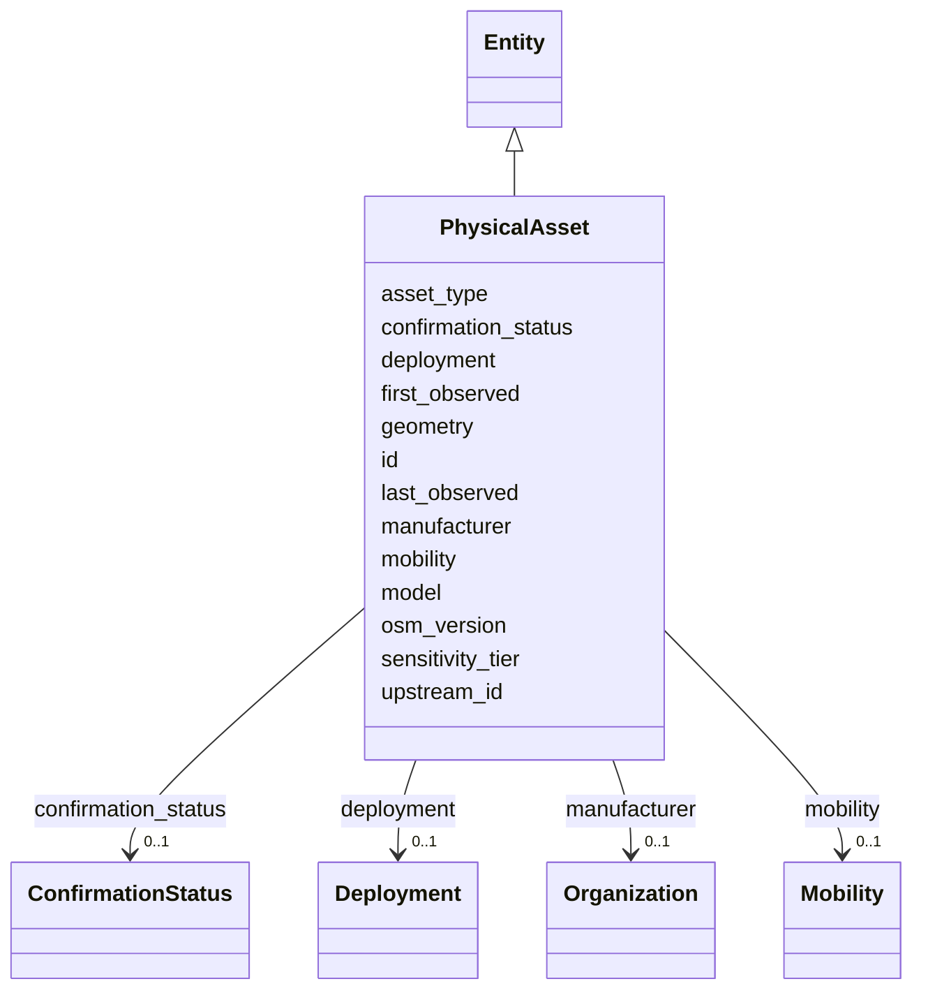

---
search:
  boost: 10.0
---

# Class: PhysicalAsset 


_A field-observed device; geometry is OPTIONAL and operator absence is a first-class countable state (§11.8, SIG-ONTO-027/028). Accommodates ways and relations, not only nodes, and MUST NOT force sensors into a camera abstraction._


<div data-search-exclude markdown="1">


URI: [sig:PhysicalAsset](https://ontology.sig-project.org/schema/PhysicalAsset)





## Inheritance
* [Entity](Entity.md)
    * **PhysicalAsset**


## Slots

| Name | Cardinality and Range | Description | Inheritance |
| ---  | --- | --- | --- |
| [asset_type](asset_type.md) | 0..1 <br/> [TechnologyCode](TechnologyCode.md) | A Technology reference, not a free string | direct |
| [geometry](geometry.md) | 0..1 <br/> [GeometryWkt](GeometryWkt.md) | Optional (SIG-GEO-004) | direct |
| [mobility](mobility.md) | 0..1 <br/> [Mobility](Mobility.md) |  | direct |
| [manufacturer](manufacturer.md) | 0..1 <br/> [Organization](Organization.md) |  | direct |
| [model](model.md) | 0..1 <br/> [String](String.md) |  | direct |
| [deployment](deployment.md) | 0..1 <br/> [Deployment](Deployment.md) | May be absent — the orphaned-device case | direct |
| [first_observed](first_observed.md) | 0..1 <br/> [Datetime](Datetime.md) |  | direct |
| [last_observed](last_observed.md) | 0..1 <br/> [Datetime](Datetime.md) |  | direct |
| [upstream_id](upstream_id.md) | * <br/> [String](String.md) | Qualified by system (osm | direct |
| [osm_version](osm_version.md) | 0..1 <br/> [Integer](Integer.md) |  | direct |
| [sensitivity_tier](sensitivity_tier.md) | 0..1 <br/> [String](String.md) |  | direct |
| [confirmation_status](confirmation_status.md) | 0..1 <br/> [ConfirmationStatus](ConfirmationStatus.md) |  | direct |
| [id](id.md) | 1 <br/> [Uriorcurie](Uriorcurie.md) | The entity's stable minted identity (L2 identity only, §8 | [Entity](Entity.md) |


## Identifier and Mapping Information


### Schema Source


* from schema: https://ontology.sig-project.org/schema/sig


## Mappings

| Mapping Type | Mapped Value |
| ---  | ---  |
| self | sig:PhysicalAsset |
| native | sig:PhysicalAsset |


## LinkML Source

<!-- TODO: investigate https://stackoverflow.com/questions/37606292/how-to-create-tabbed-code-blocks-in-mkdocs-or-sphinx -->

### Direct

<details>
```yaml
name: PhysicalAsset
description: A field-observed device; geometry is OPTIONAL and operator absence is
  a first-class countable state (§11.8, SIG-ONTO-027/028). Accommodates ways and relations,
  not only nodes, and MUST NOT force sensors into a camera abstraction.
from_schema: https://ontology.sig-project.org/schema/sig
rank: 1000
is_a: Entity
attributes:
  asset_type:
    name: asset_type
    description: A Technology reference, not a free string.
    from_schema: https://ontology.sig-project.org/schema/entities
    rank: 1000
    domain_of:
    - PhysicalAsset
    range: technology_code
  geometry:
    name: geometry
    description: Optional (SIG-GEO-004).
    from_schema: https://ontology.sig-project.org/schema/entities
    rank: 1000
    domain_of:
    - PhysicalAsset
    range: geometry_wkt
  mobility:
    name: mobility
    from_schema: https://ontology.sig-project.org/schema/entities
    rank: 1000
    domain_of:
    - PhysicalAsset
    range: Mobility
  manufacturer:
    name: manufacturer
    from_schema: https://ontology.sig-project.org/schema/entities
    rank: 1000
    domain_of:
    - PhysicalAsset
    range: Organization
  model:
    name: model
    from_schema: https://ontology.sig-project.org/schema/entities
    rank: 1000
    domain_of:
    - PhysicalAsset
    range: string
  deployment:
    name: deployment
    description: May be absent — the orphaned-device case.
    from_schema: https://ontology.sig-project.org/schema/entities
    rank: 1000
    domain_of:
    - PhysicalAsset
    - ConfigurationState
    range: Deployment
  first_observed:
    name: first_observed
    from_schema: https://ontology.sig-project.org/schema/entities
    rank: 1000
    domain_of:
    - PhysicalAsset
    range: datetime
  last_observed:
    name: last_observed
    from_schema: https://ontology.sig-project.org/schema/entities
    rank: 1000
    domain_of:
    - PhysicalAsset
    range: datetime
  upstream_id:
    name: upstream_id
    description: Qualified by system (osm.node, osm.way, osm.relation, deflock.id,
      ...).
    from_schema: https://ontology.sig-project.org/schema/entities
    rank: 1000
    domain_of:
    - PhysicalAsset
    range: string
    multivalued: true
  osm_version:
    name: osm_version
    from_schema: https://ontology.sig-project.org/schema/entities
    rank: 1000
    domain_of:
    - PhysicalAsset
    range: integer
  sensitivity_tier:
    name: sensitivity_tier
    from_schema: https://ontology.sig-project.org/schema/entities
    rank: 1000
    domain_of:
    - PhysicalAsset
    range: string
  confirmation_status:
    name: confirmation_status
    from_schema: https://ontology.sig-project.org/schema/entities
    rank: 1000
    domain_of:
    - PhysicalAsset
    range: ConfirmationStatus

```
</details>

### Induced

<details>
```yaml
name: PhysicalAsset
description: A field-observed device; geometry is OPTIONAL and operator absence is
  a first-class countable state (§11.8, SIG-ONTO-027/028). Accommodates ways and relations,
  not only nodes, and MUST NOT force sensors into a camera abstraction.
from_schema: https://ontology.sig-project.org/schema/sig
rank: 1000
is_a: Entity
attributes:
  asset_type:
    name: asset_type
    description: A Technology reference, not a free string.
    from_schema: https://ontology.sig-project.org/schema/entities
    rank: 1000
    owner: PhysicalAsset
    domain_of:
    - PhysicalAsset
    range: technology_code
  geometry:
    name: geometry
    description: Optional (SIG-GEO-004).
    from_schema: https://ontology.sig-project.org/schema/entities
    rank: 1000
    owner: PhysicalAsset
    domain_of:
    - PhysicalAsset
    range: geometry_wkt
  mobility:
    name: mobility
    from_schema: https://ontology.sig-project.org/schema/entities
    rank: 1000
    owner: PhysicalAsset
    domain_of:
    - PhysicalAsset
    range: Mobility
  manufacturer:
    name: manufacturer
    from_schema: https://ontology.sig-project.org/schema/entities
    rank: 1000
    owner: PhysicalAsset
    domain_of:
    - PhysicalAsset
    range: Organization
  model:
    name: model
    from_schema: https://ontology.sig-project.org/schema/entities
    rank: 1000
    owner: PhysicalAsset
    domain_of:
    - PhysicalAsset
    range: string
  deployment:
    name: deployment
    description: May be absent — the orphaned-device case.
    from_schema: https://ontology.sig-project.org/schema/entities
    rank: 1000
    owner: PhysicalAsset
    domain_of:
    - PhysicalAsset
    - ConfigurationState
    range: Deployment
  first_observed:
    name: first_observed
    from_schema: https://ontology.sig-project.org/schema/entities
    rank: 1000
    owner: PhysicalAsset
    domain_of:
    - PhysicalAsset
    range: datetime
  last_observed:
    name: last_observed
    from_schema: https://ontology.sig-project.org/schema/entities
    rank: 1000
    owner: PhysicalAsset
    domain_of:
    - PhysicalAsset
    range: datetime
  upstream_id:
    name: upstream_id
    description: Qualified by system (osm.node, osm.way, osm.relation, deflock.id,
      ...).
    from_schema: https://ontology.sig-project.org/schema/entities
    rank: 1000
    owner: PhysicalAsset
    domain_of:
    - PhysicalAsset
    range: string
    multivalued: true
  osm_version:
    name: osm_version
    from_schema: https://ontology.sig-project.org/schema/entities
    rank: 1000
    owner: PhysicalAsset
    domain_of:
    - PhysicalAsset
    range: integer
  sensitivity_tier:
    name: sensitivity_tier
    from_schema: https://ontology.sig-project.org/schema/entities
    rank: 1000
    owner: PhysicalAsset
    domain_of:
    - PhysicalAsset
    range: string
  confirmation_status:
    name: confirmation_status
    from_schema: https://ontology.sig-project.org/schema/entities
    rank: 1000
    owner: PhysicalAsset
    domain_of:
    - PhysicalAsset
    range: ConfirmationStatus
  id:
    name: id
    description: The entity's stable minted identity (L2 identity only, §8.2).
    from_schema: https://ontology.sig-project.org/schema/sig
    rank: 1000
    identifier: true
    owner: PhysicalAsset
    domain_of:
    - Entity
    - Edge
    range: uriorcurie
    required: true

```
</details></div>