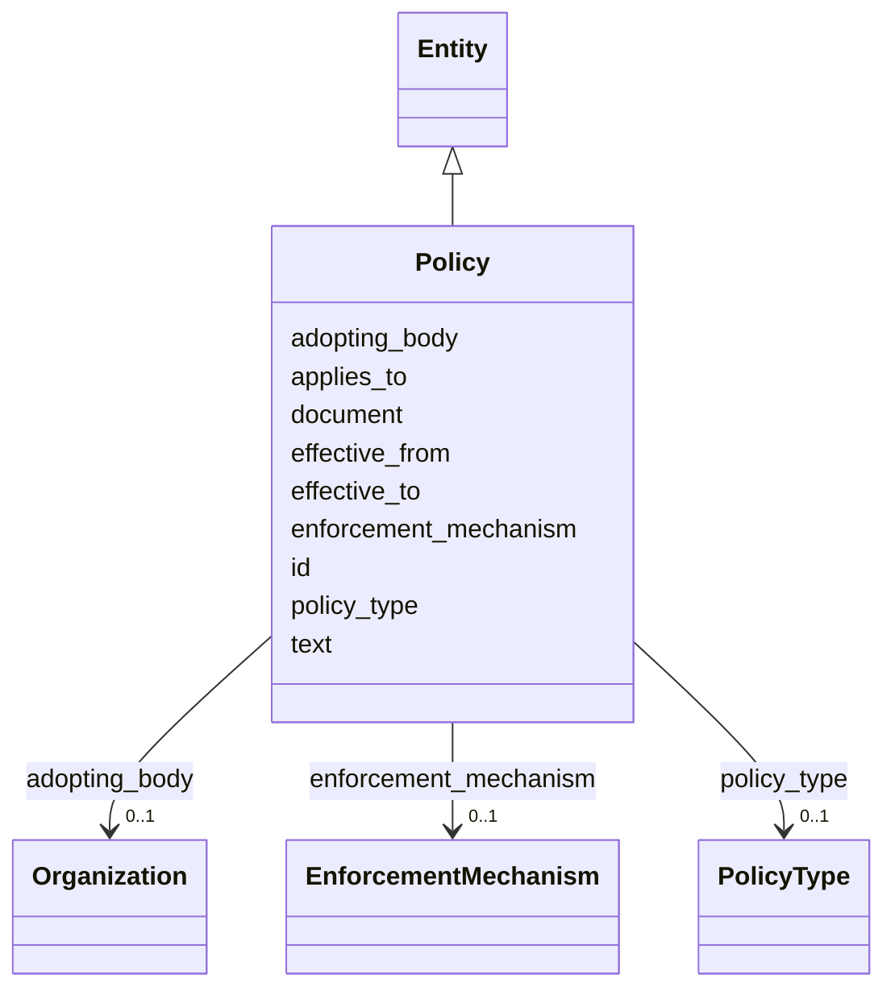

---
search:
  boost: 10.0
---

# Class: Policy 


_An institutional policy; MUST NOT be merged with ConfigurationState (§11.13, SIG-ONTO-034). Their disagreement is a first-class finding._


<div data-search-exclude markdown="1">


URI: [sig:Policy](https://ontology.sig-project.org/schema/Policy)





## Inheritance
* [Entity](Entity.md)
    * **Policy**


## Slots

| Name | Cardinality and Range | Description | Inheritance |
| ---  | --- | --- | --- |
| [policy_type](policy_type.md) | 0..1 <br/> [PolicyType](PolicyType.md) |  | direct |
| [applies_to](applies_to.md) | * <br/> [Uriorcurie](Uriorcurie.md) | Organization, Deployment, or Product — polymorphic and repeatable | direct |
| [effective_from](effective_from.md) | 0..1 <br/> [Edtf](Edtf.md) |  | direct |
| [effective_to](effective_to.md) | 0..1 <br/> [Edtf](Edtf.md) |  | direct |
| [adopting_body](adopting_body.md) | 0..1 <br/> [Organization](Organization.md) |  | direct |
| [text](text.md) | 0..1 <br/> [String](String.md) |  | direct |
| [document](document.md) | 0..1 <br/> [Uriorcurie](Uriorcurie.md) |  | direct |
| [enforcement_mechanism](enforcement_mechanism.md) | 0..1 <br/> [EnforcementMechanism](EnforcementMechanism.md) |  | direct |
| [id](id.md) | 1 <br/> [Uriorcurie](Uriorcurie.md) | The entity's stable minted identity (L2 identity only, §8 | [Entity](Entity.md) |


## Identifier and Mapping Information


### Schema Source


* from schema: https://ontology.sig-project.org/schema/sig


## Mappings

| Mapping Type | Mapped Value |
| ---  | ---  |
| self | sig:Policy |
| native | sig:Policy |


## LinkML Source

<!-- TODO: investigate https://stackoverflow.com/questions/37606292/how-to-create-tabbed-code-blocks-in-mkdocs-or-sphinx -->

### Direct

<details>
```yaml
name: Policy
description: An institutional policy; MUST NOT be merged with ConfigurationState (§11.13,
  SIG-ONTO-034). Their disagreement is a first-class finding.
from_schema: https://ontology.sig-project.org/schema/sig
rank: 1000
is_a: Entity
attributes:
  policy_type:
    name: policy_type
    from_schema: https://ontology.sig-project.org/schema/entities
    rank: 1000
    domain_of:
    - Policy
    range: PolicyType
  applies_to:
    name: applies_to
    description: Organization, Deployment, or Product — polymorphic and repeatable.
    from_schema: https://ontology.sig-project.org/schema/entities
    rank: 1000
    domain_of:
    - Policy
    range: uriorcurie
    multivalued: true
  effective_from:
    name: effective_from
    from_schema: https://ontology.sig-project.org/schema/entities
    rank: 1000
    domain_of:
    - Policy
    - LegalInstrument
    range: edtf
  effective_to:
    name: effective_to
    from_schema: https://ontology.sig-project.org/schema/entities
    rank: 1000
    domain_of:
    - Policy
    - LegalInstrument
    range: edtf
  adopting_body:
    name: adopting_body
    from_schema: https://ontology.sig-project.org/schema/entities
    rank: 1000
    domain_of:
    - Policy
    range: Organization
  text:
    name: text
    from_schema: https://ontology.sig-project.org/schema/entities
    rank: 1000
    domain_of:
    - Policy
    range: string
  document:
    name: document
    from_schema: https://ontology.sig-project.org/schema/entities
    domain_of:
    - Contract
    - Policy
    range: uriorcurie
  enforcement_mechanism:
    name: enforcement_mechanism
    from_schema: https://ontology.sig-project.org/schema/entities
    rank: 1000
    domain_of:
    - Policy
    range: EnforcementMechanism

```
</details>

### Induced

<details>
```yaml
name: Policy
description: An institutional policy; MUST NOT be merged with ConfigurationState (§11.13,
  SIG-ONTO-034). Their disagreement is a first-class finding.
from_schema: https://ontology.sig-project.org/schema/sig
rank: 1000
is_a: Entity
attributes:
  policy_type:
    name: policy_type
    from_schema: https://ontology.sig-project.org/schema/entities
    rank: 1000
    owner: Policy
    domain_of:
    - Policy
    range: PolicyType
  applies_to:
    name: applies_to
    description: Organization, Deployment, or Product — polymorphic and repeatable.
    from_schema: https://ontology.sig-project.org/schema/entities
    rank: 1000
    owner: Policy
    domain_of:
    - Policy
    range: uriorcurie
    multivalued: true
  effective_from:
    name: effective_from
    from_schema: https://ontology.sig-project.org/schema/entities
    rank: 1000
    owner: Policy
    domain_of:
    - Policy
    - LegalInstrument
    range: edtf
  effective_to:
    name: effective_to
    from_schema: https://ontology.sig-project.org/schema/entities
    rank: 1000
    owner: Policy
    domain_of:
    - Policy
    - LegalInstrument
    range: edtf
  adopting_body:
    name: adopting_body
    from_schema: https://ontology.sig-project.org/schema/entities
    rank: 1000
    owner: Policy
    domain_of:
    - Policy
    range: Organization
  text:
    name: text
    from_schema: https://ontology.sig-project.org/schema/entities
    rank: 1000
    owner: Policy
    domain_of:
    - Policy
    range: string
  document:
    name: document
    from_schema: https://ontology.sig-project.org/schema/entities
    owner: Policy
    domain_of:
    - Contract
    - Policy
    range: uriorcurie
  enforcement_mechanism:
    name: enforcement_mechanism
    from_schema: https://ontology.sig-project.org/schema/entities
    rank: 1000
    owner: Policy
    domain_of:
    - Policy
    range: EnforcementMechanism
  id:
    name: id
    description: The entity's stable minted identity (L2 identity only, §8.2).
    from_schema: https://ontology.sig-project.org/schema/sig
    rank: 1000
    identifier: true
    owner: Policy
    domain_of:
    - Entity
    - Edge
    range: uriorcurie
    required: true

```
</details></div>