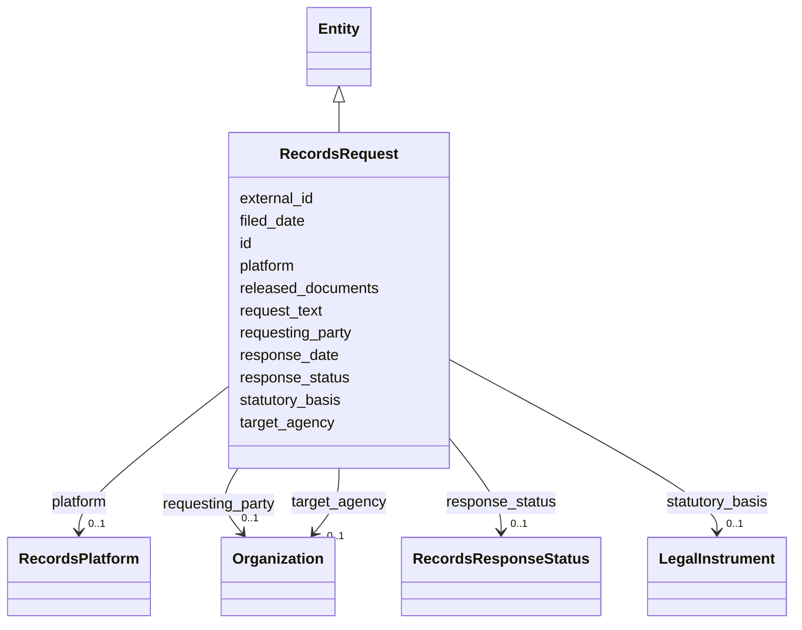

---
search:
  boost: 10.0
---

# Class: RecordsRequest 


_[NEW] A public-records request SIG both cites as provenance and generates as a task (§11.19). no_responsive_records is a positive finding (SIG-ONTO-040)._


<div data-search-exclude markdown="1">


URI: [sig:RecordsRequest](https://ontology.sig-project.org/schema/RecordsRequest)





## Inheritance
* [Entity](Entity.md)
    * **RecordsRequest**


## Slots

| Name | Cardinality and Range | Description | Inheritance |
| ---  | --- | --- | --- |
| [requesting_party](requesting_party.md) | 0..1 <br/> [Organization](Organization.md) |  | direct |
| [target_agency](target_agency.md) | 0..1 <br/> [Organization](Organization.md) |  | direct |
| [request_text](request_text.md) | 0..1 <br/> [String](String.md) |  | direct |
| [filed_date](filed_date.md) | 0..1 <br/> [Edtf](Edtf.md) |  | direct |
| [response_date](response_date.md) | 0..1 <br/> [Edtf](Edtf.md) |  | direct |
| [response_status](response_status.md) | 0..1 <br/> [RecordsResponseStatus](RecordsResponseStatus.md) |  | direct |
| [statutory_basis](statutory_basis.md) | 0..1 <br/> [LegalInstrument](LegalInstrument.md) |  | direct |
| [platform](platform.md) | 0..1 <br/> [RecordsPlatform](RecordsPlatform.md) |  | direct |
| [external_id](external_id.md) | 0..1 <br/> [String](String.md) |  | direct |
| [released_documents](released_documents.md) | * <br/> [Uriorcurie](Uriorcurie.md) |  | direct |
| [id](id.md) | 1 <br/> [Uriorcurie](Uriorcurie.md) | The entity's stable minted identity (L2 identity only, §8 | [Entity](Entity.md) |


## Identifier and Mapping Information


### Schema Source


* from schema: https://ontology.sig-project.org/schema/sig


## Mappings

| Mapping Type | Mapped Value |
| ---  | ---  |
| self | sig:RecordsRequest |
| native | sig:RecordsRequest |


## LinkML Source

<!-- TODO: investigate https://stackoverflow.com/questions/37606292/how-to-create-tabbed-code-blocks-in-mkdocs-or-sphinx -->

### Direct

<details>
```yaml
name: RecordsRequest
description: '[NEW] A public-records request SIG both cites as provenance and generates
  as a task (§11.19). no_responsive_records is a positive finding (SIG-ONTO-040).'
from_schema: https://ontology.sig-project.org/schema/sig
rank: 1000
is_a: Entity
attributes:
  requesting_party:
    name: requesting_party
    from_schema: https://ontology.sig-project.org/schema/entities
    rank: 1000
    domain_of:
    - RecordsRequest
    range: Organization
  target_agency:
    name: target_agency
    from_schema: https://ontology.sig-project.org/schema/entities
    rank: 1000
    domain_of:
    - RecordsRequest
    range: Organization
  request_text:
    name: request_text
    from_schema: https://ontology.sig-project.org/schema/entities
    rank: 1000
    domain_of:
    - RecordsRequest
    range: string
  filed_date:
    name: filed_date
    from_schema: https://ontology.sig-project.org/schema/entities
    domain_of:
    - LegalProceeding
    - RecordsRequest
    range: edtf
  response_date:
    name: response_date
    from_schema: https://ontology.sig-project.org/schema/entities
    rank: 1000
    domain_of:
    - RecordsRequest
    range: edtf
  response_status:
    name: response_status
    from_schema: https://ontology.sig-project.org/schema/entities
    rank: 1000
    domain_of:
    - RecordsRequest
    range: RecordsResponseStatus
  statutory_basis:
    name: statutory_basis
    from_schema: https://ontology.sig-project.org/schema/entities
    rank: 1000
    domain_of:
    - RecordsRequest
    range: LegalInstrument
  platform:
    name: platform
    from_schema: https://ontology.sig-project.org/schema/entities
    rank: 1000
    domain_of:
    - RecordsRequest
    range: RecordsPlatform
  external_id:
    name: external_id
    from_schema: https://ontology.sig-project.org/schema/entities
    rank: 1000
    domain_of:
    - RecordsRequest
    range: string
  released_documents:
    name: released_documents
    from_schema: https://ontology.sig-project.org/schema/entities
    rank: 1000
    domain_of:
    - RecordsRequest
    range: uriorcurie
    multivalued: true

```
</details>

### Induced

<details>
```yaml
name: RecordsRequest
description: '[NEW] A public-records request SIG both cites as provenance and generates
  as a task (§11.19). no_responsive_records is a positive finding (SIG-ONTO-040).'
from_schema: https://ontology.sig-project.org/schema/sig
rank: 1000
is_a: Entity
attributes:
  requesting_party:
    name: requesting_party
    from_schema: https://ontology.sig-project.org/schema/entities
    rank: 1000
    owner: RecordsRequest
    domain_of:
    - RecordsRequest
    range: Organization
  target_agency:
    name: target_agency
    from_schema: https://ontology.sig-project.org/schema/entities
    rank: 1000
    owner: RecordsRequest
    domain_of:
    - RecordsRequest
    range: Organization
  request_text:
    name: request_text
    from_schema: https://ontology.sig-project.org/schema/entities
    rank: 1000
    owner: RecordsRequest
    domain_of:
    - RecordsRequest
    range: string
  filed_date:
    name: filed_date
    from_schema: https://ontology.sig-project.org/schema/entities
    owner: RecordsRequest
    domain_of:
    - LegalProceeding
    - RecordsRequest
    range: edtf
  response_date:
    name: response_date
    from_schema: https://ontology.sig-project.org/schema/entities
    rank: 1000
    owner: RecordsRequest
    domain_of:
    - RecordsRequest
    range: edtf
  response_status:
    name: response_status
    from_schema: https://ontology.sig-project.org/schema/entities
    rank: 1000
    owner: RecordsRequest
    domain_of:
    - RecordsRequest
    range: RecordsResponseStatus
  statutory_basis:
    name: statutory_basis
    from_schema: https://ontology.sig-project.org/schema/entities
    rank: 1000
    owner: RecordsRequest
    domain_of:
    - RecordsRequest
    range: LegalInstrument
  platform:
    name: platform
    from_schema: https://ontology.sig-project.org/schema/entities
    rank: 1000
    owner: RecordsRequest
    domain_of:
    - RecordsRequest
    range: RecordsPlatform
  external_id:
    name: external_id
    from_schema: https://ontology.sig-project.org/schema/entities
    rank: 1000
    owner: RecordsRequest
    domain_of:
    - RecordsRequest
    range: string
  released_documents:
    name: released_documents
    from_schema: https://ontology.sig-project.org/schema/entities
    rank: 1000
    owner: RecordsRequest
    domain_of:
    - RecordsRequest
    range: uriorcurie
    multivalued: true
  id:
    name: id
    description: The entity's stable minted identity (L2 identity only, §8.2).
    from_schema: https://ontology.sig-project.org/schema/sig
    rank: 1000
    identifier: true
    owner: RecordsRequest
    domain_of:
    - Entity
    - Edge
    range: uriorcurie
    required: true

```
</details></div>