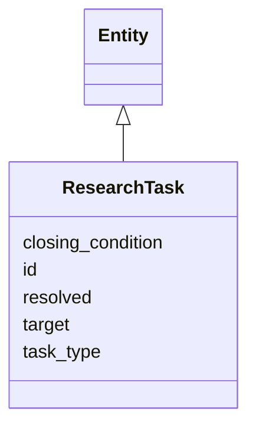

---
search:
  boost: 10.0
---

# Class: ResearchTask 


_[NEW] A research task as an object (§11.22, behaviour at §33.2)._


<div data-search-exclude markdown="1">


URI: [sig:ResearchTask](https://ontology.sig-project.org/schema/ResearchTask)





## Inheritance
* [Entity](Entity.md)
    * **ResearchTask**


## Slots

| Name | Cardinality and Range | Description | Inheritance |
| ---  | --- | --- | --- |
| [task_type](task_type.md) | 0..1 <br/> [String](String.md) |  | direct |
| [target](target.md) | 0..1 <br/> [Uriorcurie](Uriorcurie.md) |  | direct |
| [closing_condition](closing_condition.md) | 0..1 <br/> [String](String.md) |  | direct |
| [resolved](resolved.md) | 0..1 <br/> [Boolean](Boolean.md) |  | direct |
| [id](id.md) | 1 <br/> [Uriorcurie](Uriorcurie.md) | The entity's stable minted identity (L2 identity only, §8 | [Entity](Entity.md) |


## Identifier and Mapping Information


### Schema Source


* from schema: https://ontology.sig-project.org/schema/sig


## Mappings

| Mapping Type | Mapped Value |
| ---  | ---  |
| self | sig:ResearchTask |
| native | sig:ResearchTask |


## LinkML Source

<!-- TODO: investigate https://stackoverflow.com/questions/37606292/how-to-create-tabbed-code-blocks-in-mkdocs-or-sphinx -->

### Direct

<details>
```yaml
name: ResearchTask
description: '[NEW] A research task as an object (§11.22, behaviour at §33.2).'
from_schema: https://ontology.sig-project.org/schema/sig
rank: 1000
is_a: Entity
attributes:
  task_type:
    name: task_type
    from_schema: https://ontology.sig-project.org/schema/entities
    rank: 1000
    domain_of:
    - ResearchTask
    range: string
  target:
    name: target
    from_schema: https://ontology.sig-project.org/schema/entities
    rank: 1000
    domain_of:
    - ResearchTask
    - Edge
    range: uriorcurie
  closing_condition:
    name: closing_condition
    from_schema: https://ontology.sig-project.org/schema/entities
    rank: 1000
    domain_of:
    - ResearchTask
    range: string
  resolved:
    name: resolved
    from_schema: https://ontology.sig-project.org/schema/entities
    rank: 1000
    domain_of:
    - ResearchTask
    range: boolean

```
</details>

### Induced

<details>
```yaml
name: ResearchTask
description: '[NEW] A research task as an object (§11.22, behaviour at §33.2).'
from_schema: https://ontology.sig-project.org/schema/sig
rank: 1000
is_a: Entity
attributes:
  task_type:
    name: task_type
    from_schema: https://ontology.sig-project.org/schema/entities
    rank: 1000
    owner: ResearchTask
    domain_of:
    - ResearchTask
    range: string
  target:
    name: target
    from_schema: https://ontology.sig-project.org/schema/entities
    rank: 1000
    owner: ResearchTask
    domain_of:
    - ResearchTask
    - Edge
    range: uriorcurie
  closing_condition:
    name: closing_condition
    from_schema: https://ontology.sig-project.org/schema/entities
    rank: 1000
    owner: ResearchTask
    domain_of:
    - ResearchTask
    range: string
  resolved:
    name: resolved
    from_schema: https://ontology.sig-project.org/schema/entities
    rank: 1000
    owner: ResearchTask
    domain_of:
    - ResearchTask
    range: boolean
  id:
    name: id
    description: The entity's stable minted identity (L2 identity only, §8.2).
    from_schema: https://ontology.sig-project.org/schema/sig
    rank: 1000
    identifier: true
    owner: ResearchTask
    domain_of:
    - Entity
    - Edge
    range: uriorcurie
    required: true

```
</details></div>