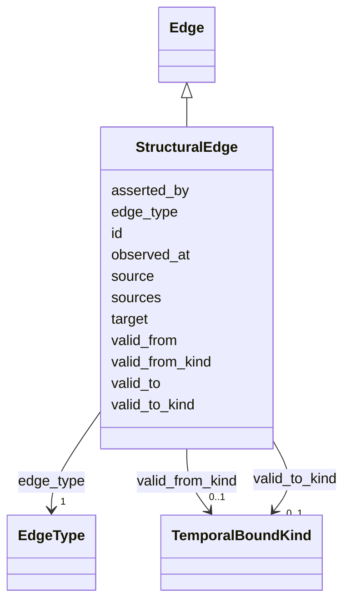

---
search:
  boost: 10.0
---

# Class: StructuralEdge 


_Organizational/structural relationships (§12.6)._


<div data-search-exclude markdown="1">


URI: [sig:StructuralEdge](https://ontology.sig-project.org/schema/StructuralEdge)





## Inheritance
* [Edge](Edge.md)
    * **StructuralEdge**


## Slots

| Name | Cardinality and Range | Description | Inheritance |
| ---  | --- | --- | --- |
| [id](id.md) | 1 <br/> [Uriorcurie](Uriorcurie.md) |  | [Edge](Edge.md) |
| [source](source.md) | 1 <br/> [Uriorcurie](Uriorcurie.md) | The asserting/originating node (directed — §12 | [Edge](Edge.md) |
| [target](target.md) | 1 <br/> [Uriorcurie](Uriorcurie.md) |  | [Edge](Edge.md) |
| [edge_type](edge_type.md) | 1 <br/> [EdgeType](EdgeType.md) | Typed from the closed catalog (§12 | [Edge](Edge.md) |
| [valid_from](valid_from.md) | 0..1 <br/> [Edtf](Edtf.md) |  | [Edge](Edge.md) |
| [valid_to](valid_to.md) | 0..1 <br/> [Edtf](Edtf.md) |  | [Edge](Edge.md) |
| [valid_from_kind](valid_from_kind.md) | 0..1 <br/> [TemporalBoundKind](TemporalBoundKind.md) | Snapshot sharing carries unknown/ongoing (SIG-ONTO-044) | [Edge](Edge.md) |
| [valid_to_kind](valid_to_kind.md) | 0..1 <br/> [TemporalBoundKind](TemporalBoundKind.md) |  | [Edge](Edge.md) |
| [observed_at](observed_at.md) | 0..1 <br/> [Edtf](Edtf.md) |  | [Edge](Edge.md) |
| [sources](sources.md) | * <br/> [Uriorcurie](Uriorcurie.md) | At least one supporting claim (§12 | [Edge](Edge.md) |
| [asserted_by](asserted_by.md) | 0..1 <br/> [Uriorcurie](Uriorcurie.md) | Which party asserted it — perspectival (§12 | [Edge](Edge.md) |


## Identifier and Mapping Information


### Schema Source


* from schema: https://ontology.sig-project.org/schema/sig


## Mappings

| Mapping Type | Mapped Value |
| ---  | ---  |
| self | sig:StructuralEdge |
| native | sig:StructuralEdge |


## LinkML Source

<!-- TODO: investigate https://stackoverflow.com/questions/37606292/how-to-create-tabbed-code-blocks-in-mkdocs-or-sphinx -->

### Direct

<details>
```yaml
name: StructuralEdge
description: Organizational/structural relationships (§12.6).
from_schema: https://ontology.sig-project.org/schema/sig
rank: 1000
is_a: Edge

```
</details>

### Induced

<details>
```yaml
name: StructuralEdge
description: Organizational/structural relationships (§12.6).
from_schema: https://ontology.sig-project.org/schema/sig
rank: 1000
is_a: Edge
attributes:
  id:
    name: id
    from_schema: https://ontology.sig-project.org/schema/edges
    identifier: true
    owner: StructuralEdge
    domain_of:
    - Entity
    - Edge
    range: uriorcurie
    required: true
  source:
    name: source
    description: The asserting/originating node (directed — §12.1.1).
    from_schema: https://ontology.sig-project.org/schema/edges
    rank: 1000
    owner: StructuralEdge
    domain_of:
    - Edge
    range: uriorcurie
    required: true
  target:
    name: target
    from_schema: https://ontology.sig-project.org/schema/edges
    owner: StructuralEdge
    domain_of:
    - ResearchTask
    - Edge
    range: uriorcurie
    required: true
  edge_type:
    name: edge_type
    description: Typed from the closed catalog (§12.1.2).
    from_schema: https://ontology.sig-project.org/schema/edges
    rank: 1000
    owner: StructuralEdge
    domain_of:
    - Edge
    range: EdgeType
    required: true
  valid_from:
    name: valid_from
    from_schema: https://ontology.sig-project.org/schema/edges
    owner: StructuralEdge
    domain_of:
    - Jurisdiction
    - Organization
    - Edge
    range: edtf
  valid_to:
    name: valid_to
    from_schema: https://ontology.sig-project.org/schema/edges
    owner: StructuralEdge
    domain_of:
    - Jurisdiction
    - Organization
    - Edge
    range: edtf
  valid_from_kind:
    name: valid_from_kind
    description: Snapshot sharing carries unknown/ongoing (SIG-ONTO-044).
    from_schema: https://ontology.sig-project.org/schema/edges
    owner: StructuralEdge
    domain_of:
    - Edge
    range: TemporalBoundKind
  valid_to_kind:
    name: valid_to_kind
    from_schema: https://ontology.sig-project.org/schema/edges
    owner: StructuralEdge
    domain_of:
    - Edge
    range: TemporalBoundKind
  observed_at:
    name: observed_at
    from_schema: https://ontology.sig-project.org/schema/edges
    owner: StructuralEdge
    domain_of:
    - Edge
    range: edtf
  sources:
    name: sources
    description: At least one supporting claim (§12.1.4, SIG-CHART-013).
    from_schema: https://ontology.sig-project.org/schema/edges
    owner: StructuralEdge
    domain_of:
    - AccountabilityEvent
    - Edge
    range: uriorcurie
    multivalued: true
  asserted_by:
    name: asserted_by
    description: Which party asserted it — perspectival (§12.1.5).
    from_schema: https://ontology.sig-project.org/schema/edges
    rank: 1000
    owner: StructuralEdge
    domain_of:
    - Edge
    range: uriorcurie

```
</details></div>