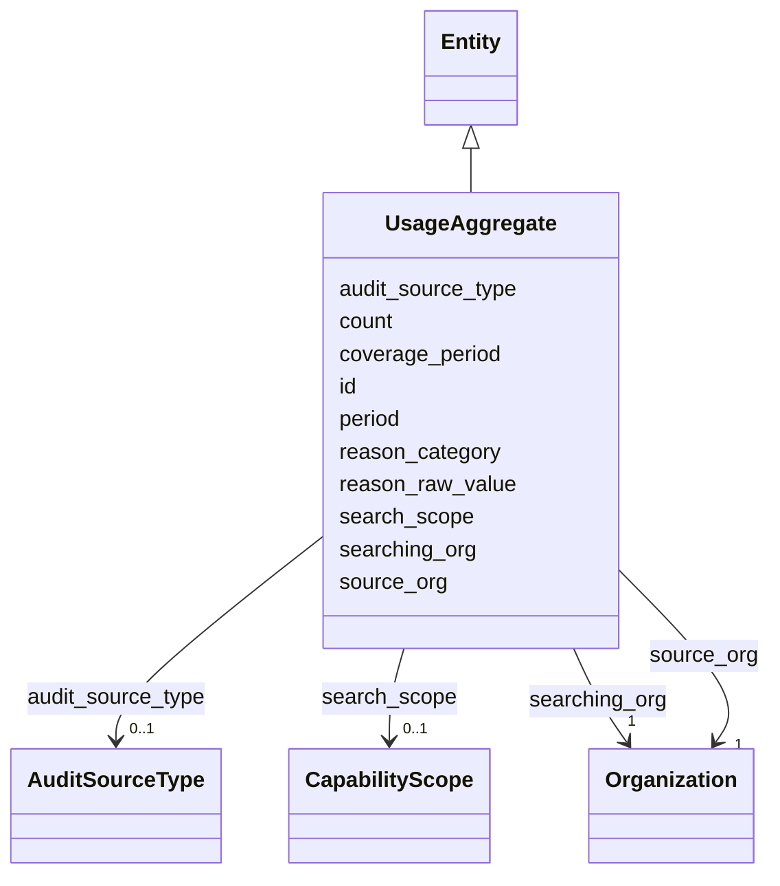

---
search:
  boost: 10.0
---

# Class: UsageAggregate 


_Aggregated usage; direction is the point (§11.16). NO per-search, per-plate, or per-person row may exist here or anywhere in SIG (SIG-ONTO-037, §18.1)._


<div data-search-exclude markdown="1">


URI: [sig:UsageAggregate](https://ontology.sig-project.org/schema/UsageAggregate)





## Inheritance
* [Entity](Entity.md)
    * **UsageAggregate**


## Slots

| Name | Cardinality and Range | Description | Inheritance |
| ---  | --- | --- | --- |
| [searching_org](searching_org.md) | 1 <br/> [Organization](Organization.md) |  | direct |
| [source_org](source_org.md) | 1 <br/> [Organization](Organization.md) |  | direct |
| [period](period.md) | 0..1 <br/> [String](String.md) | Minimum granularity one month for published data (§18 | direct |
| [count](count.md) | 0..1 <br/> [Integer](Integer.md) | Subject to small-cell suppression (§18 | direct |
| [search_scope](search_scope.md) | 0..1 <br/> [CapabilityScope](CapabilityScope.md) |  | direct |
| [reason_category](reason_category.md) | 0..1 <br/> [String](String.md) |  | direct |
| [reason_raw_value](reason_raw_value.md) | 0..1 <br/> [String](String.md) | Normalized reason_category retains the raw value (P2) | direct |
| [audit_source_type](audit_source_type.md) | 0..1 <br/> [AuditSourceType](AuditSourceType.md) |  | direct |
| [coverage_period](coverage_period.md) | 0..1 <br/> [String](String.md) | What span the underlying audit covered — distinct from period | direct |
| [id](id.md) | 1 <br/> [Uriorcurie](Uriorcurie.md) | The entity's stable minted identity (L2 identity only, §8 | [Entity](Entity.md) |


## Identifier and Mapping Information


### Schema Source


* from schema: https://ontology.sig-project.org/schema/sig


## Mappings

| Mapping Type | Mapped Value |
| ---  | ---  |
| self | sig:UsageAggregate |
| native | sig:UsageAggregate |


## LinkML Source

<!-- TODO: investigate https://stackoverflow.com/questions/37606292/how-to-create-tabbed-code-blocks-in-mkdocs-or-sphinx -->

### Direct

<details>
```yaml
name: UsageAggregate
description: Aggregated usage; direction is the point (§11.16). NO per-search, per-plate,
  or per-person row may exist here or anywhere in SIG (SIG-ONTO-037, §18.1).
from_schema: https://ontology.sig-project.org/schema/sig
rank: 1000
is_a: Entity
attributes:
  searching_org:
    name: searching_org
    from_schema: https://ontology.sig-project.org/schema/entities
    rank: 1000
    domain_of:
    - UsageAggregate
    range: Organization
    required: true
  source_org:
    name: source_org
    from_schema: https://ontology.sig-project.org/schema/entities
    rank: 1000
    domain_of:
    - UsageAggregate
    range: Organization
    required: true
  period:
    name: period
    description: Minimum granularity one month for published data (§18.4).
    from_schema: https://ontology.sig-project.org/schema/entities
    domain_of:
    - FundingInstrument
    - UsageAggregate
    range: string
  count:
    name: count
    description: Subject to small-cell suppression (§18.4).
    from_schema: https://ontology.sig-project.org/schema/entities
    rank: 1000
    domain_of:
    - UsageAggregate
    range: integer
  search_scope:
    name: search_scope
    from_schema: https://ontology.sig-project.org/schema/entities
    rank: 1000
    domain_of:
    - UsageAggregate
    range: CapabilityScope
  reason_category:
    name: reason_category
    from_schema: https://ontology.sig-project.org/schema/entities
    rank: 1000
    domain_of:
    - UsageAggregate
    range: string
  reason_raw_value:
    name: reason_raw_value
    description: Normalized reason_category retains the raw value (P2).
    from_schema: https://ontology.sig-project.org/schema/entities
    rank: 1000
    domain_of:
    - UsageAggregate
    range: string
  audit_source_type:
    name: audit_source_type
    from_schema: https://ontology.sig-project.org/schema/entities
    rank: 1000
    domain_of:
    - UsageAggregate
    range: AuditSourceType
  coverage_period:
    name: coverage_period
    description: What span the underlying audit covered — distinct from period.
    from_schema: https://ontology.sig-project.org/schema/entities
    rank: 1000
    domain_of:
    - UsageAggregate
    - CoverageRecord
    range: string

```
</details>

### Induced

<details>
```yaml
name: UsageAggregate
description: Aggregated usage; direction is the point (§11.16). NO per-search, per-plate,
  or per-person row may exist here or anywhere in SIG (SIG-ONTO-037, §18.1).
from_schema: https://ontology.sig-project.org/schema/sig
rank: 1000
is_a: Entity
attributes:
  searching_org:
    name: searching_org
    from_schema: https://ontology.sig-project.org/schema/entities
    rank: 1000
    owner: UsageAggregate
    domain_of:
    - UsageAggregate
    range: Organization
    required: true
  source_org:
    name: source_org
    from_schema: https://ontology.sig-project.org/schema/entities
    rank: 1000
    owner: UsageAggregate
    domain_of:
    - UsageAggregate
    range: Organization
    required: true
  period:
    name: period
    description: Minimum granularity one month for published data (§18.4).
    from_schema: https://ontology.sig-project.org/schema/entities
    owner: UsageAggregate
    domain_of:
    - FundingInstrument
    - UsageAggregate
    range: string
  count:
    name: count
    description: Subject to small-cell suppression (§18.4).
    from_schema: https://ontology.sig-project.org/schema/entities
    rank: 1000
    owner: UsageAggregate
    domain_of:
    - UsageAggregate
    range: integer
  search_scope:
    name: search_scope
    from_schema: https://ontology.sig-project.org/schema/entities
    rank: 1000
    owner: UsageAggregate
    domain_of:
    - UsageAggregate
    range: CapabilityScope
  reason_category:
    name: reason_category
    from_schema: https://ontology.sig-project.org/schema/entities
    rank: 1000
    owner: UsageAggregate
    domain_of:
    - UsageAggregate
    range: string
  reason_raw_value:
    name: reason_raw_value
    description: Normalized reason_category retains the raw value (P2).
    from_schema: https://ontology.sig-project.org/schema/entities
    rank: 1000
    owner: UsageAggregate
    domain_of:
    - UsageAggregate
    range: string
  audit_source_type:
    name: audit_source_type
    from_schema: https://ontology.sig-project.org/schema/entities
    rank: 1000
    owner: UsageAggregate
    domain_of:
    - UsageAggregate
    range: AuditSourceType
  coverage_period:
    name: coverage_period
    description: What span the underlying audit covered — distinct from period.
    from_schema: https://ontology.sig-project.org/schema/entities
    rank: 1000
    owner: UsageAggregate
    domain_of:
    - UsageAggregate
    - CoverageRecord
    range: string
  id:
    name: id
    description: The entity's stable minted identity (L2 identity only, §8.2).
    from_schema: https://ontology.sig-project.org/schema/sig
    rank: 1000
    identifier: true
    owner: UsageAggregate
    domain_of:
    - Entity
    - Edge
    range: uriorcurie
    required: true

```
</details></div>