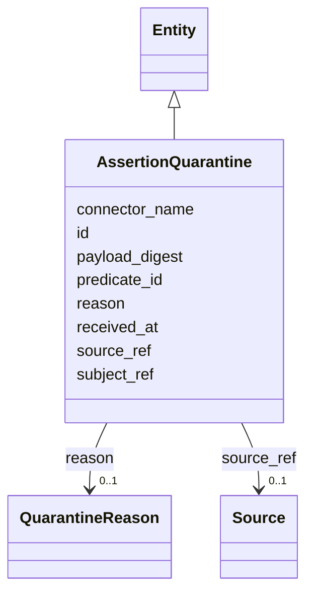

---
search:
  boost: 10.0
---

# Class: AssertionQuarantine 


_The append-only fail-closed landing for a rejected assertion (SIG-TRUST-001): unknown predicates/types and binding failures land here with reason and full payload — never silently dropped, never public-readable._


<div data-search-exclude markdown="1">


URI: [sig:class/AssertionQuarantine](https://ontology.sig-project.org/schema/class/AssertionQuarantine)





## Inheritance
* [Entity](../classes/Entity.md)
    * **AssertionQuarantine**


## Slots

| Name | Cardinality and Range | Description | Inheritance |
| ---  | --- | --- | --- |
| [reason](../slots/reason.md) | 0..1 <br/> [QuarantineReason](../enums/QuarantineReason.md) |  | direct |
| [connector_name](../slots/connector_name.md) | 0..1 <br/> [String](../types/String.md) |  | direct |
| [source_ref](../slots/source_ref.md) | 0..1 <br/> [Source](../classes/Source.md) |  | direct |
| [subject_ref](../slots/subject_ref.md) | 0..1 <br/> [String](../types/String.md) |  | direct |
| [predicate_id](../slots/predicate_id.md) | 0..1 <br/> [String](../types/String.md) |  | direct |
| [received_at](../slots/received_at.md) | 0..1 <br/> [Datetime](../types/Datetime.md) |  | direct |
| [payload_digest](../slots/payload_digest.md) | 0..1 <br/> [String](../types/String.md) | The content-keyed idempotency identity (a re-run is +0) | direct |
| [id](../slots/id.md) | 1 <br/> [Uriorcurie](../types/Uriorcurie.md) | The entity's stable minted identity (L2 identity only, §8 | [Entity](../classes/Entity.md) |


## Identifier and Mapping Information


### Schema Source


* from schema: https://ontology.sig-project.org/schema/sig


## Mappings

| Mapping Type | Mapped Value |
| ---  | ---  |
| self | sig:AssertionQuarantine |
| native | sig:AssertionQuarantine |


## LinkML Source

<!-- TODO: investigate https://stackoverflow.com/questions/37606292/how-to-create-tabbed-code-blocks-in-mkdocs-or-sphinx -->

### Direct

<details>
```yaml
name: AssertionQuarantine
description: 'The append-only fail-closed landing for a rejected assertion (SIG-TRUST-001):
  unknown predicates/types and binding failures land here with reason and full payload
  — never silently dropped, never public-readable.'
from_schema: https://ontology.sig-project.org/schema/sig
rank: 1000
is_a: Entity
attributes:
  reason:
    name: reason
    from_schema: https://ontology.sig-project.org/schema/entities
    rank: 1000
    domain_of:
    - AssertionQuarantine
    range: QuarantineReason
  connector_name:
    name: connector_name
    from_schema: https://ontology.sig-project.org/schema/entities
    rank: 1000
    domain_of:
    - AssertionQuarantine
    range: string
  source_ref:
    name: source_ref
    from_schema: https://ontology.sig-project.org/schema/entities
    rank: 1000
    domain_of:
    - AssertionQuarantine
    range: Source
  subject_ref:
    name: subject_ref
    from_schema: https://ontology.sig-project.org/schema/entities
    rank: 1000
    domain_of:
    - AssertionQuarantine
    range: string
  predicate_id:
    name: predicate_id
    from_schema: https://ontology.sig-project.org/schema/entities
    rank: 1000
    domain_of:
    - AssertionQuarantine
    range: string
  received_at:
    name: received_at
    from_schema: https://ontology.sig-project.org/schema/entities
    rank: 1000
    domain_of:
    - AssertionQuarantine
    range: datetime
  payload_digest:
    name: payload_digest
    description: The content-keyed idempotency identity (a re-run is +0).
    from_schema: https://ontology.sig-project.org/schema/entities
    rank: 1000
    domain_of:
    - AssertionQuarantine
    range: string

```
</details>

### Induced

<details>
```yaml
name: AssertionQuarantine
description: 'The append-only fail-closed landing for a rejected assertion (SIG-TRUST-001):
  unknown predicates/types and binding failures land here with reason and full payload
  — never silently dropped, never public-readable.'
from_schema: https://ontology.sig-project.org/schema/sig
rank: 1000
is_a: Entity
attributes:
  reason:
    name: reason
    from_schema: https://ontology.sig-project.org/schema/entities
    rank: 1000
    owner: AssertionQuarantine
    domain_of:
    - AssertionQuarantine
    range: QuarantineReason
  connector_name:
    name: connector_name
    from_schema: https://ontology.sig-project.org/schema/entities
    rank: 1000
    owner: AssertionQuarantine
    domain_of:
    - AssertionQuarantine
    range: string
  source_ref:
    name: source_ref
    from_schema: https://ontology.sig-project.org/schema/entities
    rank: 1000
    owner: AssertionQuarantine
    domain_of:
    - AssertionQuarantine
    range: Source
  subject_ref:
    name: subject_ref
    from_schema: https://ontology.sig-project.org/schema/entities
    rank: 1000
    owner: AssertionQuarantine
    domain_of:
    - AssertionQuarantine
    range: string
  predicate_id:
    name: predicate_id
    from_schema: https://ontology.sig-project.org/schema/entities
    rank: 1000
    owner: AssertionQuarantine
    domain_of:
    - AssertionQuarantine
    range: string
  received_at:
    name: received_at
    from_schema: https://ontology.sig-project.org/schema/entities
    rank: 1000
    owner: AssertionQuarantine
    domain_of:
    - AssertionQuarantine
    range: datetime
  payload_digest:
    name: payload_digest
    description: The content-keyed idempotency identity (a re-run is +0).
    from_schema: https://ontology.sig-project.org/schema/entities
    rank: 1000
    owner: AssertionQuarantine
    domain_of:
    - AssertionQuarantine
    range: string
  id:
    name: id
    description: The entity's stable minted identity (L2 identity only, §8.2).
    from_schema: https://ontology.sig-project.org/schema/sig
    rank: 1000
    identifier: true
    owner: AssertionQuarantine
    domain_of:
    - Entity
    - Edge
    range: uriorcurie
    required: true

```
</details></div>