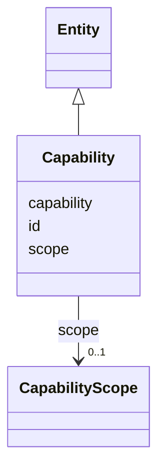

---
search:
  boost: 10.0
---

# Class: Capability 


_A verb.object.scope capability (§11.6, SIG-ONTO-023)._


<div data-search-exclude markdown="1">


URI: [sig:class/Capability](https://ontology.sig-project.org/schema/class/Capability)





## Inheritance
* [Entity](../classes/Entity.md)
    * **Capability**


## Slots

| Name | Cardinality and Range | Description | Inheritance |
| ---  | --- | --- | --- |
| [capability](../slots/capability.md) | 0..1 <br/> [CapabilityCode](../types/CapabilityCode.md) |  | direct |
| [scope](../slots/scope.md) | 0..1 <br/> [CapabilityScope](../enums/CapabilityScope.md) |  | direct |
| [id](../slots/id.md) | 1 <br/> [Uriorcurie](../types/Uriorcurie.md) | The entity's stable minted identity (L2 identity only, §8 | [Entity](../classes/Entity.md) |


## Identifier and Mapping Information


### Schema Source


* from schema: https://ontology.sig-project.org/schema/sig


## Mappings

| Mapping Type | Mapped Value |
| ---  | ---  |
| self | sig:Capability |
| native | sig:Capability |


## LinkML Source

<!-- TODO: investigate https://stackoverflow.com/questions/37606292/how-to-create-tabbed-code-blocks-in-mkdocs-or-sphinx -->

### Direct

<details>
```yaml
name: Capability
description: A verb.object.scope capability (§11.6, SIG-ONTO-023).
from_schema: https://ontology.sig-project.org/schema/sig
rank: 1000
is_a: Entity
attributes:
  capability:
    name: capability
    from_schema: https://ontology.sig-project.org/schema/entities
    rank: 1000
    domain_of:
    - Capability
    range: capability_code
  scope:
    name: scope
    from_schema: https://ontology.sig-project.org/schema/entities
    rank: 1000
    domain_of:
    - Capability
    - AccessRelationship
    - IntegrationEdge
    range: CapabilityScope

```
</details>

### Induced

<details>
```yaml
name: Capability
description: A verb.object.scope capability (§11.6, SIG-ONTO-023).
from_schema: https://ontology.sig-project.org/schema/sig
rank: 1000
is_a: Entity
attributes:
  capability:
    name: capability
    from_schema: https://ontology.sig-project.org/schema/entities
    rank: 1000
    owner: Capability
    domain_of:
    - Capability
    range: capability_code
  scope:
    name: scope
    from_schema: https://ontology.sig-project.org/schema/entities
    rank: 1000
    owner: Capability
    domain_of:
    - Capability
    - AccessRelationship
    - IntegrationEdge
    range: CapabilityScope
  id:
    name: id
    description: The entity's stable minted identity (L2 identity only, §8.2).
    from_schema: https://ontology.sig-project.org/schema/sig
    rank: 1000
    identifier: true
    owner: Capability
    domain_of:
    - Entity
    - Edge
    range: uriorcurie
    required: true

```
</details></div>