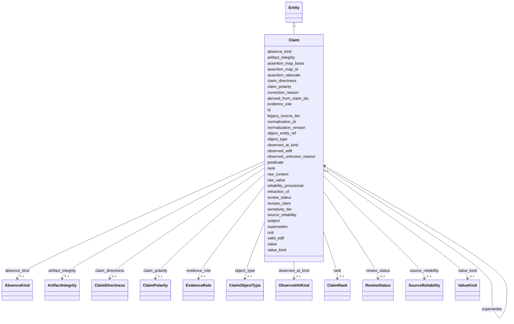

---
search:
  boost: 10.0
---

# Class: Claim 


_An append-only assertion (subject, predicate, value, ...) — the substance of the graph (§10.3, L1). Physical append-only table is P02._


<div data-search-exclude markdown="1">


URI: [sig:class/Claim](https://ontology.sig-project.org/schema/class/Claim)





## Inheritance
* [Entity](../classes/Entity.md)
    * **Claim**


## Slots

| Name | Cardinality and Range | Description | Inheritance |
| ---  | --- | --- | --- |
| [subject](../slots/subject.md) | 0..1 <br/> [Uriorcurie](../types/Uriorcurie.md) |  | direct |
| [predicate](../slots/predicate.md) | 0..1 <br/> [PredicateCode](../types/PredicateCode.md) |  | direct |
| [value](../slots/value.md) | 0..1 <br/> [String](../types/String.md) |  | direct |
| [value_kind](../slots/value_kind.md) | 0..1 <br/> [ValueKind](../enums/ValueKind.md) |  | direct |
| [raw_value](../slots/raw_value.md) | 0..1 <br/> [String](../types/String.md) |  | direct |
| [absence_kind](../slots/absence_kind.md) | 0..1 <br/> [AbsenceKind](../enums/AbsenceKind.md) |  | direct |
| [evidence_role](../slots/evidence_role.md) | 0..1 <br/> [EvidenceRole](../enums/EvidenceRole.md) |  | direct |
| [supersedes](../slots/supersedes.md) | 0..1 <br/> [Claim](../classes/Claim.md) |  | direct |
| [object_type](../slots/object_type.md) | 0..1 <br/> [ClaimObjectType](../enums/ClaimObjectType.md) |  | direct |
| [object_entity_ref](../slots/object_entity_ref.md) | 0..1 <br/> [Uriorcurie](../types/Uriorcurie.md) | The resolved entity an entity_ref object names; never a person (Part VIII) | direct |
| [unit](../slots/unit.md) | 0..1 <br/> [String](../types/String.md) | REQUIRED when object_type is quantity (§10 | direct |
| [raw_context](../slots/raw_context.md) | 0..1 <br/> [String](../types/String.md) | The citation anchor within the artifact (P2), as structured text | direct |
| [normalization_id](../slots/normalization_id.md) | 0..1 <br/> [String](../types/String.md) |  | direct |
| [normalization_version](../slots/normalization_version.md) | 0..1 <br/> [String](../types/String.md) |  | direct |
| [valid_edtf](../slots/valid_edtf.md) | 0..1 <br/> [Edtf](../types/Edtf.md) |  | direct |
| [observed_edtf](../slots/observed_edtf.md) | 0..1 <br/> [Edtf](../types/Edtf.md) |  | direct |
| [observed_at_kind](../slots/observed_at_kind.md) | 0..1 <br/> [ObservedAtKind](../enums/ObservedAtKind.md) |  | direct |
| [observed_unknown_reason](../slots/observed_unknown_reason.md) | 0..1 <br/> [String](../types/String.md) | REQUIRED when observed_at is absent — an absent observation time always says ... | direct |
| [source_reliability](../slots/source_reliability.md) | 0..1 <br/> [SourceReliability](../enums/SourceReliability.md) |  | direct |
| [reliability_provisional](../slots/reliability_provisional.md) | 0..1 <br/> [Boolean](../types/Boolean.md) |  | direct |
| [claim_directness](../slots/claim_directness.md) | 0..1 <br/> [ClaimDirectness](../enums/ClaimDirectness.md) |  | direct |
| [artifact_integrity](../slots/artifact_integrity.md) | 0..1 <br/> [ArtifactIntegrity](../enums/ArtifactIntegrity.md) |  | direct |
| [legacy_source_tier](../slots/legacy_source_tier.md) | 0..1 <br/> [String](../types/String.md) | An upstream's own Tier A-F label, passthrough only — never used in resolution... | direct |
| [claim_polarity](../slots/claim_polarity.md) | 0..1 <br/> [ClaimPolarity](../enums/ClaimPolarity.md) |  | direct |
| [rank](../slots/rank.md) | 0..1 <br/> [ClaimRank](../enums/ClaimRank.md) |  | direct |
| [review_status](../slots/review_status.md) | 0..1 <br/> [ReviewStatus](../enums/ReviewStatus.md) |  | direct |
| [sensitivity_tier](../slots/sensitivity_tier.md) | 0..1 <br/> [Integer](../types/Integer.md) | The §42 sensitivity tier; absent never silently lowers | direct |
| [assertion_rationale](../slots/assertion_rationale.md) | 0..1 <br/> [String](../types/String.md) |  | direct |
| [derived_from_claim_ids](../slots/derived_from_claim_ids.md) | * <br/> [Claim](../classes/Claim.md) |  | direct |
| [revises_claim](../slots/revises_claim.md) | 0..1 <br/> [Claim](../classes/Claim.md) |  | direct |
| [retraction_of](../slots/retraction_of.md) | 0..1 <br/> [Claim](../classes/Claim.md) |  | direct |
| [correction_reason](../slots/correction_reason.md) | 0..1 <br/> [String](../types/String.md) | REQUIRED when revises_claim is set (§16 | direct |
| [assertion_map_id](../slots/assertion_map_id.md) | 0..1 <br/> [String](../types/String.md) | The named versioned mapping the row's defaults were derived under (sig | direct |
| [assertion_map_basis](../slots/assertion_map_basis.md) | 0..1 <br/> [String](../types/String.md) | The explicit basis string recording how each absent field was derived | direct |
| [id](../slots/id.md) | 1 <br/> [Uriorcurie](../types/Uriorcurie.md) | The entity's stable minted identity (L2 identity only, §8 | [Entity](../classes/Entity.md) |


## Usages

| used by | used in | type | used |
| ---  | --- | --- | --- |
| [Claim](../classes/Claim.md) | [supersedes](../slots/supersedes.md) | range | [Claim](../classes/Claim.md) |
| [Claim](../classes/Claim.md) | [derived_from_claim_ids](../slots/derived_from_claim_ids.md) | range | [Claim](../classes/Claim.md) |
| [Claim](../classes/Claim.md) | [revises_claim](../slots/revises_claim.md) | range | [Claim](../classes/Claim.md) |
| [Claim](../classes/Claim.md) | [retraction_of](../slots/retraction_of.md) | range | [Claim](../classes/Claim.md) |
| [ClaimEvidence](../classes/ClaimEvidence.md) | [claim](../slots/claim.md) | range | [Claim](../classes/Claim.md) |
| [ClaimQualifier](../classes/ClaimQualifier.md) | [claim](../slots/claim.md) | range | [Claim](../classes/Claim.md) |


## Identifier and Mapping Information


### Schema Source


* from schema: https://ontology.sig-project.org/schema/sig


## Mappings

| Mapping Type | Mapped Value |
| ---  | ---  |
| self | sig:Claim |
| native | sig:Claim |


## LinkML Source

<!-- TODO: investigate https://stackoverflow.com/questions/37606292/how-to-create-tabbed-code-blocks-in-mkdocs-or-sphinx -->

### Direct

<details>
```yaml
name: Claim
description: An append-only assertion (subject, predicate, value, ...) — the substance
  of the graph (§10.3, L1). Physical append-only table is P02.
from_schema: https://ontology.sig-project.org/schema/sig
rank: 1000
is_a: Entity
attributes:
  subject:
    name: subject
    from_schema: https://ontology.sig-project.org/schema/entities
    rank: 1000
    domain_of:
    - Claim
    - Resolution
    - Contradiction
    - CoverageRecord
    range: uriorcurie
  predicate:
    name: predicate
    from_schema: https://ontology.sig-project.org/schema/entities
    rank: 1000
    domain_of:
    - Claim
    - Resolution
    - Contradiction
    - CoverageRecord
    range: predicate_code
  value:
    name: value
    from_schema: https://ontology.sig-project.org/schema/entities
    rank: 1000
    domain_of:
    - Claim
    range: string
  value_kind:
    name: value_kind
    from_schema: https://ontology.sig-project.org/schema/entities
    rank: 1000
    domain_of:
    - Claim
    range: ValueKind
  raw_value:
    name: raw_value
    from_schema: https://ontology.sig-project.org/schema/entities
    rank: 1000
    domain_of:
    - Claim
    range: string
  absence_kind:
    name: absence_kind
    from_schema: https://ontology.sig-project.org/schema/entities
    rank: 1000
    domain_of:
    - Claim
    - CoverageRecord
    range: AbsenceKind
  evidence_role:
    name: evidence_role
    from_schema: https://ontology.sig-project.org/schema/entities
    rank: 1000
    domain_of:
    - Claim
    range: EvidenceRole
  supersedes:
    name: supersedes
    from_schema: https://ontology.sig-project.org/schema/entities
    rank: 1000
    domain_of:
    - Claim
    range: Claim
  object_type:
    name: object_type
    from_schema: https://ontology.sig-project.org/schema/entities
    rank: 1000
    domain_of:
    - Claim
    range: ClaimObjectType
  object_entity_ref:
    name: object_entity_ref
    description: The resolved entity an entity_ref object names; never a person (Part
      VIII).
    from_schema: https://ontology.sig-project.org/schema/entities
    rank: 1000
    domain_of:
    - Claim
    range: uriorcurie
  unit:
    name: unit
    description: REQUIRED when object_type is quantity (§10.3.5).
    from_schema: https://ontology.sig-project.org/schema/entities
    rank: 1000
    domain_of:
    - Claim
    - ClaimQualifier
    range: string
  raw_context:
    name: raw_context
    description: The citation anchor within the artifact (P2), as structured text.
    from_schema: https://ontology.sig-project.org/schema/entities
    rank: 1000
    domain_of:
    - Claim
    range: string
  normalization_id:
    name: normalization_id
    from_schema: https://ontology.sig-project.org/schema/entities
    rank: 1000
    domain_of:
    - Claim
    range: string
  normalization_version:
    name: normalization_version
    from_schema: https://ontology.sig-project.org/schema/entities
    rank: 1000
    domain_of:
    - Claim
    range: string
  valid_edtf:
    name: valid_edtf
    from_schema: https://ontology.sig-project.org/schema/entities
    rank: 1000
    domain_of:
    - Claim
    range: edtf
  observed_edtf:
    name: observed_edtf
    from_schema: https://ontology.sig-project.org/schema/entities
    rank: 1000
    domain_of:
    - Claim
    range: edtf
  observed_at_kind:
    name: observed_at_kind
    from_schema: https://ontology.sig-project.org/schema/entities
    rank: 1000
    domain_of:
    - Claim
    range: ObservedAtKind
  observed_unknown_reason:
    name: observed_unknown_reason
    description: REQUIRED when observed_at is absent — an absent observation time
      always says why.
    from_schema: https://ontology.sig-project.org/schema/entities
    rank: 1000
    domain_of:
    - Claim
    range: string
  source_reliability:
    name: source_reliability
    from_schema: https://ontology.sig-project.org/schema/entities
    rank: 1000
    domain_of:
    - Claim
    range: SourceReliability
  reliability_provisional:
    name: reliability_provisional
    from_schema: https://ontology.sig-project.org/schema/entities
    rank: 1000
    domain_of:
    - Claim
    range: boolean
  claim_directness:
    name: claim_directness
    from_schema: https://ontology.sig-project.org/schema/entities
    rank: 1000
    domain_of:
    - Claim
    range: ClaimDirectness
  artifact_integrity:
    name: artifact_integrity
    from_schema: https://ontology.sig-project.org/schema/entities
    rank: 1000
    domain_of:
    - Claim
    range: ArtifactIntegrity
  legacy_source_tier:
    name: legacy_source_tier
    description: An upstream's own Tier A-F label, passthrough only — never used in
      resolution (§10.4).
    from_schema: https://ontology.sig-project.org/schema/entities
    rank: 1000
    domain_of:
    - Claim
    range: string
  claim_polarity:
    name: claim_polarity
    from_schema: https://ontology.sig-project.org/schema/entities
    rank: 1000
    domain_of:
    - Claim
    range: ClaimPolarity
  rank:
    name: rank
    from_schema: https://ontology.sig-project.org/schema/entities
    rank: 1000
    domain_of:
    - Claim
    - ClaimQualifier
    range: ClaimRank
  review_status:
    name: review_status
    from_schema: https://ontology.sig-project.org/schema/entities
    rank: 1000
    domain_of:
    - Claim
    range: ReviewStatus
  sensitivity_tier:
    name: sensitivity_tier
    description: The §42 sensitivity tier; absent never silently lowers.
    from_schema: https://ontology.sig-project.org/schema/entities
    domain_of:
    - PhysicalAsset
    - Claim
    range: integer
  assertion_rationale:
    name: assertion_rationale
    from_schema: https://ontology.sig-project.org/schema/entities
    rank: 1000
    domain_of:
    - Claim
    range: string
  derived_from_claim_ids:
    name: derived_from_claim_ids
    from_schema: https://ontology.sig-project.org/schema/entities
    rank: 1000
    domain_of:
    - Claim
    range: Claim
    multivalued: true
  revises_claim:
    name: revises_claim
    from_schema: https://ontology.sig-project.org/schema/entities
    rank: 1000
    domain_of:
    - Claim
    range: Claim
  retraction_of:
    name: retraction_of
    from_schema: https://ontology.sig-project.org/schema/entities
    rank: 1000
    domain_of:
    - Claim
    range: Claim
  correction_reason:
    name: correction_reason
    description: REQUIRED when revises_claim is set (§16.6).
    from_schema: https://ontology.sig-project.org/schema/entities
    rank: 1000
    domain_of:
    - Claim
    range: string
  assertion_map_id:
    name: assertion_map_id
    description: The named versioned mapping the row's defaults were derived under
      (sig.assertion.map.v1).
    from_schema: https://ontology.sig-project.org/schema/entities
    rank: 1000
    domain_of:
    - Claim
    range: string
  assertion_map_basis:
    name: assertion_map_basis
    description: The explicit basis string recording how each absent field was derived.
    from_schema: https://ontology.sig-project.org/schema/entities
    rank: 1000
    domain_of:
    - Claim
    range: string

```
</details>

### Induced

<details>
```yaml
name: Claim
description: An append-only assertion (subject, predicate, value, ...) — the substance
  of the graph (§10.3, L1). Physical append-only table is P02.
from_schema: https://ontology.sig-project.org/schema/sig
rank: 1000
is_a: Entity
attributes:
  subject:
    name: subject
    from_schema: https://ontology.sig-project.org/schema/entities
    rank: 1000
    owner: Claim
    domain_of:
    - Claim
    - Resolution
    - Contradiction
    - CoverageRecord
    range: uriorcurie
  predicate:
    name: predicate
    from_schema: https://ontology.sig-project.org/schema/entities
    rank: 1000
    owner: Claim
    domain_of:
    - Claim
    - Resolution
    - Contradiction
    - CoverageRecord
    range: predicate_code
  value:
    name: value
    from_schema: https://ontology.sig-project.org/schema/entities
    rank: 1000
    owner: Claim
    domain_of:
    - Claim
    range: string
  value_kind:
    name: value_kind
    from_schema: https://ontology.sig-project.org/schema/entities
    rank: 1000
    owner: Claim
    domain_of:
    - Claim
    range: ValueKind
  raw_value:
    name: raw_value
    from_schema: https://ontology.sig-project.org/schema/entities
    rank: 1000
    owner: Claim
    domain_of:
    - Claim
    range: string
  absence_kind:
    name: absence_kind
    from_schema: https://ontology.sig-project.org/schema/entities
    rank: 1000
    owner: Claim
    domain_of:
    - Claim
    - CoverageRecord
    range: AbsenceKind
  evidence_role:
    name: evidence_role
    from_schema: https://ontology.sig-project.org/schema/entities
    rank: 1000
    owner: Claim
    domain_of:
    - Claim
    range: EvidenceRole
  supersedes:
    name: supersedes
    from_schema: https://ontology.sig-project.org/schema/entities
    rank: 1000
    owner: Claim
    domain_of:
    - Claim
    range: Claim
  object_type:
    name: object_type
    from_schema: https://ontology.sig-project.org/schema/entities
    rank: 1000
    owner: Claim
    domain_of:
    - Claim
    range: ClaimObjectType
  object_entity_ref:
    name: object_entity_ref
    description: The resolved entity an entity_ref object names; never a person (Part
      VIII).
    from_schema: https://ontology.sig-project.org/schema/entities
    rank: 1000
    owner: Claim
    domain_of:
    - Claim
    range: uriorcurie
  unit:
    name: unit
    description: REQUIRED when object_type is quantity (§10.3.5).
    from_schema: https://ontology.sig-project.org/schema/entities
    rank: 1000
    owner: Claim
    domain_of:
    - Claim
    - ClaimQualifier
    range: string
  raw_context:
    name: raw_context
    description: The citation anchor within the artifact (P2), as structured text.
    from_schema: https://ontology.sig-project.org/schema/entities
    rank: 1000
    owner: Claim
    domain_of:
    - Claim
    range: string
  normalization_id:
    name: normalization_id
    from_schema: https://ontology.sig-project.org/schema/entities
    rank: 1000
    owner: Claim
    domain_of:
    - Claim
    range: string
  normalization_version:
    name: normalization_version
    from_schema: https://ontology.sig-project.org/schema/entities
    rank: 1000
    owner: Claim
    domain_of:
    - Claim
    range: string
  valid_edtf:
    name: valid_edtf
    from_schema: https://ontology.sig-project.org/schema/entities
    rank: 1000
    owner: Claim
    domain_of:
    - Claim
    range: edtf
  observed_edtf:
    name: observed_edtf
    from_schema: https://ontology.sig-project.org/schema/entities
    rank: 1000
    owner: Claim
    domain_of:
    - Claim
    range: edtf
  observed_at_kind:
    name: observed_at_kind
    from_schema: https://ontology.sig-project.org/schema/entities
    rank: 1000
    owner: Claim
    domain_of:
    - Claim
    range: ObservedAtKind
  observed_unknown_reason:
    name: observed_unknown_reason
    description: REQUIRED when observed_at is absent — an absent observation time
      always says why.
    from_schema: https://ontology.sig-project.org/schema/entities
    rank: 1000
    owner: Claim
    domain_of:
    - Claim
    range: string
  source_reliability:
    name: source_reliability
    from_schema: https://ontology.sig-project.org/schema/entities
    rank: 1000
    owner: Claim
    domain_of:
    - Claim
    range: SourceReliability
  reliability_provisional:
    name: reliability_provisional
    from_schema: https://ontology.sig-project.org/schema/entities
    rank: 1000
    owner: Claim
    domain_of:
    - Claim
    range: boolean
  claim_directness:
    name: claim_directness
    from_schema: https://ontology.sig-project.org/schema/entities
    rank: 1000
    owner: Claim
    domain_of:
    - Claim
    range: ClaimDirectness
  artifact_integrity:
    name: artifact_integrity
    from_schema: https://ontology.sig-project.org/schema/entities
    rank: 1000
    owner: Claim
    domain_of:
    - Claim
    range: ArtifactIntegrity
  legacy_source_tier:
    name: legacy_source_tier
    description: An upstream's own Tier A-F label, passthrough only — never used in
      resolution (§10.4).
    from_schema: https://ontology.sig-project.org/schema/entities
    rank: 1000
    owner: Claim
    domain_of:
    - Claim
    range: string
  claim_polarity:
    name: claim_polarity
    from_schema: https://ontology.sig-project.org/schema/entities
    rank: 1000
    owner: Claim
    domain_of:
    - Claim
    range: ClaimPolarity
  rank:
    name: rank
    from_schema: https://ontology.sig-project.org/schema/entities
    rank: 1000
    owner: Claim
    domain_of:
    - Claim
    - ClaimQualifier
    range: ClaimRank
  review_status:
    name: review_status
    from_schema: https://ontology.sig-project.org/schema/entities
    rank: 1000
    owner: Claim
    domain_of:
    - Claim
    range: ReviewStatus
  sensitivity_tier:
    name: sensitivity_tier
    description: The §42 sensitivity tier; absent never silently lowers.
    from_schema: https://ontology.sig-project.org/schema/entities
    owner: Claim
    domain_of:
    - PhysicalAsset
    - Claim
    range: integer
  assertion_rationale:
    name: assertion_rationale
    from_schema: https://ontology.sig-project.org/schema/entities
    rank: 1000
    owner: Claim
    domain_of:
    - Claim
    range: string
  derived_from_claim_ids:
    name: derived_from_claim_ids
    from_schema: https://ontology.sig-project.org/schema/entities
    rank: 1000
    owner: Claim
    domain_of:
    - Claim
    range: Claim
    multivalued: true
  revises_claim:
    name: revises_claim
    from_schema: https://ontology.sig-project.org/schema/entities
    rank: 1000
    owner: Claim
    domain_of:
    - Claim
    range: Claim
  retraction_of:
    name: retraction_of
    from_schema: https://ontology.sig-project.org/schema/entities
    rank: 1000
    owner: Claim
    domain_of:
    - Claim
    range: Claim
  correction_reason:
    name: correction_reason
    description: REQUIRED when revises_claim is set (§16.6).
    from_schema: https://ontology.sig-project.org/schema/entities
    rank: 1000
    owner: Claim
    domain_of:
    - Claim
    range: string
  assertion_map_id:
    name: assertion_map_id
    description: The named versioned mapping the row's defaults were derived under
      (sig.assertion.map.v1).
    from_schema: https://ontology.sig-project.org/schema/entities
    rank: 1000
    owner: Claim
    domain_of:
    - Claim
    range: string
  assertion_map_basis:
    name: assertion_map_basis
    description: The explicit basis string recording how each absent field was derived.
    from_schema: https://ontology.sig-project.org/schema/entities
    rank: 1000
    owner: Claim
    domain_of:
    - Claim
    range: string
  id:
    name: id
    description: The entity's stable minted identity (L2 identity only, §8.2).
    from_schema: https://ontology.sig-project.org/schema/sig
    rank: 1000
    identifier: true
    owner: Claim
    domain_of:
    - Entity
    - Edge
    range: uriorcurie
    required: true

```
</details></div>