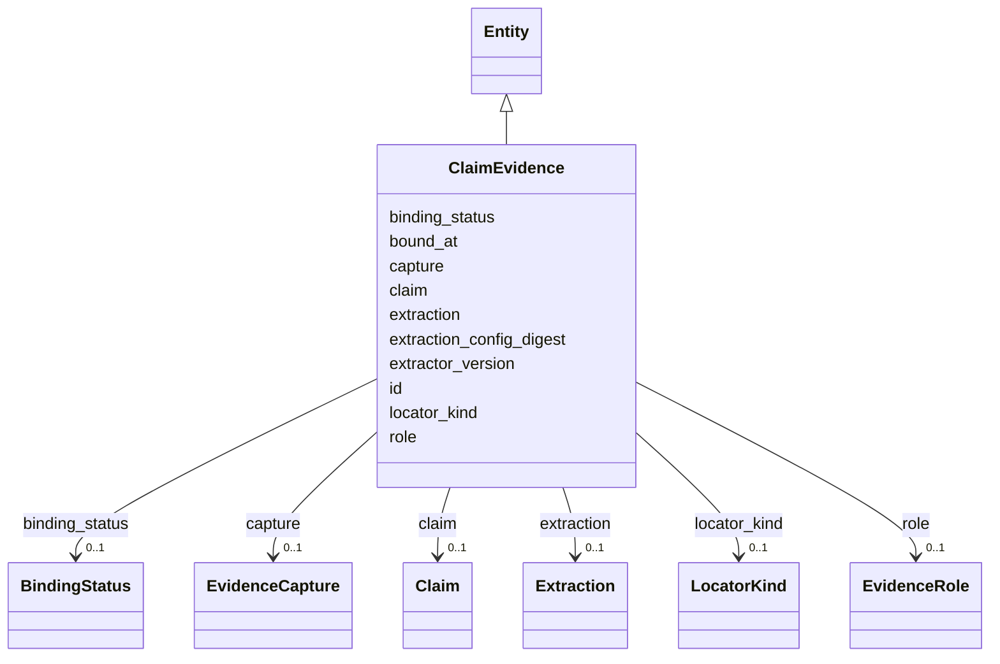

---
search:
  boost: 10.0
---

# Class: ClaimEvidence 


_One claim↔capture evidence link (§16.5) — P32.2 binds the ACTUAL captured artifact the extraction consumed, with its typed locator and binding classification (SIG-TRUST-002)._


<div data-search-exclude markdown="1">


URI: [sig:class/ClaimEvidence](https://ontology.sig-project.org/schema/class/ClaimEvidence)





## Inheritance
* [Entity](../classes/Entity.md)
    * **ClaimEvidence**


## Slots

| Name | Cardinality and Range | Description | Inheritance |
| ---  | --- | --- | --- |
| [claim](../slots/claim.md) | 0..1 <br/> [Claim](../classes/Claim.md) |  | direct |
| [capture](../slots/capture.md) | 0..1 <br/> [EvidenceCapture](../classes/EvidenceCapture.md) |  | direct |
| [extraction](../slots/extraction.md) | 0..1 <br/> [Extraction](../classes/Extraction.md) |  | direct |
| [role](../slots/role.md) | 0..1 <br/> [EvidenceRole](../enums/EvidenceRole.md) |  | direct |
| [locator_kind](../slots/locator_kind.md) | 0..1 <br/> [LocatorKind](../enums/LocatorKind.md) | The kind of the typed locator row (locator fields live in the physical jsonb ... | direct |
| [extraction_config_digest](../slots/extraction_config_digest.md) | 0..1 <br/> [String](../types/String.md) |  | direct |
| [extractor_version](../slots/extractor_version.md) | 0..1 <br/> [String](../types/String.md) |  | direct |
| [binding_status](../slots/binding_status.md) | 0..1 <br/> [BindingStatus](../enums/BindingStatus.md) |  | direct |
| [bound_at](../slots/bound_at.md) | 0..1 <br/> [Datetime](../types/Datetime.md) | When the binding was asserted — distinct from the capture's retrieval time | direct |
| [id](../slots/id.md) | 1 <br/> [Uriorcurie](../types/Uriorcurie.md) | The entity's stable minted identity (L2 identity only, §8 | [Entity](../classes/Entity.md) |


## Identifier and Mapping Information


### Schema Source


* from schema: https://ontology.sig-project.org/schema/sig


## Mappings

| Mapping Type | Mapped Value |
| ---  | ---  |
| self | sig:ClaimEvidence |
| native | sig:ClaimEvidence |


## LinkML Source

<!-- TODO: investigate https://stackoverflow.com/questions/37606292/how-to-create-tabbed-code-blocks-in-mkdocs-or-sphinx -->

### Direct

<details>
```yaml
name: ClaimEvidence
description: One claim↔capture evidence link (§16.5) — P32.2 binds the ACTUAL captured
  artifact the extraction consumed, with its typed locator and binding classification
  (SIG-TRUST-002).
from_schema: https://ontology.sig-project.org/schema/sig
rank: 1000
is_a: Entity
attributes:
  claim:
    name: claim
    from_schema: https://ontology.sig-project.org/schema/entities
    rank: 1000
    domain_of:
    - ClaimEvidence
    - ClaimQualifier
    range: Claim
  capture:
    name: capture
    from_schema: https://ontology.sig-project.org/schema/entities
    rank: 1000
    domain_of:
    - ClaimEvidence
    range: EvidenceCapture
  extraction:
    name: extraction
    from_schema: https://ontology.sig-project.org/schema/entities
    rank: 1000
    domain_of:
    - ClaimEvidence
    - ClaimQualifier
    range: Extraction
  role:
    name: role
    from_schema: https://ontology.sig-project.org/schema/entities
    rank: 1000
    domain_of:
    - ClaimEvidence
    - RoleAssignment
    range: EvidenceRole
  locator_kind:
    name: locator_kind
    description: The kind of the typed locator row (locator fields live in the physical
      jsonb row).
    from_schema: https://ontology.sig-project.org/schema/entities
    rank: 1000
    domain_of:
    - ClaimEvidence
    range: LocatorKind
  extraction_config_digest:
    name: extraction_config_digest
    from_schema: https://ontology.sig-project.org/schema/entities
    domain_of:
    - Extraction
    - ClaimEvidence
    range: string
  extractor_version:
    name: extractor_version
    from_schema: https://ontology.sig-project.org/schema/entities
    domain_of:
    - Extraction
    - ClaimEvidence
    range: string
  binding_status:
    name: binding_status
    from_schema: https://ontology.sig-project.org/schema/entities
    rank: 1000
    domain_of:
    - ClaimEvidence
    range: BindingStatus
  bound_at:
    name: bound_at
    description: When the binding was asserted — distinct from the capture's retrieval
      time.
    from_schema: https://ontology.sig-project.org/schema/entities
    rank: 1000
    domain_of:
    - ClaimEvidence
    range: datetime

```
</details>

### Induced

<details>
```yaml
name: ClaimEvidence
description: One claim↔capture evidence link (§16.5) — P32.2 binds the ACTUAL captured
  artifact the extraction consumed, with its typed locator and binding classification
  (SIG-TRUST-002).
from_schema: https://ontology.sig-project.org/schema/sig
rank: 1000
is_a: Entity
attributes:
  claim:
    name: claim
    from_schema: https://ontology.sig-project.org/schema/entities
    rank: 1000
    owner: ClaimEvidence
    domain_of:
    - ClaimEvidence
    - ClaimQualifier
    range: Claim
  capture:
    name: capture
    from_schema: https://ontology.sig-project.org/schema/entities
    rank: 1000
    owner: ClaimEvidence
    domain_of:
    - ClaimEvidence
    range: EvidenceCapture
  extraction:
    name: extraction
    from_schema: https://ontology.sig-project.org/schema/entities
    rank: 1000
    owner: ClaimEvidence
    domain_of:
    - ClaimEvidence
    - ClaimQualifier
    range: Extraction
  role:
    name: role
    from_schema: https://ontology.sig-project.org/schema/entities
    rank: 1000
    owner: ClaimEvidence
    domain_of:
    - ClaimEvidence
    - RoleAssignment
    range: EvidenceRole
  locator_kind:
    name: locator_kind
    description: The kind of the typed locator row (locator fields live in the physical
      jsonb row).
    from_schema: https://ontology.sig-project.org/schema/entities
    rank: 1000
    owner: ClaimEvidence
    domain_of:
    - ClaimEvidence
    range: LocatorKind
  extraction_config_digest:
    name: extraction_config_digest
    from_schema: https://ontology.sig-project.org/schema/entities
    owner: ClaimEvidence
    domain_of:
    - Extraction
    - ClaimEvidence
    range: string
  extractor_version:
    name: extractor_version
    from_schema: https://ontology.sig-project.org/schema/entities
    owner: ClaimEvidence
    domain_of:
    - Extraction
    - ClaimEvidence
    range: string
  binding_status:
    name: binding_status
    from_schema: https://ontology.sig-project.org/schema/entities
    rank: 1000
    owner: ClaimEvidence
    domain_of:
    - ClaimEvidence
    range: BindingStatus
  bound_at:
    name: bound_at
    description: When the binding was asserted — distinct from the capture's retrieval
      time.
    from_schema: https://ontology.sig-project.org/schema/entities
    rank: 1000
    owner: ClaimEvidence
    domain_of:
    - ClaimEvidence
    range: datetime
  id:
    name: id
    description: The entity's stable minted identity (L2 identity only, §8.2).
    from_schema: https://ontology.sig-project.org/schema/sig
    rank: 1000
    identifier: true
    owner: ClaimEvidence
    domain_of:
    - Entity
    - Edge
    range: uriorcurie
    required: true

```
</details></div>