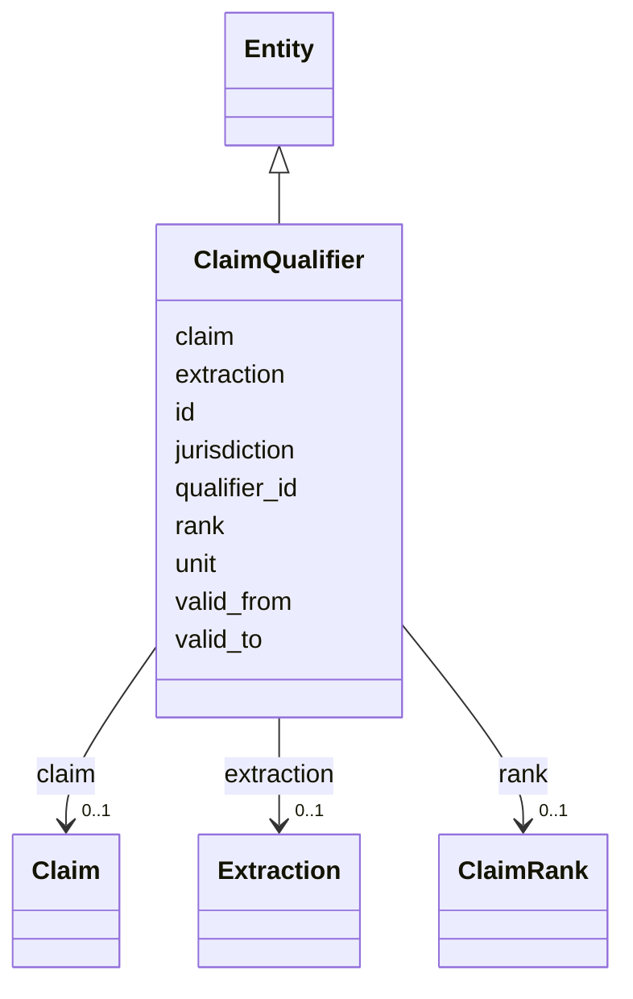

---
search:
  boost: 10.0
---

# Class: ClaimQualifier 


_One typed qualifier statement on a claim (§16.5): the six FIELD_MAP §3 categories — instrument lifecycle, execution evidence, money/currency/ period, actor roles, capability/modality, clause applicability._


<div data-search-exclude markdown="1">


URI: [sig:class/ClaimQualifier](https://ontology.sig-project.org/schema/class/ClaimQualifier)





## Inheritance
* [Entity](../classes/Entity.md)
    * **ClaimQualifier**


## Slots

| Name | Cardinality and Range | Description | Inheritance |
| ---  | --- | --- | --- |
| [claim](../slots/claim.md) | 0..1 <br/> [Claim](../classes/Claim.md) |  | direct |
| [qualifier_id](../slots/qualifier_id.md) | 0..1 <br/> [PredicateCode](../types/PredicateCode.md) | A registered predicate id — unregistered keys quarantine, never guessed | direct |
| [unit](../slots/unit.md) | 0..1 <br/> [String](../types/String.md) |  | direct |
| [valid_from](../slots/valid_from.md) | 0..1 <br/> [Edtf](../types/Edtf.md) | The qualifier's own applicability valid time (e | direct |
| [valid_to](../slots/valid_to.md) | 0..1 <br/> [Edtf](../types/Edtf.md) |  | direct |
| [jurisdiction](../slots/jurisdiction.md) | 0..1 <br/> [String](../types/String.md) | The applicability jurisdiction the qualifier scopes to | direct |
| [rank](../slots/rank.md) | 0..1 <br/> [ClaimRank](../enums/ClaimRank.md) |  | direct |
| [extraction](../slots/extraction.md) | 0..1 <br/> [Extraction](../classes/Extraction.md) |  | direct |
| [id](../slots/id.md) | 1 <br/> [Uriorcurie](../types/Uriorcurie.md) | The entity's stable minted identity (L2 identity only, §8 | [Entity](../classes/Entity.md) |


## Identifier and Mapping Information


### Schema Source


* from schema: https://ontology.sig-project.org/schema/sig


## Mappings

| Mapping Type | Mapped Value |
| ---  | ---  |
| self | sig:ClaimQualifier |
| native | sig:ClaimQualifier |


## LinkML Source

<!-- TODO: investigate https://stackoverflow.com/questions/37606292/how-to-create-tabbed-code-blocks-in-mkdocs-or-sphinx -->

### Direct

<details>
```yaml
name: ClaimQualifier
description: 'One typed qualifier statement on a claim (§16.5): the six FIELD_MAP
  §3 categories — instrument lifecycle, execution evidence, money/currency/ period,
  actor roles, capability/modality, clause applicability.'
from_schema: https://ontology.sig-project.org/schema/sig
rank: 1000
is_a: Entity
attributes:
  claim:
    name: claim
    from_schema: https://ontology.sig-project.org/schema/entities
    domain_of:
    - ClaimEvidence
    - ClaimQualifier
    range: Claim
  qualifier_id:
    name: qualifier_id
    description: A registered predicate id — unregistered keys quarantine, never guessed.
    from_schema: https://ontology.sig-project.org/schema/entities
    rank: 1000
    domain_of:
    - ClaimQualifier
    range: predicate_code
  unit:
    name: unit
    from_schema: https://ontology.sig-project.org/schema/entities
    domain_of:
    - Claim
    - ClaimQualifier
    range: string
  valid_from:
    name: valid_from
    description: The qualifier's own applicability valid time (e.g. an instrument's
      effective period).
    from_schema: https://ontology.sig-project.org/schema/entities
    domain_of:
    - Jurisdiction
    - Organization
    - ClaimQualifier
    - Edge
    range: edtf
  valid_to:
    name: valid_to
    from_schema: https://ontology.sig-project.org/schema/entities
    domain_of:
    - Jurisdiction
    - Organization
    - ClaimQualifier
    - Edge
    range: edtf
  jurisdiction:
    name: jurisdiction
    description: The applicability jurisdiction the qualifier scopes to.
    from_schema: https://ontology.sig-project.org/schema/entities
    domain_of:
    - Organization
    - Deployment
    - LegalInstrument
    - ClaimQualifier
    range: string
  rank:
    name: rank
    from_schema: https://ontology.sig-project.org/schema/entities
    domain_of:
    - Claim
    - ClaimQualifier
    range: ClaimRank
  extraction:
    name: extraction
    from_schema: https://ontology.sig-project.org/schema/entities
    domain_of:
    - ClaimEvidence
    - ClaimQualifier
    range: Extraction

```
</details>

### Induced

<details>
```yaml
name: ClaimQualifier
description: 'One typed qualifier statement on a claim (§16.5): the six FIELD_MAP
  §3 categories — instrument lifecycle, execution evidence, money/currency/ period,
  actor roles, capability/modality, clause applicability.'
from_schema: https://ontology.sig-project.org/schema/sig
rank: 1000
is_a: Entity
attributes:
  claim:
    name: claim
    from_schema: https://ontology.sig-project.org/schema/entities
    owner: ClaimQualifier
    domain_of:
    - ClaimEvidence
    - ClaimQualifier
    range: Claim
  qualifier_id:
    name: qualifier_id
    description: A registered predicate id — unregistered keys quarantine, never guessed.
    from_schema: https://ontology.sig-project.org/schema/entities
    rank: 1000
    owner: ClaimQualifier
    domain_of:
    - ClaimQualifier
    range: predicate_code
  unit:
    name: unit
    from_schema: https://ontology.sig-project.org/schema/entities
    owner: ClaimQualifier
    domain_of:
    - Claim
    - ClaimQualifier
    range: string
  valid_from:
    name: valid_from
    description: The qualifier's own applicability valid time (e.g. an instrument's
      effective period).
    from_schema: https://ontology.sig-project.org/schema/entities
    owner: ClaimQualifier
    domain_of:
    - Jurisdiction
    - Organization
    - ClaimQualifier
    - Edge
    range: edtf
  valid_to:
    name: valid_to
    from_schema: https://ontology.sig-project.org/schema/entities
    owner: ClaimQualifier
    domain_of:
    - Jurisdiction
    - Organization
    - ClaimQualifier
    - Edge
    range: edtf
  jurisdiction:
    name: jurisdiction
    description: The applicability jurisdiction the qualifier scopes to.
    from_schema: https://ontology.sig-project.org/schema/entities
    owner: ClaimQualifier
    domain_of:
    - Organization
    - Deployment
    - LegalInstrument
    - ClaimQualifier
    range: string
  rank:
    name: rank
    from_schema: https://ontology.sig-project.org/schema/entities
    owner: ClaimQualifier
    domain_of:
    - Claim
    - ClaimQualifier
    range: ClaimRank
  extraction:
    name: extraction
    from_schema: https://ontology.sig-project.org/schema/entities
    owner: ClaimQualifier
    domain_of:
    - ClaimEvidence
    - ClaimQualifier
    range: Extraction
  id:
    name: id
    description: The entity's stable minted identity (L2 identity only, §8.2).
    from_schema: https://ontology.sig-project.org/schema/sig
    rank: 1000
    identifier: true
    owner: ClaimQualifier
    domain_of:
    - Entity
    - Edge
    range: uriorcurie
    required: true

```
</details></div>