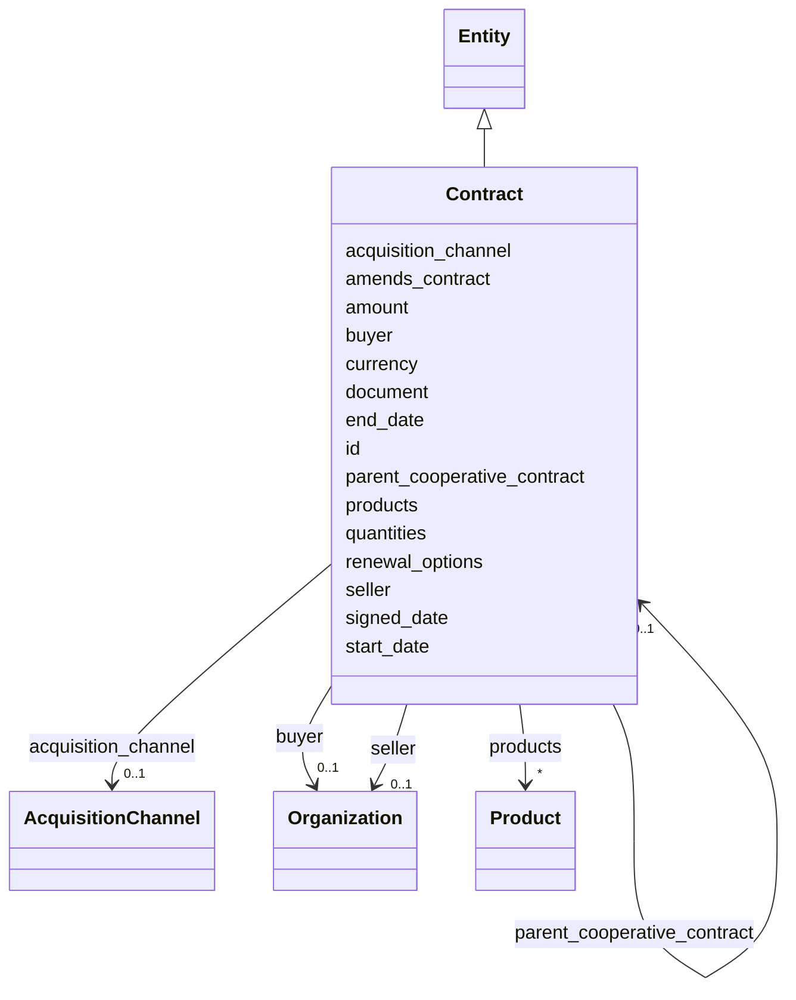

---
search:
  boost: 10.0
---

# Class: Contract 


_A contract; acquisition_channel and parent_cooperative_contract are REQUIRED model elements (§11.11, SIG-ONTO-032)._


<div data-search-exclude markdown="1">


URI: [sig:class/Contract](https://ontology.sig-project.org/schema/class/Contract)





## Inheritance
* [Entity](../classes/Entity.md)
    * **Contract**


## Slots

| Name | Cardinality and Range | Description | Inheritance |
| ---  | --- | --- | --- |
| [buyer](../slots/buyer.md) | 0..1 <br/> [Organization](../classes/Organization.md) |  | direct |
| [seller](../slots/seller.md) | 0..1 <br/> [Organization](../classes/Organization.md) |  | direct |
| [amount](../slots/amount.md) | 0..1 <br/> [Money](../types/Money.md) |  | direct |
| [currency](../slots/currency.md) | 0..1 <br/> [String](../types/String.md) |  | direct |
| [signed_date](../slots/signed_date.md) | 0..1 <br/> [Edtf](../types/Edtf.md) |  | direct |
| [start_date](../slots/start_date.md) | 0..1 <br/> [Edtf](../types/Edtf.md) |  | direct |
| [end_date](../slots/end_date.md) | 0..1 <br/> [Edtf](../types/Edtf.md) |  | direct |
| [renewal_options](../slots/renewal_options.md) | 0..1 <br/> [String](../types/String.md) |  | direct |
| [products](../slots/products.md) | * <br/> [Product](../classes/Product.md) |  | direct |
| [quantities](../slots/quantities.md) | * <br/> [Integer](../types/Integer.md) |  | direct |
| [document](../slots/document.md) | 0..1 <br/> [Uriorcurie](../types/Uriorcurie.md) |  | direct |
| [acquisition_channel](../slots/acquisition_channel.md) | 0..1 <br/> [AcquisitionChannel](../enums/AcquisitionChannel.md) |  | direct |
| [parent_cooperative_contract](../slots/parent_cooperative_contract.md) | 0..1 <br/> [Contract](../classes/Contract.md) | The master award being ridden (SIG-ONTO-032) | direct |
| [amends_contract](../slots/amends_contract.md) | 0..1 <br/> [Contract](../classes/Contract.md) |  | direct |
| [id](../slots/id.md) | 1 <br/> [Uriorcurie](../types/Uriorcurie.md) | The entity's stable minted identity (L2 identity only, §8 | [Entity](../classes/Entity.md) |


## Usages

| used by | used in | type | used |
| ---  | --- | --- | --- |
| [Contract](../classes/Contract.md) | [parent_cooperative_contract](../slots/parent_cooperative_contract.md) | range | [Contract](../classes/Contract.md) |
| [Contract](../classes/Contract.md) | [amends_contract](../slots/amends_contract.md) | range | [Contract](../classes/Contract.md) |


## Identifier and Mapping Information


### Schema Source


* from schema: https://ontology.sig-project.org/schema/sig


## Mappings

| Mapping Type | Mapped Value |
| ---  | ---  |
| self | sig:Contract |
| native | sig:Contract |


## LinkML Source

<!-- TODO: investigate https://stackoverflow.com/questions/37606292/how-to-create-tabbed-code-blocks-in-mkdocs-or-sphinx -->

### Direct

<details>
```yaml
name: Contract
description: A contract; acquisition_channel and parent_cooperative_contract are REQUIRED
  model elements (§11.11, SIG-ONTO-032).
from_schema: https://ontology.sig-project.org/schema/sig
rank: 1000
is_a: Entity
attributes:
  buyer:
    name: buyer
    from_schema: https://ontology.sig-project.org/schema/entities
    rank: 1000
    domain_of:
    - Contract
    range: Organization
  seller:
    name: seller
    from_schema: https://ontology.sig-project.org/schema/entities
    rank: 1000
    domain_of:
    - Contract
    range: Organization
  amount:
    name: amount
    from_schema: https://ontology.sig-project.org/schema/entities
    rank: 1000
    domain_of:
    - Contract
    - FundingInstrument
    range: money
  currency:
    name: currency
    from_schema: https://ontology.sig-project.org/schema/entities
    rank: 1000
    domain_of:
    - Contract
    range: string
  signed_date:
    name: signed_date
    from_schema: https://ontology.sig-project.org/schema/entities
    rank: 1000
    domain_of:
    - Contract
    range: edtf
  start_date:
    name: start_date
    from_schema: https://ontology.sig-project.org/schema/entities
    rank: 1000
    domain_of:
    - Contract
    range: edtf
  end_date:
    name: end_date
    from_schema: https://ontology.sig-project.org/schema/entities
    rank: 1000
    domain_of:
    - Contract
    range: edtf
  renewal_options:
    name: renewal_options
    from_schema: https://ontology.sig-project.org/schema/entities
    rank: 1000
    domain_of:
    - Contract
    range: string
  products:
    name: products
    from_schema: https://ontology.sig-project.org/schema/entities
    rank: 1000
    domain_of:
    - Contract
    range: Product
    multivalued: true
  quantities:
    name: quantities
    from_schema: https://ontology.sig-project.org/schema/entities
    rank: 1000
    domain_of:
    - Contract
    range: integer
    multivalued: true
  document:
    name: document
    from_schema: https://ontology.sig-project.org/schema/entities
    rank: 1000
    domain_of:
    - Contract
    - Policy
    range: uriorcurie
  acquisition_channel:
    name: acquisition_channel
    from_schema: https://ontology.sig-project.org/schema/entities
    rank: 1000
    domain_of:
    - Contract
    range: AcquisitionChannel
  parent_cooperative_contract:
    name: parent_cooperative_contract
    description: The master award being ridden (SIG-ONTO-032).
    from_schema: https://ontology.sig-project.org/schema/entities
    rank: 1000
    domain_of:
    - Contract
    range: Contract
  amends_contract:
    name: amends_contract
    from_schema: https://ontology.sig-project.org/schema/entities
    rank: 1000
    domain_of:
    - Contract
    range: Contract

```
</details>

### Induced

<details>
```yaml
name: Contract
description: A contract; acquisition_channel and parent_cooperative_contract are REQUIRED
  model elements (§11.11, SIG-ONTO-032).
from_schema: https://ontology.sig-project.org/schema/sig
rank: 1000
is_a: Entity
attributes:
  buyer:
    name: buyer
    from_schema: https://ontology.sig-project.org/schema/entities
    rank: 1000
    owner: Contract
    domain_of:
    - Contract
    range: Organization
  seller:
    name: seller
    from_schema: https://ontology.sig-project.org/schema/entities
    rank: 1000
    owner: Contract
    domain_of:
    - Contract
    range: Organization
  amount:
    name: amount
    from_schema: https://ontology.sig-project.org/schema/entities
    rank: 1000
    owner: Contract
    domain_of:
    - Contract
    - FundingInstrument
    range: money
  currency:
    name: currency
    from_schema: https://ontology.sig-project.org/schema/entities
    rank: 1000
    owner: Contract
    domain_of:
    - Contract
    range: string
  signed_date:
    name: signed_date
    from_schema: https://ontology.sig-project.org/schema/entities
    rank: 1000
    owner: Contract
    domain_of:
    - Contract
    range: edtf
  start_date:
    name: start_date
    from_schema: https://ontology.sig-project.org/schema/entities
    rank: 1000
    owner: Contract
    domain_of:
    - Contract
    range: edtf
  end_date:
    name: end_date
    from_schema: https://ontology.sig-project.org/schema/entities
    rank: 1000
    owner: Contract
    domain_of:
    - Contract
    range: edtf
  renewal_options:
    name: renewal_options
    from_schema: https://ontology.sig-project.org/schema/entities
    rank: 1000
    owner: Contract
    domain_of:
    - Contract
    range: string
  products:
    name: products
    from_schema: https://ontology.sig-project.org/schema/entities
    rank: 1000
    owner: Contract
    domain_of:
    - Contract
    range: Product
    multivalued: true
  quantities:
    name: quantities
    from_schema: https://ontology.sig-project.org/schema/entities
    rank: 1000
    owner: Contract
    domain_of:
    - Contract
    range: integer
    multivalued: true
  document:
    name: document
    from_schema: https://ontology.sig-project.org/schema/entities
    rank: 1000
    owner: Contract
    domain_of:
    - Contract
    - Policy
    range: uriorcurie
  acquisition_channel:
    name: acquisition_channel
    from_schema: https://ontology.sig-project.org/schema/entities
    rank: 1000
    owner: Contract
    domain_of:
    - Contract
    range: AcquisitionChannel
  parent_cooperative_contract:
    name: parent_cooperative_contract
    description: The master award being ridden (SIG-ONTO-032).
    from_schema: https://ontology.sig-project.org/schema/entities
    rank: 1000
    owner: Contract
    domain_of:
    - Contract
    range: Contract
  amends_contract:
    name: amends_contract
    from_schema: https://ontology.sig-project.org/schema/entities
    rank: 1000
    owner: Contract
    domain_of:
    - Contract
    range: Contract
  id:
    name: id
    description: The entity's stable minted identity (L2 identity only, §8.2).
    from_schema: https://ontology.sig-project.org/schema/sig
    rank: 1000
    identifier: true
    owner: Contract
    domain_of:
    - Entity
    - Edge
    range: uriorcurie
    required: true

```
</details></div>