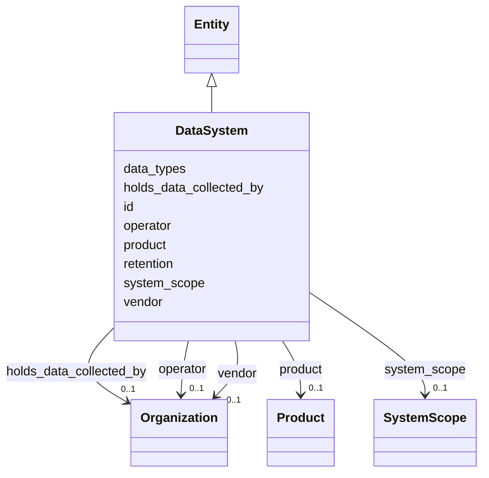

---
search:
  boost: 10.0
---

# Class: DataSystem 


_Reference databases as infrastructure — representable even where SIG holds no sensor (§11.10, SIG-ONTO-031)._


<div data-search-exclude markdown="1">


URI: [sig:class/DataSystem](https://ontology.sig-project.org/schema/class/DataSystem)





## Inheritance
* [Entity](../classes/Entity.md)
    * **DataSystem**


## Slots

| Name | Cardinality and Range | Description | Inheritance |
| ---  | --- | --- | --- |
| [operator](../slots/operator.md) | 0..1 <br/> [Organization](../classes/Organization.md) |  | direct |
| [vendor](../slots/vendor.md) | 0..1 <br/> [Organization](../classes/Organization.md) |  | direct |
| [product](../slots/product.md) | 0..1 <br/> [Product](../classes/Product.md) |  | direct |
| [data_types](../slots/data_types.md) | * <br/> [String](../types/String.md) |  | direct |
| [retention](../slots/retention.md) | 0..1 <br/> [DurationIso](../types/DurationIso.md) | A ConfigurationState fact where it varies per deployment | direct |
| [system_scope](../slots/system_scope.md) | 0..1 <br/> [SystemScope](../enums/SystemScope.md) |  | direct |
| [holds_data_collected_by](../slots/holds_data_collected_by.md) | 0..1 <br/> [Organization](../classes/Organization.md) | Custody != collection | direct |
| [id](../slots/id.md) | 1 <br/> [Uriorcurie](../types/Uriorcurie.md) | The entity's stable minted identity (L2 identity only, §8 | [Entity](../classes/Entity.md) |


## Identifier and Mapping Information


### Schema Source


* from schema: https://ontology.sig-project.org/schema/sig


## Mappings

| Mapping Type | Mapped Value |
| ---  | ---  |
| self | sig:DataSystem |
| native | sig:DataSystem |


## LinkML Source

<!-- TODO: investigate https://stackoverflow.com/questions/37606292/how-to-create-tabbed-code-blocks-in-mkdocs-or-sphinx -->

### Direct

<details>
```yaml
name: DataSystem
description: Reference databases as infrastructure — representable even where SIG
  holds no sensor (§11.10, SIG-ONTO-031).
from_schema: https://ontology.sig-project.org/schema/sig
rank: 1000
is_a: Entity
attributes:
  operator:
    name: operator
    from_schema: https://ontology.sig-project.org/schema/entities
    rank: 1000
    domain_of:
    - DataSystem
    range: Organization
  vendor:
    name: vendor
    from_schema: https://ontology.sig-project.org/schema/entities
    domain_of:
    - Product
    - Deployment
    - DataSystem
    range: Organization
  product:
    name: product
    from_schema: https://ontology.sig-project.org/schema/entities
    domain_of:
    - Deployment
    - DataSystem
    range: Product
  data_types:
    name: data_types
    from_schema: https://ontology.sig-project.org/schema/entities
    rank: 1000
    domain_of:
    - DataSystem
    range: string
    multivalued: true
  retention:
    name: retention
    description: A ConfigurationState fact where it varies per deployment.
    from_schema: https://ontology.sig-project.org/schema/entities
    rank: 1000
    domain_of:
    - DataSystem
    range: duration_iso
  system_scope:
    name: system_scope
    from_schema: https://ontology.sig-project.org/schema/entities
    rank: 1000
    domain_of:
    - DataSystem
    range: SystemScope
  holds_data_collected_by:
    name: holds_data_collected_by
    description: Custody != collection.
    from_schema: https://ontology.sig-project.org/schema/entities
    rank: 1000
    domain_of:
    - DataSystem
    range: Organization

```
</details>

### Induced

<details>
```yaml
name: DataSystem
description: Reference databases as infrastructure — representable even where SIG
  holds no sensor (§11.10, SIG-ONTO-031).
from_schema: https://ontology.sig-project.org/schema/sig
rank: 1000
is_a: Entity
attributes:
  operator:
    name: operator
    from_schema: https://ontology.sig-project.org/schema/entities
    rank: 1000
    owner: DataSystem
    domain_of:
    - DataSystem
    range: Organization
  vendor:
    name: vendor
    from_schema: https://ontology.sig-project.org/schema/entities
    owner: DataSystem
    domain_of:
    - Product
    - Deployment
    - DataSystem
    range: Organization
  product:
    name: product
    from_schema: https://ontology.sig-project.org/schema/entities
    owner: DataSystem
    domain_of:
    - Deployment
    - DataSystem
    range: Product
  data_types:
    name: data_types
    from_schema: https://ontology.sig-project.org/schema/entities
    rank: 1000
    owner: DataSystem
    domain_of:
    - DataSystem
    range: string
    multivalued: true
  retention:
    name: retention
    description: A ConfigurationState fact where it varies per deployment.
    from_schema: https://ontology.sig-project.org/schema/entities
    rank: 1000
    owner: DataSystem
    domain_of:
    - DataSystem
    range: duration_iso
  system_scope:
    name: system_scope
    from_schema: https://ontology.sig-project.org/schema/entities
    rank: 1000
    owner: DataSystem
    domain_of:
    - DataSystem
    range: SystemScope
  holds_data_collected_by:
    name: holds_data_collected_by
    description: Custody != collection.
    from_schema: https://ontology.sig-project.org/schema/entities
    rank: 1000
    owner: DataSystem
    domain_of:
    - DataSystem
    range: Organization
  id:
    name: id
    description: The entity's stable minted identity (L2 identity only, §8.2).
    from_schema: https://ontology.sig-project.org/schema/sig
    rank: 1000
    identifier: true
    owner: DataSystem
    domain_of:
    - Entity
    - Edge
    range: uriorcurie
    required: true

```
</details></div>