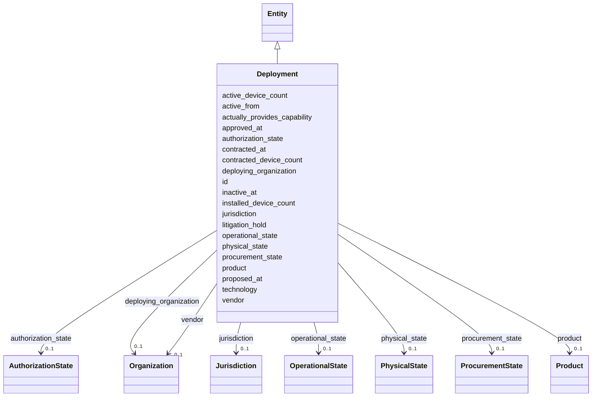

---
search:
  boost: 10.0
---

# Class: Deployment 


_The bridge between organizational adoption and individual devices; creatable with NO product, NO vendor, and NO physical asset (§11.7, SIG-ONTO-026)._


<div data-search-exclude markdown="1">


URI: [sig:class/Deployment](https://ontology.sig-project.org/schema/class/Deployment)





## Inheritance
* [Entity](../classes/Entity.md)
    * **Deployment**


## Slots

| Name | Cardinality and Range | Description | Inheritance |
| ---  | --- | --- | --- |
| [deploying_organization](../slots/deploying_organization.md) | 0..1 <br/> [Organization](../classes/Organization.md) |  | direct |
| [product](../slots/product.md) | 0..1 <br/> [Product](../classes/Product.md) |  | direct |
| [vendor](../slots/vendor.md) | 0..1 <br/> [Organization](../classes/Organization.md) |  | direct |
| [technology](../slots/technology.md) | * <br/> [TechnologyCode](../types/TechnologyCode.md) | Repeatable; the coarsest level the evidence supports | direct |
| [actually_provides_capability](../slots/actually_provides_capability.md) | * <br/> [CapabilityCode](../types/CapabilityCode.md) | Evidentiary; never silently inferred from product default (SIG-ONTO-018) | direct |
| [procurement_state](../slots/procurement_state.md) | 0..1 <br/> [ProcurementState](../enums/ProcurementState.md) |  | direct |
| [physical_state](../slots/physical_state.md) | 0..1 <br/> [PhysicalState](../enums/PhysicalState.md) |  | direct |
| [operational_state](../slots/operational_state.md) | 0..1 <br/> [OperationalState](../enums/OperationalState.md) |  | direct |
| [authorization_state](../slots/authorization_state.md) | 0..1 <br/> [AuthorizationState](../enums/AuthorizationState.md) |  | direct |
| [litigation_hold](../slots/litigation_hold.md) | 0..1 <br/> [Boolean](../types/Boolean.md) | A flag, coexisting with any state combination (SIG-ONTO-061) | direct |
| [jurisdiction](../slots/jurisdiction.md) | 0..1 <br/> [Jurisdiction](../classes/Jurisdiction.md) |  | direct |
| [contracted_device_count](../slots/contracted_device_count.md) | 0..1 <br/> [Integer](../types/Integer.md) |  | direct |
| [installed_device_count](../slots/installed_device_count.md) | 0..1 <br/> [Integer](../types/Integer.md) |  | direct |
| [active_device_count](../slots/active_device_count.md) | 0..1 <br/> [Integer](../types/Integer.md) |  | direct |
| [proposed_at](../slots/proposed_at.md) | 0..1 <br/> [Edtf](../types/Edtf.md) |  | direct |
| [approved_at](../slots/approved_at.md) | 0..1 <br/> [Edtf](../types/Edtf.md) |  | direct |
| [contracted_at](../slots/contracted_at.md) | 0..1 <br/> [Edtf](../types/Edtf.md) |  | direct |
| [active_from](../slots/active_from.md) | 0..1 <br/> [Edtf](../types/Edtf.md) |  | direct |
| [inactive_at](../slots/inactive_at.md) | 0..1 <br/> [Edtf](../types/Edtf.md) |  | direct |
| [id](../slots/id.md) | 1 <br/> [Uriorcurie](../types/Uriorcurie.md) | The entity's stable minted identity (L2 identity only, §8 | [Entity](../classes/Entity.md) |


## Usages

| used by | used in | type | used |
| ---  | --- | --- | --- |
| [PhysicalAsset](../classes/PhysicalAsset.md) | [deployment](../slots/deployment.md) | range | [Deployment](../classes/Deployment.md) |
| [ConfigurationState](../classes/ConfigurationState.md) | [deployment](../slots/deployment.md) | range | [Deployment](../classes/Deployment.md) |
| [AccountabilityEvent](../classes/AccountabilityEvent.md) | [deployments](../slots/deployments.md) | range | [Deployment](../classes/Deployment.md) |


## Identifier and Mapping Information


### Schema Source


* from schema: https://ontology.sig-project.org/schema/sig


## Mappings

| Mapping Type | Mapped Value |
| ---  | ---  |
| self | sig:Deployment |
| native | sig:Deployment |


## LinkML Source

<!-- TODO: investigate https://stackoverflow.com/questions/37606292/how-to-create-tabbed-code-blocks-in-mkdocs-or-sphinx -->

### Direct

<details>
```yaml
name: Deployment
description: The bridge between organizational adoption and individual devices; creatable
  with NO product, NO vendor, and NO physical asset (§11.7, SIG-ONTO-026).
from_schema: https://ontology.sig-project.org/schema/sig
rank: 1000
is_a: Entity
attributes:
  deploying_organization:
    name: deploying_organization
    from_schema: https://ontology.sig-project.org/schema/entities
    rank: 1000
    domain_of:
    - Deployment
    range: Organization
  product:
    name: product
    from_schema: https://ontology.sig-project.org/schema/entities
    rank: 1000
    domain_of:
    - Deployment
    - DataSystem
    range: Product
  vendor:
    name: vendor
    from_schema: https://ontology.sig-project.org/schema/entities
    domain_of:
    - Product
    - Deployment
    - DataSystem
    range: Organization
  technology:
    name: technology
    description: Repeatable; the coarsest level the evidence supports.
    from_schema: https://ontology.sig-project.org/schema/entities
    domain_of:
    - Technology
    - Deployment
    range: technology_code
    multivalued: true
  actually_provides_capability:
    name: actually_provides_capability
    description: Evidentiary; never silently inferred from product default (SIG-ONTO-018).
    from_schema: https://ontology.sig-project.org/schema/entities
    rank: 1000
    domain_of:
    - Deployment
    range: capability_code
    multivalued: true
  procurement_state:
    name: procurement_state
    from_schema: https://ontology.sig-project.org/schema/entities
    rank: 1000
    domain_of:
    - Deployment
    range: ProcurementState
  physical_state:
    name: physical_state
    from_schema: https://ontology.sig-project.org/schema/entities
    rank: 1000
    domain_of:
    - Deployment
    range: PhysicalState
  operational_state:
    name: operational_state
    from_schema: https://ontology.sig-project.org/schema/entities
    rank: 1000
    domain_of:
    - Deployment
    range: OperationalState
  authorization_state:
    name: authorization_state
    from_schema: https://ontology.sig-project.org/schema/entities
    rank: 1000
    domain_of:
    - Deployment
    range: AuthorizationState
  litigation_hold:
    name: litigation_hold
    description: A flag, coexisting with any state combination (SIG-ONTO-061).
    from_schema: https://ontology.sig-project.org/schema/entities
    rank: 1000
    domain_of:
    - Deployment
    range: boolean
  jurisdiction:
    name: jurisdiction
    from_schema: https://ontology.sig-project.org/schema/entities
    domain_of:
    - Organization
    - Deployment
    - LegalInstrument
    range: Jurisdiction
  contracted_device_count:
    name: contracted_device_count
    from_schema: https://ontology.sig-project.org/schema/entities
    rank: 1000
    domain_of:
    - Deployment
    range: integer
  installed_device_count:
    name: installed_device_count
    from_schema: https://ontology.sig-project.org/schema/entities
    rank: 1000
    domain_of:
    - Deployment
    range: integer
  active_device_count:
    name: active_device_count
    from_schema: https://ontology.sig-project.org/schema/entities
    rank: 1000
    domain_of:
    - Deployment
    range: integer
  proposed_at:
    name: proposed_at
    from_schema: https://ontology.sig-project.org/schema/entities
    rank: 1000
    domain_of:
    - Deployment
    range: edtf
  approved_at:
    name: approved_at
    from_schema: https://ontology.sig-project.org/schema/entities
    rank: 1000
    domain_of:
    - Deployment
    range: edtf
  contracted_at:
    name: contracted_at
    from_schema: https://ontology.sig-project.org/schema/entities
    rank: 1000
    domain_of:
    - Deployment
    range: edtf
  active_from:
    name: active_from
    from_schema: https://ontology.sig-project.org/schema/entities
    rank: 1000
    domain_of:
    - Deployment
    range: edtf
  inactive_at:
    name: inactive_at
    from_schema: https://ontology.sig-project.org/schema/entities
    rank: 1000
    domain_of:
    - Deployment
    range: edtf

```
</details>

### Induced

<details>
```yaml
name: Deployment
description: The bridge between organizational adoption and individual devices; creatable
  with NO product, NO vendor, and NO physical asset (§11.7, SIG-ONTO-026).
from_schema: https://ontology.sig-project.org/schema/sig
rank: 1000
is_a: Entity
attributes:
  deploying_organization:
    name: deploying_organization
    from_schema: https://ontology.sig-project.org/schema/entities
    rank: 1000
    owner: Deployment
    domain_of:
    - Deployment
    range: Organization
  product:
    name: product
    from_schema: https://ontology.sig-project.org/schema/entities
    rank: 1000
    owner: Deployment
    domain_of:
    - Deployment
    - DataSystem
    range: Product
  vendor:
    name: vendor
    from_schema: https://ontology.sig-project.org/schema/entities
    owner: Deployment
    domain_of:
    - Product
    - Deployment
    - DataSystem
    range: Organization
  technology:
    name: technology
    description: Repeatable; the coarsest level the evidence supports.
    from_schema: https://ontology.sig-project.org/schema/entities
    owner: Deployment
    domain_of:
    - Technology
    - Deployment
    range: technology_code
    multivalued: true
  actually_provides_capability:
    name: actually_provides_capability
    description: Evidentiary; never silently inferred from product default (SIG-ONTO-018).
    from_schema: https://ontology.sig-project.org/schema/entities
    rank: 1000
    owner: Deployment
    domain_of:
    - Deployment
    range: capability_code
    multivalued: true
  procurement_state:
    name: procurement_state
    from_schema: https://ontology.sig-project.org/schema/entities
    rank: 1000
    owner: Deployment
    domain_of:
    - Deployment
    range: ProcurementState
  physical_state:
    name: physical_state
    from_schema: https://ontology.sig-project.org/schema/entities
    rank: 1000
    owner: Deployment
    domain_of:
    - Deployment
    range: PhysicalState
  operational_state:
    name: operational_state
    from_schema: https://ontology.sig-project.org/schema/entities
    rank: 1000
    owner: Deployment
    domain_of:
    - Deployment
    range: OperationalState
  authorization_state:
    name: authorization_state
    from_schema: https://ontology.sig-project.org/schema/entities
    rank: 1000
    owner: Deployment
    domain_of:
    - Deployment
    range: AuthorizationState
  litigation_hold:
    name: litigation_hold
    description: A flag, coexisting with any state combination (SIG-ONTO-061).
    from_schema: https://ontology.sig-project.org/schema/entities
    rank: 1000
    owner: Deployment
    domain_of:
    - Deployment
    range: boolean
  jurisdiction:
    name: jurisdiction
    from_schema: https://ontology.sig-project.org/schema/entities
    owner: Deployment
    domain_of:
    - Organization
    - Deployment
    - LegalInstrument
    range: Jurisdiction
  contracted_device_count:
    name: contracted_device_count
    from_schema: https://ontology.sig-project.org/schema/entities
    rank: 1000
    owner: Deployment
    domain_of:
    - Deployment
    range: integer
  installed_device_count:
    name: installed_device_count
    from_schema: https://ontology.sig-project.org/schema/entities
    rank: 1000
    owner: Deployment
    domain_of:
    - Deployment
    range: integer
  active_device_count:
    name: active_device_count
    from_schema: https://ontology.sig-project.org/schema/entities
    rank: 1000
    owner: Deployment
    domain_of:
    - Deployment
    range: integer
  proposed_at:
    name: proposed_at
    from_schema: https://ontology.sig-project.org/schema/entities
    rank: 1000
    owner: Deployment
    domain_of:
    - Deployment
    range: edtf
  approved_at:
    name: approved_at
    from_schema: https://ontology.sig-project.org/schema/entities
    rank: 1000
    owner: Deployment
    domain_of:
    - Deployment
    range: edtf
  contracted_at:
    name: contracted_at
    from_schema: https://ontology.sig-project.org/schema/entities
    rank: 1000
    owner: Deployment
    domain_of:
    - Deployment
    range: edtf
  active_from:
    name: active_from
    from_schema: https://ontology.sig-project.org/schema/entities
    rank: 1000
    owner: Deployment
    domain_of:
    - Deployment
    range: edtf
  inactive_at:
    name: inactive_at
    from_schema: https://ontology.sig-project.org/schema/entities
    rank: 1000
    owner: Deployment
    domain_of:
    - Deployment
    range: edtf
  id:
    name: id
    description: The entity's stable minted identity (L2 identity only, §8.2).
    from_schema: https://ontology.sig-project.org/schema/sig
    rank: 1000
    identifier: true
    owner: Deployment
    domain_of:
    - Entity
    - Edge
    range: uriorcurie
    required: true

```
</details></div>