---
search:
  boost: 10.0
---

# Class: Entity 


_Abstract base — every entity has identity (§3.1 defining standard)._


<div data-search-exclude markdown="1">


* __NOTE__: this is an abstract class and should not be instantiated directly


URI: [sig:class/Entity](https://ontology.sig-project.org/schema/class/Entity)

```mermaid
 classDiagram
    class Entity
    click Entity href "../../classes/Entity/"
      Entity <|-- Jurisdiction
        click Jurisdiction href "../../classes/Jurisdiction/"
      Entity <|-- Organization
        click Organization href "../../classes/Organization/"
      Entity <|-- Person
        click Person href "../../classes/Person/"
      Entity <|-- Product
        click Product href "../../classes/Product/"
      Entity <|-- Technology
        click Technology href "../../classes/Technology/"
      Entity <|-- Capability
        click Capability href "../../classes/Capability/"
      Entity <|-- Deployment
        click Deployment href "../../classes/Deployment/"
      Entity <|-- PhysicalAsset
        click PhysicalAsset href "../../classes/PhysicalAsset/"
      Entity <|-- CandidateAsset
        click CandidateAsset href "../../classes/CandidateAsset/"
      Entity <|-- DataSystem
        click DataSystem href "../../classes/DataSystem/"
      Entity <|-- Contract
        click Contract href "../../classes/Contract/"
      Entity <|-- FundingInstrument
        click FundingInstrument href "../../classes/FundingInstrument/"
      Entity <|-- Policy
        click Policy href "../../classes/Policy/"
      Entity <|-- LegalInstrument
        click LegalInstrument href "../../classes/LegalInstrument/"
      Entity <|-- ConfigurationState
        click ConfigurationState href "../../classes/ConfigurationState/"
      Entity <|-- UsageAggregate
        click UsageAggregate href "../../classes/UsageAggregate/"
      Entity <|-- AccountabilityEvent
        click AccountabilityEvent href "../../classes/AccountabilityEvent/"
      Entity <|-- LegalProceeding
        click LegalProceeding href "../../classes/LegalProceeding/"
      Entity <|-- RecordsRequest
        click RecordsRequest href "../../classes/RecordsRequest/"
      Entity <|-- Source
        click Source href "../../classes/Source/"
      Entity <|-- EvidenceArtifact
        click EvidenceArtifact href "../../classes/EvidenceArtifact/"
      Entity <|-- EvidenceCapture
        click EvidenceCapture href "../../classes/EvidenceCapture/"
      Entity <|-- Extraction
        click Extraction href "../../classes/Extraction/"
      Entity <|-- Claim
        click Claim href "../../classes/Claim/"
      Entity <|-- Resolution
        click Resolution href "../../classes/Resolution/"
      Entity <|-- Contradiction
        click Contradiction href "../../classes/Contradiction/"
      Entity <|-- ResearchTask
        click ResearchTask href "../../classes/ResearchTask/"
      Entity <|-- CoverageRecord
        click CoverageRecord href "../../classes/CoverageRecord/"
      
      Entity : id
        
      
```





## Inheritance
* **Entity**
    * [Jurisdiction](../classes/Jurisdiction.md)
    * [Organization](../classes/Organization.md)
    * [Person](../classes/Person.md)
    * [Product](../classes/Product.md)
    * [Technology](../classes/Technology.md)
    * [Capability](../classes/Capability.md)
    * [Deployment](../classes/Deployment.md)
    * [PhysicalAsset](../classes/PhysicalAsset.md)
    * [CandidateAsset](../classes/CandidateAsset.md)
    * [DataSystem](../classes/DataSystem.md)
    * [Contract](../classes/Contract.md)
    * [FundingInstrument](../classes/FundingInstrument.md)
    * [Policy](../classes/Policy.md)
    * [LegalInstrument](../classes/LegalInstrument.md)
    * [ConfigurationState](../classes/ConfigurationState.md)
    * [UsageAggregate](../classes/UsageAggregate.md)
    * [AccountabilityEvent](../classes/AccountabilityEvent.md)
    * [LegalProceeding](../classes/LegalProceeding.md)
    * [RecordsRequest](../classes/RecordsRequest.md)
    * [Source](../classes/Source.md)
    * [EvidenceArtifact](../classes/EvidenceArtifact.md)
    * [EvidenceCapture](../classes/EvidenceCapture.md)
    * [Extraction](../classes/Extraction.md)
    * [Claim](../classes/Claim.md)
    * [Resolution](../classes/Resolution.md)
    * [Contradiction](../classes/Contradiction.md)
    * [ResearchTask](../classes/ResearchTask.md)
    * [CoverageRecord](../classes/CoverageRecord.md)


## Slots

| Name | Cardinality and Range | Description | Inheritance |
| ---  | --- | --- | --- |
| [id](../slots/id.md) | 1 <br/> [Uriorcurie](../types/Uriorcurie.md) | The entity's stable minted identity (L2 identity only, §8 | direct |


## Identifier and Mapping Information


### Schema Source


* from schema: https://ontology.sig-project.org/schema/sig


## Mappings

| Mapping Type | Mapped Value |
| ---  | ---  |
| self | sig:Entity |
| native | sig:Entity |


## LinkML Source

<!-- TODO: investigate https://stackoverflow.com/questions/37606292/how-to-create-tabbed-code-blocks-in-mkdocs-or-sphinx -->

### Direct

<details>
```yaml
name: Entity
description: Abstract base — every entity has identity (§3.1 defining standard).
from_schema: https://ontology.sig-project.org/schema/sig
rank: 1000
abstract: true
slots:
- id

```
</details>

### Induced

<details>
```yaml
name: Entity
description: Abstract base — every entity has identity (§3.1 defining standard).
from_schema: https://ontology.sig-project.org/schema/sig
rank: 1000
abstract: true
attributes:
  id:
    name: id
    description: The entity's stable minted identity (L2 identity only, §8.2).
    from_schema: https://ontology.sig-project.org/schema/sig
    rank: 1000
    identifier: true
    owner: Entity
    domain_of:
    - Entity
    - Edge
    range: uriorcurie
    required: true

```
</details></div>