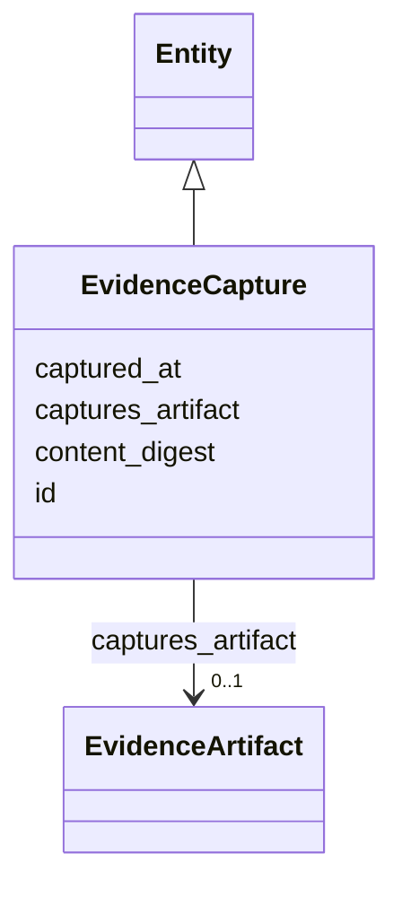

---
search:
  boost: 10.0
---

# Class: EvidenceCapture 


_A content-addressed capture of an artifact at a time (§10.2, L0)._


<div data-search-exclude markdown="1">


URI: [sig:class/EvidenceCapture](https://ontology.sig-project.org/schema/class/EvidenceCapture)





## Inheritance
* [Entity](../classes/Entity.md)
    * **EvidenceCapture**


## Slots

| Name | Cardinality and Range | Description | Inheritance |
| ---  | --- | --- | --- |
| [captures_artifact](../slots/captures_artifact.md) | 0..1 <br/> [EvidenceArtifact](../classes/EvidenceArtifact.md) |  | direct |
| [captured_at](../slots/captured_at.md) | 0..1 <br/> [Datetime](../types/Datetime.md) |  | direct |
| [content_digest](../slots/content_digest.md) | 0..1 <br/> [String](../types/String.md) |  | direct |
| [id](../slots/id.md) | 1 <br/> [Uriorcurie](../types/Uriorcurie.md) | The entity's stable minted identity (L2 identity only, §8 | [Entity](../classes/Entity.md) |


## Usages

| used by | used in | type | used |
| ---  | --- | --- | --- |
| [Extraction](../classes/Extraction.md) | [from_capture](../slots/from_capture.md) | range | [EvidenceCapture](../classes/EvidenceCapture.md) |


## Identifier and Mapping Information


### Schema Source


* from schema: https://ontology.sig-project.org/schema/sig


## Mappings

| Mapping Type | Mapped Value |
| ---  | ---  |
| self | sig:EvidenceCapture |
| native | sig:EvidenceCapture |


## LinkML Source

<!-- TODO: investigate https://stackoverflow.com/questions/37606292/how-to-create-tabbed-code-blocks-in-mkdocs-or-sphinx -->

### Direct

<details>
```yaml
name: EvidenceCapture
description: A content-addressed capture of an artifact at a time (§10.2, L0).
from_schema: https://ontology.sig-project.org/schema/sig
rank: 1000
is_a: Entity
attributes:
  captures_artifact:
    name: captures_artifact
    from_schema: https://ontology.sig-project.org/schema/entities
    rank: 1000
    domain_of:
    - EvidenceCapture
    range: EvidenceArtifact
  captured_at:
    name: captured_at
    from_schema: https://ontology.sig-project.org/schema/entities
    rank: 1000
    domain_of:
    - EvidenceCapture
    range: datetime
  content_digest:
    name: content_digest
    from_schema: https://ontology.sig-project.org/schema/entities
    rank: 1000
    domain_of:
    - EvidenceCapture
    range: string

```
</details>

### Induced

<details>
```yaml
name: EvidenceCapture
description: A content-addressed capture of an artifact at a time (§10.2, L0).
from_schema: https://ontology.sig-project.org/schema/sig
rank: 1000
is_a: Entity
attributes:
  captures_artifact:
    name: captures_artifact
    from_schema: https://ontology.sig-project.org/schema/entities
    rank: 1000
    owner: EvidenceCapture
    domain_of:
    - EvidenceCapture
    range: EvidenceArtifact
  captured_at:
    name: captured_at
    from_schema: https://ontology.sig-project.org/schema/entities
    rank: 1000
    owner: EvidenceCapture
    domain_of:
    - EvidenceCapture
    range: datetime
  content_digest:
    name: content_digest
    from_schema: https://ontology.sig-project.org/schema/entities
    rank: 1000
    owner: EvidenceCapture
    domain_of:
    - EvidenceCapture
    range: string
  id:
    name: id
    description: The entity's stable minted identity (L2 identity only, §8.2).
    from_schema: https://ontology.sig-project.org/schema/sig
    rank: 1000
    identifier: true
    owner: EvidenceCapture
    domain_of:
    - Entity
    - Edge
    range: uriorcurie
    required: true

```
</details></div>