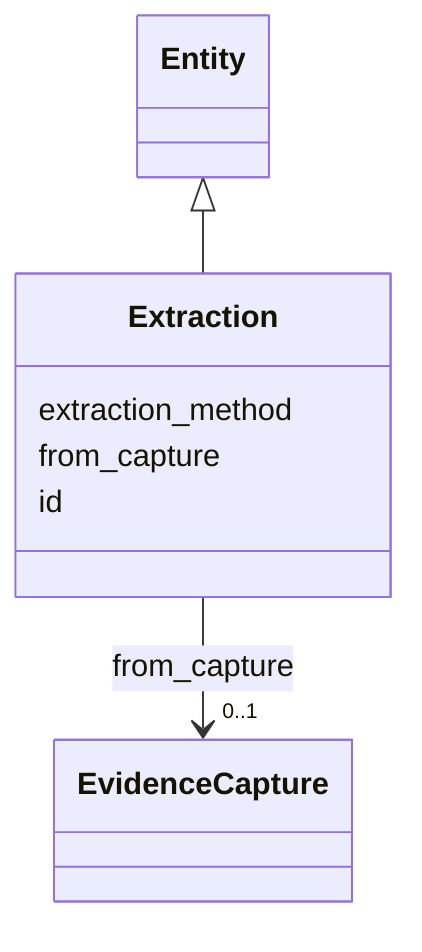

---
search:
  boost: 10.0
---

# Class: Extraction 


_A run that extracted claims from a capture (§10.2)._


<div data-search-exclude markdown="1">


URI: [sig:class/Extraction](https://ontology.sig-project.org/schema/class/Extraction)





## Inheritance
* [Entity](../classes/Entity.md)
    * **Extraction**


## Slots

| Name | Cardinality and Range | Description | Inheritance |
| ---  | --- | --- | --- |
| [from_capture](../slots/from_capture.md) | 0..1 <br/> [EvidenceCapture](../classes/EvidenceCapture.md) |  | direct |
| [extraction_method](../slots/extraction_method.md) | 0..1 <br/> [String](../types/String.md) |  | direct |
| [id](../slots/id.md) | 1 <br/> [Uriorcurie](../types/Uriorcurie.md) | The entity's stable minted identity (L2 identity only, §8 | [Entity](../classes/Entity.md) |


## Identifier and Mapping Information


### Schema Source


* from schema: https://ontology.sig-project.org/schema/sig


## Mappings

| Mapping Type | Mapped Value |
| ---  | ---  |
| self | sig:Extraction |
| native | sig:Extraction |


## LinkML Source

<!-- TODO: investigate https://stackoverflow.com/questions/37606292/how-to-create-tabbed-code-blocks-in-mkdocs-or-sphinx -->

### Direct

<details>
```yaml
name: Extraction
description: A run that extracted claims from a capture (§10.2).
from_schema: https://ontology.sig-project.org/schema/sig
rank: 1000
is_a: Entity
attributes:
  from_capture:
    name: from_capture
    from_schema: https://ontology.sig-project.org/schema/entities
    rank: 1000
    domain_of:
    - Extraction
    range: EvidenceCapture
  extraction_method:
    name: extraction_method
    from_schema: https://ontology.sig-project.org/schema/entities
    rank: 1000
    domain_of:
    - Extraction
    range: string

```
</details>

### Induced

<details>
```yaml
name: Extraction
description: A run that extracted claims from a capture (§10.2).
from_schema: https://ontology.sig-project.org/schema/sig
rank: 1000
is_a: Entity
attributes:
  from_capture:
    name: from_capture
    from_schema: https://ontology.sig-project.org/schema/entities
    rank: 1000
    owner: Extraction
    domain_of:
    - Extraction
    range: EvidenceCapture
  extraction_method:
    name: extraction_method
    from_schema: https://ontology.sig-project.org/schema/entities
    rank: 1000
    owner: Extraction
    domain_of:
    - Extraction
    range: string
  id:
    name: id
    description: The entity's stable minted identity (L2 identity only, §8.2).
    from_schema: https://ontology.sig-project.org/schema/sig
    rank: 1000
    identifier: true
    owner: Extraction
    domain_of:
    - Entity
    - Edge
    range: uriorcurie
    required: true

```
</details></div>