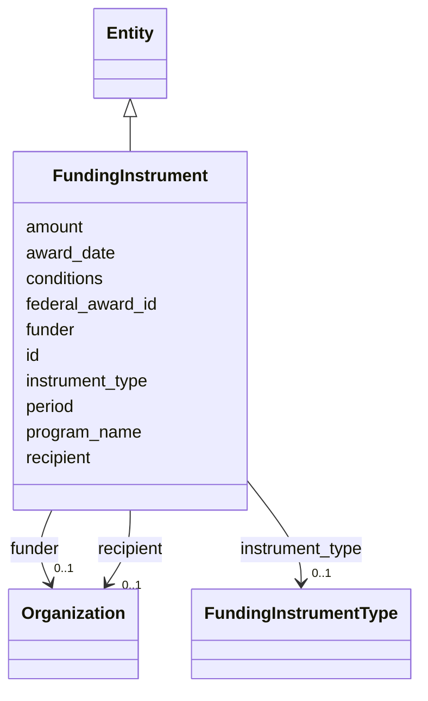

---
search:
  boost: 10.0
---

# Class: FundingInstrument 


_[NEW] Purchaser != operator != funder (§11.12, SIG-ONTO-033). Grants and third-party funding; federal grant → local surveillance is traceable._


<div data-search-exclude markdown="1">


URI: [sig:class/FundingInstrument](https://ontology.sig-project.org/schema/class/FundingInstrument)





## Inheritance
* [Entity](../classes/Entity.md)
    * **FundingInstrument**


## Slots

| Name | Cardinality and Range | Description | Inheritance |
| ---  | --- | --- | --- |
| [funder](../slots/funder.md) | 0..1 <br/> [Organization](../classes/Organization.md) |  | direct |
| [recipient](../slots/recipient.md) | 0..1 <br/> [Organization](../classes/Organization.md) |  | direct |
| [instrument_type](../slots/instrument_type.md) | 0..1 <br/> [FundingInstrumentType](../enums/FundingInstrumentType.md) |  | direct |
| [program_name](../slots/program_name.md) | 0..1 <br/> [String](../types/String.md) | e | direct |
| [amount](../slots/amount.md) | 0..1 <br/> [Money](../types/Money.md) |  | direct |
| [award_date](../slots/award_date.md) | 0..1 <br/> [Edtf](../types/Edtf.md) |  | direct |
| [period](../slots/period.md) | 0..1 <br/> [String](../types/String.md) |  | direct |
| [conditions](../slots/conditions.md) | 0..1 <br/> [String](../types/String.md) |  | direct |
| [federal_award_id](../slots/federal_award_id.md) | 0..1 <br/> [String](../types/String.md) | USAspending award/sub-award id — the traceable link (SIG-ONTO-033) | direct |
| [id](../slots/id.md) | 1 <br/> [Uriorcurie](../types/Uriorcurie.md) | The entity's stable minted identity (L2 identity only, §8 | [Entity](../classes/Entity.md) |


## Identifier and Mapping Information


### Schema Source


* from schema: https://ontology.sig-project.org/schema/sig


## Mappings

| Mapping Type | Mapped Value |
| ---  | ---  |
| self | sig:FundingInstrument |
| native | sig:FundingInstrument |


## LinkML Source

<!-- TODO: investigate https://stackoverflow.com/questions/37606292/how-to-create-tabbed-code-blocks-in-mkdocs-or-sphinx -->

### Direct

<details>
```yaml
name: FundingInstrument
description: '[NEW] Purchaser != operator != funder (§11.12, SIG-ONTO-033). Grants
  and third-party funding; federal grant → local surveillance is traceable.'
from_schema: https://ontology.sig-project.org/schema/sig
rank: 1000
is_a: Entity
attributes:
  funder:
    name: funder
    from_schema: https://ontology.sig-project.org/schema/entities
    rank: 1000
    domain_of:
    - FundingInstrument
    range: Organization
  recipient:
    name: recipient
    from_schema: https://ontology.sig-project.org/schema/entities
    rank: 1000
    domain_of:
    - FundingInstrument
    range: Organization
  instrument_type:
    name: instrument_type
    from_schema: https://ontology.sig-project.org/schema/entities
    rank: 1000
    domain_of:
    - FundingInstrument
    - LegalInstrument
    range: FundingInstrumentType
  program_name:
    name: program_name
    description: e.g. Byrne JAG, UASI, COPS, Operation Stonegarden, HIDTA.
    from_schema: https://ontology.sig-project.org/schema/entities
    rank: 1000
    domain_of:
    - FundingInstrument
    range: string
  amount:
    name: amount
    from_schema: https://ontology.sig-project.org/schema/entities
    domain_of:
    - Contract
    - FundingInstrument
    range: money
  award_date:
    name: award_date
    from_schema: https://ontology.sig-project.org/schema/entities
    rank: 1000
    domain_of:
    - FundingInstrument
    range: edtf
  period:
    name: period
    from_schema: https://ontology.sig-project.org/schema/entities
    rank: 1000
    domain_of:
    - FundingInstrument
    - UsageAggregate
    range: string
  conditions:
    name: conditions
    from_schema: https://ontology.sig-project.org/schema/entities
    rank: 1000
    domain_of:
    - FundingInstrument
    range: string
  federal_award_id:
    name: federal_award_id
    description: USAspending award/sub-award id — the traceable link (SIG-ONTO-033).
    from_schema: https://ontology.sig-project.org/schema/entities
    rank: 1000
    domain_of:
    - FundingInstrument
    range: string

```
</details>

### Induced

<details>
```yaml
name: FundingInstrument
description: '[NEW] Purchaser != operator != funder (§11.12, SIG-ONTO-033). Grants
  and third-party funding; federal grant → local surveillance is traceable.'
from_schema: https://ontology.sig-project.org/schema/sig
rank: 1000
is_a: Entity
attributes:
  funder:
    name: funder
    from_schema: https://ontology.sig-project.org/schema/entities
    rank: 1000
    owner: FundingInstrument
    domain_of:
    - FundingInstrument
    range: Organization
  recipient:
    name: recipient
    from_schema: https://ontology.sig-project.org/schema/entities
    rank: 1000
    owner: FundingInstrument
    domain_of:
    - FundingInstrument
    range: Organization
  instrument_type:
    name: instrument_type
    from_schema: https://ontology.sig-project.org/schema/entities
    rank: 1000
    owner: FundingInstrument
    domain_of:
    - FundingInstrument
    - LegalInstrument
    range: FundingInstrumentType
  program_name:
    name: program_name
    description: e.g. Byrne JAG, UASI, COPS, Operation Stonegarden, HIDTA.
    from_schema: https://ontology.sig-project.org/schema/entities
    rank: 1000
    owner: FundingInstrument
    domain_of:
    - FundingInstrument
    range: string
  amount:
    name: amount
    from_schema: https://ontology.sig-project.org/schema/entities
    owner: FundingInstrument
    domain_of:
    - Contract
    - FundingInstrument
    range: money
  award_date:
    name: award_date
    from_schema: https://ontology.sig-project.org/schema/entities
    rank: 1000
    owner: FundingInstrument
    domain_of:
    - FundingInstrument
    range: edtf
  period:
    name: period
    from_schema: https://ontology.sig-project.org/schema/entities
    rank: 1000
    owner: FundingInstrument
    domain_of:
    - FundingInstrument
    - UsageAggregate
    range: string
  conditions:
    name: conditions
    from_schema: https://ontology.sig-project.org/schema/entities
    rank: 1000
    owner: FundingInstrument
    domain_of:
    - FundingInstrument
    range: string
  federal_award_id:
    name: federal_award_id
    description: USAspending award/sub-award id — the traceable link (SIG-ONTO-033).
    from_schema: https://ontology.sig-project.org/schema/entities
    rank: 1000
    owner: FundingInstrument
    domain_of:
    - FundingInstrument
    range: string
  id:
    name: id
    description: The entity's stable minted identity (L2 identity only, §8.2).
    from_schema: https://ontology.sig-project.org/schema/sig
    rank: 1000
    identifier: true
    owner: FundingInstrument
    domain_of:
    - Entity
    - Edge
    range: uriorcurie
    required: true

```
</details></div>