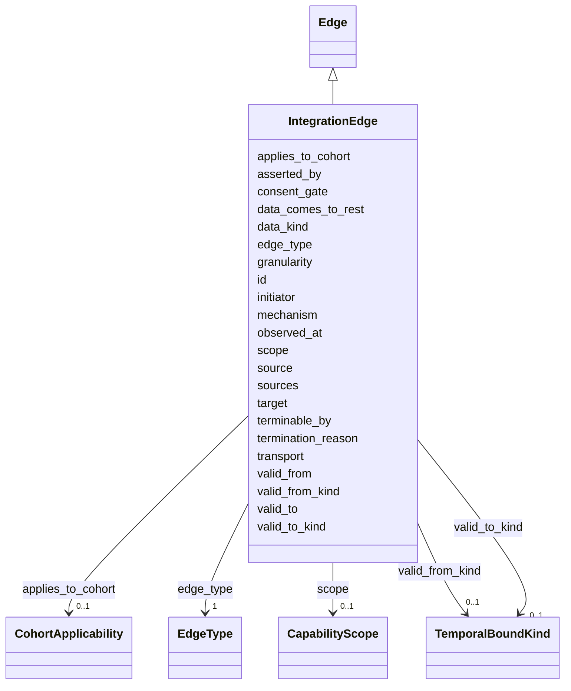

---
search:
  boost: 10.0
---

# Class: IntegrationEdge 


_A data-bearing integration edge (§12.3). Edges are per (product-pair, data-kind, direction), never per product-pair (SIG-ONTO-046). Unilaterally terminable, mid-contract, possibly partially, via applies_to_cohort._


<div data-search-exclude markdown="1">


URI: [sig:class/IntegrationEdge](https://ontology.sig-project.org/schema/class/IntegrationEdge)





## Inheritance
* [Edge](../classes/Edge.md)
    * **IntegrationEdge**


## Slots

| Name | Cardinality and Range | Description | Inheritance |
| ---  | --- | --- | --- |
| [data_kind](../slots/data_kind.md) | 1 <br/> [String](../types/String.md) | The kind of data that moves (part of the edge key, SIG-ONTO-046) | direct |
| [initiator](../slots/initiator.md) | 0..1 <br/> [Uriorcurie](../types/Uriorcurie.md) |  | direct |
| [transport](../slots/transport.md) | 0..1 <br/> [String](../types/String.md) |  | direct |
| [granularity](../slots/granularity.md) | 0..1 <br/> [String](../types/String.md) |  | direct |
| [data_comes_to_rest](../slots/data_comes_to_rest.md) | 0..1 <br/> [Boolean](../types/Boolean.md) |  | direct |
| [scope](../slots/scope.md) | 0..1 <br/> [CapabilityScope](../enums/CapabilityScope.md) |  | direct |
| [consent_gate](../slots/consent_gate.md) | 0..1 <br/> [Boolean](../types/Boolean.md) |  | direct |
| [mechanism](../slots/mechanism.md) | 0..1 <br/> [String](../types/String.md) |  | direct |
| [terminable_by](../slots/terminable_by.md) | 0..1 <br/> [Uriorcurie](../types/Uriorcurie.md) |  | direct |
| [termination_reason](../slots/termination_reason.md) | 0..1 <br/> [String](../types/String.md) |  | direct |
| [applies_to_cohort](../slots/applies_to_cohort.md) | 0..1 <br/> [CohortApplicability](../enums/CohortApplicability.md) | Partial termination cohort — all / new_customers_only / existing_customers_on... | direct |
| [id](../slots/id.md) | 1 <br/> [Uriorcurie](../types/Uriorcurie.md) |  | [Edge](../classes/Edge.md) |
| [source](../slots/source.md) | 1 <br/> [Uriorcurie](../types/Uriorcurie.md) | The asserting/originating node (directed — §12 | [Edge](../classes/Edge.md) |
| [target](../slots/target.md) | 1 <br/> [Uriorcurie](../types/Uriorcurie.md) |  | [Edge](../classes/Edge.md) |
| [edge_type](../slots/edge_type.md) | 1 <br/> [EdgeType](../enums/EdgeType.md) | Typed from the closed catalog (§12 | [Edge](../classes/Edge.md) |
| [valid_from](../slots/valid_from.md) | 0..1 <br/> [Edtf](../types/Edtf.md) |  | [Edge](../classes/Edge.md) |
| [valid_to](../slots/valid_to.md) | 0..1 <br/> [Edtf](../types/Edtf.md) |  | [Edge](../classes/Edge.md) |
| [valid_from_kind](../slots/valid_from_kind.md) | 0..1 <br/> [TemporalBoundKind](../enums/TemporalBoundKind.md) | Snapshot sharing carries unknown/ongoing (SIG-ONTO-044) | [Edge](../classes/Edge.md) |
| [valid_to_kind](../slots/valid_to_kind.md) | 0..1 <br/> [TemporalBoundKind](../enums/TemporalBoundKind.md) |  | [Edge](../classes/Edge.md) |
| [observed_at](../slots/observed_at.md) | 0..1 <br/> [Edtf](../types/Edtf.md) |  | [Edge](../classes/Edge.md) |
| [sources](../slots/sources.md) | * <br/> [Uriorcurie](../types/Uriorcurie.md) | At least one supporting claim (§12 | [Edge](../classes/Edge.md) |
| [asserted_by](../slots/asserted_by.md) | 0..1 <br/> [Uriorcurie](../types/Uriorcurie.md) | Which party asserted it — perspectival (§12 | [Edge](../classes/Edge.md) |


## Identifier and Mapping Information


### Schema Source


* from schema: https://ontology.sig-project.org/schema/sig


## Mappings

| Mapping Type | Mapped Value |
| ---  | ---  |
| self | sig:IntegrationEdge |
| native | sig:IntegrationEdge |


## LinkML Source

<!-- TODO: investigate https://stackoverflow.com/questions/37606292/how-to-create-tabbed-code-blocks-in-mkdocs-or-sphinx -->

### Direct

<details>
```yaml
name: IntegrationEdge
description: A data-bearing integration edge (§12.3). Edges are per (product-pair,
  data-kind, direction), never per product-pair (SIG-ONTO-046). Unilaterally terminable,
  mid-contract, possibly partially, via applies_to_cohort.
from_schema: https://ontology.sig-project.org/schema/sig
rank: 1000
is_a: Edge
attributes:
  data_kind:
    name: data_kind
    description: The kind of data that moves (part of the edge key, SIG-ONTO-046).
    from_schema: https://ontology.sig-project.org/schema/edges
    rank: 1000
    domain_of:
    - IntegrationEdge
    range: string
    required: true
  initiator:
    name: initiator
    from_schema: https://ontology.sig-project.org/schema/edges
    rank: 1000
    domain_of:
    - IntegrationEdge
    range: uriorcurie
  transport:
    name: transport
    from_schema: https://ontology.sig-project.org/schema/edges
    rank: 1000
    domain_of:
    - IntegrationEdge
    range: string
  granularity:
    name: granularity
    from_schema: https://ontology.sig-project.org/schema/edges
    rank: 1000
    domain_of:
    - IntegrationEdge
    range: string
  data_comes_to_rest:
    name: data_comes_to_rest
    from_schema: https://ontology.sig-project.org/schema/edges
    rank: 1000
    domain_of:
    - IntegrationEdge
    range: boolean
  scope:
    name: scope
    from_schema: https://ontology.sig-project.org/schema/edges
    domain_of:
    - Capability
    - AccessRelationship
    - IntegrationEdge
    range: CapabilityScope
  consent_gate:
    name: consent_gate
    from_schema: https://ontology.sig-project.org/schema/edges
    rank: 1000
    domain_of:
    - IntegrationEdge
    range: boolean
  mechanism:
    name: mechanism
    from_schema: https://ontology.sig-project.org/schema/edges
    rank: 1000
    domain_of:
    - IntegrationEdge
    range: string
  terminable_by:
    name: terminable_by
    from_schema: https://ontology.sig-project.org/schema/edges
    rank: 1000
    domain_of:
    - IntegrationEdge
    range: uriorcurie
  termination_reason:
    name: termination_reason
    from_schema: https://ontology.sig-project.org/schema/edges
    rank: 1000
    domain_of:
    - IntegrationEdge
    range: string
  applies_to_cohort:
    name: applies_to_cohort
    description: Partial termination cohort — all / new_customers_only / existing_customers_only
      (SIG-ONTO-046).
    from_schema: https://ontology.sig-project.org/schema/edges
    rank: 1000
    domain_of:
    - IntegrationEdge
    range: CohortApplicability

```
</details>

### Induced

<details>
```yaml
name: IntegrationEdge
description: A data-bearing integration edge (§12.3). Edges are per (product-pair,
  data-kind, direction), never per product-pair (SIG-ONTO-046). Unilaterally terminable,
  mid-contract, possibly partially, via applies_to_cohort.
from_schema: https://ontology.sig-project.org/schema/sig
rank: 1000
is_a: Edge
attributes:
  data_kind:
    name: data_kind
    description: The kind of data that moves (part of the edge key, SIG-ONTO-046).
    from_schema: https://ontology.sig-project.org/schema/edges
    rank: 1000
    owner: IntegrationEdge
    domain_of:
    - IntegrationEdge
    range: string
    required: true
  initiator:
    name: initiator
    from_schema: https://ontology.sig-project.org/schema/edges
    rank: 1000
    owner: IntegrationEdge
    domain_of:
    - IntegrationEdge
    range: uriorcurie
  transport:
    name: transport
    from_schema: https://ontology.sig-project.org/schema/edges
    rank: 1000
    owner: IntegrationEdge
    domain_of:
    - IntegrationEdge
    range: string
  granularity:
    name: granularity
    from_schema: https://ontology.sig-project.org/schema/edges
    rank: 1000
    owner: IntegrationEdge
    domain_of:
    - IntegrationEdge
    range: string
  data_comes_to_rest:
    name: data_comes_to_rest
    from_schema: https://ontology.sig-project.org/schema/edges
    rank: 1000
    owner: IntegrationEdge
    domain_of:
    - IntegrationEdge
    range: boolean
  scope:
    name: scope
    from_schema: https://ontology.sig-project.org/schema/edges
    owner: IntegrationEdge
    domain_of:
    - Capability
    - AccessRelationship
    - IntegrationEdge
    range: CapabilityScope
  consent_gate:
    name: consent_gate
    from_schema: https://ontology.sig-project.org/schema/edges
    rank: 1000
    owner: IntegrationEdge
    domain_of:
    - IntegrationEdge
    range: boolean
  mechanism:
    name: mechanism
    from_schema: https://ontology.sig-project.org/schema/edges
    rank: 1000
    owner: IntegrationEdge
    domain_of:
    - IntegrationEdge
    range: string
  terminable_by:
    name: terminable_by
    from_schema: https://ontology.sig-project.org/schema/edges
    rank: 1000
    owner: IntegrationEdge
    domain_of:
    - IntegrationEdge
    range: uriorcurie
  termination_reason:
    name: termination_reason
    from_schema: https://ontology.sig-project.org/schema/edges
    rank: 1000
    owner: IntegrationEdge
    domain_of:
    - IntegrationEdge
    range: string
  applies_to_cohort:
    name: applies_to_cohort
    description: Partial termination cohort — all / new_customers_only / existing_customers_only
      (SIG-ONTO-046).
    from_schema: https://ontology.sig-project.org/schema/edges
    rank: 1000
    owner: IntegrationEdge
    domain_of:
    - IntegrationEdge
    range: CohortApplicability
  id:
    name: id
    from_schema: https://ontology.sig-project.org/schema/edges
    identifier: true
    owner: IntegrationEdge
    domain_of:
    - Entity
    - Edge
    range: uriorcurie
    required: true
  source:
    name: source
    description: The asserting/originating node (directed — §12.1.1).
    from_schema: https://ontology.sig-project.org/schema/edges
    rank: 1000
    owner: IntegrationEdge
    domain_of:
    - Edge
    range: uriorcurie
    required: true
  target:
    name: target
    from_schema: https://ontology.sig-project.org/schema/edges
    owner: IntegrationEdge
    domain_of:
    - ResearchTask
    - Edge
    range: uriorcurie
    required: true
  edge_type:
    name: edge_type
    description: Typed from the closed catalog (§12.1.2).
    from_schema: https://ontology.sig-project.org/schema/edges
    rank: 1000
    owner: IntegrationEdge
    domain_of:
    - Edge
    range: EdgeType
    required: true
  valid_from:
    name: valid_from
    from_schema: https://ontology.sig-project.org/schema/edges
    owner: IntegrationEdge
    domain_of:
    - Jurisdiction
    - Organization
    - Edge
    range: edtf
  valid_to:
    name: valid_to
    from_schema: https://ontology.sig-project.org/schema/edges
    owner: IntegrationEdge
    domain_of:
    - Jurisdiction
    - Organization
    - Edge
    range: edtf
  valid_from_kind:
    name: valid_from_kind
    description: Snapshot sharing carries unknown/ongoing (SIG-ONTO-044).
    from_schema: https://ontology.sig-project.org/schema/edges
    owner: IntegrationEdge
    domain_of:
    - Edge
    range: TemporalBoundKind
  valid_to_kind:
    name: valid_to_kind
    from_schema: https://ontology.sig-project.org/schema/edges
    owner: IntegrationEdge
    domain_of:
    - Edge
    range: TemporalBoundKind
  observed_at:
    name: observed_at
    from_schema: https://ontology.sig-project.org/schema/edges
    owner: IntegrationEdge
    domain_of:
    - Edge
    range: edtf
  sources:
    name: sources
    description: At least one supporting claim (§12.1.4, SIG-CHART-013).
    from_schema: https://ontology.sig-project.org/schema/edges
    owner: IntegrationEdge
    domain_of:
    - AccountabilityEvent
    - Edge
    range: uriorcurie
    multivalued: true
  asserted_by:
    name: asserted_by
    description: Which party asserted it — perspectival (§12.1.5).
    from_schema: https://ontology.sig-project.org/schema/edges
    rank: 1000
    owner: IntegrationEdge
    domain_of:
    - Edge
    range: uriorcurie

```
</details></div>