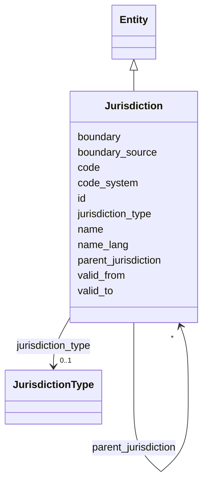

---
search:
  boost: 10.0
---

# Class: Jurisdiction 


_[NEW] A first-class jurisdiction with a self-referential hierarchy, a pluggable national code system, and temporally-versioned geometry (§11.1, SIG-ONTO-010/011)._


<div data-search-exclude markdown="1">


URI: [sig:class/Jurisdiction](https://ontology.sig-project.org/schema/class/Jurisdiction)





## Inheritance
* [Entity](../classes/Entity.md)
    * **Jurisdiction**


## Slots

| Name | Cardinality and Range | Description | Inheritance |
| ---  | --- | --- | --- |
| [jurisdiction_type](../slots/jurisdiction_type.md) | 0..1 <br/> [JurisdictionType](../enums/JurisdictionType.md) |  | direct |
| [parent_jurisdiction](../slots/parent_jurisdiction.md) | * <br/> [Jurisdiction](../classes/Jurisdiction.md) | Multiple parents permitted; hierarchies overlap (SIG-ONTO-010) | direct |
| [code_system](../slots/code_system.md) | * <br/> [String](../types/String.md) | Repeatable code-system identifiers (us | direct |
| [code](../slots/code.md) | * <br/> [String](../types/String.md) |  | direct |
| [boundary](../slots/boundary.md) | 0..1 <br/> [GeometryWkt](../types/GeometryWkt.md) | MultiPolygon, 4326 | direct |
| [boundary_source](../slots/boundary_source.md) | 0..1 <br/> [Uriorcurie](../types/Uriorcurie.md) |  | direct |
| [name](../slots/name.md) | * <br/> [String](../types/String.md) |  | direct |
| [name_lang](../slots/name_lang.md) | * <br/> [Bcp47](../types/Bcp47.md) |  | direct |
| [valid_from](../slots/valid_from.md) | 0..1 <br/> [Edtf](../types/Edtf.md) |  | direct |
| [valid_to](../slots/valid_to.md) | 0..1 <br/> [Edtf](../types/Edtf.md) |  | direct |
| [id](../slots/id.md) | 1 <br/> [Uriorcurie](../types/Uriorcurie.md) | The entity's stable minted identity (L2 identity only, §8 | [Entity](../classes/Entity.md) |


## Usages

| used by | used in | type | used |
| ---  | --- | --- | --- |
| [Jurisdiction](../classes/Jurisdiction.md) | [parent_jurisdiction](../slots/parent_jurisdiction.md) | range | [Jurisdiction](../classes/Jurisdiction.md) |
| [Organization](../classes/Organization.md) | [jurisdiction](../slots/jurisdiction.md) | range | [Jurisdiction](../classes/Jurisdiction.md) |
| [Deployment](../classes/Deployment.md) | [jurisdiction](../slots/jurisdiction.md) | range | [Jurisdiction](../classes/Jurisdiction.md) |
| [LegalInstrument](../classes/LegalInstrument.md) | [jurisdiction](../slots/jurisdiction.md) | range | [Jurisdiction](../classes/Jurisdiction.md) |


## Identifier and Mapping Information


### Schema Source


* from schema: https://ontology.sig-project.org/schema/sig


## Mappings

| Mapping Type | Mapped Value |
| ---  | ---  |
| self | sig:Jurisdiction |
| native | sig:Jurisdiction |


## LinkML Source

<!-- TODO: investigate https://stackoverflow.com/questions/37606292/how-to-create-tabbed-code-blocks-in-mkdocs-or-sphinx -->

### Direct

<details>
```yaml
name: Jurisdiction
description: '[NEW] A first-class jurisdiction with a self-referential hierarchy,
  a pluggable national code system, and temporally-versioned geometry (§11.1, SIG-ONTO-010/011).'
from_schema: https://ontology.sig-project.org/schema/sig
rank: 1000
is_a: Entity
attributes:
  jurisdiction_type:
    name: jurisdiction_type
    from_schema: https://ontology.sig-project.org/schema/entities
    rank: 1000
    domain_of:
    - Jurisdiction
    range: JurisdictionType
  parent_jurisdiction:
    name: parent_jurisdiction
    description: Multiple parents permitted; hierarchies overlap (SIG-ONTO-010).
    from_schema: https://ontology.sig-project.org/schema/entities
    rank: 1000
    domain_of:
    - Jurisdiction
    range: Jurisdiction
    multivalued: true
  code_system:
    name: code_system
    description: Repeatable code-system identifiers (us.census.geoid, iso.3166-2,
      fr.insee, ...).
    from_schema: https://ontology.sig-project.org/schema/entities
    rank: 1000
    domain_of:
    - Jurisdiction
    range: string
    multivalued: true
  code:
    name: code
    from_schema: https://ontology.sig-project.org/schema/entities
    rank: 1000
    domain_of:
    - Jurisdiction
    range: string
    multivalued: true
  boundary:
    name: boundary
    description: MultiPolygon, 4326.
    from_schema: https://ontology.sig-project.org/schema/entities
    rank: 1000
    domain_of:
    - Jurisdiction
    range: geometry_wkt
  boundary_source:
    name: boundary_source
    from_schema: https://ontology.sig-project.org/schema/entities
    rank: 1000
    domain_of:
    - Jurisdiction
    range: uriorcurie
  name:
    name: name
    from_schema: https://ontology.sig-project.org/schema/entities
    rank: 1000
    domain_of:
    - Jurisdiction
    range: string
    multivalued: true
  name_lang:
    name: name_lang
    from_schema: https://ontology.sig-project.org/schema/entities
    rank: 1000
    domain_of:
    - Jurisdiction
    - Organization
    range: bcp47
    multivalued: true
  valid_from:
    name: valid_from
    from_schema: https://ontology.sig-project.org/schema/entities
    domain_of:
    - Jurisdiction
    - Organization
    - Edge
    range: edtf
  valid_to:
    name: valid_to
    from_schema: https://ontology.sig-project.org/schema/entities
    domain_of:
    - Jurisdiction
    - Organization
    - Edge
    range: edtf

```
</details>

### Induced

<details>
```yaml
name: Jurisdiction
description: '[NEW] A first-class jurisdiction with a self-referential hierarchy,
  a pluggable national code system, and temporally-versioned geometry (§11.1, SIG-ONTO-010/011).'
from_schema: https://ontology.sig-project.org/schema/sig
rank: 1000
is_a: Entity
attributes:
  jurisdiction_type:
    name: jurisdiction_type
    from_schema: https://ontology.sig-project.org/schema/entities
    rank: 1000
    owner: Jurisdiction
    domain_of:
    - Jurisdiction
    range: JurisdictionType
  parent_jurisdiction:
    name: parent_jurisdiction
    description: Multiple parents permitted; hierarchies overlap (SIG-ONTO-010).
    from_schema: https://ontology.sig-project.org/schema/entities
    rank: 1000
    owner: Jurisdiction
    domain_of:
    - Jurisdiction
    range: Jurisdiction
    multivalued: true
  code_system:
    name: code_system
    description: Repeatable code-system identifiers (us.census.geoid, iso.3166-2,
      fr.insee, ...).
    from_schema: https://ontology.sig-project.org/schema/entities
    rank: 1000
    owner: Jurisdiction
    domain_of:
    - Jurisdiction
    range: string
    multivalued: true
  code:
    name: code
    from_schema: https://ontology.sig-project.org/schema/entities
    rank: 1000
    owner: Jurisdiction
    domain_of:
    - Jurisdiction
    range: string
    multivalued: true
  boundary:
    name: boundary
    description: MultiPolygon, 4326.
    from_schema: https://ontology.sig-project.org/schema/entities
    rank: 1000
    owner: Jurisdiction
    domain_of:
    - Jurisdiction
    range: geometry_wkt
  boundary_source:
    name: boundary_source
    from_schema: https://ontology.sig-project.org/schema/entities
    rank: 1000
    owner: Jurisdiction
    domain_of:
    - Jurisdiction
    range: uriorcurie
  name:
    name: name
    from_schema: https://ontology.sig-project.org/schema/entities
    rank: 1000
    owner: Jurisdiction
    domain_of:
    - Jurisdiction
    range: string
    multivalued: true
  name_lang:
    name: name_lang
    from_schema: https://ontology.sig-project.org/schema/entities
    rank: 1000
    owner: Jurisdiction
    domain_of:
    - Jurisdiction
    - Organization
    range: bcp47
    multivalued: true
  valid_from:
    name: valid_from
    from_schema: https://ontology.sig-project.org/schema/entities
    owner: Jurisdiction
    domain_of:
    - Jurisdiction
    - Organization
    - Edge
    range: edtf
  valid_to:
    name: valid_to
    from_schema: https://ontology.sig-project.org/schema/entities
    owner: Jurisdiction
    domain_of:
    - Jurisdiction
    - Organization
    - Edge
    range: edtf
  id:
    name: id
    description: The entity's stable minted identity (L2 identity only, §8.2).
    from_schema: https://ontology.sig-project.org/schema/sig
    rank: 1000
    identifier: true
    owner: Jurisdiction
    domain_of:
    - Entity
    - Edge
    range: uriorcurie
    required: true

```
</details></div>