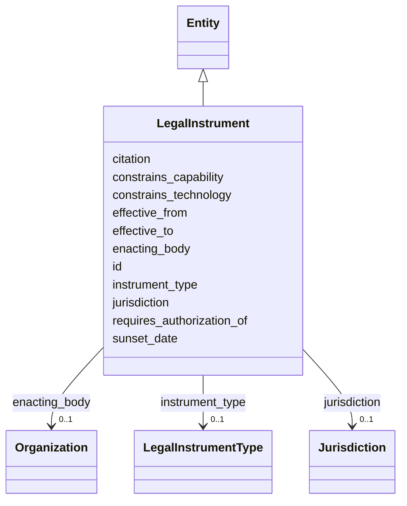

---
search:
  boost: 10.0
---

# Class: LegalInstrument 


_[NEW] Laws and regulations as a modelled entity (§11.14). Gives the international requirement somewhere to put an arrêté préfectoral, a CNIL decision, or an EU AI Act obligation._


<div data-search-exclude markdown="1">


URI: [sig:class/LegalInstrument](https://ontology.sig-project.org/schema/class/LegalInstrument)





## Inheritance
* [Entity](../classes/Entity.md)
    * **LegalInstrument**


## Slots

| Name | Cardinality and Range | Description | Inheritance |
| ---  | --- | --- | --- |
| [instrument_type](../slots/instrument_type.md) | 0..1 <br/> [LegalInstrumentType](../enums/LegalInstrumentType.md) |  | direct |
| [enacting_body](../slots/enacting_body.md) | 0..1 <br/> [Organization](../classes/Organization.md) |  | direct |
| [jurisdiction](../slots/jurisdiction.md) | 0..1 <br/> [Jurisdiction](../classes/Jurisdiction.md) |  | direct |
| [citation](../slots/citation.md) | 0..1 <br/> [String](../types/String.md) |  | direct |
| [effective_from](../slots/effective_from.md) | 0..1 <br/> [Edtf](../types/Edtf.md) |  | direct |
| [effective_to](../slots/effective_to.md) | 0..1 <br/> [Edtf](../types/Edtf.md) |  | direct |
| [sunset_date](../slots/sunset_date.md) | 0..1 <br/> [Edtf](../types/Edtf.md) |  | direct |
| [constrains_technology](../slots/constrains_technology.md) | * <br/> [TechnologyCode](../types/TechnologyCode.md) |  | direct |
| [constrains_capability](../slots/constrains_capability.md) | * <br/> [CapabilityCode](../types/CapabilityCode.md) |  | direct |
| [requires_authorization_of](../slots/requires_authorization_of.md) | * <br/> [Uriorcurie](../types/Uriorcurie.md) | CCOPS-style approval requirements | direct |
| [id](../slots/id.md) | 1 <br/> [Uriorcurie](../types/Uriorcurie.md) | The entity's stable minted identity (L2 identity only, §8 | [Entity](../classes/Entity.md) |


## Usages

| used by | used in | type | used |
| ---  | --- | --- | --- |
| [RecordsRequest](../classes/RecordsRequest.md) | [statutory_basis](../slots/statutory_basis.md) | range | [LegalInstrument](../classes/LegalInstrument.md) |


## Identifier and Mapping Information


### Schema Source


* from schema: https://ontology.sig-project.org/schema/sig


## Mappings

| Mapping Type | Mapped Value |
| ---  | ---  |
| self | sig:LegalInstrument |
| native | sig:LegalInstrument |


## LinkML Source

<!-- TODO: investigate https://stackoverflow.com/questions/37606292/how-to-create-tabbed-code-blocks-in-mkdocs-or-sphinx -->

### Direct

<details>
```yaml
name: LegalInstrument
description: '[NEW] Laws and regulations as a modelled entity (§11.14). Gives the
  international requirement somewhere to put an arrêté préfectoral, a CNIL decision,
  or an EU AI Act obligation.'
from_schema: https://ontology.sig-project.org/schema/sig
rank: 1000
is_a: Entity
attributes:
  instrument_type:
    name: instrument_type
    from_schema: https://ontology.sig-project.org/schema/entities
    domain_of:
    - FundingInstrument
    - LegalInstrument
    range: LegalInstrumentType
  enacting_body:
    name: enacting_body
    from_schema: https://ontology.sig-project.org/schema/entities
    rank: 1000
    domain_of:
    - LegalInstrument
    range: Organization
  jurisdiction:
    name: jurisdiction
    from_schema: https://ontology.sig-project.org/schema/entities
    domain_of:
    - Organization
    - Deployment
    - LegalInstrument
    range: Jurisdiction
  citation:
    name: citation
    from_schema: https://ontology.sig-project.org/schema/entities
    rank: 1000
    domain_of:
    - LegalInstrument
    range: string
  effective_from:
    name: effective_from
    from_schema: https://ontology.sig-project.org/schema/entities
    domain_of:
    - Policy
    - LegalInstrument
    range: edtf
  effective_to:
    name: effective_to
    from_schema: https://ontology.sig-project.org/schema/entities
    domain_of:
    - Policy
    - LegalInstrument
    range: edtf
  sunset_date:
    name: sunset_date
    from_schema: https://ontology.sig-project.org/schema/entities
    rank: 1000
    domain_of:
    - LegalInstrument
    range: edtf
  constrains_technology:
    name: constrains_technology
    from_schema: https://ontology.sig-project.org/schema/entities
    rank: 1000
    domain_of:
    - LegalInstrument
    range: technology_code
    multivalued: true
  constrains_capability:
    name: constrains_capability
    from_schema: https://ontology.sig-project.org/schema/entities
    rank: 1000
    domain_of:
    - LegalInstrument
    range: capability_code
    multivalued: true
  requires_authorization_of:
    name: requires_authorization_of
    description: CCOPS-style approval requirements.
    from_schema: https://ontology.sig-project.org/schema/entities
    rank: 1000
    domain_of:
    - LegalInstrument
    range: uriorcurie
    multivalued: true

```
</details>

### Induced

<details>
```yaml
name: LegalInstrument
description: '[NEW] Laws and regulations as a modelled entity (§11.14). Gives the
  international requirement somewhere to put an arrêté préfectoral, a CNIL decision,
  or an EU AI Act obligation.'
from_schema: https://ontology.sig-project.org/schema/sig
rank: 1000
is_a: Entity
attributes:
  instrument_type:
    name: instrument_type
    from_schema: https://ontology.sig-project.org/schema/entities
    owner: LegalInstrument
    domain_of:
    - FundingInstrument
    - LegalInstrument
    range: LegalInstrumentType
  enacting_body:
    name: enacting_body
    from_schema: https://ontology.sig-project.org/schema/entities
    rank: 1000
    owner: LegalInstrument
    domain_of:
    - LegalInstrument
    range: Organization
  jurisdiction:
    name: jurisdiction
    from_schema: https://ontology.sig-project.org/schema/entities
    owner: LegalInstrument
    domain_of:
    - Organization
    - Deployment
    - LegalInstrument
    range: Jurisdiction
  citation:
    name: citation
    from_schema: https://ontology.sig-project.org/schema/entities
    rank: 1000
    owner: LegalInstrument
    domain_of:
    - LegalInstrument
    range: string
  effective_from:
    name: effective_from
    from_schema: https://ontology.sig-project.org/schema/entities
    owner: LegalInstrument
    domain_of:
    - Policy
    - LegalInstrument
    range: edtf
  effective_to:
    name: effective_to
    from_schema: https://ontology.sig-project.org/schema/entities
    owner: LegalInstrument
    domain_of:
    - Policy
    - LegalInstrument
    range: edtf
  sunset_date:
    name: sunset_date
    from_schema: https://ontology.sig-project.org/schema/entities
    rank: 1000
    owner: LegalInstrument
    domain_of:
    - LegalInstrument
    range: edtf
  constrains_technology:
    name: constrains_technology
    from_schema: https://ontology.sig-project.org/schema/entities
    rank: 1000
    owner: LegalInstrument
    domain_of:
    - LegalInstrument
    range: technology_code
    multivalued: true
  constrains_capability:
    name: constrains_capability
    from_schema: https://ontology.sig-project.org/schema/entities
    rank: 1000
    owner: LegalInstrument
    domain_of:
    - LegalInstrument
    range: capability_code
    multivalued: true
  requires_authorization_of:
    name: requires_authorization_of
    description: CCOPS-style approval requirements.
    from_schema: https://ontology.sig-project.org/schema/entities
    rank: 1000
    owner: LegalInstrument
    domain_of:
    - LegalInstrument
    range: uriorcurie
    multivalued: true
  id:
    name: id
    description: The entity's stable minted identity (L2 identity only, §8.2).
    from_schema: https://ontology.sig-project.org/schema/sig
    rank: 1000
    identifier: true
    owner: LegalInstrument
    domain_of:
    - Entity
    - Edge
    range: uriorcurie
    required: true

```
</details></div>