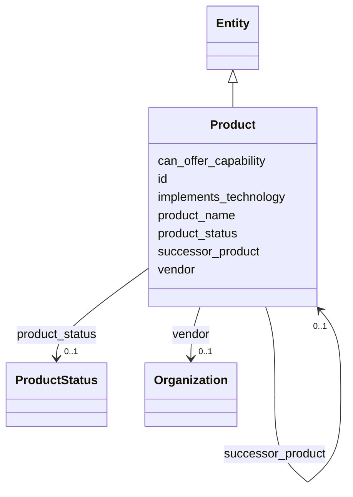

---
search:
  boost: 10.0
---

# Class: Product 


_A product; MUST NOT be equated with a Technology (§11.4, SIG-ONTO-017)._


<div data-search-exclude markdown="1">


URI: [sig:class/Product](https://ontology.sig-project.org/schema/class/Product)





## Inheritance
* [Entity](../classes/Entity.md)
    * **Product**


## Slots

| Name | Cardinality and Range | Description | Inheritance |
| ---  | --- | --- | --- |
| [product_name](../slots/product_name.md) | 0..1 <br/> [String](../types/String.md) | Time-bounded; products are renamed constantly | direct |
| [vendor](../slots/vendor.md) | 0..1 <br/> [Organization](../classes/Organization.md) |  | direct |
| [implements_technology](../slots/implements_technology.md) | * <br/> [TechnologyCode](../types/TechnologyCode.md) |  | direct |
| [can_offer_capability](../slots/can_offer_capability.md) | * <br/> [CapabilityCode](../types/CapabilityCode.md) | Defeasible / marketing-level only (SIG-ONTO-018) | direct |
| [product_status](../slots/product_status.md) | 0..1 <br/> [ProductStatus](../enums/ProductStatus.md) |  | direct |
| [successor_product](../slots/successor_product.md) | 0..1 <br/> [Product](../classes/Product.md) |  | direct |
| [id](../slots/id.md) | 1 <br/> [Uriorcurie](../types/Uriorcurie.md) | The entity's stable minted identity (L2 identity only, §8 | [Entity](../classes/Entity.md) |


## Usages

| used by | used in | type | used |
| ---  | --- | --- | --- |
| [Product](../classes/Product.md) | [successor_product](../slots/successor_product.md) | range | [Product](../classes/Product.md) |
| [Deployment](../classes/Deployment.md) | [product](../slots/product.md) | range | [Product](../classes/Product.md) |
| [DataSystem](../classes/DataSystem.md) | [product](../slots/product.md) | range | [Product](../classes/Product.md) |
| [Contract](../classes/Contract.md) | [products](../slots/products.md) | range | [Product](../classes/Product.md) |


## Identifier and Mapping Information


### Schema Source


* from schema: https://ontology.sig-project.org/schema/sig


## Mappings

| Mapping Type | Mapped Value |
| ---  | ---  |
| self | sig:Product |
| native | sig:Product |


## LinkML Source

<!-- TODO: investigate https://stackoverflow.com/questions/37606292/how-to-create-tabbed-code-blocks-in-mkdocs-or-sphinx -->

### Direct

<details>
```yaml
name: Product
description: A product; MUST NOT be equated with a Technology (§11.4, SIG-ONTO-017).
from_schema: https://ontology.sig-project.org/schema/sig
rank: 1000
is_a: Entity
attributes:
  product_name:
    name: product_name
    description: Time-bounded; products are renamed constantly.
    from_schema: https://ontology.sig-project.org/schema/entities
    rank: 1000
    domain_of:
    - Product
    range: string
  vendor:
    name: vendor
    from_schema: https://ontology.sig-project.org/schema/entities
    rank: 1000
    domain_of:
    - Product
    - Deployment
    - DataSystem
    range: Organization
  implements_technology:
    name: implements_technology
    from_schema: https://ontology.sig-project.org/schema/entities
    rank: 1000
    domain_of:
    - Product
    range: technology_code
    multivalued: true
  can_offer_capability:
    name: can_offer_capability
    description: Defeasible / marketing-level only (SIG-ONTO-018).
    from_schema: https://ontology.sig-project.org/schema/entities
    rank: 1000
    domain_of:
    - Product
    range: capability_code
    multivalued: true
  product_status:
    name: product_status
    from_schema: https://ontology.sig-project.org/schema/entities
    rank: 1000
    domain_of:
    - Product
    range: ProductStatus
  successor_product:
    name: successor_product
    from_schema: https://ontology.sig-project.org/schema/entities
    rank: 1000
    domain_of:
    - Product
    range: Product

```
</details>

### Induced

<details>
```yaml
name: Product
description: A product; MUST NOT be equated with a Technology (§11.4, SIG-ONTO-017).
from_schema: https://ontology.sig-project.org/schema/sig
rank: 1000
is_a: Entity
attributes:
  product_name:
    name: product_name
    description: Time-bounded; products are renamed constantly.
    from_schema: https://ontology.sig-project.org/schema/entities
    rank: 1000
    owner: Product
    domain_of:
    - Product
    range: string
  vendor:
    name: vendor
    from_schema: https://ontology.sig-project.org/schema/entities
    rank: 1000
    owner: Product
    domain_of:
    - Product
    - Deployment
    - DataSystem
    range: Organization
  implements_technology:
    name: implements_technology
    from_schema: https://ontology.sig-project.org/schema/entities
    rank: 1000
    owner: Product
    domain_of:
    - Product
    range: technology_code
    multivalued: true
  can_offer_capability:
    name: can_offer_capability
    description: Defeasible / marketing-level only (SIG-ONTO-018).
    from_schema: https://ontology.sig-project.org/schema/entities
    rank: 1000
    owner: Product
    domain_of:
    - Product
    range: capability_code
    multivalued: true
  product_status:
    name: product_status
    from_schema: https://ontology.sig-project.org/schema/entities
    rank: 1000
    owner: Product
    domain_of:
    - Product
    range: ProductStatus
  successor_product:
    name: successor_product
    from_schema: https://ontology.sig-project.org/schema/entities
    rank: 1000
    owner: Product
    domain_of:
    - Product
    range: Product
  id:
    name: id
    description: The entity's stable minted identity (L2 identity only, §8.2).
    from_schema: https://ontology.sig-project.org/schema/sig
    rank: 1000
    identifier: true
    owner: Product
    domain_of:
    - Entity
    - Edge
    range: uriorcurie
    required: true

```
</details></div>