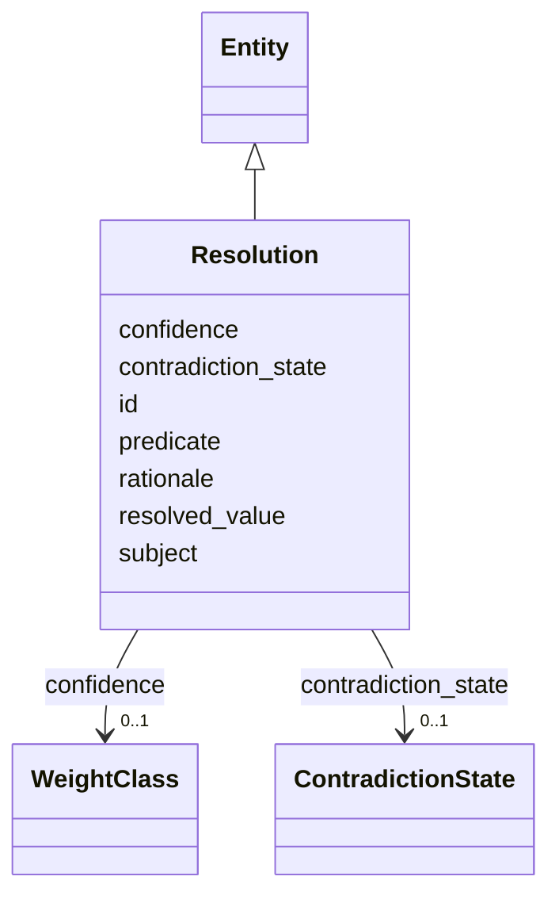

---
search:
  boost: 10.0
---

# Class: Resolution 


_A stored current-best decision record (§16.4, L3), not a view._


<div data-search-exclude markdown="1">


URI: [sig:class/Resolution](https://ontology.sig-project.org/schema/class/Resolution)





## Inheritance
* [Entity](../classes/Entity.md)
    * **Resolution**


## Slots

| Name | Cardinality and Range | Description | Inheritance |
| ---  | --- | --- | --- |
| [subject](../slots/subject.md) | 0..1 <br/> [Uriorcurie](../types/Uriorcurie.md) |  | direct |
| [predicate](../slots/predicate.md) | 0..1 <br/> [PredicateCode](../types/PredicateCode.md) |  | direct |
| [resolved_value](../slots/resolved_value.md) | 0..1 <br/> [String](../types/String.md) |  | direct |
| [confidence](../slots/confidence.md) | 0..1 <br/> [WeightClass](../enums/WeightClass.md) |  | direct |
| [contradiction_state](../slots/contradiction_state.md) | 0..1 <br/> [ContradictionState](../enums/ContradictionState.md) |  | direct |
| [rationale](../slots/rationale.md) | 0..1 <br/> [String](../types/String.md) |  | direct |
| [id](../slots/id.md) | 1 <br/> [Uriorcurie](../types/Uriorcurie.md) | The entity's stable minted identity (L2 identity only, §8 | [Entity](../classes/Entity.md) |


## Identifier and Mapping Information


### Schema Source


* from schema: https://ontology.sig-project.org/schema/sig


## Mappings

| Mapping Type | Mapped Value |
| ---  | ---  |
| self | sig:Resolution |
| native | sig:Resolution |


## LinkML Source

<!-- TODO: investigate https://stackoverflow.com/questions/37606292/how-to-create-tabbed-code-blocks-in-mkdocs-or-sphinx -->

### Direct

<details>
```yaml
name: Resolution
description: A stored current-best decision record (§16.4, L3), not a view.
from_schema: https://ontology.sig-project.org/schema/sig
rank: 1000
is_a: Entity
attributes:
  subject:
    name: subject
    from_schema: https://ontology.sig-project.org/schema/entities
    domain_of:
    - Claim
    - Resolution
    - Contradiction
    - CoverageRecord
    range: uriorcurie
  predicate:
    name: predicate
    from_schema: https://ontology.sig-project.org/schema/entities
    domain_of:
    - Claim
    - Resolution
    - Contradiction
    - CoverageRecord
    range: predicate_code
  resolved_value:
    name: resolved_value
    from_schema: https://ontology.sig-project.org/schema/entities
    rank: 1000
    domain_of:
    - Resolution
    range: string
  confidence:
    name: confidence
    from_schema: https://ontology.sig-project.org/schema/entities
    rank: 1000
    domain_of:
    - Resolution
    range: WeightClass
  contradiction_state:
    name: contradiction_state
    from_schema: https://ontology.sig-project.org/schema/entities
    rank: 1000
    domain_of:
    - Resolution
    range: ContradictionState
  rationale:
    name: rationale
    from_schema: https://ontology.sig-project.org/schema/entities
    rank: 1000
    domain_of:
    - Resolution
    range: string

```
</details>

### Induced

<details>
```yaml
name: Resolution
description: A stored current-best decision record (§16.4, L3), not a view.
from_schema: https://ontology.sig-project.org/schema/sig
rank: 1000
is_a: Entity
attributes:
  subject:
    name: subject
    from_schema: https://ontology.sig-project.org/schema/entities
    owner: Resolution
    domain_of:
    - Claim
    - Resolution
    - Contradiction
    - CoverageRecord
    range: uriorcurie
  predicate:
    name: predicate
    from_schema: https://ontology.sig-project.org/schema/entities
    owner: Resolution
    domain_of:
    - Claim
    - Resolution
    - Contradiction
    - CoverageRecord
    range: predicate_code
  resolved_value:
    name: resolved_value
    from_schema: https://ontology.sig-project.org/schema/entities
    rank: 1000
    owner: Resolution
    domain_of:
    - Resolution
    range: string
  confidence:
    name: confidence
    from_schema: https://ontology.sig-project.org/schema/entities
    rank: 1000
    owner: Resolution
    domain_of:
    - Resolution
    range: WeightClass
  contradiction_state:
    name: contradiction_state
    from_schema: https://ontology.sig-project.org/schema/entities
    rank: 1000
    owner: Resolution
    domain_of:
    - Resolution
    range: ContradictionState
  rationale:
    name: rationale
    from_schema: https://ontology.sig-project.org/schema/entities
    rank: 1000
    owner: Resolution
    domain_of:
    - Resolution
    range: string
  id:
    name: id
    description: The entity's stable minted identity (L2 identity only, §8.2).
    from_schema: https://ontology.sig-project.org/schema/sig
    rank: 1000
    identifier: true
    owner: Resolution
    domain_of:
    - Entity
    - Edge
    range: uriorcurie
    required: true

```
</details></div>