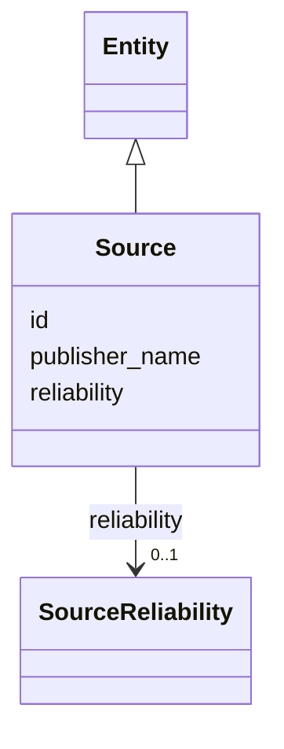

---
search:
  boost: 10.0
---

# Class: Source 


_A publisher of evidence (§10.2, §11.20). Distinct from artifact and capture._


<div data-search-exclude markdown="1">


URI: [sig:class/Source](https://ontology.sig-project.org/schema/class/Source)





## Inheritance
* [Entity](../classes/Entity.md)
    * **Source**


## Slots

| Name | Cardinality and Range | Description | Inheritance |
| ---  | --- | --- | --- |
| [publisher_name](../slots/publisher_name.md) | 0..1 <br/> [String](../types/String.md) |  | direct |
| [reliability](../slots/reliability.md) | 0..1 <br/> [SourceReliability](../enums/SourceReliability.md) |  | direct |
| [id](../slots/id.md) | 1 <br/> [Uriorcurie](../types/Uriorcurie.md) | The entity's stable minted identity (L2 identity only, §8 | [Entity](../classes/Entity.md) |


## Usages

| used by | used in | type | used |
| ---  | --- | --- | --- |
| [EvidenceArtifact](../classes/EvidenceArtifact.md) | [published_by](../slots/published_by.md) | range | [Source](../classes/Source.md) |


## Identifier and Mapping Information


### Schema Source


* from schema: https://ontology.sig-project.org/schema/sig


## Mappings

| Mapping Type | Mapped Value |
| ---  | ---  |
| self | sig:Source |
| native | sig:Source |


## LinkML Source

<!-- TODO: investigate https://stackoverflow.com/questions/37606292/how-to-create-tabbed-code-blocks-in-mkdocs-or-sphinx -->

### Direct

<details>
```yaml
name: Source
description: A publisher of evidence (§10.2, §11.20). Distinct from artifact and capture.
from_schema: https://ontology.sig-project.org/schema/sig
rank: 1000
is_a: Entity
attributes:
  publisher_name:
    name: publisher_name
    from_schema: https://ontology.sig-project.org/schema/entities
    rank: 1000
    domain_of:
    - Source
    range: string
  reliability:
    name: reliability
    from_schema: https://ontology.sig-project.org/schema/entities
    rank: 1000
    domain_of:
    - Source
    range: SourceReliability

```
</details>

### Induced

<details>
```yaml
name: Source
description: A publisher of evidence (§10.2, §11.20). Distinct from artifact and capture.
from_schema: https://ontology.sig-project.org/schema/sig
rank: 1000
is_a: Entity
attributes:
  publisher_name:
    name: publisher_name
    from_schema: https://ontology.sig-project.org/schema/entities
    rank: 1000
    owner: Source
    domain_of:
    - Source
    range: string
  reliability:
    name: reliability
    from_schema: https://ontology.sig-project.org/schema/entities
    rank: 1000
    owner: Source
    domain_of:
    - Source
    range: SourceReliability
  id:
    name: id
    description: The entity's stable minted identity (L2 identity only, §8.2).
    from_schema: https://ontology.sig-project.org/schema/sig
    rank: 1000
    identifier: true
    owner: Source
    domain_of:
    - Entity
    - Edge
    range: uriorcurie
    required: true

```
</details></div>