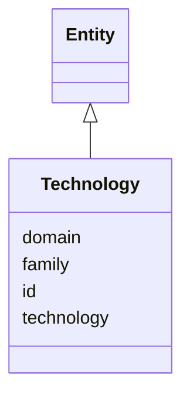

---
search:
  boost: 10.0
---

# Class: Technology 


_A three-level technology (domain→family→technology, §11.5, SIG-ONTO-019). The authoritative term hierarchy is the SKOS Technology scheme (§13.1); this class carries the code and its rollup levels for a specific referenced node._


<div data-search-exclude markdown="1">


URI: [sig:class/Technology](https://ontology.sig-project.org/schema/class/Technology)





## Inheritance
* [Entity](../classes/Entity.md)
    * **Technology**


## Slots

| Name | Cardinality and Range | Description | Inheritance |
| ---  | --- | --- | --- |
| [technology](../slots/technology.md) | 0..1 <br/> [TechnologyCode](../types/TechnologyCode.md) | The technology-level slug | direct |
| [family](../slots/family.md) | 0..1 <br/> [TechnologyCode](../types/TechnologyCode.md) | The family-level slug this rolls up to | direct |
| [domain](../slots/domain.md) | 0..1 <br/> [TechnologyCode](../types/TechnologyCode.md) | The domain-level slug this rolls up to | direct |
| [id](../slots/id.md) | 1 <br/> [Uriorcurie](../types/Uriorcurie.md) | The entity's stable minted identity (L2 identity only, §8 | [Entity](../classes/Entity.md) |


## Identifier and Mapping Information


### Schema Source


* from schema: https://ontology.sig-project.org/schema/sig


## Mappings

| Mapping Type | Mapped Value |
| ---  | ---  |
| self | sig:Technology |
| native | sig:Technology |


## LinkML Source

<!-- TODO: investigate https://stackoverflow.com/questions/37606292/how-to-create-tabbed-code-blocks-in-mkdocs-or-sphinx -->

### Direct

<details>
```yaml
name: Technology
description: A three-level technology (domain→family→technology, §11.5, SIG-ONTO-019).
  The authoritative term hierarchy is the SKOS Technology scheme (§13.1); this class
  carries the code and its rollup levels for a specific referenced node.
from_schema: https://ontology.sig-project.org/schema/sig
rank: 1000
is_a: Entity
attributes:
  technology:
    name: technology
    description: The technology-level slug.
    from_schema: https://ontology.sig-project.org/schema/entities
    rank: 1000
    domain_of:
    - Technology
    - Deployment
    range: technology_code
  family:
    name: family
    description: The family-level slug this rolls up to.
    from_schema: https://ontology.sig-project.org/schema/entities
    rank: 1000
    domain_of:
    - Technology
    range: technology_code
  domain:
    name: domain
    description: The domain-level slug this rolls up to.
    from_schema: https://ontology.sig-project.org/schema/entities
    rank: 1000
    domain_of:
    - Technology
    range: technology_code

```
</details>

### Induced

<details>
```yaml
name: Technology
description: A three-level technology (domain→family→technology, §11.5, SIG-ONTO-019).
  The authoritative term hierarchy is the SKOS Technology scheme (§13.1); this class
  carries the code and its rollup levels for a specific referenced node.
from_schema: https://ontology.sig-project.org/schema/sig
rank: 1000
is_a: Entity
attributes:
  technology:
    name: technology
    description: The technology-level slug.
    from_schema: https://ontology.sig-project.org/schema/entities
    rank: 1000
    owner: Technology
    domain_of:
    - Technology
    - Deployment
    range: technology_code
  family:
    name: family
    description: The family-level slug this rolls up to.
    from_schema: https://ontology.sig-project.org/schema/entities
    rank: 1000
    owner: Technology
    domain_of:
    - Technology
    range: technology_code
  domain:
    name: domain
    description: The domain-level slug this rolls up to.
    from_schema: https://ontology.sig-project.org/schema/entities
    rank: 1000
    owner: Technology
    domain_of:
    - Technology
    range: technology_code
  id:
    name: id
    description: The entity's stable minted identity (L2 identity only, §8.2).
    from_schema: https://ontology.sig-project.org/schema/sig
    rank: 1000
    identifier: true
    owner: Technology
    domain_of:
    - Entity
    - Edge
    range: uriorcurie
    required: true

```
</details></div>